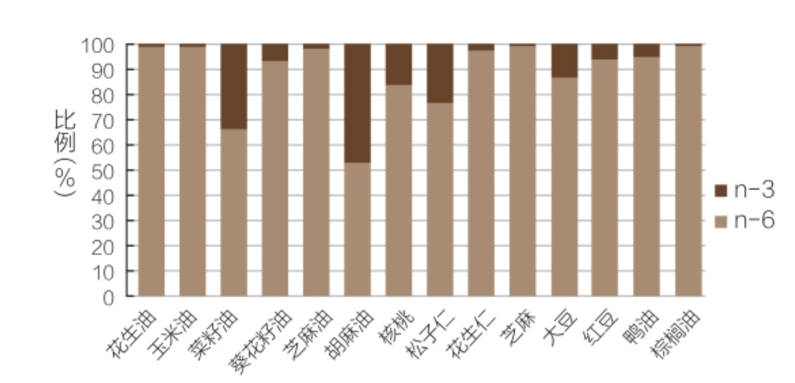

**减脂人群在低脂肪饮食过程中，应尽量选择吃富含n-3脂肪酸的植物油，每天适当吃核桃、松子等坚果（每天只需约15g）​，每周吃2~3次海鱼就可以了。增肌人群分为两种情况。**

**纯增肌者，不太在意体脂率的稍微增加，那么在饮食脂肪摄入上，建议通过脂肪摄入的热量占每日总热量摄入的约35%，植物油建议使用橄榄油。在减脂期的增肌者，这个比例控制在30%以下比较理想，植物油仍然选择橄榄油。**
碳水蛋白质脂肪，449大卡每克

脂肪没啥可看的，就是低脂少吃，和上面的

必需脂肪酸包括亚麻酸和亚油酸。亚麻酸，一般叫n-3系列脂肪酸，大众更熟悉的叫法是ω-3脂肪酸。亚油酸就是n-6系列脂肪酸，或者叫ω-6脂肪酸。

n-6系列脂肪酸都相对更容易获得，但跟n-6相比，n-3就少得多
营养学界一般建议，n-3和n-6的理想比例至少也要达到1∶5、1∶3或1∶2则更好一些。

补充n-3系列脂肪酸，一种方式是多吃海鱼，再就是多吃亚麻籽油（或者我们说的胡麻油）​。同时，核桃、松子里面的n-3系列脂肪酸也比较丰富。如果上面这些东西你平时都不吃，那吃植物油的时候，最好就选择大豆油、菜籽油、小麦胚芽油。这些植物油里面，n-3系列脂肪酸还算相对比较多。

但对增肌者来说，脂肪还有更重要的作用，因为饮食脂肪跟我们的睾酮水平有关。总体来说，高脂肪饮食会提高人的基础血睾酮水平。

一般来说，有规律有效的力量训练，通过脂肪摄入的热量，不低于每日总热量摄入的30%就足够了。
碳水蛋白质脂肪，449大卡每克

一些研究认为，如果饮食脂肪当中多不饱和脂肪酸摄入比例增加，会引起血睾酮水平的下降。而饱和脂肪酸和单不饱和脂肪酸，则会提高睾酮水平。
所以，从增肌的角度考虑，建议脂肪的摄入以单不饱和脂肪酸为主，同时可以适当摄入饱和脂肪。

运动后过量氧耗，简单理解，就是人在停止运动后，身体的高热量消耗却没有停止，还要持续一段时间。我们也可以理解为在运动后的一段时间，人的基础代谢率仍然维持在较高水平。

高强度运动减脂效果好的另一个重要原因，是因为高强度运动能带来明显的肌糖原超量储存，超量储存的肌糖原，大量消耗了我们食物中的碳水化合物，能用来变成脂肪的碳水化合物就少得多了。

肌内脂肪的恢复，甚至超量储存，跟肌糖原超量储存相似，也是在运动大量消耗肌内脂肪后出现的。

当我们身体的循环能量物质浓度降低，尤其是糖类物质消耗较明显的时候，才叫空腹。通俗地说，空腹就是我们身体开始明显地缺乏能量物质，尤其是糖类。这时，血糖处于一个相对较低的水平，储存的血糖（肝糖原）也被大量消耗。
一般来说，8~12小时没有进食才能算空腹状态。典型的空腹状态就是一夜禁食后晨起的时候。空腹的时候，因为身体可利用的糖类水平较低，这时运动，脂肪的氧化燃烧比例一般会增加

