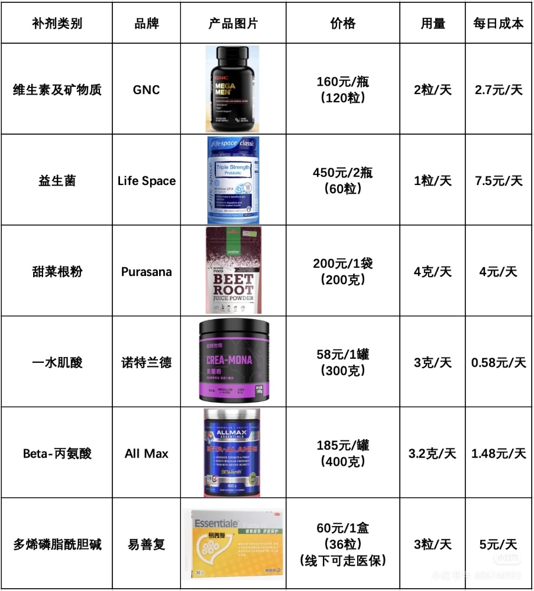
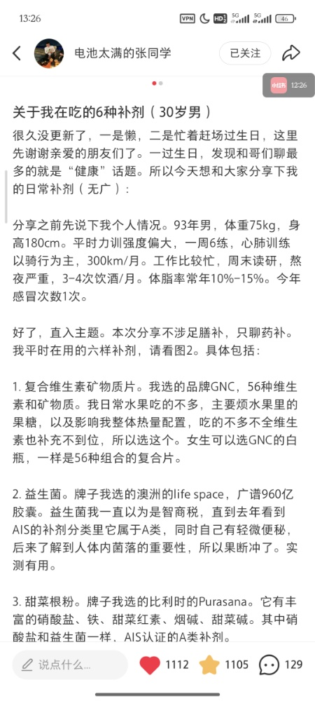

男性维生素
GNC 这一款属于**加强型/专业运动型**多维，而善存属于**基础日常维护型**。（都是海外版，国内版被阉割）

诺特兰德的肌酸鱼油，便宜

| 对比维度      | GNC Mega Men (加强型)    | 善存海外男士 (基础型)          | 对你的意义 (健身+不吃菜)        |
| :-------- | :-------------------- | :-------------------- | :-------------------- |
| **B族维生素** | **50mg 级** (极高剂量)     | **1.2-2.0mg 级** (基础)  | GNC 支撑高强度训练代谢，善存仅防缺乏  |
| **抗氧化成分** | **果蔬粉+硫辛酸+叶黄素**       | 仅含少量番茄红素              | **GNC 完美弥补你不爱吃菜的短板**  |
| **核心矿物质** | 锌 (25mg) / 硒 (200mcg) | 锌 (11mg) / 硒 (100mcg) | GNC 对维持雄性激素和免疫力更有利    |
| **服用量**   | 每日 2 片                | 每日 1 片                | GNC 颗粒大，需分次或随餐        |
| **单日成本**  | 约 2.0 - 2.5 元         | 约 0.7 - 1.0 元         | GNC 贵在“高性能”和“植物提取”    |
| **综合评价**  | **健身者顶配“保险”**         | 均衡饮食者的日常补充            | **不差钱选 GNC，省钱选善存+复B** |

诺特兰德的肌酸鱼油，便宜

