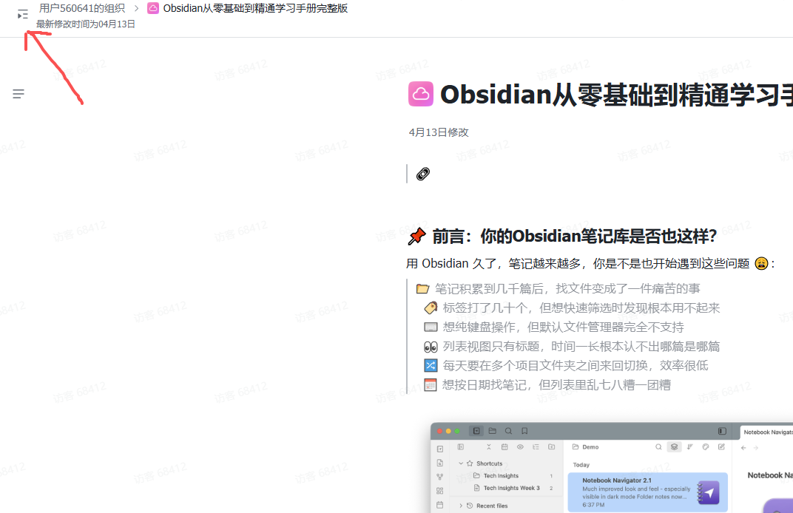
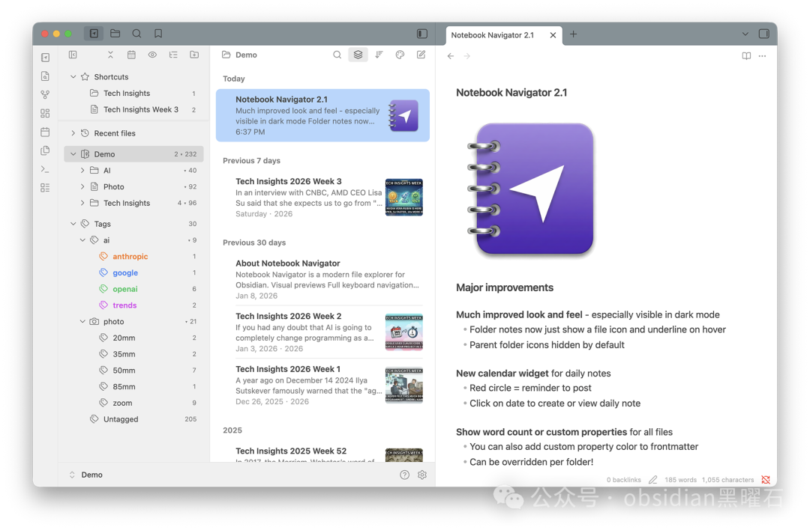
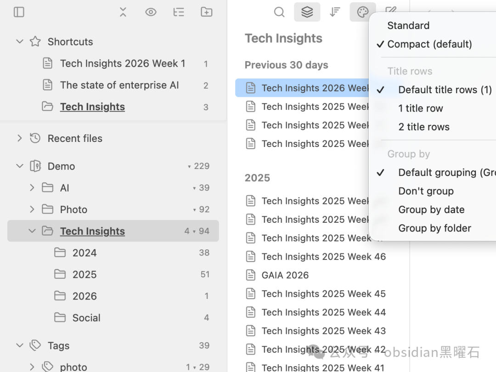
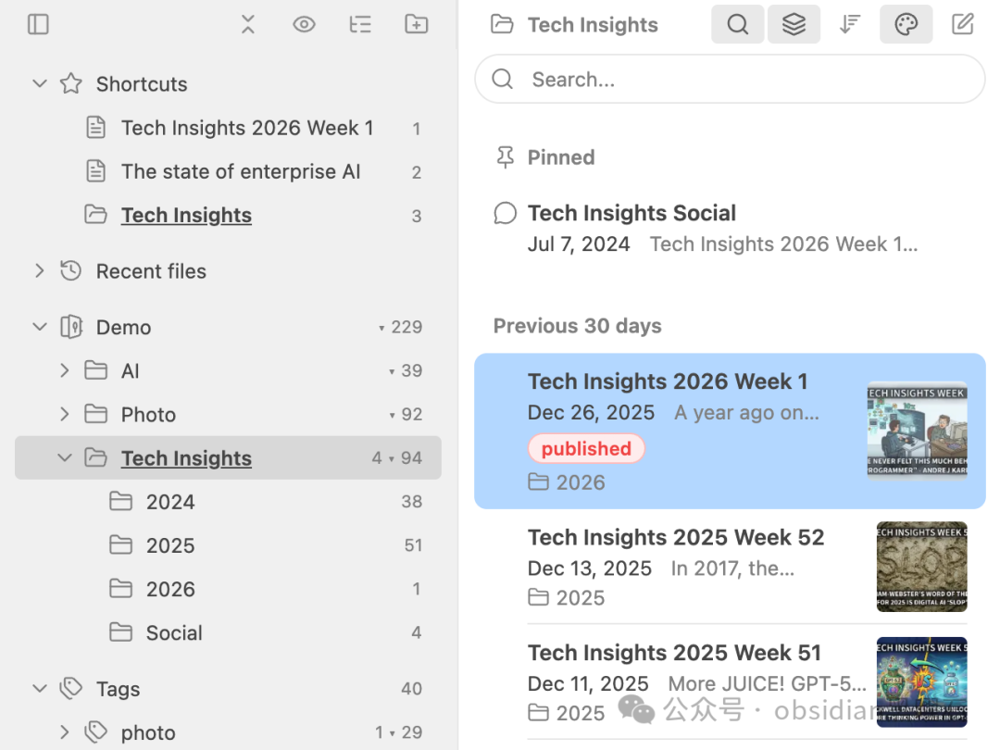
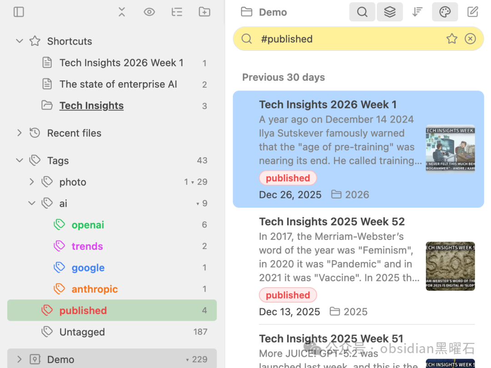

## 📌 前言：你的Obsidian笔记库是否也这样？

用 Obsidian 久了，笔记越来越多，你是不是也开始遇到这些问题 😩：



如果你有同感，今天要介绍的这个插件或许能解决你所有烦恼——它叫 Notebook Navigator。

这是一个专门为 Obsidian 打造的双栏文件管理器，可以替代默认的文件侧边栏，让笔记的浏览、搜索、管理效率大幅提升。截至2026年初，它在 GitHub 上已获得超过 18000颗星 ⭐，是 Obsidian 社区中最受欢迎的文件管理插件之一。

***

## 🚀 一、安装与基础配置

### 📥 1.1 安装步骤

第一步：安装 Obsidian 📦 从 Obsidian 官网下载并安装客户端。

第二步：开启社区插件 ⚙️ 打开 Obsidian → 设置 → 社区插件 → 打开「社区插件」开关。

第三步：安装 Notebook Navigator 📥 点击「浏览」→ 搜索「Notebook Navigator」→ 点击安装。

第四步（可选）：安装 Style Settings 插件 🎨 如果想自定义颜色和外观，可以额外安装「Style Settings」插件进行深度定制。

***



### ✅ 1.2 首次配置建议

安装完成后，建议做以下基础设置 ⚡：

| 设置项  | 推荐操作              | 说明              |
| ---- | ----------------- | --------------- |
| 布局模式 | 选择「双栏模式」          | 导航窗格 + 列表窗格同时显示 |
| 预览功能 | 开启「Note previews」 | 建议2-3行预览文字      |
| 特色图片 | 开启「缩略图」功能         | 让笔记更易识别         |
| 日期分组 | 开启日期分组            | 按今天/昨天/本周自动归类   |
| 同步设置 | 根据需求开启/关闭         | 多设备用户注意此项       |

***

## 🖥️ 二、界面与布局：双栏结构一览

Notebook Navigator 采用了「导航窗格 + 列表窗格」的双栏设计 🏗️：

`┌─────────────────┬──────────────────────────────┐ │ 📁 导航窗格 │ 📋 列表窗格 │ │ │ │ │ - 📂 文件夹树 │ 显示当前文件夹/标签下的文件 │ │ - 🏷️ 标签树 │ │ │ - 🔑 属性浏览器 │ │ │ - ⭐ 快捷方式 │ │ │ - 📅 日历 │ │ └─────────────────┴──────────────────────────────┘`

🧩 布局特点：

* 🔄 支持水平和垂直两种分栏方向

* ↔️ 面板大小可以自由拖动调整

* 🎯 支持单栏/双栏一键切换

* 🔎 独立的 UI 缩放，不影响 Obsidian 全局缩放

* 🌍 支持21种语言，含RTL布局

***

## ⚡ 三、核心功能详解

### 🔍 3.1 过滤搜索：一条命令搞定多条件筛选

这是 Notebook Navigator 最强大的功能之一 ✨。你可以将文件名、标签、属性、日期、文件夹、扩展名等条件组合在一个查询里。

💡 搜索示例：

`text meeting .status=active #work @thisweek`

***



📂 按文件名搜索：

| 搜索内容        | 效果                 |
| ----------- | ------------------ |
| word        | 匹配文件名中含「word」的笔记   |
| word1 word2 | 要求每个单词都与文件名匹配      |
| -word       | ❌ 排除文件名中含「word」的笔记 |

***

🏷️ 按标签搜索：

| 搜索内容           | 效果                              |
| -------------- | ------------------------------- |
| #tag           | 包含该标签的笔记（也匹配嵌套标签如 #tag /subtag） |
| #              | 只显示有标签的笔记                       |
| - #tag         | ❌ 排除带该标签的笔记                     |
| -#             | 只显示无标签的笔记                       |
| #tag1 #tag2    | 同时匹配两个标签（AND 关系）                |
| #tag1 OR #tag2 | 匹配任一标签（OR 关系）                   |

***

📅 按日期搜索：

| 搜索内容                    | 效果              |
| ----------------------- | --------------- |
| @today                  | 📆 今天修改的笔记      |
| @yesterday              | 昨天修改的笔记         |
| @last7d                 | 📅 近7天修改的笔记     |
| @last30d                | 近30天修改的笔记       |
| @thisweek               | 本周修改的笔记         |
| @thismonth              | 本月修改的笔记         |
| @2026-03                | 2026年3月修改的笔记    |
| @2026-W10               | 2026年第10周修改的笔记  |
| @2026-Q1                | 2026年第一季度修改的笔记  |
| @2026-03-01..2026-03-15 | ⏰ 日期范围：3月1日至15日 |

***

📁 按文件夹和扩展名搜索：

| 搜索内容                  | 效果                              |
| --------------------- | ------------------------------- |
| folder:meetings       | 在文件夹名含「meetings」的文件夹中搜索         |
| folder:/work/meetings | 仅在 work/meetings 文件夹中搜索（不含子文件夹） |
| folder:/              | 仅在保险库根目录中搜索                     |
| -folder:archive       | ❌ 排除文件夹名含「archive」的文件夹          |
| ext:md                | 只显示 .md 格式文件                    |
| -ext:pdf              | ❌ 排除 .pdf 文件                    |

***

🏷️ 按属性搜索：

| 搜索内容                            | 效果             |
| ------------------------------- | -------------- |
| .key                            | 在属性键中包含该关键词的笔记 |
| .key=value                      | 属性值匹配的笔记       |
| ."Reading Status"               | 带空格属性键需用双引号    |
| ."Reading Status"="In Progress" | 带空格键和值都用双引号    |
| -.key                           | ❌ 排除有该属性键的笔记   |

***

🔧 过滤器：

| 搜索内容      | 效果                     |
| --------- | ---------------------- |
| has:task  | 📌 包含未完成任务项（- \[ ]）的笔记 |
| -has:task | ❌ 不含未完成任务项的笔记          |

***

### 🌲 3.2 标签树：层级标签一目了然

Notebook Navigator 将所有标签以树形结构展示，支持层级嵌套，比 Obsidian 默认的标签面板直观得多 。

✨ 功能亮点：

| 功能        | 说明                     |
| --------- | ---------------------- |
| 👆 点击即展开  | 点击某个标签，右侧立即显示该标签下的所有笔记 |
| 🔢 双重排序   | 支持按字母顺序或使用频率排序         |
| 🎨 颜色图标   | 可以给常用标签设置专属颜色和图标       |
| ⭐ 快捷方式    | 给标签右键可快速添加为「快捷方式」，一键直达 |
| 🖱️ 可点击标签 | 文件列表中的标签可直接点击导航        |

***

### 📌 3.3 快捷方式：像浏览器书签一样方便

Notebook Navigator 允许把任意文件夹、标签、属性视图保存为快捷方式\_bookmark:。

💼 使用场景：

* 工作中需要频繁在「客户资料」「项目A」「项目B」「归档」之间切换 🔀

* 把这4个位置分别保存为快捷方式1-4

* 绑定快捷键后，按一个数字就能秒切过去 ⚡

📝 操作方法：

1. 在导航栏选到目标文件夹或标签

1) 右键 → 「Add to shortcuts」➕

1. 最多可创建 9个 快捷方式，支持拖动排序

1) 在 Obsidian 快捷键设置中绑定「Open shortcut 1-9」命令

***

### 📅 3.4 日历视图：轻松管理周期笔记

Notebook Navigator 内置日历功能，非常适合有日记/周记/月记习惯的用户 🗓️。

📆 支持打开的笔记类型：

| 类型            | 说明             |
| ------------- | -------------- |
| 📅 每日笔记       | Daily Note     |
| 📆 每周笔记       | Weekly Note    |
| �\_monthly 月记 | Monthly Note   |
| 📊 每季笔记       | Quarterly Note |
| 📆 年度笔记       | Yearly Note    |

🖱️ 操作方式：

* 点击日历某一天即可直接打开或新建当天的日志笔记 ✨

* 可以显示特色图片预览（需配置 cover 图片）

* 支持垂直分栏布局

* 绑定快捷键 `Cmd/Ctrl + Shift + C` 一键打开日历

***

### 🖼️ 3.5 文件预览与特色图片

Notebook Navigator 的列表显示可以高度自定义，让你的笔记库颜值飙升 💯：

📝 开启笔记预览：

1. 设置 → Notebook Navigator → 开启「Note previews」

1) 调整预览行数（1-5行可调）

1. 可选是否去除 HTML 格式（让代码块显示更干净）

🖼️ 设置特色图片（缩略图）：

| 设置方法 | 操作步骤                               |
| ---- | ---------------------------------- |
| 方法一  | 在笔记 frontmatter 中添加 cover: 图片路径    |
| 方法二  | 把图片放在笔记同名文件夹里作为封面                  |
| 远程图片 | 开启「Download external images」加载远程封面 |

📅 日期分组显示：

当按日期排序时，列表会自动按以下方式分组展示 📊：

`📅 今天 └── 笔记A.md └── 笔记B.md 📆 昨天 └── 笔记C.md 📅 近7天 └── 笔记D.md 📅 近30天 └── 笔记E.md 📆 2026年3月 └── 笔记F.md`

***

### 🎨 3.6 颜色和图标系统

Notebook Navigator 支持给文件夹、标签、属性、文件设置不同的颜色和图标 🎭：

| 元素     | 可自定义内容  |
| ------ | ------- |
| 📂 文件夹 | 颜色 + 图标 |
| 🏷️ 标签 | 颜色 + 图标 |
| 🔑 属性  | 颜色 + 图标 |
| 📄 文件  | 颜色 + 图标 |

🎁 图标类型支持： - Emoji 图标 😊 - Lucide 图标（专业图标库） - 自定义图标包

⚙️ 自动映射： 可以根据文件类型（如 `.md` 、 `.pdf` ）自动映射对应图标

***

### 📊 3.7 属性浏览器：按元数据快速筛选

Notebook Navigator 提供了一个强大的属性浏览器，可以根据笔记的 frontmatter 属性来组织和筛选文件 🔑。

✨ 功能特点：

* 按属性 key 浏览（如：状态、类型、优先级）

* 按属性 value 浏览（如：status=done、type=project）

* 显示每个属性下的文件数量统计

* 支持给属性设置颜色和图标区分

* 支持拖放调整属性顺序

***

### 📁 3.8 文件夹树与层级导航

Notebook Navigator 的文件夹树支持：

| 功能         | 说明            |
| ---------- | ------------- |
| 📂 展开/折叠   | 按需展开或折叠文件夹层级  |
| 🔢 文件计数    | 显示每个文件夹下的文件数量 |
| 🎨 自定义排序   | 手动拖动调整文件夹顺序   |
| 👁️ 显示隐藏文件 | 可切换显示/隐藏隐藏文件夹 |

***



## ⌨️ 四、键盘快捷键：全键盘操作指南

Notebook Navigator 的核心理念就是 「让手不离开键盘」 💪。

### 🔠 4.1 基础导航快捷键

| 快捷键                 | 操作                             |
| ------------------- | ------------------------------ |
| ↑ / ↓               | ⬆️⬇️ 在当前窗格中向上/向下导航             |
| ←                   | ⬅️ 导航窗格：折叠或返回上级；列表窗格：切换到导航窗格   |
| →                   | ➡️ 导航窗格：展开或切换到列表窗格；列表窗格：切换到编辑器 |
| Tab                 | 🔄 在导航窗格和列表窗格之间切换              |
| Shift+Tab           | 🔄 反向切换窗格                      |
| Enter               | ▶️ 打开文件夹笔记 / 打开选中文件            |
| Delete              | 🗑️ 删除选中项目                     |
| Home / End          | ⏮️⏭️ 跳转到当前窗格第一个/最后一个项目         |
| Page Up / Page Down | 📄 向上/向下滚动一页                   |

***

### 🎯 4.2 多选操作快捷键

| 快捷键              | 操作                           |
| ---------------- | ---------------------------- |
| Cmd/Ctrl + A     | �\_select\_all 全选当前文件夹中的所有笔记 |
| Cmd/Ctrl + Click | 🖱️ 单独添加/取消选中某条              |
| Shift + Click    | 📦 选择范围内的笔记                  |
| Shift + Home/End | ↕️ 从当前位置选到第一个/最后一个           |
| Shift + ↑/↓      | ↕️ 向上/向下扩展选区                 |

***

### ⚙️ 4.3 推荐自定义快捷键配置

强烈建议在 Obsidian 快捷键设置中绑定以下命令 🚀：

| 快捷键                  | 命令 ID                                 | 用途           |
| -------------------- | ------------------------------------- | ------------ |
| Cmd/Ctrl + Shift + E | notebook-navigator:open               | ⚡ 快速打开导航器    |
| Cmd/Ctrl + Shift + S | notebook-navigator:search             | 🔍 快速打开搜索    |
| Cmd/Ctrl + Shift + R | notebook-navigator:reveal-file        | 📍 定位当前文件位置  |
| Cmd/Ctrl + N         | notebook-navigator:new-note           | ➕ 在当前位置新建笔记  |
| Cmd/Ctrl + Shift + A | notebook-navigator:toggle-dual-pane   | 🔲 单/双栏切换    |
| Cmd/Ctrl + Shift + D | notebook-navigator:toggle-descendants | 📂 显示/隐藏子文件夹 |
| Cmd/Ctrl + Shift + C | notebook-navigator:toggle-calendar    | 📅 打开日历      |
| Cmd/Ctrl + 1\~9      | notebook-navigator:open-shortcut-1\~9 | ⭐ 打开对应快捷方式   |

***

## 💼 五、真实使用场景举例

### 🏢 场景一：上班族的多项目管理

😫 痛点背景：

你同时跟进3个项目（项目A、项目B、客户资料），每个项目下有几十个文件夹和上百篇笔记。每天要在不同项目之间来回切换，找文件成了最费时间的事。

✅ 解决方案：

1. 打开 Notebook Navigator

1) 依次将「项目A文件夹」「项目B文件夹」「客户资料文件夹」添加为快捷方式

1. 绑定快捷键：

1) `Cmd/Ctrl + 1` → 快捷方式1（项目A）

1. `Cmd/Ctrl + 2` → 快捷方式2（项目B）

1) `Cmd/Ctrl + 3` → 快捷方式3（客户资料）

1. 以后切换项目时，按一个数字键就到了 ⚡

🎨 进阶技巧： 给每个项目文件夹设置不同颜色的图标，视觉上更好区分，如： - 项目A：🔵 蓝色 - 项目B：🟢 绿色 - 客户资料：🟠 橙色

***

### 📚 场景二：标签化知识管理

😫 痛点背景：

你用标签管理了几百个主题的学习笔记，但想快速找到某个标签下的所有内容时很不方便。Obsidian 默认标签面板只能看到扁平列表，无法直观地看到标签层级。

✅ 解决方案：

1. 在导航栏切换到「标签树」视图 🌲

1) 找到目标标签（如 `#编程 / Python` ），点击展开

1. 右侧列表立即显示所有相关笔记

1) 配合日期筛选，如输入： `#编程 #Python @last30d` 找出最近一个月关于Python的所有笔记

1. 将这个组合搜索保存为快捷方式，下次一键直达

💡 进阶用法： 使用 OR 组合扩大范围： \`\`\`

# 编程 #Python OR #编程 #JavaScript @last30d

***

### 📝 场景三：每日复盘与周期笔记

😫 痛点背景：

你习惯每天写复盘，每周写周记，每月写月记。但每次打开对应日期的笔记非常麻烦，要翻找很久。

✅ 解决方案：

1. 绑定日历快捷键： `Cmd/Ctrl + Shift + C`

1) 打开日历，点击今天的日期，自动创建或打开今日笔记 ✨

1. 在笔记中记录当日复盘内容

1) 周五时，在日历中选择「本周」直接打开周记

1. 月底同样方式打开月记进行月度总结

📆 配套设置（需在 Obsidian 设置中配置）：

| 设置项   | 配置内容                  |
| ----- | --------------------- |
| 日记文件夹 | 如 日记/2026/            |
| 日记模板  | 设置好 frontmatter 和格式模板 |
| 文件名格式 | 如 YYYY-MM-DD          |

***

### 📋 场景四：精准筛选待处理任务

😫 痛点背景： 你有多篇笔记带有任务清单（ `- [ ]` 语法），想快速找出哪些任务还没完成，然后逐个处理。

✅ 解决方案：

1. 在搜索栏输入 `has:task` 📌

1) 列表立即显示所有包含未完成任务项的笔记

1. 进一步精准筛选： `has:task #work @today` 找出今天需要处理的工作任务

1) 点击任意一条笔记进去完成任务勾选

1. 用 `notebook-navigator:rebuild-cache` 命令重建缓存，确保统计准确

🔄 日常使用流程：

`早上一杯咖啡时间： ☐ 输入 has:task @today 看看今天要做什么 ☐ 处理任务，打勾 ✓ ☐ 傍晚输入 has:task 看看还有哪些漏网之鱼`

***

### 👥 场景五：多人协作共享库

😫 痛点背景：

你和团队共用一个 Obsidian 库，文件不断增多，需要统一管理，但又想每个人有自己的视图，不会被别人的文件干扰。

✅ 解决方案：

使用 Notebook Navigator 的「Vault Profiles」功能 👤👤👤：

| 配置文件       | 显示内容              |
| ---------- | ----------------- |
| 配置文件A（成员A） | 📁 客户资料 + 📁 项目跟进 |
| 配置文件B（成员B） | 📁 财务记录 + 📁 合同管理 |
| 配置文件C（共享）  | 📁 公告 + 📁 团队文档   |

📝 每个配置文件可以独立设置： - ✅ 隐藏哪些文件夹 / 标签 / 笔记 - ✅ 文件可见性规则 - ✅ 各自的头部和横幅 - ✅ 各自专属的快捷方式

切换方式： 使用命令 `notebook-navigator:select-profile` 或 `notebook-navigator:select-profile-1/2/3`

***

## 🔧 六、Vault 配置文件详解

Vault 配置文件是 Notebook Navigator 的进阶功能，适合复杂使用场景 🛠️。

### 📋 配置项清单

| 配置项    | 说明            |
| ------ | ------------- |
| 文件夹可见性 | 哪些文件夹显示/隐藏    |
| 标签可见性  | 哪些标签显示/隐藏     |
| 笔记可见性  | 哪些笔记显示/隐藏     |
| 文件夹排序  | 导航窗格中文件夹的显示顺序 |
| 标签排序   | 按字母序或使用频率     |
| 快捷方式   | 每个配置文件的专属快捷方式 |
| 头部横幅   | 每个配置文件的欢迎横幅   |
| 默认视图   | 启动时显示哪个视图     |

### 🎯 使用建议

* 👤 个人用户：主要使用「默认」配置文件，根据项目创建专用配置

* 👥 团队用户：每人创建自己的配置文件，互不干扰

* 📂 项目制用户：为每个项目创建独立配置，项目切换时一键换档

***

## 🔄 七、同步与本地设置

Notebook Navigator 的很多设置都有「同步切换」按钮（云图标 ☁️），控制每个设置是否同步到多设备 🔗。

### ☁️ 同步机制说明

启用同步时 ☁️✅： - 设置值保存到 `data.json` - 通过 Obsidian Sync / iCloud / Git / Dropbox 等同步服务 - 自动同步到所有设备

禁用同步时 📱❌： - 设置值保存到本地存储 - 不同设备可以有不同偏好 - 当前值会从 `data.json` 中移除

### 💡 推荐同步策略

| 设置类型  | 建议 | 原因         |
| ----- | -- | ---------- |
| 界面布局  | 同步 | 保持各设备一致体验  |
| 快捷键绑定 | 本地 | 不同设备键盘布局不同 |
| 快捷方式  | 同步 | 各设备通用      |
| 颜色图标  | 同步 | 保持外观一致     |
| 隐藏配置  | 本地 | 各设备可能有不同需求 |

***

## 📋 八、快速命令清单

Notebook Navigator 提供了丰富的命令，可在 Obsidian 快捷键设置中绑定 🎛️：

### 👁️ 查看和导航类

| 命令 ID                                   | 用途             |
| --------------------------------------- | -------------- |
| notebook-navigator:open                 | 🚀 打开导航器       |
| notebook-navigator:toggle-left-sidebar  | ↔️ 切换左侧边栏      |
| notebook-navigator:reveal-file          | 📍 定位当前文件      |
| notebook-navigator:open-all-files       | 📂 打开当前文件夹所有笔记 |
| notebook-navigator:navigate-to-folder   | 📁 跳转到任意文件夹    |
| notebook-navigator:navigate-to-tag      | 🏷️ 跳转到任意标签    |
| notebook-navigator:navigate-to-property | 🔑 跳转到任意属性     |
| notebook-navigator:select-next-file     | ⬇️ 选择下一个文件     |
| notebook-navigator:select-previous-file | ⬆️ 选择上一个文件     |

### 📐 布局和显示类

| 命令 ID                                           | 用途               |
| ----------------------------------------------- | ---------------- |
| notebook-navigator:toggle-dual-pane             | 🔲 单/双栏切换        |
| notebook-navigator:toggle-dual-pane-orientation | ↕️ 切换分栏方向（水平/垂直） |
| notebook-navigator:toggle-calendar              | 📅 打开日历          |
| notebook-navigator:toggle-compact-mode          | 📄 紧凑模式切换        |
| notebook-navigator:toggle-hidden                | 👁️ 显示/隐藏隐藏项目    |
| notebook-navigator:toggle-tag-sort              | 🔢 标签排序切换        |
| notebook-navigator:collapse-expand              | 📂 折叠/展开所有项目     |

### 📝 文件操作类

| 命令 ID                                     | 用途          |
| ----------------------------------------- | ----------- |
| notebook-navigator:new-note               | ➕ 新建笔记      |
| notebook-navigator:new-note-from-template | 📄 从模板新建笔记  |
| notebook-navigator:move-files             | 📦 移动文件     |
| notebook-navigator:delete-files           | 🗑️ 删除文件    |
| notebook-navigator:convert-to-folder-note | 📁 转换为文件夹笔记 |
| notebook-navigator:set-as-folder-note     | 📌 设置为文件夹笔记 |
| notebook-navigator:detach-folder-note     | 🔓 分离文件夹笔记  |

### 🏷️ 标签操作类

| 命令 ID                              | 用途           |
| ---------------------------------- | ------------ |
| notebook-navigator:add-tag         | ➕ 添加标签       |
| notebook-navigator:remove-tag      | ➖ 删除标签       |
| notebook-navigator:remove-all-tags | 🧹 清除所有标签    |
| notebook-navigator:set-property    | 🔧 为选定文件设置属性 |

### 📅 日历相关类

| 命令 ID                                  | 用途         |
| -------------------------------------- | ---------- |
| notebook-navigator:open-daily-note     | 📅 打开今日笔记  |
| notebook-navigator:open-weekly-note    | 📆 打开本周笔记  |
| notebook-navigator:open-monthly-note   | 🗓️ 打开本月笔记 |
| notebook-navigator:open-quarterly-note | 📊 打开本季笔记  |
| notebook-navigator:open-yearly-note    | 📆 打开本年笔记  |

### 🔧 维护类

| 命令 ID                            | 用途                       |
| -------------------------------- | ------------------------ |
| notebook-navigator:rebuild-cache | 🔄 重建缓存（解决标签丢失、预览不正确等问题） |

***

## 🔒 九、隐私与网络安全

Notebook Navigator 在隐私方面的处理非常透明 ✅：

| 方面       | 说明                 |
| -------- | ------------------ |
| ✅ 笔记内容   | 不会发送到任何服务器         |
| ✅ 文件名/标签 | 不会发送到任何服务器         |
| ✅ 本地存储   | 所有笔记数据存在本地         |
| ☁️ 版本更新  | 最多每24小时检查一次，可关闭    |
| 🖼️ 图标包  | 可选下载，存储在 IndexedDB |
| 🖼️ 外部图片 | 可选下载，存储在 IndexedDB |

***

## ❓ 十、常见问题与解决方案

### ❓ 问题1：标签或预览显示不正确

症状： 明明打了标签，但在导航器里看不到，或者预览内容不对

✅ 解决方案：

1. 使用命令 `notebook-navigator:rebuild-cache` 重建缓存

1) 如果还不行，重启 Obsidian

***

### ❓ 问题2：快捷键冲突

症状： 绑定快捷键后没有反应，或和其他插件冲突

✅ 解决方案：

1. 检查 Obsidian 内置快捷键是否冲突

1) 检查其他插件（如 Templater、QuickAdd）是否占用了相同快捷键

1. 必要时解除其他插件的绑定

***

### ❓ 问题3：多选文件操作无效

症状： 选中多个文件后，点击删除或移动没反应

✅ 解决方案：

确保使用 Notebook Navigator 提供的命令，而不是 Obsidian 内置命令：

| 操作 | 正确命令                            |
| -- | ------------------------------- |
| 删除 | notebook-navigator:delete-files |
| 移动 | notebook-navigator:move-files   |
| 新建 | notebook-navigator:new-note     |

***

### ❓ 问题4：大型库（10000+笔记）加载慢

症状： 笔记太多，切换视图或搜索时很卡

✅ 解决方案：

1. Notebook Navigator 使用虚拟滚动技术优化性能

1) 定期使用 `notebook-navigator:rebuild-cache` 重建缓存

1. 关闭不需要的显示选项（如预览、缩略图）

1) 使用紧凑模式减少渲染内容

***

### ❓ 问题5：日历功能无法创建笔记

症状： 点击日历日期没反应，或创建的不是想要的模板

✅ 解决方案：

1. 检查 Obsidian 的日记设置是否正确配置

1) 确认「每日笔记文件夹」路径存在

1. 确认「日记模板」已设置好

***

## 🎯 十一、进阶使用技巧

### 💡 技巧一：善用「最近文件」功能

Notebook Navigator 会自动记录你最近打开的文件（ Recent Files），可以固定常用笔记为快捷方式，随时快速访问。

### 💡 技巧二：组合搜索保存为快捷方式

将常用的复杂搜索保存为快捷方式，例如：

| 快捷方式  | 搜索内容            | 用途       |
| ----- | --------------- | -------- |
| 本周工作  | #work @thisweek | 本周工作相关笔记 |
| 今日待办  | has:task @today | 今日任务     |
| 未完成项目 | has:task - #归档  | 未归档的任务   |

### 💡 技巧三：使用属性浏览器管理项目

为每篇项目笔记添加统一的 frontmatter 属性：

```plaintext
project: 项目A status: 进行中 priority: 高
```

***

```plaintext
然后在属性浏览器中按 status 或 priority 筛选，一目了然。
```


***

## 📊 十二、功能一览表

| 功能分类   | 具体功能             | 推荐指数  |
| ------ | ---------------- | ----- |
| 🔍 搜索  | 过滤搜索、全文搜索、组合搜索   | ⭐⭐⭐⭐⭐ |
| 🏷️ 标签 | 标签树、层级标签、快捷标签    | ⭐⭐⭐⭐⭐ |
| 📁 文件夹 | 文件夹树、自定义排序、文件夹笔记 | ⭐⭐⭐⭐  |
| 📅 日历  | 周期笔记、日期导航、快捷日历   | ⭐⭐⭐⭐  |
| ⌨️ 快捷键 | 全键盘操作、自定义绑定      | ⭐⭐⭐⭐⭐ |
| 🖼️ 预览 | 笔记预览、特色图片、日期分组   | ⭐⭐⭐⭐  |
| 🎨 外观  | 颜色图标、紧凑模式、UI缩放   | ⭐⭐⭐⭐  |
| 🔗 同步  | 多设备同步、本地设置       | ⭐⭐⭐⭐  |
| 👥 多人  | Vault配置文件、视图隔离   | ⭐⭐⭐⭐  |
| 📋 命令  | 丰富命令、批量操作        | ⭐⭐⭐⭐  |

***

## 🎬 结语

Notebook Navigator 解决的核心问题很简单 📣：

这些问题看似基础，但用过 Obsidian 默认管理器的人都知道，默认体验有多折磨 😖。这个插件就是来解决这个痛点的。

🚀 建议从这三个功能开始用起：

1. 🌲 双栏布局 — 让导航和列表同时可见

1) 🏷️ 标签树 — 让层级标签一目了然

1. ⭐ 快捷方式 — 让常用位置一键直达

很快你就会发现——再也回不去了 😂
