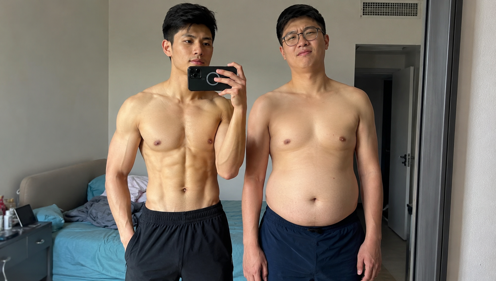
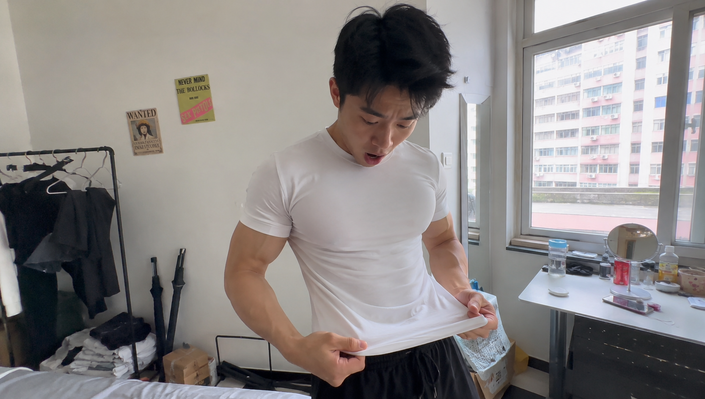
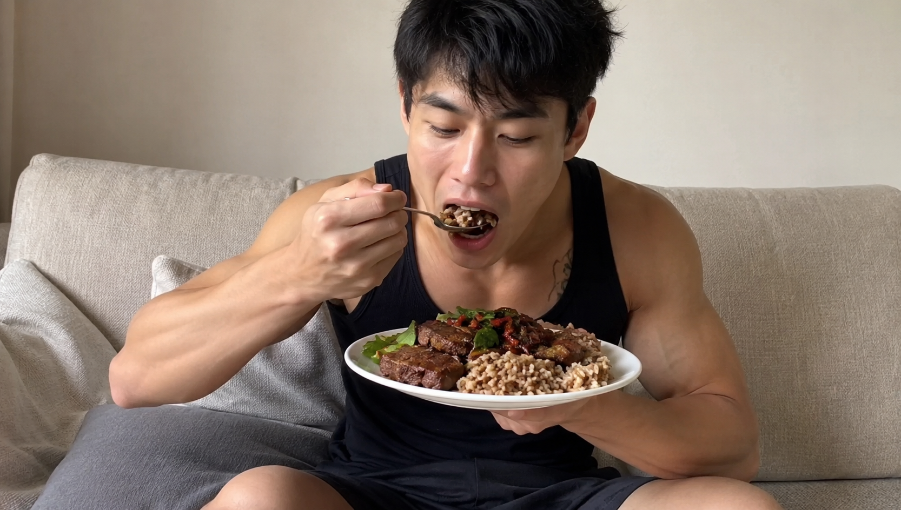

**【封面图设计指令】** 画面描述：两个体重相同但身材反差极大的年轻男性站在镜子前，左边肌肉紧实，右边有大肚腩。主体在正中间安全区。 **AI生成中文指令：** 两个年轻男性并排站在一面大镜子前，左边男性肌肉线条清晰紧致，右边男性有明显的啤酒肚，两人都光着膀子。核心人物完全处于画面正中间。背景是普通的家庭卧室，光线自然。手机随手拍质感，真实细腻的皮肤质感，未经精修的生活记录风格，比例16:9。

**【都是 140 斤，有肌肉VS没肌肉，完全俩身材……】**

你在生活里肯定遇到过这种暴击： 一上秤，你和朋友都是140斤。 但他穿衣显瘦、脱衣有肉，你却大腹便便、肉全松垮着。

**核心速读：在这篇里你需要理清的三个真相。**

- 为什么体重一样，体型却天差地别？
- 脂肪和肌肉的体积差距到底有多可怕？
- 为什么肌肉多的人，躺着都在疯狂燃脂？

别再死盯着体重秤上的数字焦虑了！ 决定你身材的，从来不是多少斤，而是你体内的肌肉和脂肪比例。

---

### **体积之差：同等重量，脂肪大得吓人**

为什么同样是140斤，有人像彭于晏，有人像高晓松？ 答案就藏在密度里。

肌肉的密度大约是 1.12g/cm³，而脂肪只有 0.79g/cm³。 这意味着什么？ **同样是5公斤的重量，脂肪的体积比肌肉足足大了好几圈！**

如果你把身体里5公斤的脂肪换成5公斤的肌肉。 你的体重没变，但你的腰围可能会缩小十几厘米！ 所以，肌肉含量高的人，看起来就是比同等体重的人要精瘦得多。

**【插图设计指令 1】** 画面描述：一个精瘦结实的小伙子拿着一件曾经穿不下的偏小号T恤，惊讶现在穿正好。 **AI生成中文指令：** 一个身材紧实、有隐约腹肌的年轻男性，正惊讶地看着自己穿上的一件偏小的白色T恤，现在居然显得很合身。背景是光线明亮的出租屋。手机随手拍视角，第一人称记录感，真实的生活光影，无美颜滤镜，8k分辨率。

---

### **代谢之差：肌肉是你的免费“燃脂机”**

除了让你看起来更苗条，肌肉还有一个逆天的隐藏属性。 它是人体消耗热量的绝对大户。

在安静状态下，1公斤肌肉每24小时能消耗约15千卡热量。 而1公斤脂肪，24小时只能消耗可怜的4千卡。 **相差将近4倍！**

如果两个人体重相同，肌肉男每天的“基础代谢”会比胖子高出一大截。 就算他俩每天并排躺在沙发上玩手机，肌肉男消耗的热量也远超胖子。 这就是为什么有肌肉的人，吃得更多也不容易长胖。

**【插图设计指令 2】** 画面描述：一个身材健壮的男生在沙发上惬意地吃着健康餐。 **AI生成中文指令：** 一个手臂肌肉线条清晰的年轻男生，正惬意地坐在家里的布艺沙发上，端着一盘丰盛的牛肉糙米饭大口吃着。手机随手拍抓拍，室内自然光，色彩真实，没有多余的布景，展现日常干饭的放松状态。

---

### **告别体重焦虑，把脂肪换成肌肉**

很多新手减肥，第一反应就是节食饿肚子。 体重掉得是很快，但掉的全是宝贵的肌肉和水分。 最后变成了一个“小号的胖子”，一旦恢复饮食，报复性反弹马上就来。

**【正误对比】**

- ❌ **错觉：** 减肥就是让体重秤上的数字越小越好。
- ✅ **真相：** 减肥的本质是“减脂增肌”，用力量训练保住肌肉，用热量缺口刷掉脂肪。

**一句话总结** 好身材不是饿出来的，拿起哑铃，把松垮的脂肪变成紧实的肌肉，你才能真正迎来蜕变！

---

**【📚 科学依据与参考文献】** 为了保证内容的严谨性，本文科学依据均提炼自以下权威文献：

1. **《一平米健身：硬派健身》**，Chapter 1 减肥，从何开始：“体重能代表什么？”一节中，详细对比了同等重量下脂肪与肌肉的体积差异（密度数据），以及肌肉和脂肪在静息状态下的热量消耗量差异，参见第249-251页。
2. **《量化健身：原理解析》**，第一章 破除健身迷思：明确指出决定身材的往往是身体成分中脂肪与肌肉的比例，参见第399页。

**【文末互动投票】** 铁子，你现在更关注哪个数据？（多选）

- 镜子，[衣服撑不撑得起全看它]
- 卷尺，[腰围一小天地宽]
- 体重秤，[数字不掉我不安心]
- 体脂率，[肌肉线条才是王道]
- 摆烂，[快乐干饭最重要]

---

这篇推文的排版、字数和配图指令符合你的预期吗？需要我为你调用工具，把这篇内容直接生成配套的 NotebookLM 播客（Audio Overview）音频吗？