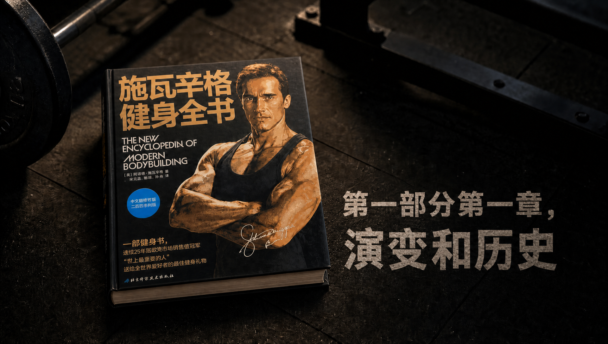
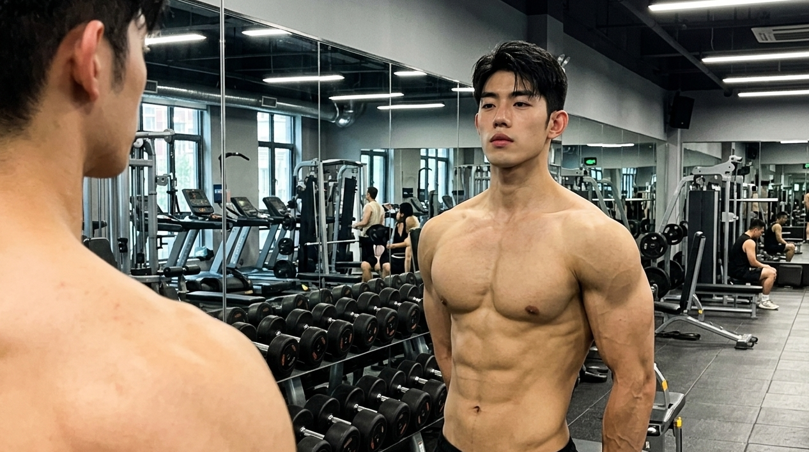
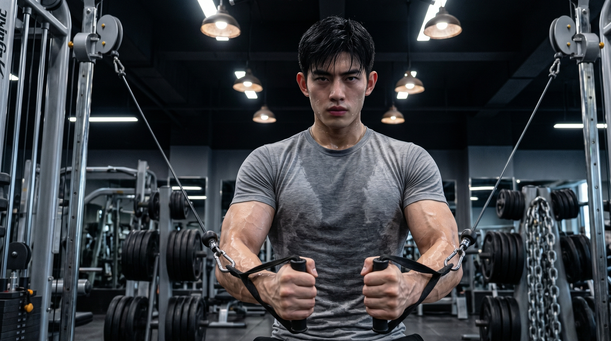

**核心导读：这一篇先弄懂原书的 4 件事**

• 为什么天生比例完美的“中胚型”，反而是健身房里最容易摸鱼、撞上瓶颈期的群体？

• 怎样在计划中狠抠“多角度孤立细节”，去精雕你那副让人嫉妒的骨架？

• 原书死磕的“硬核动作转换”，为什么是你维持长期**渐进负荷**的终极武器？

• 想要保持线条**拉丝**又不想掉围度，天选之子究竟该怎么去调配你的有氧和饮食？

#### **1. 警惕天赋陷阱：别让你那极强的恢复力，变成了训练摸鱼的借口**

原著当中明确说明，壮实类型的身形是各种身形之中的天选类型。这类人一般具有宽厚的胸腔。同时还有饱满的大肌群。并且天生体脂率比较低。骨骼和肌肉的适配程度非常好。

最让人羡慕的是，你的肌肉恢复以及生长的速度非常快，如同开启了外挂一般。

简单来说吧，其他人在完成锻炼之后需要整整休息三天才能够恢复过来。而你休息一觉之后身体的状态就全部恢复了。并且就算是多吃几口食物，增长的也全部都是肌肉，没有一点肥肉存在。

阿诺德在书中对这类天生容易发胖、特别容易陷入自我满足怪圈且在健身房总习惯用七成强度划水摸鱼的人泼了冷水。

你应当这样去做。不要让你的天赋长处被浪费掉。要主动从舒适的小环境当中走出来。

在动作的标准都达到符合要求的基础之上，朝着你的极限负重持续发起冲击，以最大的强度去挖掘你身体内部所潜藏着的潜力。

配图1

#### **2. 开启多角度精雕：不能只满足于大块头，你得追求极致的比例美感**

外胚型的人需要仔细地去进行复合动作，内胚型的人需要大力地去增加训练的容量，中胚型的人则要在这两者中间塑造出最为精致的肌肉线条。

施瓦辛格觉得，你的骨骼条件能够支撑练出非常夸张的肌肉维度。接下来就是运用不同的动作去打磨很多经常被忽略的肌肉边角位置。

简单来说就是：你已经拥有了坚实的基础，当下需要认真地进行雕琢，把每一个细节都妥善地处理好。

不要仅仅想着将胸肌练得很大，要使得胸肌的上缘部位饱满且紧实，下缘部位的线条要显得干脆利落，如同是被雕刻出来的那般。

具体的安排是这样的：需要保留能够起到核心增效作用的复合动作，并且在你的训练计划当中要加入数量众多的多方位的针对性单项训练以及变换的动作。

以胸部训练日作为例子，在完成经典的平板杠铃卧推之后，接着进行上斜哑铃飞鸟、低位绳索夹胸。从不同的肌肉发力角度来深度刺激胸肌纤维。

#### **3. 摧毁身体的适应性：高频更换你的动作库，别给肌肉喘息的机会**

原版书籍当中明确地表明，中胚型的身形如同一个反应极为迅速的智能系统，能够以超出想象的速度去适应单一的训练方式。

要是你按照某一个增肌方案机械地进行了三个月的锻炼，那么你的肌肉就会适应那个训练模式，平稳地进入到瓶颈阶段。

简单来说，你需要成为一个让肌肉完全无法把握其规律的非常厉害的角色。

有的时候改变动作的顺序，或者对组与组之间休息的时间进行调整，又或者更换使用不同的器械，持续地给身体的神经创造新的刺激。

具体的操作办法是：保持核心训练的节奏不发生改变。每隔四到六周的时间，把辅助训练的全部动作都进行一次更换。

这周使用哑铃来进行划船的动作，下周则更换为T杆拉背或者悍马机单臂牵拉。今天安排进行超级组的训练，明天运用降重组的方式来将目标肌群训练到完全没有力气。

配图2

#### **4. 饮食与有氧微调：走在干净增肌的钢丝绳上，多一分则肥、少一分则瘦**

很多人认为中胚层体质天生就不容易出现体重增加的情况，于是就完全没有限制地进行大量饮食，进行所谓的“粗放增肌”，每一顿饭都和汉堡以及甜饮料离不开关系。

这份指引的核心内容是：对于中胚型体质的人来说，即使其代谢能力是比较强的。但是如果长时间每一顿饭都食用高脂高糖的食物，那么还是会变成骨架较为壮实的胖人。原本清晰且分明的肌肉线条也会全部变得不太明显了。

阿诺德在书籍当中表示，中胚型体质的人应当按照高蛋白质、中等碳水、极少脂肪的较为清淡的饮食方式来进行。

你不要像很多身体肥胖的人一样与主食较劲儿，也不要像身材瘦高的人一般毫无节制地大量食用高热量的食物。

若想要保持日常稳步进行塑型，就需要摄入足够量的蛋白质，而碳水化合物则选择燕麦、糙米这类消化速度较慢的优质谷物。

进行有氧锻炼的话，每周进行2到3次。每次进行25分钟的温和运动。例如快走或者缓坡漫步相关的。它的作用并非是猛烈地燃烧脂肪，而是帮助你保持良好的心肺状态。如此一来便能够为你的高强度力量训练提供助力了。

请把下面这张“中胚型精雕排错检查表”截图保存在手机里。当你觉得身材不长了、训练变枯燥时，一条一条对过去：

1. **多样性检查**：这个训练计划是不是已经练了两个月没变过了？（下周立刻换动作！）
    
2. **强度检查**：今天最后两组有没有真正逼近**力竭**？还是觉得围度够大就提前收兵了？
    
3. **细节检查**：今天有没有安排针对弱势部位（如后束、小腿、腹外斜肌）的精准孤立轰炸？
    
4. **状态检查**：照镜子时肌肉有没有标志性的**泵感**与拉丝度？（如果变糊了，立刻扣掉饮食里的隐形脂肪）
    

昨日锻炼数据：

杠铃平板卧推 - 110kg - 4组_6次 上斜哑铃推举 - 45kg(单只) - 4组_8次

双杠加重臂屈伸 - 自重+25kg铁盘 - 3组_10次 低位绳索夹胸 - 32kg - 4组_12次（慢速离心，极度压榨泵感）

所以，各位在评论区天天羡慕别人“天赋异禀、随便练练线条就很好”的中胚型老铁，也摸着良心自问一下：上天给了你最好的地基，你却天天在健身房里用划水敷衍自己，你到底是在练健美，还是在暴殄天物？

来评论区说一说，你觉得自己的哪一个身体部位是老天爷给予吃饭的资本，或者是哪一个身体部位是怎么进行锻炼都没有效果的？

北京科学技术出版社在2012年推出了《施瓦辛格健身全书》。这本书是由阿诺德·施瓦辛格和比尔·多宾斯共同合作撰写而成的。

_注：本文主要依据《施瓦辛格健身全书》第二部分第二章“了解你的身体类型”中的“中胚型体型”内容进行拆解，旨在将理论转化为实操。_