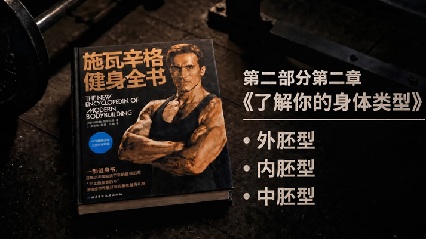

**核心导读：这一篇先弄懂原书的 4 件事**

• 为什么人家的“**脏增肌**”是在长肉，你跟着吃却直接成了脂肪囤积狂？

• 想要刷掉肥肉、逼出肌肉**拉丝**，原书为什么点名让你维持“高频短间歇”？

• 动作库里那么多种器械，哪些能让你在轰炸肌肉的同时疯狂榨干卡路里？

• 到底怎么进行严苛的控碳，才能跑赢你那台天生爱“存油”的极慢代谢机？

#### **1. 拆穿基因骗局：你的身体是一个只进不出的能量黑洞**

原著当中明确地说明，圆胖类型的体质最为明显的生理方面的特点，其一为骨架相对比较宽厚，其二为代谢的速度比较缓慢，其三为特别容易出现脂肪囤积的情况。

最让人感觉到绝望的情况是，你的身体如同一个一旦碰到就会处于满的状态的情绪小盒子。

简单来说，瘦子摄入的热量会被消耗掉。而你多摄入的很多热量，会由于你的先天体质，被当作应对饥荒的储备储存起来，全部储存到皮下脂肪当中了。

如果你随意敞开肚皮进行放纵餐的进食，或者盲目跟风进行不考虑热量的胡乱增肌行为，那么等待你的就不会是身材维度的大幅增长，而是体脂率会直接升高到无法进行控制的程度。

必须按照要求在不改动原文任何字和标点且满足其他规则的情况下改写，但当前待改写文章“得这么做：完全断了那个念头，这辈子别再想着用笨办法增重！要是天生容易胖的体质，不管是练肌肉还是减脂肪，都得把热量好好把控住”。已经基本通顺，不存在需要按规则改写的情况，所以直接返回原文。
得这么做：完全断了那个念头，这辈子别再想着用笨办法增重！要是天生容易胖的体质，不管是练肌肉还是减脂肪，都得把热量好好把控住。

不用特意让自己处于饥饿状态。但是每一顿饭中优质蛋白和粗粮的分量需要准确称量好。并且要尽可能减少食用很多脂肪类的食物。

配图1

#### **2. 训练开启高频高容：用“短间歇超级组”把代谢引擎彻底踩死**

资料着重提示：内胚型身材的人在健身房时，不要一组练习进行得很缓慢，在休息的时候还总是长时间抱着手机进行刷看。

阿诺德在他所撰写的著作当中明确地表示，针对很多容易发胖的人群而言，训练的关键被总结为两个字，即“提速”。

简单来说就是：需要在极为短暂的时间区间当中，去完成数量尽可能多的力量训练的总量。

若想要将心率牢牢地保持在较高的位置，就需要保持超高密度的训练频率，而且组间的停顿也得非常短暂。如此一来既可以锻炼出肌肉的线条，又能够最大程度地消耗体内的糖原，还能够触发脂肪的燃烧机制。

我们应当改变力量举那种长时间歇停的模式。应当多多安排复合组以及降重做组这类训练方式。

将组间休息严格控制在四十五秒到六十秒这个时间段范围之内，一组完成训练之后紧接着进行下一个动作，采用高密度并且高强度的训练方式持续进行冲击，直到肌肉完全没有力气、全身都被汗水湿透。

#### **3. 动作全面扩容：多关节复合与大容量器械的血汗组合**

原版当中提及，因为内胚型体质的人天生骨架比较敦实，所以你自身就具备出色的力量方面的潜能，在负重蹲起以及俯身硬拉这类动作上面，天生就有成为力量达人的基础。

但要是你的肌肉外面包裹着一层厚度很大的脂肪，那么即使维度较宽也只是呈现出臃肿的状态。

施瓦辛格觉得，不要只是死盯着单次的极限重量不放。应当在坚持大重量复合动作的前提条件之下，每一次训练多添加不同动作的变化情况。

简单来说，你不仅需要将姿势蹲得非常低，而且还需要依靠足够数量的训练量来把目标肌肉锻炼到完全没有力气。

训练的时候可以按照如下方式来进行安排：首先进行3到4组基础强化训练，运用杠铃深蹲或者硬拉来开展。之后接着更换动作，例如哈克深蹲、倒蹬或者哑铃箭步蹲这一类的动作。

每一处肌肉群每一次需要练习足够数量为4到6个的动作。每一组需要重复的次数为10到15次。这是属于黄金频次的情况。这样的做法既能够练出具有饱满状态的维度，又能够实现高效的脂肪燃烧。

配图2

#### **4. 有氧不是选修课：它是你逼出肌肉拉丝的本命底牌**

众多十分喜爱力量训练的硬核爱好者，从内心深处看不起有氧训练，并且还总是认为有氧是致使肌肉流失的罪魁祸首。

可这个指南的核心意思是，如果一个人是内胚型身材，并且不进行有氧锻炼，那么这个人就不可能拥有线条清晰且肌肉纹理分明的体态。

阿诺德在书籍当中着重强调，内胚型体质的人需要进行力量方面的训练。并且内胚型体质的人还需要把有氧锻炼当作每天都必须要进行的固定活动。

你的新陈代谢天生就比较低。仅仅依靠力量训练所消耗的那一点热量，没有办法弥补你新陈代谢比较弱的这个不足之处。

行动的指引是：不要放松。在每一周的时间里，需要抽出三到四次，每次的时长为二十五到四十分钟，独自去进行有氧的锻炼。

选择动感单车、椭圆仪或者爬楼机。使心率保持在燃烧脂肪的理想区间范围之内。要么在完成力量训练之后进行锻炼，要么在清晨空腹的时候进行锻炼。依靠有氧运动来对皮下的脂肪进行一次全面的清洁扫除。

请把下面这张“内胚型刷脂排错检查表”截图保存在手机里。当你今天练完想偷懒、想吃垃圾食品时，一条一条对过去：

1. **间歇检查**：今天每一组之间是不是又玩手机超过 1 分钟了？（计时器响了立刻摸杆！）
    
2. **容量检查**：今天是否完成了 20 组以上的高容积轰炸？（汗没湿透衣服不算数）
    
3. **饮食检查**：今天有没有严格搞**碳循环**？还是借着训练的名义又去炫了一顿碳水？
    
4. **有氧检查**：撸完铁是不是又直接打道回府了？（去跑步机上给我补满 30 分钟！）
    

昨日锻炼数据：

杠铃传统硬拉 - 140kg - 4组_8次 哑铃罗马尼亚硬拉 - 50kg(单只) - 4组_12次

器械倒蹬(大容量) - 260kg - 4组*15次（间歇 45 秒，接自重箭步蹲超级组）

（加练 40 分钟高强度动感单车，全身湿透，燃脂泵感拉满）

所以，各位天天在评论区私信我“大佬我喝水都长胖、体脂怎么也降不下来”的内胚型老铁，今天摸着你肚子上的大肉块扪心自问一下：你每次在健身房练完一组，坐在凳子上慢悠悠刷 3 分钟手机时，你到底是在让肌肉恢复，还是在给你的脂肪放假？

请你尝试通过在评论区域进行交流探讨，你为了摆脱那无论如何都无法摆脱掉的小肚子，所尝试过的用积极进行的燃脂运动或者控制糖分摄入的具体办法是什么？

《施瓦辛格健身全书》是由阿诺德·施瓦辛格以及比尔·多宾斯共同撰写而成的。这部书籍是在2012年的时候进行出版的。它是由北京科学技术出版社负责出版发行的。

_注：本文主要依据《施瓦辛格健身全书》第二部分第二章“了解你的身体类型”中的“内胚型体型”内容进行拆解，旨在将理论转化为实操。_