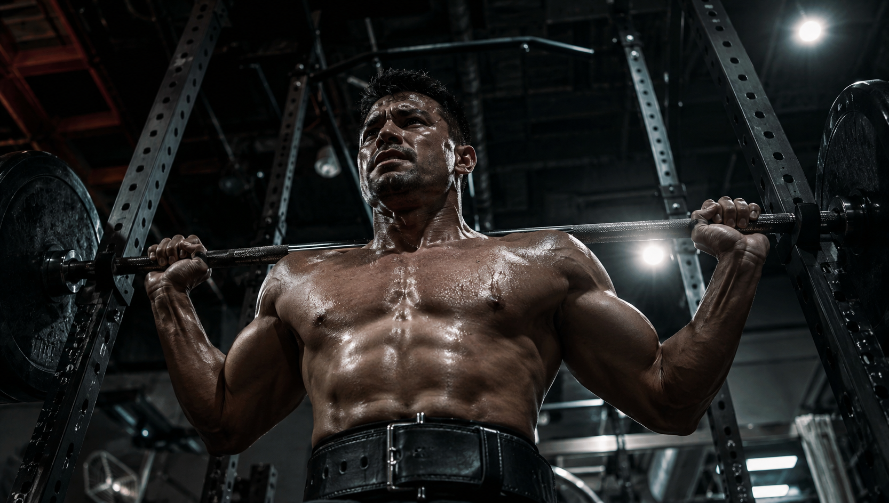

**【封面图设计指令】** 画面描述：一个身材健美的健身者在工业风健身房做平板支撑，核心收紧，侧面特写。主体在画面正中间，比例16:9，确保上下裁剪成2.35:1后主体依然完整。 **AI生成中文指令：** 一个身材健美、满身大汗的年轻男性，正在昏暗的工业风健身房的瑜伽垫上做标准的平板支撑，腰腹部肌肉紧绷，汗水顺着脸颊滴落。侧面特写，背景具有景深感，自然光效。第一人称随手拍视角，真实电影感，摄影级8k画质，极其精致的细节，高对比度，核心人物处于画面正中央，比例16:9。

**【想练好健身，这部分肌群千万不要放过，练好了已经毕业一半】**

你在健身房可能经常看到这种人： 胸肌练得很大，手臂粗壮，但只要一上重量做深蹲或硬拉，身体就狂抖，甚至经常抱怨腰痛。

问题出在哪？ 他们忽略了人体最重要的“承上启下”枢纽——腰腹核心肌群。

很多新手以为练核心就是为了好看的“八块腹肌”或“马甲线”。 其实，核心肌群是你全身力量的源泉，练好核心，你的健身之路就已经“毕业了一半”。

今天，我们就来揭开核心肌群的真正威力。

---

### **核心不只是“腹肌”，它是力量的“发动机”**

在运动解剖学中，核心被定义为腰椎-骨盆-髋关节复合体（LPHC），它是人体所有动作的起始点和身体重心所在。

你可以把身体想象成一条鞭子。 腿部是发力的手，末端四肢是鞭梢，而核心肌群就是鞭子的中段，负责传递和加速力量。

如果你的核心不够强健，下肢强大的爆发力就无法顺畅传导到上肢。 这就是为什么你明明腿部有力量，却在推举或投掷时总觉得使不上劲。

**【插图设计指令 1】** 画面描述：一个健身者正在做大重量深蹲，腰部佩戴着举重腰带，表情专注，体现出核心力量的爆发。 **AI生成中文指令：** 一个肌肉线条分明的健身硬汉，腰间佩戴着黑色的专业举重腰带，正在深蹲架前扛着沉重的杠铃。他腹部紧绷，眼神坚毅，面部带着真实的汗水反光。背景是器材冰冷的健身房。第一人称仰视视角，胶片颗粒质感，真实电影光影，极其精致的细节。

---

### **核心薄弱，是受伤的罪魁祸首**

很多人热衷于孤立地练胸、练手臂（动作系统），却不锻炼深层核心（稳定系统）。

这就像在流沙上建高楼。 如果动作系统的肌肉非常强壮，但局部核心稳定系统较弱，动力链就会严重失衡，无法正确传递力量。

最直接的后果，就是在做深蹲、弓步或过头推举时，脊椎过度伸展（塌腰），最终导致代偿和下背痛等损伤模式。 保护脊椎免受伤害，必须从强化核心开始。

**【插图设计指令 2】** 画面描述：一个年轻人在做卷腹动作，表情有些痛苦，双手抱头，展示错误的腹肌发力。 **AI生成中文指令：** 一个年轻男性在蓝色的瑜伽垫上做仰卧起坐，他双手紧紧抱住后脑勺，脖子被用力向前拉扯，表情十分痛苦和吃力。背景是明亮的现代健身房。真实摄影抓拍质感，自然光效，逼真的皮肤纹理，8k分辨率。

---

### **告别无效卷腹，科学强化核心**

还在每天做几百个卷腹？ 如果动作错误（比如双手抱头硬拉脖子），不仅练不到核心，还会让颈椎严重受损。

真正高效的核心训练，应该注重身体的整体稳定性。

**动作一：平板支撑（Plank）** 这是核心训练的最强动作。它几乎能训练到核心区域的所有肌群，兼顾稳定和深层刺激。 不要追求撑多久，关键是保持核心紧绷，不塌腰、不松腹、不撅屁股。

**动作二：十字挺身** 这是锻炼下背部核心的最佳动作之一。 趴在垫子上，对侧的手臂和腿同时抬起，在顶端收缩停留。它能极大增强你的脊柱稳定性，预防“闪腰”等下背部损伤。

**【插图设计指令 3】** 画面描述：一个女性在健身房做标准的平板支撑，身体呈一条直线。 **AI生成中文指令：** 一个穿着紧身运动服的年轻女性，正在健身房的垫子上做极其标准的平板支撑动作。她的背部、臀部和腿部保持在一条直线上，腹部微微收紧。侧面视角，背景有些许虚化，阳光从大窗户斜射进来，极简构图，真实细腻的质感。

---

**【写在最后】**

别再痴迷于只练四肢的“面子肌肉”了。 真正的强者，都有一个坚不可摧的核心。

今天去健身房，试着在力量训练前或后，加上3组平板支撑和十字挺身。 建立起强悍的核心地基，你才能在健身的道路上举得更重、走得更远！

点个**【赞】**和**【在看】**，转发给你身边那个深蹲老是塌腰的好肌友，拉他一起重塑核心！

---

**【📚 科学依据与参考文献】**

1. **《NASM-CPT美国国家运动医学学会私人教练认证指南（第6版）》**，第9章“核心训练概念”：详细阐述了核心是人体动作系统的重心和起始点，指出动作系统强壮而稳定系统薄弱会导致动作代偿、动力链失衡与下背部损伤，参见第215-218页。
2. **《硬派健身》**，第9章“腰腹核心——身材承上启下的关键！”：解释了核心肌群作为“动力链”力量传导枢纽的关键作用，并推荐了平板支撑与十字挺身作为高效安全的整体核心训练动作，参见第271-277页。

需要我为你进一步拆解在深蹲或硬拉这类复合动作中，如何正确“收紧核心”及使用腹式呼吸的发力技巧吗？