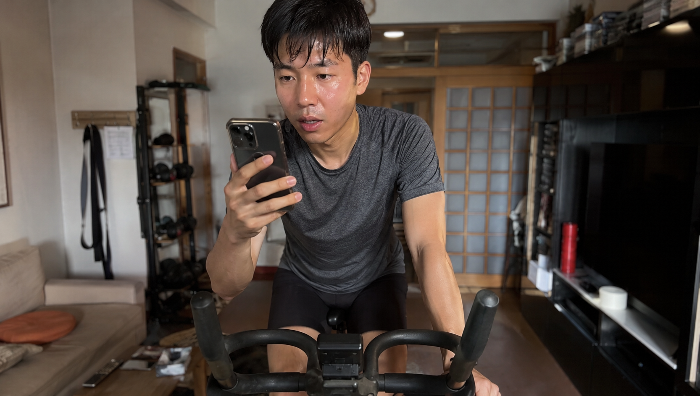
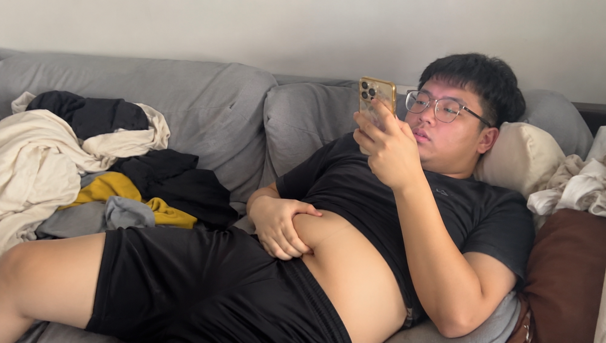
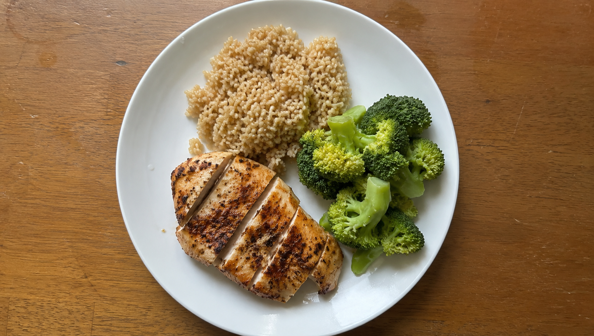
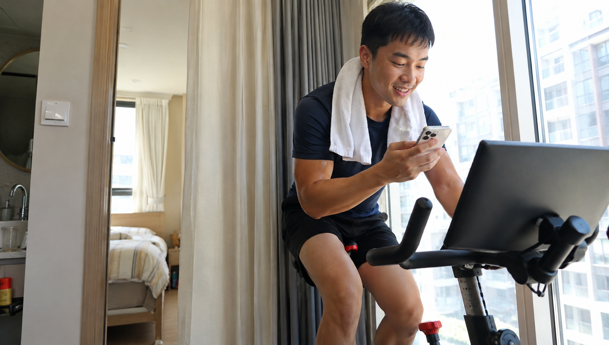

每天在下班之后回到自己的家中，就想要朝着沙发上面一躺去刷短视频？捏捏自己腰上那软软的赘肉，马上又被焦虑所包围了？

不要慌张。今天向大家分享一种对懒癌患者比较友好的物品。它能够精准地应对令人讨厌的内脏脂肪，并且你在刷手机的时候就能够大量出汗，没有任何负担。

---

### **内脏脂肪，其实最“好骗”**

很多人总是说，腰上的很多肥肉是特别难以减下去的。但实际的情况是，身体内部所蕴含着的脂肪对于热量方面的缺口是特别敏感的！。

只要身体处于消耗的量比吸收的量多的这种状态，体重下降的速度就会非常惊人。减脂的核心实际上就是长时间保持热量的摄入量少于热量的消耗的这种状态。

没有必要每天在田径场跑步跑到到处呕吐。你实际上真正需要的是一套能够让人轻松坚持且没有太多心理压力的长期计划。

---

### **边玩手机边练，选对运动是关键**

体重超标的人还长期不进行运动，不要一开始就激烈地进行跑步、跳绳这类运动，这类运动对身体的冲击比较大，自身存在额外的体重，这不仅容易损伤膝盖，还会因为疼痛的感觉比较强烈而很快放弃运动。

你是否正在寻找一个在刷手机的时候能够偷偷活动起来的小物件？那是有的带有靠背的动感单车或者家用踏步器就是比较合适的。

这类有氧运动器械在运动的时候强度是比较平缓的。它不会给身体带来剧烈的冲击力。安全系数非常高。并且在进行操作的时候，完全不需要一直处于高度紧张的状态。

你可以一边观看番剧、观看脱口秀节目，或者回复办公群内的消息。只要运动的强度保持微微喘气并且还能够正常说话，每天行走四十分钟，热量就会慢慢地被消耗掉！。

---

### **吃对热量，十斤起瘦**

如果你想要快速甩掉身上多余的肉，仅仅只是在口头上说说那是没有作用的。必须要行动起来才可以。你需要明白瘦下来是一个逐步进行的过程。千万不要依靠饿着肚子来勉强支撑。

平常的时候可以多食用瘦牛腱、鸡大胸这类富含高蛋白的食品，食用之后能够让人在很长的一段时间内都不会感觉到饥饿。还可以把白米白面替换成燕麦、藜麦这类能够抵御饥饿的粗粮。

控制日常生活中所摄入的食物，并且加上在使用手机期间的少量活动，持续如此坚持下去，你的腰围必然会较为明显地变小。

---

**【写在最后】**

不要让手机耽误你进行减肥的进程。将用于刷手机的零碎时间，转变成为专门用于消耗脂肪的时间。

你就听从我的建议，在今天晚上去进行一段时间的单车骑行活动吧。

觉得这招有用，记得点个**【赞】**和**【在看】**。 顺手转发给你那个天天喊着减肥、却长在沙发上玩手机的朋友，拉TA一起“躺赢”！

---

**【📚 科学依据与参考文献】**

1. **《量化健身：原理解析》**，第七章 拆解减脂训练，第四节“减脂与增肌的关键”：详细阐述了减脂的核心本质在于维持“持续的热量赤字”，指出减脂是一个长期的过程，参见第16页。-
2. **《硬派健身：一平米硬派健身》**，Chapter 1 减肥，从何开始：解释了跳绳、跑步等高冲击力运动容易与脂肪产生共振并伤害超重者的关节，建议超重人群首选动感单车、椭圆机等和缓的有氧器械，参见第39-40页（对应文档中的261-262段落）。-