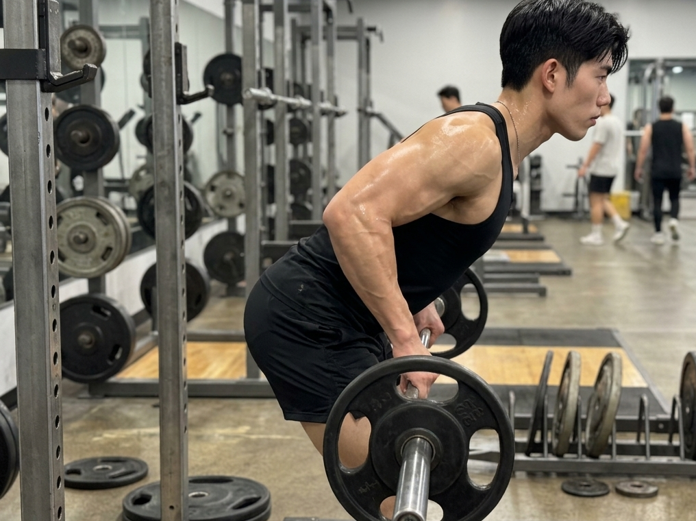
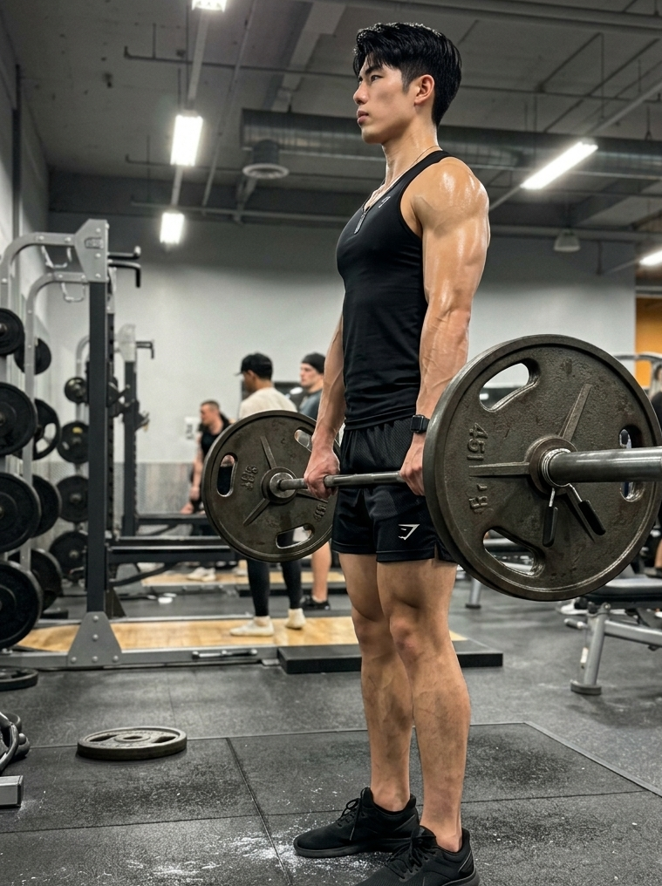

很多健身的新手一进入到健身房之中就用力地锻炼胸部，仅仅是因为能够对着镜子清晰地看到这一块胸肌。

真正支撑你身体姿态端正、身体身形挺拔的，是身体背后的深层肌肉群。

每天都蜷缩在电脑前面进行工作，始终保持着低头的状态，背部也呈现出弯曲的情形，脊椎就这样逐渐地变得笔直了。

这就直接导致了身体的姿态是歪斜的，整个人看起来至少矮了有五厘米。

若想要改善含胸驼背的状况，让身体的姿态变得挺拔修长，那么就需要将深层肌群的训练进行安排。

许多人的身体姿态出现问题，关键之处在于后背部位的肌肉力量不充足。

要对背部的肌肉群进行强化。强化背部的肌肉群可以使得身形变得更为宽厚。并且强化背部的肌肉群还能够带来稳固的后支撑力。

现在就来为你罗列在健身圈子里被大家所认可的4个经典王牌动作。

## 一、正握引体向上：打造完美的“V”字形宽背

[配图1]

引体向上是一个流传了很长时间的肌力训练动作。它是硬核力量的一种具有标志性的展现形式。

它能够精准地对背阔肌的外缘部分进行锻炼，从而使得你可以轻松地练出更为宽阔的背部线条。

双手紧紧握住横杆，掌心朝着下方。握距需要尽可能地达到自己能够掌控的最大宽度。

双手紧紧地握住横杆，使身体悬挂于空中。接着用力地向上牵拉，直至后颈或者上胸贴近横杆。

当拉到动作顶端的时候，略微停顿片刻。之后将背部的肌肉充分地收紧并压实。

然后缓慢地让身体回落，回到最开始的姿势，在整个过程当中都维持稳定的状态。

刚开始进行练习的人如果力气不足而无法拉动自己，不要勉强自己坚持。

你能够先在本次训练周期当中，运用高位下拉器去替代进行练习。

双手以和肩膀宽度相同的方式握住物品。之后反手向下进行拉的动作。如此能够帮助你平稳且缓慢地适应并完成过渡。

## 二、俯身杠铃划船：雕刻背部厚度与强韧核心

[配图2]

如果说引体向上主要是用于锻炼宽阔的后背，那么划船这个动作就是专门用来使背部的肌肉群体变得厚实的。

俯身拿着铃铛，然后躬身进行拉动的这个动作，是一个性价比比较高的训练动作。这个动作能够全方位地刺激后背部位的肌群。

它能够使后背变得宽阔以及大圆肌得到锻炼。与此同时它还可以让腰腹部位的深层肌肉维持紧绷的状态。

膝盖有轻微的弯曲状态，臀部朝着后方有坐下的态势，上半身朝着前方有前倾的态势，腰背始终维持着挺直并且舒展的情形。

双手紧紧握住杠铃，胳膊就那样自然地垂着，大腿前侧紧紧绷起来以稳住身体。

当你进行吐气动作的时候，需要专注地去调动后背部位的肌肉群用力，之后将杠铃朝着肚脐所在的位置进行拉动。

当被抬升到最高的位置的时候，让肩膀部位的肌肉处于绷紧收缩的状态，能够感觉到那种酸热的灼烧般的感觉。

在进行大重量训练的时候，需要学会进行憋气来发力，并且要将肚子里的力量稳定住。

如果你随意地扭动腰部或者不加选择地进行喘气，那么你的后腰就很容易产生疲劳，而且还有可能会受到损伤。

## 三、坐姿器械划船：孤立背肌的“安全牌”

[配图3]

在进行徒手杠铃俯身拉这个动作的时候，对于腰腹核心部位的稳定性有着比较高的要求。

要是在平常的时候进行深蹲和硬拉的练习次数过多，后腰就会比较容易出现过度疲劳的情况。

这时候，坐姿器械拉背就成为了非常合适的替代选项。它能够更加精准地去锻炼背部的肌群。

双脚抵靠在器械前面的挡块之上，腰背保持挺直的状态，将小腹收紧，双手紧紧地握住握把。

顺着器械的走向，把手朝着胸腹的位置进行拉动。与此同时胳膊肘紧紧地贴近身体的两侧部位。

进行动作的时候，不要大幅度地前后晃动身体来借助力量。

你将所有的注意力全都集中到肩胛骨的向内收拢以及向外舒展这一情况之上。

平行进行移动的路径，可以使得背阔肌中下区域的肌肉线条被稳妥且精准地塑造出来。

## 四、屈腿硬拉：点燃全身后侧链的王牌

[配图4]

俯身拉举属于哑铃训练里的动作，它是较为重要的，并且它是后肌群的关键组成部分。

它能够锻炼后腰部位的肌肉、臀部的肌肉、大腿后侧的肌肉，以及整个背部的肌群。

双脚处于自然站立的状态，杠铃杆轻轻地贴近小腿的前侧，双手既可以采用一个正握和一个反握的方式进行抓握，也能够都运用正握的方式来抓握。

腰背保持挺直并且处于绷紧的状态，臀部进行夹紧的动作，借助双腿蹬地所产生的力量，将杠铃笔直地向上拉取。

在进行举杠铃的操作时，后背应当保持处于一条直线的状态，不可以使得后背出现打弯的情况。

当顶部处于固定状态的时候，需要保持胸部挺直。不要向后仰得过多。之后平稳地将杠铃放置回去。

经常进行硬拉这个动作，能够使得脊柱周围锻炼出结实的肌肉保护层。同时它还可以协助你对骨盆的姿态进行调整。

通过进行高强度的静态发力，使得你的背部肌群具备持久的耐力。

完成这四组动作之后，你的后背会出现酸胀的感觉，身形会自但是然地舒展变得挺拔。

### 参考文献

1. 《硬派健身》Chapter 8 驼背与不平衡成因。
2. 《施瓦辛格健身全书》第三部分 背部训练要领。
3. 《量化健身(动作精讲)》第三章 俯身杠铃划船与瓦式呼吸。
4. 《力量训练基础》Chapter 4 硬拉力学与背部刚性。