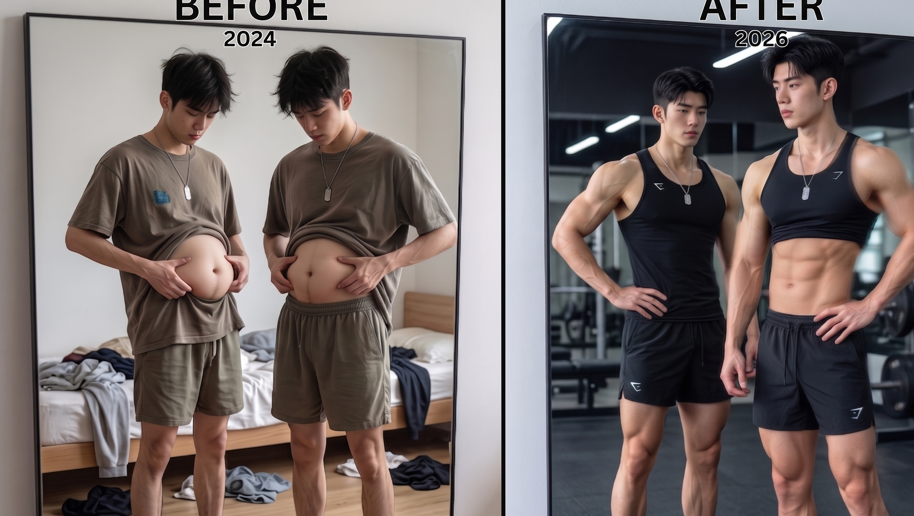
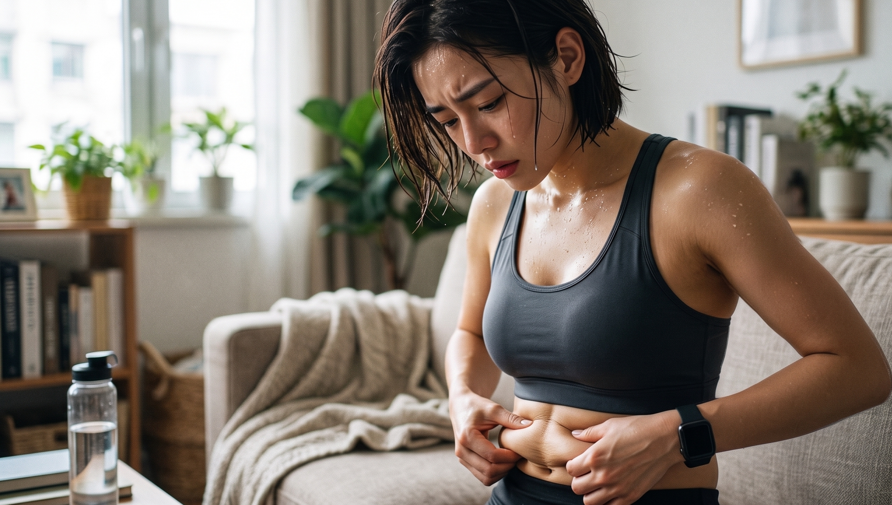
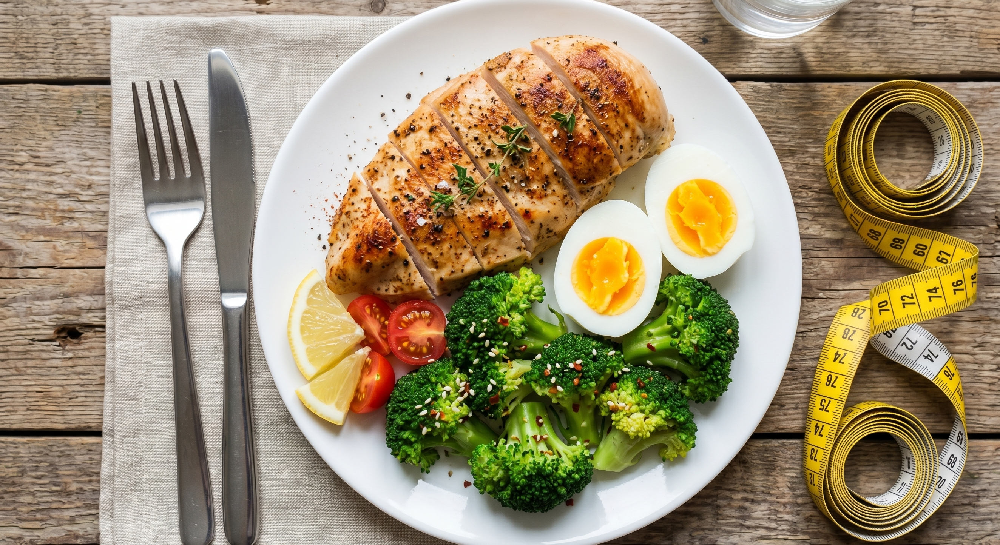
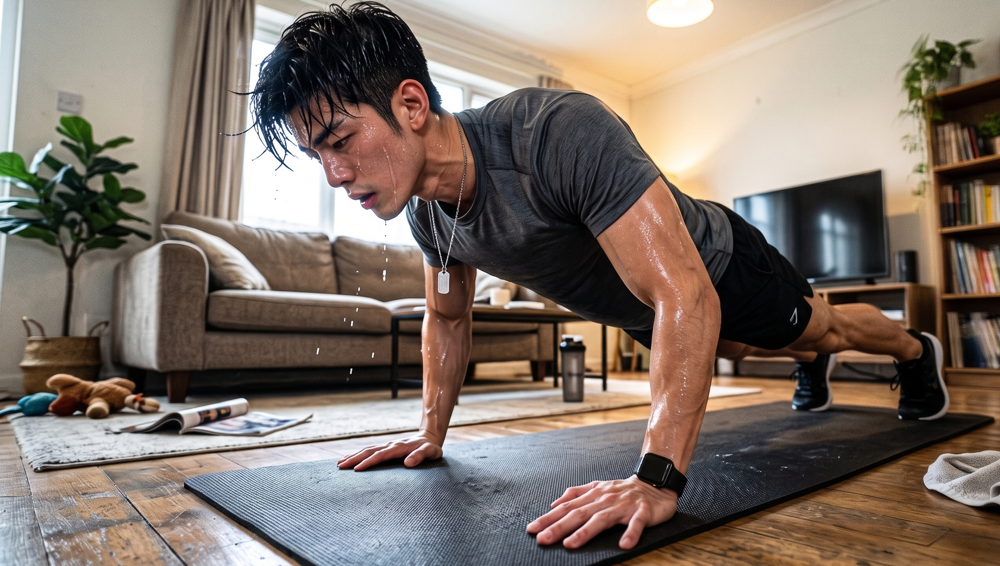

明明四肢纤细，体重也很轻。

刚刚坐下，腰腹部的赘肉就堆积起来，形成了三圈。

原本打算穿着修身款式的服装来凸显自身的身材，但是实际情况是，满满的肚腩将兴致全部破坏掉了。

不要再盲目地饿着肚子还拼命地刷步数了。你就是处于“看似瘦弱但实际上肥胖”的状态之中。

现在向你分享三个能够加速脂肪燃烧、使小肚子变得平坦的实用方法。

请尽快将物品收存起来。否则等到肌肉开始减少、肚子变得松弛的时候，再去后悔就已经没有机会了。

🚨 **陷阱：节食是“瘦胖子”的罪魁祸首**

很多人在看到肚子呈现出圆滚滚的状态时，第一个产生的想法就是通过依靠让自己饿肚子这种方式来进行解决。

完全弄混淆了！通过让自己处于饥饿状态来实现变瘦的目的，大多数情况下所减掉的是身体内部的水分以及珍贵的肌肉组织的量。

相关的研究显示，很多刻意对饮食进行节制的人，他们身体的基础代谢的速度和饮食规律的人相比较，要缓慢许多。

身体的基础代谢的水平会因为肌肉数量的减少而直接地降低。

换一种表达方式，你目前的身体状况就是稍微喝一点凉水就会出现长胖情况的体质了。

刚在放开饮食之后没有过几天，多余的热量就全部转化成为了肚子上的柔软的肉！。

🥩 **技巧一：喂饱肌肉，蛋白质是关键**

若想要应对令人厌烦的小肚腩问题，首先需要做的事情是坚守相关要点，并且同时还需要去锻炼出更多的肌肉组织。

在日常进行进食活动的时候，多食用一些包含蛋白质含量相对较多的食物。

可以多吃一些瘦的牛腱子肉、鸡的大的胸脯部位的肉、新鲜的鱼肉以及煮得很白的鸡蛋。

食用富含蛋白质的食物。其能够使你在较长的时间段内保持有饱腹感的状态。并且身体在对它进行消化的时候会消耗掉更多的热量。这种额外消耗的热量大概能够达到所摄入热量的两到三成。

就比如说你处于坐着吃饭的状态时，连肠胃进行消化这件事情，在这个时候也在悄悄地帮助你更多地消耗一些热量！。

🏋️‍♂️ **技巧二：力量训练，减腰围的最强武器**

若想要将肚子里顽固的脂肪清理干净，仅仅依靠慢悠悠地跑步是远远不够的。

相关的调研结果显示，与强度处于中等及以上程度的有氧锻炼相比较，抗阻训练在降低体重以及缩小腰围这一方面所产生的效果更为明显。

需要将原句进行改写，在不改变原文任何字和标点的情况下，使段落更通顺且符合要求。

要把比如深蹲、硬拉、俯卧撑这类能够带动大肌群的多关节动作进行安排。

它们不只是能够让你的胳膊以及腿变得紧致并且匀称，还能够默默地让你的肢体的线条感得到提升。

还能够极大程度地激发你身体之中的耗能机器，使得基础代谢得以全面地爆发开来。

🔥 **技巧三：HIIT收尾，激活后燃效应**

觉得去健身房进行跑步运动比较麻烦的话，那么可以尝试一下间歇练法，这种练法能够在较短的时间内使身体出现爆燃的状态。

在完成力量练习之后，紧接着去进行时长为15到20分钟的高强度间歇训练。

大强度的运动能够明显提升在静息状态下的摄氧能力，并且还会产生较为强烈的运动之后的额外氧耗效应。

即使训练结束已经过去了很长时间，当你蜷缩在沙发上的时候，也能够在不知不觉中消耗掉热量。

要摆脱那种看起来是瘦但实际上是不健康的状态，那就需要和瞎着肚子饿着以及仅仅偷懒躺着的做法说再见了。

将这三个巧妙的方法放置到日常的饮食、喝水以及运动的过程里面去。

你会察觉到，四肢的线条变得越发紧致了。并且那令人厌恶的小肚子居然悄然地消失不见了。

👇 **【交作业时间】**

你是否存在腰腹部位赘肉较多但四肢相对较为纤细的困扰？欢迎来到评论区分享一下如何规避这类问题！。

---

### 参考文献

- 《硬派健身：一平米硬派健身》：Chapter 2“你为什么会减肥失败”，第350-351页（阐述节食导致基础代谢率下降及肌肉流失的机制）
- 《硬派健身：一平米硬派健身》：Chapter 1“久坐不动，如何开始运动”，第360-361页（阐述力量训练相比有氧运动更能有效减小腰围和内脏脂肪）
- 《中国居民膳食指南科学研究报告（2021）》：第一部分“一般人群膳食指南”，第88页（阐述蛋白质具有极高的食物热效应）
- 《硬派健身：一平米硬派健身》：Chapter 3“什么样的有氧运动最减脂”，第316页（阐述HIIT与高强度训练带来EPOC持续燃脂效应的原理）