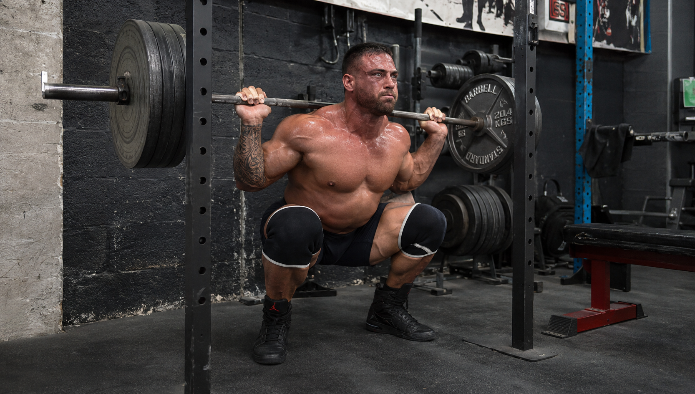
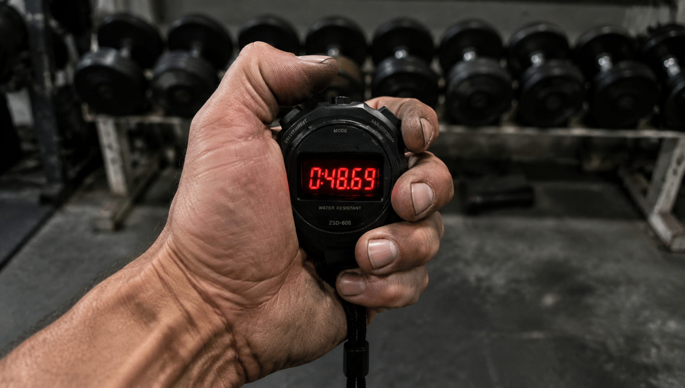

健身房实际上是一个有着明确规定的小范围群体。

很多刚刚办理健身卡的新手，眼睛总是一直盯着别人杠铃上面放置了多少配重片。

看到别人所推举的分量比较多，就憋着一股劲用力增加重量。结果就是腰弯曲得如同拉满的弓一般，脸憋得通红，脖子也肿胀起来了。

醒醒吧！真正练习达到相应程度的老手，在私下里根本就看不上很多没有实际意义的虚浮不实的重量。

他们彼此之间心照不宣地在暗中进行着较量，在他们的背后隐藏着五句真心话，这五句真心话能够戳破那层窗户纸。

### 1. 拼“蹲到底”的尊严：全幅度动作

刚开始练习深蹲的人，膝盖刚刚弯曲一点点就立刻起身，这种情况通常被称作“蜻蜓点水式深蹲”

而老手之间的较量，比拼的是各自能够把身体蹲到“大腿贴小腿”。

研究很早之前就已经把这件事情说明白了：只要身体可以承受，全程完成动作所练出的肌肉量，比半程动作所产生的效果要好很多啊。

你认为半程蹲举大重量是很酷的事情。
但是健身方面有经验的人却觉得那就是用关节去代偿。半程蹲举大重量这种做法，肌肉并没有得到充分的锻炼。而且还会给人一种看起来很外行并且很鲁莽的感觉。

高手所遵循的准则是什么？就是即使要拆去两块钢，也要将动作做到最为极致的程度。

### 2. 拼“下放”的定力：极致的离心控制

举起重物不能算作是有本领。能够较为平稳且缓慢地把重物放置下来，那才是真正的高超技艺。

很多新手在练习胸部肌肉时，下放杠铃的动作非常迅速，就好像是向下掉落一样。随后“哐当”一声杠铃砸到胸口，之后完全依靠那股力量弹起。

但很多真正的行家里手，下沉的速度非常缓慢，缓慢得超出了平常的程度。

在健身增肌的圈子里面，“慢升快降”或者“快升慢降”的练习方法是比较受欢迎的。

由于将动作的节奏进行放慢，能够给肌肉带来比较强的代谢负荷以及比较细微的损伤，这样的做法更加有助于肌肉的生长。

要是有谁能够在最令人难受的离心收缩阶段保持稳定的状态，那么这个人的肌肉纤维便可以获得最为充分的牵拉刺激。

### 3. 拼“憋气”的内功：瓦式呼吸

看那壮汉在准备用力提起大杠铃之前，用力地深深吸了一口气，肚子变得圆滚滚的，脸涨得红彤彤的。

别笑，人家这叫瓦式呼吸。

没有掌握腹式呼吸的健身者，在进行大重量力量动作的练习时，很容易出现动作变形的情况，甚至连举起相应重量都无法做到。

新手在进行重量冲击时，总是会把护腰腰带勒得非常紧。而老手在进行重量冲击的时候，完全依靠吸气来让腹压升高，从而为自己打造出一副如同隐形的肌肉腰甲。

谁的气憋得稳，谁的核心就固若金汤！

### 4. 拼“掐表”的无情：苛刻的组间歇

在健身房当中，最让人产生不好印象的行为，就是在完成一组动作之后，拿出手机来，花费较长时间去刷短视频。

观察很多线条干脆利落的健身者，在完成一组动作之后，立刻把目光聚焦在自己手腕上的计时器或者是墙上的挂钟之上。

将组与组之间的休息时间进行缩短，这样便能够极大程度地提升肌肉的代谢负荷。

很多想要锻炼肌肉的人会精确地控制组间的休息时间。他们甚至会准备一个简单的计时器具。休息的时长被严格地控制在半分钟到两分钟这个时间段范围之内。

如果想要让肌肉迅速增长，就必须对自己严格要求。刷手机这种行为，就相当于是在健身房里随意走动而没有真正锻炼。

### 5. 拼“记账”的细节：雷打不动的训练日志

顶级层次的博弈情况，就是认知方面的内容与信息方面的内容相互交锋的情形。

新手进行练习的时候完全是依据自己的兴趣来确定，今天想要练习什么内容就去练习什么内容，练习了多长时间完全是借助自己的主观感受。

在大佬的健身包里面，经常会放置着一个随身的小本子，或者是记录在手机里边的便签页面。

若想要每一次健身都达成身体进阶的理想效果，那么你就需要把每一次锻炼的情况都记录下来。

再聪明的头脑也比不上随手记录的习惯。倘若你可以清晰地记录下上周举起了多重、练习了多少回，那么这周便能够在这个基础之上再努力一下，比之前多取得一点进步。

这，就是资深玩家将普通爱好者甩在后面的那个制胜的关键招数！。

---

健身这件事情，从来比拼的并非是最初的那一股猛劲，而是看谁更加知道去找到正确的方法并且坚持下去。

不要再一直紧盯着别人的哑铃片而暗自较劲儿了。把那好胜的心态放下。去认真研究动作的幅度。稳定呼吸的节奏。紧紧盯着计时的表盘。认真地做好训练的记录。

要是你也曾在健身房跟随他人盲目进行锻炼，强行去举起过重的重量，那么麻烦你点一个赞，把这件事情转交给你很多还没有弄清楚状况的朋友，尽快让他们不要再盲目地进行锻炼了！。

---

**【参考文献】**

1. 《肌肉与力量全书》：第4章“动作选择与技巧”关于全程动作与肌肥大效果的阐述
2. 《量化健身：动作精讲》：第1章关于“瓦式呼吸”对核心稳定及高强度动作质量影响的解析；第8章关于“快起慢落”动作速度与代谢压力的关系
3. 《量化健身：原理解析》：第2章关于“训练记录”作为量化训练与超量恢复基石的阐述；第3章关于“次间间歇与组间歇”对增肌代谢压力影响的规定