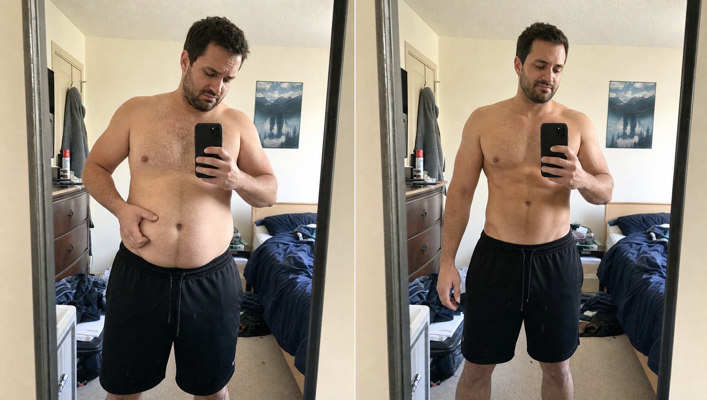
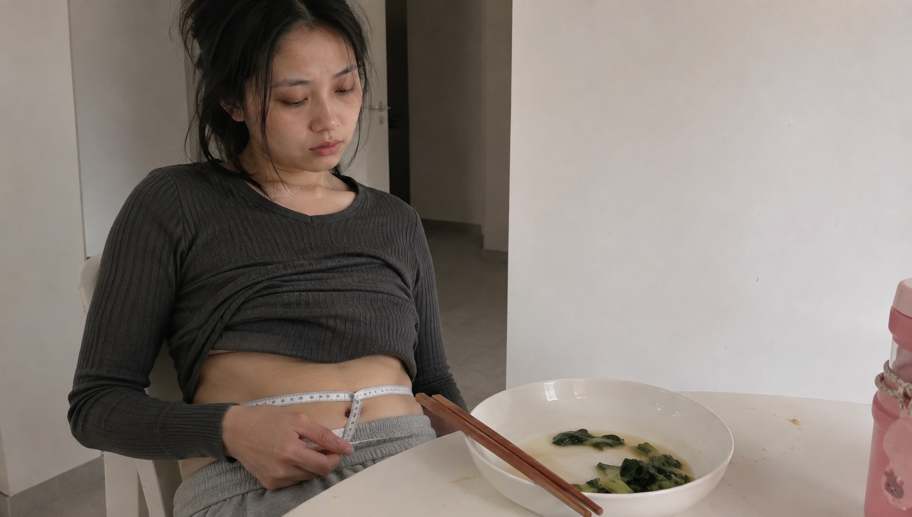
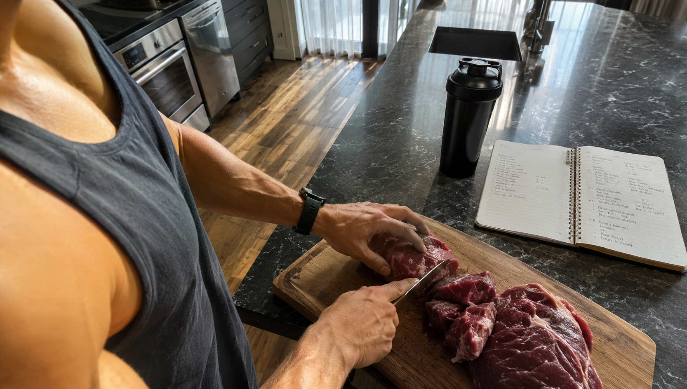
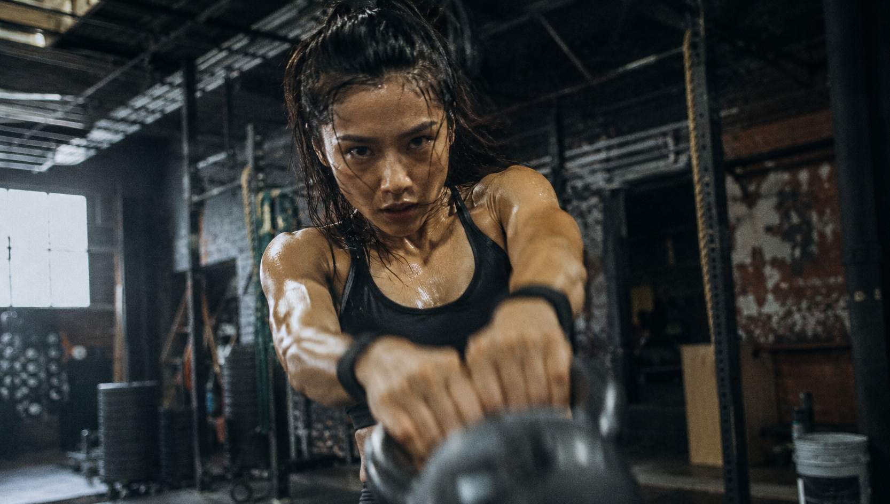

你每天算着卡路里，严格执行16+8轻断食。

天天肚子处于非常饥饿的状态，眼睛几乎都要冒出金星了，之后去踩踏体重秤，发现自己竟然轻了两斤。

将衣服向上掀起时，可以看到肚子上存在着一堆无法摆脱的赘肉，并且这些赘肉仍然停留在那里没有消失。

你会觉得自己正在努力地减肥以甩掉身上的多余脂肪，但是实际情况是，所减掉的大部分是珍贵的水分以及肌肉。

不要再被很多表面上的体重以及很多繁杂且花哨的营销话语所欺骗了。

今天我们就来把轻断食无法减小肚子这一事情的真实情况阐述明白。

把你身体内部所潜藏着的内脏脂肪全部消灭掉！

📉 **陷阱一：节食让身体“锁死”脂肪**

很多的人将轻断食变成了另外一种过度进行节食的情形。

这样做不仅不能够起到减肥的效果，而且会使得身体仿佛处于一种好像自己正处在缺乏粮食的状态之中。

要是长时间摄入的食物所提供的热量不足，身体便会自行逐步降低日常消耗的速率以确保能够维持生存。
也就是**减掉耗能多的肌肉，保留肥肉。**

更为糟糕的是，身体内部用于控制食欲的抑制性信号突然出现明显减少的情况，同时促使食欲活跃的信号却有大幅度的增多现象。

你的身体会特别想要含有高脂肪和高糖分的食物。而且肚子上的脂肪还不断地堆积起来。

要是在这个时候你稍微正常地进食，那么赘肉会立刻生长回来，甚至比之前的数量还要多。

🥩 **陷阱二：肌肉流失，代谢引擎熄火**

要是仅仅借助通过节食挨饿的方式来减轻体重，那么最先快速流失的实际上是肌肉的数量。

你需要明白的是，肌肉如同你身体内部极为出色的燃脂小能手。

每减少一市斤肌肉，你每一天所消耗的热量就会明显地降低。

要是身体的能量消耗机能完全停止进行运转，那么即使饮用少量的凉白开也比较容易出现体重增加的情况。

最后你将会变成那一种看起来瘦得没有太多的肉，但是身上全部都是松垮垮的脂肪的“纸片胖子”

若想要真正减掉内脏脂肪，首先需要去做的第一件事情是保护好你自身的肌肉！。

🏋️‍♂️ **破局点：用力量训练激活“后燃效应”**

若想要摆脱令人讨厌的内脏脂肪，仅仅依靠节食以及慢速行走是远远不够的。

来为身体补充一些有强度的物质吧。去进行举重锻炼或者参与高强度的间歇训练。

这类体育运动能够使你的兴奋感觉明显地得到提高。

这便是开启身体脂肪分解核心通道的关键密码。

更为关键的是，在进行高强度运动之后，会出现较为明显的后续氧消耗的状况。

在完成训练后的一两天时间里，即使人处于瘫坐在沙发上的状态，脂肪也正在默默地进行消耗。

🥦 **终极绝招：聪明吃，而不是盲目少吃**

不要再总是一直紧紧盯着热量值的很多数字而不放手。

要是你想要在锻炼出肌肉的同时也甩掉身体上的多余脂肪，那么优质的蛋白质是能够起到很大帮助作用的东西。

食用它能够快速使人产生较为强烈的饱腹感，并且身体在对它进行消化的时候还会消耗掉更多的热量。

在日常生活当中进行吃饭活动时，多数情况下是着重去补充蛋白质。而对于碳水化合物，仅仅是在进行训练前后的时候才会食用一些。

这样做首先能够使得血糖调节更为稳定，防止内脏脂肪堆积，其次还能够为运动训练补充能量。

不要再毫无思考地跟从去进行轻断食了，应该学着运用科学的方式将内脏脂肪去除掉。

你一直所想着的紧致腰腹线条实际上就隐藏在那一层软乎乎的赘肉的下面。

你为了减小肚子都尝试过哪些没有效果的方法？欢迎到评论区域进行讲述，将很多没有效果的陷阱分享出来吧

### 参考文献

- 《硬派健身：一平米硬派健身》：Chapter 2“你为什么会减肥失败”（阐述节食降低基础代谢、导致瘦素下降与脑肠肽上升的机制）
- 《量化健身：原理解析》：第七章“拆解减脂训练”，第160-162页（阐述运动提升肾上腺素，激活HSL酶加速脂肪动员与转运的生理机制）
- 《硬派健身：一平米硬派健身》：Chapter 3“什么样的有氧运动最减脂？”（阐述力量与高强度训练带来的EPOC持续燃脂效应）
- 《健身营养全书》：第6章“健身运动中的能量平衡”，第202页（阐述减脂节食期间基础代谢水平下降及肌肉流失的原理）