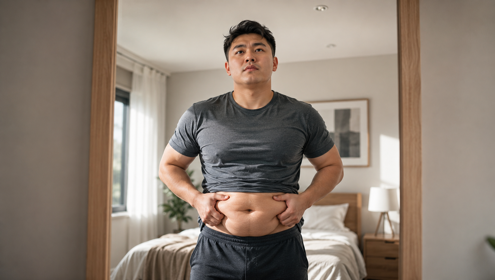
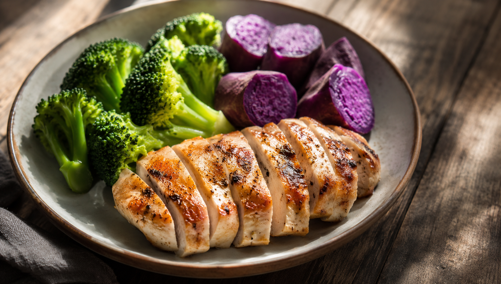
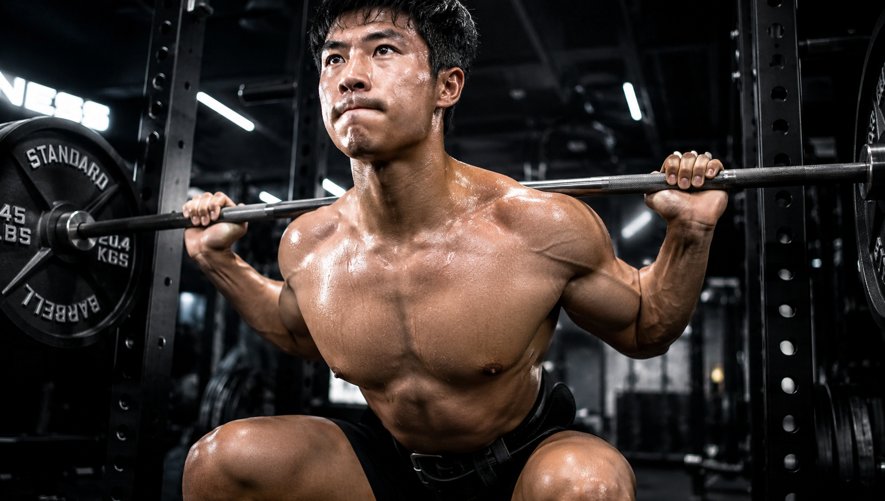

在你的身边必定存在着这样的人，或许你自身就是其中之一。他们的胳膊与腿看上去颇为匀称且纤细，可是肚子却圆滚滚的，就仿佛肚子里面藏着一个小皮球一般。

这是具有较高风险的苹果型肥胖情况，也就是内脏脂肪出现超标现象。内脏脂肪过量和堆积在皮肤表层的脂肪是不一样的，内脏脂肪过量更加容易打乱身体正常的代谢状态，而且还会增加患上心脑血管疾病以及糖尿病的概率。

许多新手一旦碰到自己圆滚滚的腹部，就认为腹部里的深层脂肪必定很难减掉。但是实际的情形正好与之相反，摆脱很多内脏脂肪，比你所想象的要轻松很多。

今天就来谈谈如何能够又快又准地将体内的这些垃圾清理掉。

---

### **真相：内脏脂肪，其实最容易减**

很多人总是抱怨大腿以及臀部的赘肉很难被消除，却没有察觉到肚子里面的内脏脂肪实际上是比较“听话”的。

当身体长时间处于能量供应不足的状态的时候，体内的脂肪会依照特定的规律被消耗掉。内脏脂肪堆积在腹肌的下面，使得肚子变得圆滚滚的。这样的内脏脂肪对于能量的波动是特别敏感的。只要你通过对饮食进行调整或者坚持进行运动来制造出热量的缺口，那么令人烦恼的啤酒肚就可以轻松地瘦下去。

不要被它所蒙蔽，找到正确的方法，它就会迅速消退。

---

### **第一步：持续的热量赤字与控糖**

减肥并没有什么捷径。其核心之处在于让身体在长期内消耗的热量要比摄入的热量多。但这并不是说要通过饿肚子来强行支撑。盲目地进行挨饿不仅会使珍贵的肌肉流失掉，还会让身体日常消耗热量的能力大幅度地降低，最终陷入到越是饥饿就越是肥胖的恶性循环之中。

你需要做的是**优化饮食结构**：

要减少精制主食，这样能够稳住胰岛素的分泌情况。要是身体内的胰岛素水平偏高，那么身体分解脂肪的效率就会降低。
需要多补充优质的蛋白质。优质的蛋白质能够带来持续的饱腹感。它还可以避免肌肉量的减少。而且消化优质的蛋白质会消耗更多的热量，能够帮助悄悄地燃烧脂肪。

---

### **第二步：用力量训练减腰围**

一提到瘦肚子，大多数人首先想到的是去进行慢跑运动。但是从长远的角度来看，仅仅依靠有氧运动是不够的。

哈佛团队开展了一项大范围的调研活动。调研所得到的结果显示，与中高强度的有氧锻炼相比较，肌力训练在减轻体重以及缩小腰围方面所呈现出的效果更为明显。肌力训练能够使得你增加肌肉的数量，能够提升日常的基础代谢水平，并且还能够让你在非进行运动的时间段里也持续地消耗热量。

---

### **第三步：加入HIIT，激活超强燃脂**

要是感觉到慢悠悠地进行跑步耗费时间较多，那么可以考虑尝试一下短时间高强度的间歇锻炼。

在进行大强度运动之后，身体会出现一种特殊的能量消耗状况。在运动结束之后很长的一段时间里，身体依然在默默地加速燃烧脂肪。有研究显示这种后续所消耗的能量最高能够达到运动总耗氧量的九成，并且这些能量全部是从脂肪分解而来的。

将力量练习和间歇冲刺训练结合起来。这样进行操作，一方面能够使得你具备舒展且挺拔的体态。另一方面还可以将内脏脂肪悄然地驱逐掉。

---

**【写在最后】**

甩掉内脏脂肪，不只是为了能够穿着更加美观。更是为了让健康拥有一个良好的基础。不要再盲目地饿着肚子了，也不要在跑步机上一直坚持到膝盖疼痛。

要通过控制饮食的方式来形成热量方面的差异，通过进行力量锻炼的方式来使腰腹部变得紧实，现在就马上开始付诸行动吧！

觉得这篇有用的铁子，记得点个**【赞】**和**【在看】**。 顺手转发给你那个天天喊着要减“啤酒肚”的朋友，拉他一起科学刷脂！

**【📚 科学依据与参考文献】**

1. **《健身营养全书：关于力量与肌肉的营养策略》**，第4章 燃脂运动：详细说明了产生能量赤字时，内脏脂肪（如啤酒肚）很容易被优先减掉的生理规律，参见第126页。
2. **《硬派健身：一平米硬派健身》**，Chapter 1 减肥，从何开始：阐述了力量训练相比有氧运动能更有效减小腰围、以及EPOC（运动后过量氧耗）极速燃烧脂肪的原理，参见第369、372页。
3. **《量化健身：原理解析》**，第七章 拆解减脂训练：解释了减脂的核心在于“持续的热量赤字”，以及控制胰岛素对脂肪动员的关键作用，参见第184、160页。