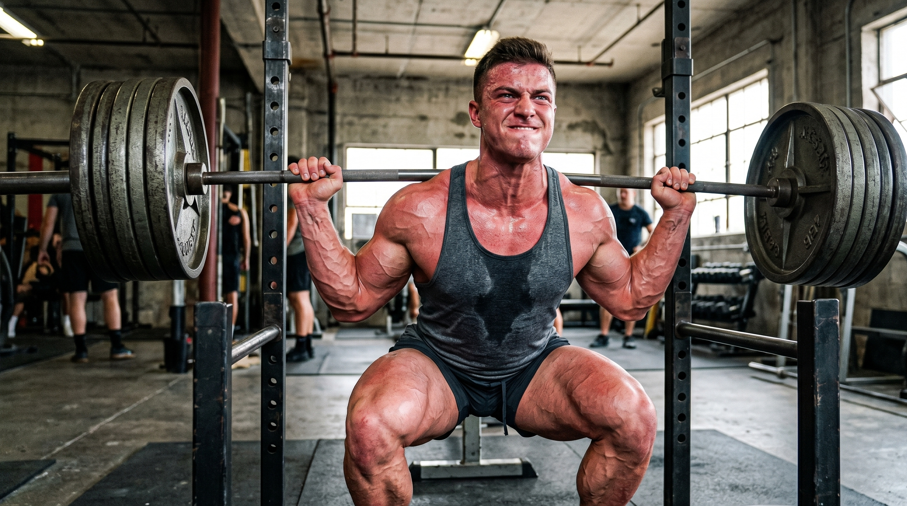
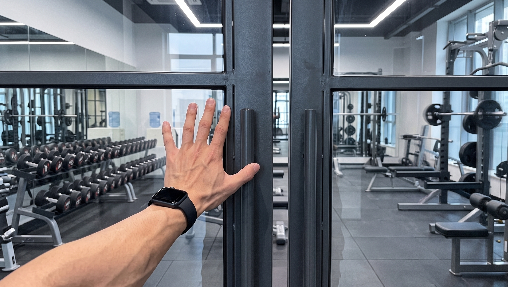
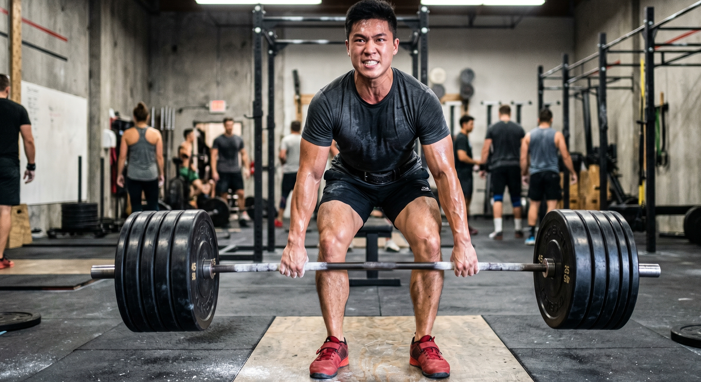
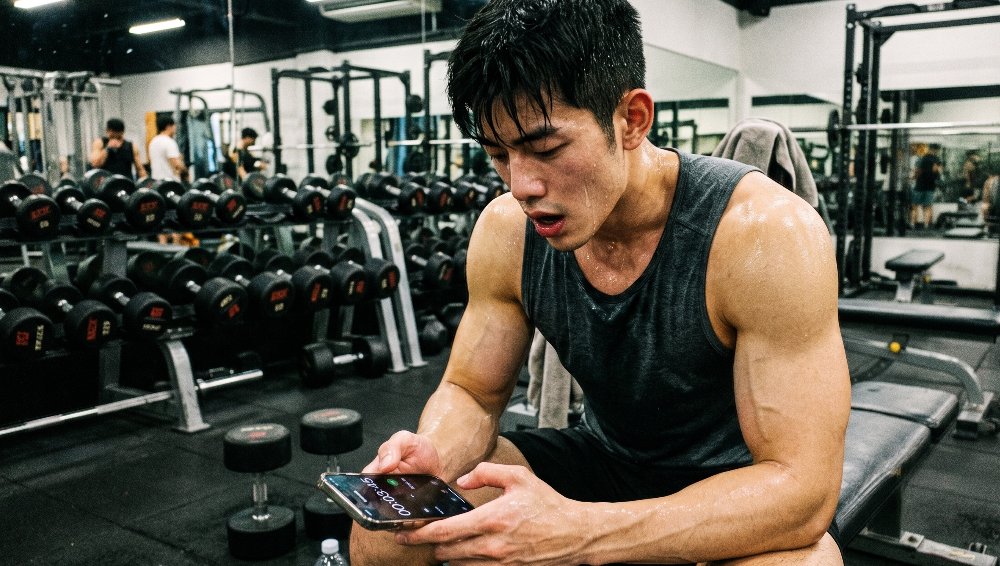

昨天刚刚完成火锅和烤肉相关的事情，今天内心之中满是所谓的“罪恶感”

别着急！你刚才吃进去的众多碳水，此刻正转变为肌糖原，好好地贮存在肌肉里面，随时等候发挥作用。

如果今天仅仅只是在跑步机上缓慢地跑上几步以出些汗水，那就太过浪费了。

今天就来教你利用这股“洪荒之力”来安排一场能够将糖原彻底耗尽的高效力量训练。

把“解馋小灶”变成够成为助力你突破肌肉方面所遇到的瓶颈的良好辅助工具，让它帮助你去突破肌肉方面碰到的瓶颈。

🔥 **核心一：锁定大肌群，开启“耗糖黑洞”**

若想要快速地把肌肉当中所积存的糖原全部清空，那么就需要去调动身体里面消耗能量最多的那个部位。

不要再为像哑铃弯举、小腿提踵这类单独训练局部肌肉的训练而纠结了。直接把它们从你的训练列表当中删除掉。

将重点集中在大腿所处的部分、后腰所处的部分以及胸口所处的部分。

需要安排像深蹲、硬拉、卧推、引体向上这类可以带动多个部位肌肉群的组合动作。

当这些大块肌肉进行发力动作的时候，它们能够立刻激活全身的神经。随后能够快速地将前一天晚上积累下来的多余糖分消耗掉。

📈 **核心二：拉高训练容量，把次数做上去**

在日常的肌肉力量训练过程里，无氧糖酵解是为身体提供能量的核心代谢方式中的某一种。

若想要让身体进行能量供应的基础代谢通路能够全力地运转起来，就需要依靠在日常生活中足够数量的训练积累。

相关研究表明，当进行多组重复且总体运动量较大的力量训练时，肌肉内的糖原储备将会被大量消耗掉。

那今天就不要去尝试自己单次能够承受的最大重量了。这单次的最大负重主要是依靠磷酸肌酸来提供能量的。

将重量调整到你能够完成八次到十五次的范围就可以了。大致是你全力能够举起重量的百分之六十五到百分之八十。

每个动作被重复4~5组，在这一轮轮肌肉收紧的过程当中，糖原被彻底地消耗殆尽了。

⏱️ **核心三：缩短组间歇，逼迫身体疯狂燃糖**

在完成规定的练习量且达到标准之后，好好地进行休息也是比较关键的事情。

要是在每一组训练结束之后刷五分钟的手机，那么锻炼所产生的燃脂效果就会大幅度地降低。

要把控组与组之间的休息时间长度，需要让其处于30~90秒这样的范围之中。

还没有等到身体完全恢复就开始进行下一组训练。这样身体就始终处于高负荷的代谢状态之中。无氧供能的能量也被充分地调动了起来。

你会察觉到，前一天晚上进食量充足，到了第二天进行锻炼的时候，发力时能明显感觉到力量很充沛，肌肉呈现出鼓胀的状态，几乎快要把上衣撑得变形了。

请不要担心会因为进食过多而感到不适，带着充足的活力前往力量区域认真地进行一番努力。

这一轮你已经成功度过了。你应该要感谢昨晚那一顿吃得非常尽兴并且非常饱的饭。

👇 **【交作业时间】**

你今天打算去健身房锻炼哪一个核心部位？快来评论区说一说并且分享一下吧。

### 参考文献

- 《NSCA-CSCS美国国家体能协会体能教练认证指南第4版》：第3章“运动与训练的生物能量学”，第61页（阐述多组数和总做功量大的抗阻训练会导致肌糖原大量消耗，且消耗量与总做功量相关）
- 《健身营养全书》：第6章“运动中及运动后的营养”，第186页（阐述力量训练和健美训练中，无氧糖酵解是生成ATP的最重要新陈代谢途径）