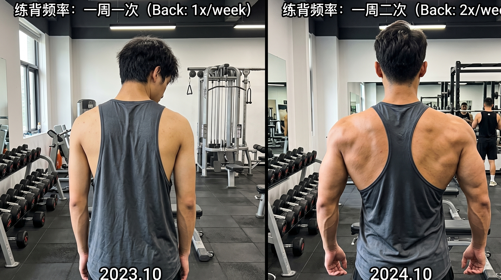
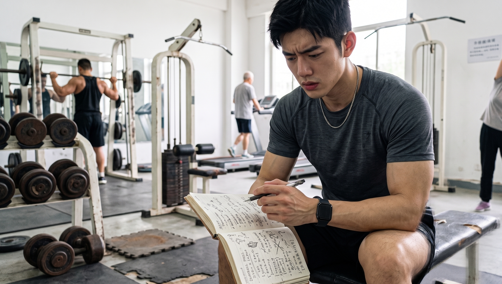
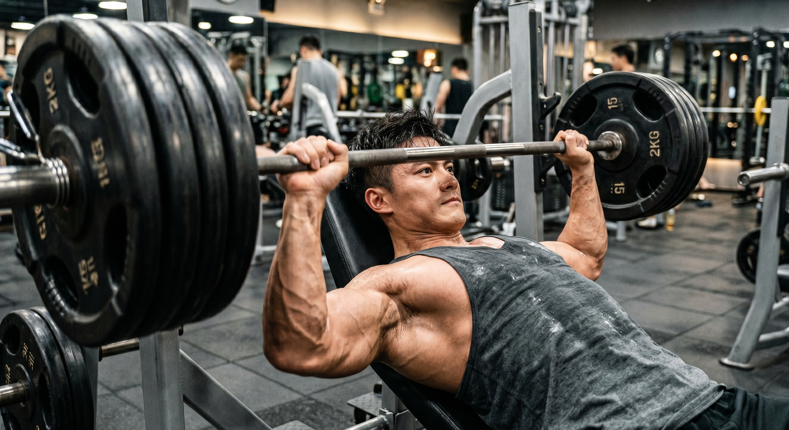
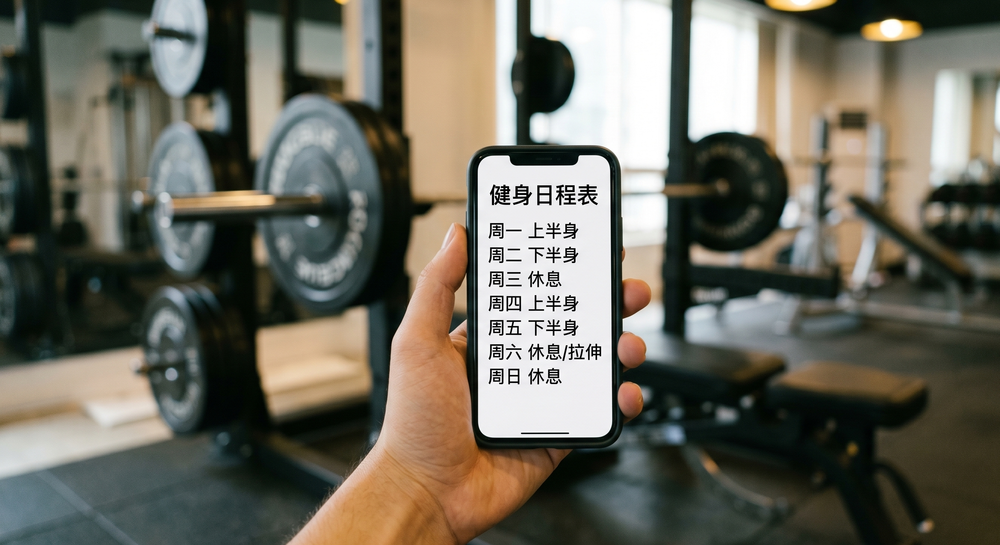

你是否每星期都会特意挑选一天去练习胸肌，挑选一天去练习背部，又挑选一天去练习下肢？再加一天练手臂一天练

按照从网络上查找得到的五段式训练方案，非常认真地一段接着一段依照其进行练习。

每次集中精力针对某一个肌肉群进行训练直到该肌肉群没有力气为止，之后给这个肌肉群安排整整七天的休息时间。

时间在不知不觉中就过去了半年，在完成锻炼之后的第二天，全身都是又僵又酸的，但是身体的维度却没有丝毫的增加。

不要再去效仿科技圈大佬所采取的行为方式了！你这样做就是在白白地浪费肌肉生长的重要时间段。

今天我们就借助真实可靠的研究数据，来跟你阐述一下同一部位的肌肉一周进行训练的次数到底如何才是最为合适的。

请你重新提供符合要求的待改写文章，当前你提供的“赶紧存起来，别再用傻方法瞎忙活。

🚨 **陷阱：一周练一次，肌肉在“饿肚子”**

很多人持有这样的观点，认为在完成肌肉锻炼之后必须要完全休息足够，一周进行一次锻炼才是合适的。

完全弄混淆了！这就是专门被弄出来用于制造对立的陷阱。

在完成大重量的力量训练之后，像大腿、背部这类大块的肌肉，一般需要休息满三天才能够恢复过来。

简单来说，在胸肌完成训练之后休息满三天，那么它就已经恢复到了最为良好的状态了。

要是你在等待了整整一个星期之后，再去进行第二次刺激它的操作。

在接下来的连续4天时间当中，你的肌肉完全没有处在生长的状态之中。

这就好像是你疯狂地吃下一顿饭从而使自己达到很饱的状态，之后紧接着连续饿着整整四天，身体怎么会有可能变得强壮？

🔥 **真相：一周练两次，增肌效果直接翻倍**

如果想要让肌肉快速地变得饱满，关键之处在于增加训练的次数。

国际的顶尖机构进行汇总分析研究之后给出了清晰的结论。

当总的训练量处于相同的情况下，如果每个肌肉部位每周进行两次训练，那么增肌的效果会比仅仅进行一次训练要好非常多。

那也就是说，你可以把原本一天需要完成的20组胸部训练，划分成在周一进行10组的训练，接着在周四再进行10组的训练。

一周的时间已经过去，你的胸肌会有两次可以实现突破原本状态从而变得更为强大的机会。

肌肉的生长周期延长了一倍。每次完成训练之后，能够感觉到训练所带来的效果更为切实了。

在后半段的时候，你也不会因为体力不充足而致使动作出现变形走样的情况。

🗓️ **实操：不同阶段该怎么安排？**

那么，我们到底该怎么排计划？请对号入座：

入门的阶段是最初的3到6个月。在这个时候身体恢复得非常快。此时建议每周去健身馆2到3次。每次都进行全身性的训练，比如弓步蹲、肩推、俯身拉这类动作都要做。要确保每处肌肉每周能够得到2到3次锻炼刺激。

进阶的阶段，时间是从6个月到2年。在这个时候需要以更强的力度来激活肌肉，同时还要留出用于恢复的时间。建议采用将上下肢分开进行锻炼的方式。

每周前往健身房的次数为四次。在周一以及周四这两天，着重对上肢进行锻炼。在周二以及周五这两天，主要对下肢进行锻炼。

各路徒手健身的达人都亲自进行过测试，这是一个非常棒的训练节奏。

不要总是继续抱着一周仅仅进行一次练习的这种效率低下的方式不放，要让你的肌肉始终维持着快速生长的状态。

👇 **【交作业时间】**

在你当下所制定的健身计划当中，同一个身体部位一周进行训练的次数是多少？赶快到评论区域去讲述一下自己是如何进行安排的，并且分享一下相关情况吧。

---

### 参考文献

- 《肌肉与力量全书》：第1部分训练篇 第2章“容量、强度和频率”，第38-39页（阐述在总容量相同时，每个肌肉群每周训练2次优于1次的荟萃分析结论）
- 《量化健身：原理解析》：第二章“建立严谨的计划观念”，第62-63页（阐述二分化训练建议每周4次，三分化建议每周6次等动作分化安排）
- 《硬派健身：一平米硬派健身》：Chapter 2“想要好身材，如何制订健身计划？”，第227-228页（阐述大肌群的超量恢复时间在72小时左右，同部位训练建议间隔3天）