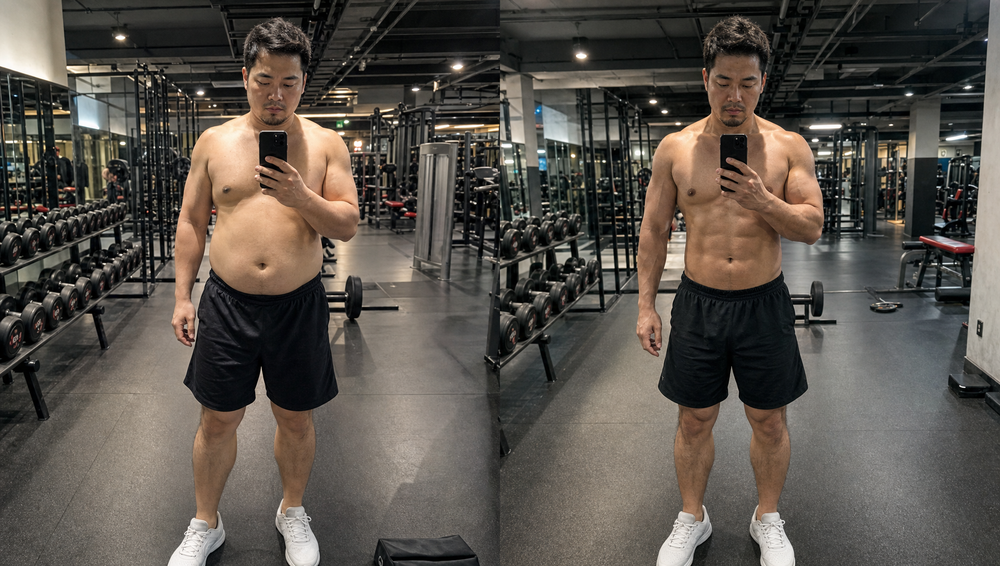
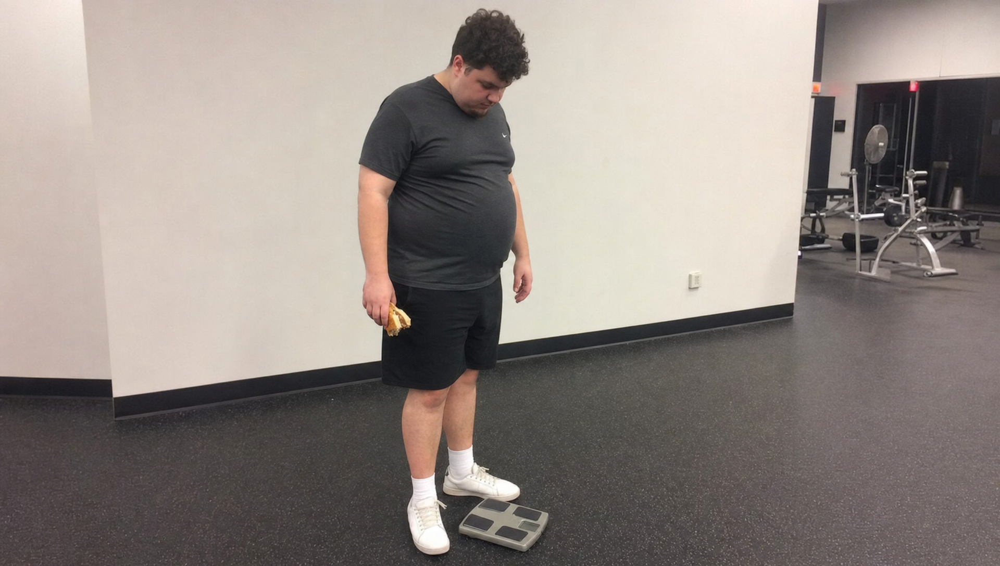
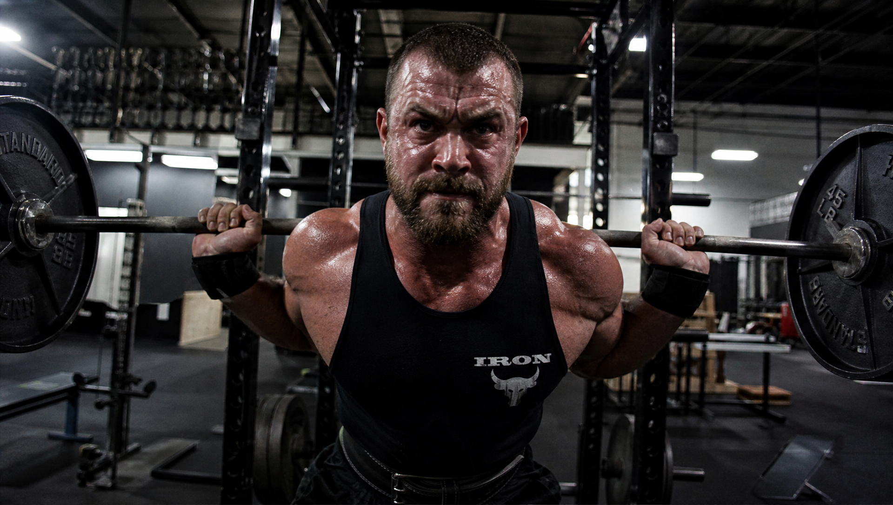
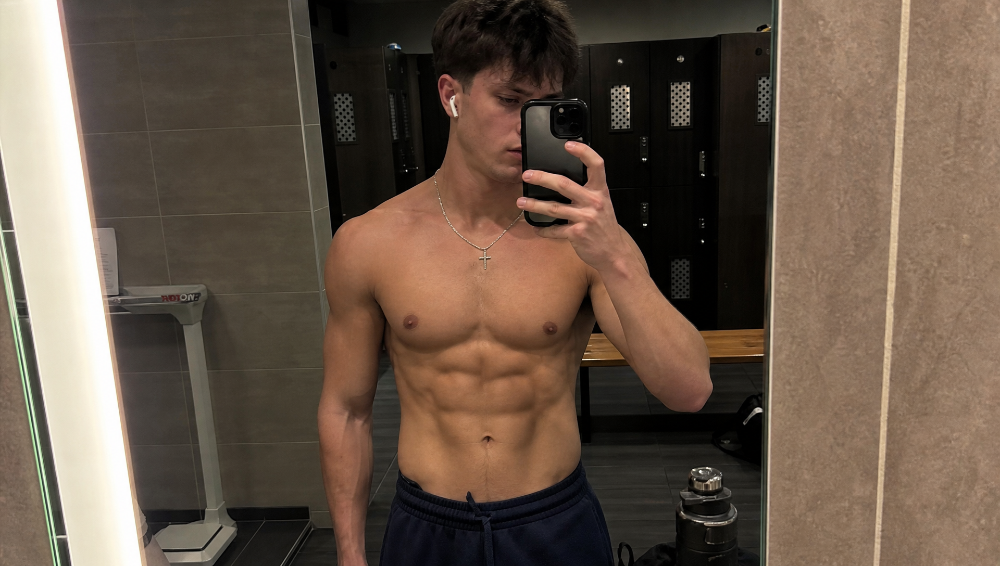

你每日都在健身馆中停留，用力地流汗。锻炼结束之后，便匆匆忙忙地大口进食。

想着自己当下正在长肌肉，多吃两口不会有太大的问题。

三个月很快就过去了，胳膊的粗细没有什么改变，肚子却圆滚滚地向外突出了一圈。

原本心里想着要练出宽肩窄背的倒三角那样的身材，可是最后的结果却是变成了有赘肉的壮实的身体形态？

别再拿脏增肌当借口了！。

现在把四个能够只让肌肉生长起来而不把赘肉囤积起来的实用方法分享给你了。

请将以下内容按照要求进行改写：赶紧存起来不然等小肚子把腹肌都盖住了，到时候后悔可就晚！

请赶紧将其保存起来，否则当腹部脂肪将腹部肌肉覆盖时，届时再后悔就已经来不及了。

🥩 **技巧一：管住热量盈余，拒绝胡吃海喝**

很多人持有这样的看法，即认为进行肌肉的锻炼就是没有任何限制地进行大吃大喝。

完全弄混淆了！身体生长肌肉的速度是存在着真实确切的上限的。

额外摄入的热量，最终都会悄悄地堆积在腰腹的部位，转化成为软乎乎的赘肉。

在进行健康增肌的过程中，其关键之处在于存在着少量的热量富余情况。

每天就是让摄入的热量比消耗的热量少二百到三百大卡这样就可以了。

需要更多地去关注碳水化合物和健康脂肪之间的搭配比例的情况，需要留意碳水化合物与健康脂肪的搭配比例的状况。

不要让那香酥的炸鸡以及冰甜的奶茶，将你每天流汗努力所取得的成果给抵消掉！。

🥦 **技巧二：蛋白质要够，碳水要聪明吃**

若想练出结实的肌肉，那么主食是不能缺少的。主食是你能够举起重物的动力来源。

要是所选择的碳水化合物不合适，那么血糖就会迅速地升高，之后脂肪就会悄然地堆积起来。

关键在于吃对时间。

在进行锻炼之前以及锻炼之后，可以放心地多吃优质的主食。优质的主食能够给肌肉充分地提供能量。

在周末或者是晚上的时候，你可以尝试着减少主食的摄入。更多地去食用一些新鲜且爽口的绿叶蔬菜。

蛋白质就像是助力肌肉生长的“建筑基石”，在每一天里，依据每公斤体重来进行补充，补充的数量为1.6到2克便可以了。

这便是能够让肌肉快速变得壮实起来的可靠方法。

🏋️‍♂️ **技巧三：渐进超负荷，给身体生长指令**

当你在健身房进行锻炼的时候，总是拿着相同重量的器械，一遍又一遍地重复同样次数的动作。

身体凭什么要给你长肌肉？。

如果没有长期的外在力量来进行督促，那么就算饮食方面再怎么注重讲究也没有什么作用。

哪怕每次仅仅添加 2.5 公斤的配重片，又或者多完成一组符合规范的动作。

肌肉进行生长的核心要点，就是外部的力量去进行拉扯以及新陈代谢需要承受负荷。

只要动作没有发生变形，这就是身体所发出的长高的信号。

不要仅仅只是一直关注大小，要去将分量以及质量进行提升。

🏃‍♂️ **技巧四：适度有氧不是敌人，保持代谢引擎**

许多人认为，在进行增肌活动的时候开展有氧训练会将通过辛苦锻炼所获得的肌肉消耗掉。

其实这是个老掉牙的误区。

在进行增肌的过程中，开展一些适量的有氧锻炼，这可以使你的体脂率维持在平稳的状态，是一种不错的方式。

每周选择两到三天的时间，每一日花费二十到三十分钟左右去开展一些轻松的有氧活动。

它能够增强心肺功能。并且当你下次进行深蹲练习的时候，它能够让你更快地恢复。

它还能够使得身体对于胰岛素的反应变得良好，更多的营养可以被供应给肌肉，而不是脂肪组织。

若想要摆脱那种粗枝大叶的增肌方式，那么就必须要把敷衍以及懈怠的状态抛在一旁。

在接下来进行训练以及进行饮食的时候，运用这四个小方法便可以了。

你将会发现，身体变得紧实并且很有力，腰腹的线条依旧清晰且利落。

下次去健身房的时候，你计划首先锻炼的是哪一个身体部位？欢迎在评论区域进行阐述。

---

### 参考文献

- 《肌肉与力量全书》：第2部分营养篇 第9章“能量平衡”，第192-193页（阐述增肌减脂与身体成分及P比例的关系）
《运动营养指南》当中的第6章内容为运动与日常膳食。在第239页的位置，此处阐述了低脂多碳水饮食和肌肉增长期热量盈余之间所存在的关联。
- 《施瓦辛格健身全书》：第二章“体重控制”，第423页（阐述增肌期要做多少有氧运动的限度）
- 《量化健身：原理解析》：第五章“拆解增肌训练”，第104-106页（阐述机械张力、代谢压力等训练导致肌肉肥大的机制）