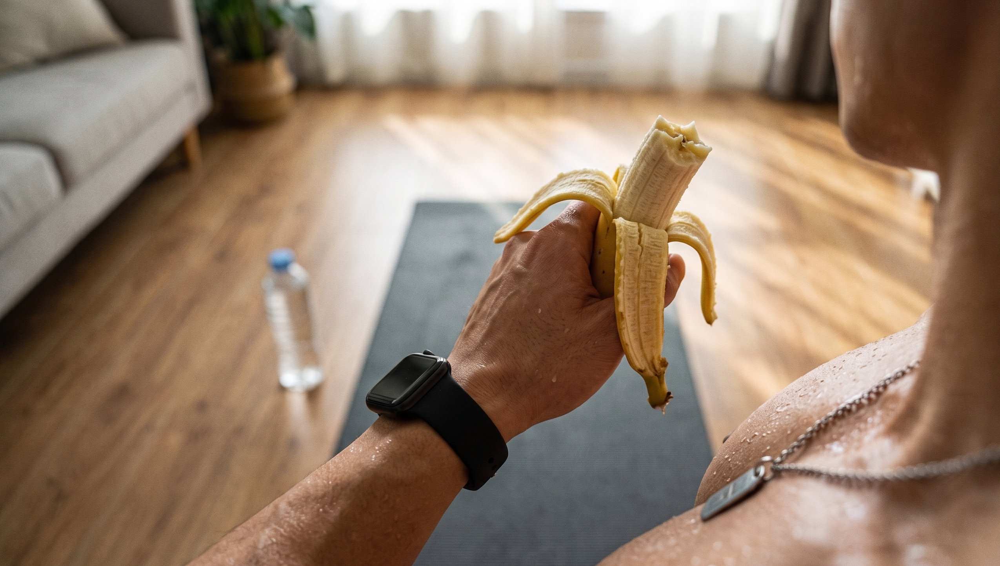

听闻高强度的间歇运动减脂的速度非常快，你便满怀兴致地寻找到一个流量较高的教程并跟着进行练习。

结果才跳了三分钟。

心跳忽然间就变快了，胸口感觉闷闷的，十分难受，膝盖疼痛的程度很严重，都没有办法直直地站立起来。

最后只能够无力地瘫坐在地面之上，内心之中满是迷茫。

不要总是责怪自己体力不佳，是你从一开始练习的方法不正确。

今天将要把4个为新手打造的高强度间歇训练避坑的干货分享给你。

赶紧将其储存起来，不然当膝盖的软骨被磨坏的时候，到那时就只能后悔！。

❌ **原则一：拒绝疯狂跑跳，选择低冲击动作**

如果一个人的体重基数比较大，或者是刚刚开始接触运动的新手，那么就不可以一开始就练习开合跳这类强度较高的动作。

你的膝盖没有办法承受身体重量好几倍的那种猛烈的力量冲击。

要是想要健康地甩掉多余的肉，首先应当将动作更换成较为温和、轻量的那一种。

你处于沙发之上，或是蹲着，或是呈侧向弓步的姿势，又或是在原地进行快慢交替的走动。

脚没有接触到地面，心跳仍然快速地跳动着，安全的程度迅速提高。

⏱️ **原则二：控制间歇时间，尝试“7分钟循环法”**

不要非得逼迫自己去跟着那个要求严格的教练练习足够半小时。

新手在刚刚开始入门的时候，经常没有办法很好地对自己的精力进行掌控。要是有一点点不小心的情况出现，就很容易让自己处于劳累过度的状态，甚至还会出现运动方面的损伤情况。

非常强烈地向人们推荐来尝试那针对新手而言超级合适的时长为7分钟的循环练习方法。

首先花费两分钟来进行一些轻量的动作，使得身体微微地发热并且出一些汗，从而为身体进行前期的准备工作。

然后依照1分钟的快节奏、1分钟的慢节奏这样交替的方式来完成3组练习。

要保持适度，要给身体留出足够的时间来缓冲节奏的改变。

❤️ **原则三：把握强度，高低起伏才是核心**

间歇高强度训练的核心之处在于快慢强度进行交替式的切换，并非是一味地死撑硬扛。

在这六十秒的全力冲刺时刻，你需要拼搏到全身紧紧绷起，大口大口地进行喘气。

把自身最高心率的百分之八十到百分之九十五之间当作心率的最为合适的控制范围。

在运动强度相对比较低的阶段，可不要立刻就瘫坐下来。

缓缓地减小动作的幅度，使得心跳缓缓地变缓，身体始终维持着活动的状态。

🍞 **原则四：切忌空腹，给身体留足燃料**

很多进行健身的新手会觉得，在空腹的状态下进行间歇燃脂操的练习能够多消耗一些脂肪。

大错特错！高强度的运动，会消耗掉身体内不少储存能量的物质。

当肚子处于饥饿状态的时候，你也许马上就会出现头昏眼花的现象，并且还容易出现那种晕乎乎的低血糖状况。

身体还会发出健康方面的警示信号，从而致使肌肉迅速地流失掉。

在运动开始之前的四十分钟的时候，吃一根香蕉或者是一小块全麦吐司。

这便是能够让你的马力得以全面开动并且能够高效地燃烧脂肪的理想能量来源。

不要再毫无目标地跟随他人进行练习了，应该去找到那个适合自己的节奏才行。

每周会有二到三次，去进行这个入门级的间歇训练。

你会发现，原来能够畅快地流出汗水、甩掉身体上的赘肉也是这样轻松并且充满力量！

👇 **【交作业时间】**

你第一次跟着视频学习做体操，坚持了多长的时间？赶快到评论区域讲述一下吧！

### 参考文献

- 《硬派健身：一平米硬派健身》：Chapter 3“什么样的有氧运动最减脂”，第225-226页（阐述爬楼梯等无跳跃动作对膝盖冲击极小、能有效保护关节的机制）
- 《NSCA-CSCS美国国家体能协会体能教练认证指南第4版》：第20章“有氧耐力训练的计划设计和技术”，第607页（阐述高强度间歇训练的心率需达到最大摄氧量或心率的80%-95%以获取最佳效果）
《运动营养指南》当中的第9章是有关提升运动状态的饮食方案，该内容处于第298页。此处提及空腹开展高强度运动，有可能出现糖原不够的状况，同时或许会有血糖偏低的情形，并且还会存在肌肉流失的问题。