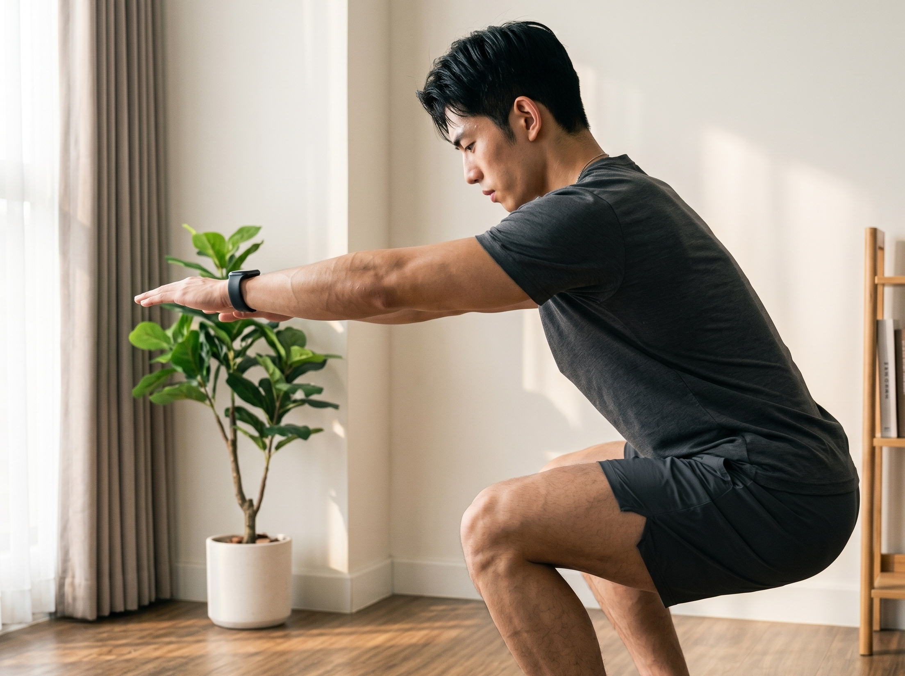

你难道就没有经历过那数不清的回数的这般内心的挣扎状况：

到了下班之前的时候还怀揣着雄心壮志，换好了衣服心想着直接就去健身房。但是只要一坐到回家的那趟地铁之上，又或者是屁股刚刚接触到沙发，大脑里边就会冒出来一个声响。

*今天太累了，明天再去吧。*

*不差这一天，休息也是恢复。*

最终，你顺理成章地就选取了躺平，随后便是在深夜之中有无穷无尽的负罪感接踵而来。

有相当多的人感觉自身不能够持续地坚持做某件事情，其缘由被以为是意志力不够强大又或者是从出生下来就比较懒惰。

**快停止这种无意义的自我攻击！科学研究早就表明：意志力是一种极其有限的资源。**

今日，我要跟您唠一唠一个心理欺骗之术。这个心理欺骗之术已经被写入专业之教科书，就连顶尖之运动员都在暗地里使用。无需死撑着用力气，无需打那种令人兴奋之鸡血相关的，就能让您自己心甘情愿朝着深蹲架那边走过去。

---

核心之处的痛点具体在于：为什么借助意志积极进行健身活动肯定是会走向失败的？

在那漫长的进化的过程当中，的大脑发育形成了一个最为根本的准则，那便是节省能量。

当提及到大脑的时候，你正躺在沙发之上刷着手机，这般情形会使得大脑处于低耗能的状态，而且还能够马上获取到高回报（也就是多巴胺）。而要是朝着健身房走去的话，那么就是大脑处于高耗能的状态，而且还得等候满足感的到来。

要是你尝试借助纯粹的意志积极对抗身体的进化本能，这如同拿小灵通的电池去运转3A等级的游戏大作一般。你在职场当中经历了整整一天的开会、修改方案以及情绪方面的内耗，你的意志力电池早就已经完完全全地没有电量。

当下，你可不太需要那种所谓“自律给你自由”这类听着颇为玄虚的鸡汤，反倒得拥有一个科学的前馈控制机制。

---

## ## 科学欺骗术：10分钟行动启动效应

这个方法的精髓只有一句话：**今天不去健身，我只是去换个衣服/做一个10分钟的动态热身。**

在心理学以及行为力学范畴之内存在着一个广为人知的概念叫做启动效应。而在物理学领域当中，物体要是想要克服最大静摩擦力的话，是需要耗费最大的能量的。但是只要物体一旦开始滚动起来，那么维持它进行运动所需要的力便会大幅度地减小。身体和大脑的情况也是如同这样的。

### ### 第一步：降低入场阈值

将你原本计划今日于健身房花费1.5个小时进行锻炼、开展5个动作并且每个动作做4组的目标，变更为我就穿上运动鞋，接着在垫子上做10分钟的动态拉伸就可以。

心中暗自跟自己言道：要是十分钟过后我真的极为疲惫，极其想要回家，那么我立刻就收拾物件离开，一点儿都不耽搁。

在这样一个暗示的作用之下，大脑的防御机制便会趋向于变低。这是由于大脑会认为十分钟的拉伸并不会带来疼痛之感，而且也不会需要耗费过多的能量。

### ### 第二步：生理唤醒的连锁反应

当你切实地换上了服装，开始去做泡沫轴的滚动操作，或者在做完了若干组猫牛式以及自身重量的深蹲之后的时候，那奇妙的情形出现喽：

在动作进行开展的时候，你的交感神经系统便开始发挥主要的作用，心率渐渐地变得越来越快，血液从腹部以及内脏部位朝着四肢流淌过去。

你的关节已经开始分泌滑液。滑液使得原本生硬且僵硬的身躯变得具备了弹性。

运动单位征召究竟是个情况？那专业的《肌力与体能训练》理论来讲，动态的热身可以使得神经冲动传导的速度变得更快，而且还能够激活更多的肌纤维。

[配图 1]

这时候，你的大脑已经从下班后的疲惫模式被硬生生切换到了运动准备模式。你会惊奇地发现：**既然来都来了，热身也做完了，那我就顺便推两组空杆吧。**

---

## ## 进阶技巧：打造你的健身行为链

仅仅只是依靠心理暗示那是远远不够的。我们还可以去利用环境方面的很多线索。借助着环境线索，就能够使得那个欺诈的手段形成一种自动、呈闭环的这样一种状态。

### 1. 视觉线索（Visual Cues）

可千万不要老是将运动鞋长久地放置在柜子的那幽深之处 。

出门之前，将你的运动包、筋膜枪以及摇摇杯直接放置到玄关最最显眼的地方，或者就摆放在工位的旁边。心理学方面的研究发现，显眼的物理方面的线索能够跳过大脑的思考步骤，直接就会引发接下来的下一步行动。

### 2. 仪式感热身（Ritualized Warm-up）

在《肌力与体能训练》这门课程的一般热身阶段里，不要去进行那种枯燥乏味的跑步机慢跑活动。你完全可以为自己规划出一套具备固定顺序的仪式化的动作。

例如：

* 泡沫轴松解背部与臀大肌 3分钟

* 髂腰肌动态拉伸（每侧5次）

* 自重深蹲 15次

[配图 2]

存在着这样一种高度重复的动作序列，它好似身体的某一个开关。当你把这三个动作做完之后，你的肌肉以及神经便会自动接收到信号，而信号所传达的内容是：得要开始进行核心以及力量的锻炼！。

---

## ## 结语：别等想去才去，先动起来再说

现代行为科学最伟大的发现之一就是：**情绪并不总是决定行动，相反，行动往往能反向决定情绪。**

你并非必须要等到自己心情处于良好状态、且有着充足干劲的时候才去进行健身方面的活动 。

下一次，倘若你准备要放弃的时候，试着对自己说：“我仅仅就是去健身房冲一个澡，或者是做十分钟的拉伸就可以了”。

去欺骗它吧，去把它给启动起来。当你开始迈出那第一步的时候，你就已经是胜利了的。

## ## 参考文献

1. **《肌力与体能训练》（第四版）** * **科学依据来源：** 第12章《热身与柔韧性训练》
    
    - **核心理论：** 详细阐述了热身（Warm-up）对提高神经冲动传导速度、促进关节滑液分泌、提高肌肉温度以及增强运动单位征召（Motor Unit Recruitment）的生理机制。明确指出一般热身与专门热身如何通过生理唤醒，从根本上改变身体从静止到运动的动力学状态，是“10分钟启动效应”的核心科学基石。
        
2. **《现代行为设计学与习惯回路》**
    
    - **科学依据来源：** 核心章节关于“最小阻力路径”与“环境线索（Visual Cues）”对中枢神经系统决策行为的干预机制。
        
