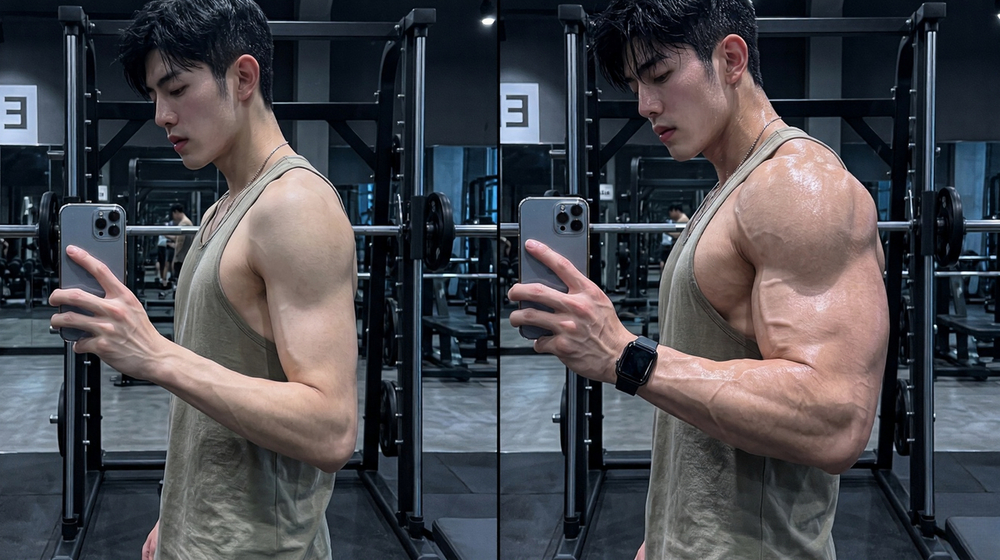
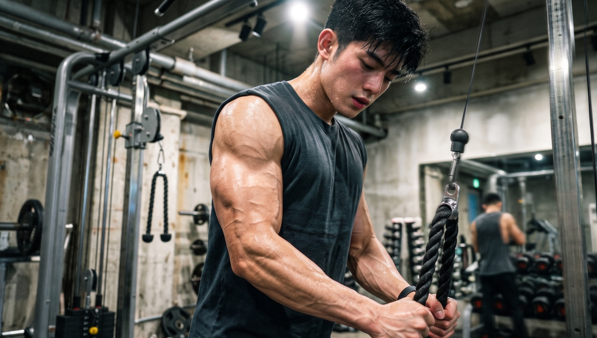
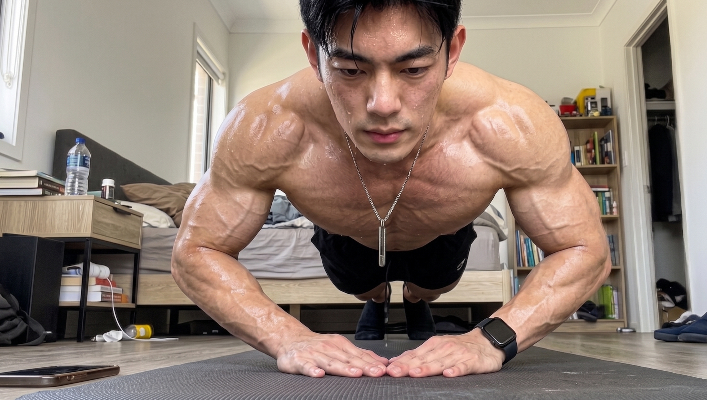

你每天待在健身场馆里面，用力地进行杠铃弯举的练习，练到全身都被汗水湿透了。

心想着夏天能穿T恤撑爆袖管。

好几个月的时间已经过去了，从正面进行观察好像存在着一点点的变化，但是从侧面进行观察依旧是呈现出塌塌的状态，如同一个平面的纸片子的模样一样。

原本所期望的是能够练出具有力量的手臂，但是最终的结果却仅仅是自己让自己有了一些感动的感觉？

不要把天赋欠缺当作借口了，你仅仅是用力的方向不正确罢了。

今天我们把打造3D立体手臂的三个核心思路向你进行讲述。

建议你尽快将其保存起来，否则当你发觉无论如何练习胳膊都没有变粗的时候就会产生后悔的情绪。

💪 **误区一：死磕肱二头肌，却忘了手臂真正的“大头”**

很多人只要一提及锻炼胳膊，首先想到的就是运用弯举这种动作来对手臂前侧的那一块肌肉进行锻炼。

，完全弄反！实际情况是上臂后侧的肌肉块以及力量都比上臂前侧的肌肉要强很多。

手臂存在着匀称的线条。通常情况下上臂后侧的肌肉所占的比例大约是前侧的两倍。

如果将全部的心思都集中在那一小块范围之内，那么口袋怎么会有可能变得鼓起来。

如果想要让手臂看起来结实并且具有一定的形态，那么就需要把发力的重点放置到大臂后方的肱三头肌上面！。

🔪 **破局点：外侧头，决定视觉宽度的核心**

肱三头肌，从它的名字就能够知道它具备三个部分。这三个部分分别是内侧束、外侧束以及长束。

外侧的肌肉位于手臂的外侧部位。它会直接对手臂的轮廓产生影响。很容易被其他人注意到这个手臂的轮廓情况。

对于男生来说，外侧头会影响身形线条是否能够舒展大气；对于女生而言，外侧头能够让手臂晕出浅浅的阴影，让手臂看起来利落且立体。

如果想要让整条手臂呈现出好看的马蹄轮廓，那么就需要把手臂外侧的肌肉练习得紧实且饱满才可以。

🏋️‍♂️ **动作推荐一：钻石俯卧撑（综合刺激最佳）**

窄距俯卧撑是一种能够很好地锻炼手臂后侧肌肉的方式。窄距俯卧撑它能够被用来锻炼手臂后侧的肌肉。

如果双手之间的距离过窄，那么三角肌前束就很难发挥出应有的力量，在这种情况下，大部分的负担就全部落在胸肌和肱三头肌上面了。

并且，双手握得越靠近，手臂后侧的肌肉感觉到的程度就越明显。

🔥 **动作推荐二：颈后臂屈伸与绳索下压**

要是想要精准地打造手臂外侧以及后侧的流畅线条，那么就需要借助具有针对性的孤立动作来给予助力。

当做颈后臂屈伸动作到达最低处的时候，上臂后侧能够感觉到明显的强烈牵拉感。

拉伸能够有助于肌肉增强力量，同时还能够练出好看的线条。这是一种打造匀称手臂较为合适的入门方式。

另外，使用弹力绳或者拉力带进行向下牵拉的动作。通过这样的方式可以使得肌肉在动作接近结束的时候能够更加充分地收缩。

若想要锻炼出粗壮的手臂，其核心且关键之处在于通过运用这些动作来使得手臂能够充分地充满血液，从而让手臂产生满满的胀感。

要想要摆脱“纸片手”的状态，就是要从那种刻板认知所形成的限制当中跳脱出来。

下次在练习手臂的时候，来尝试一下下面所列举的这些动作。

你将会发现，要塑造出真正饱满且立体的手臂线条，关键所在就是那常常被你所忽视的手臂后侧肌群。

👇 **【交作业时间】**

你在平常锻炼手臂的时候，在肱三头肌上所花费的时间多不多？在肱二头肌上所花费的时间又多不多？赶快到评论区说一说吧，把你花费时间的具体情况分享一下吧！。

---

### 参考文献

- 《囚徒增肌》：第三章“‘教练’威德的增肌策略”，第183-185页（阐述肱三头肌的解剖结构与外侧头、长头的作用）
- 《囚徒健身》：第十二章“训练计划”，第170页（阐述肱三头肌占据上臂2/3体积及训练误区）
- 《一平米健身·硬派健身》：Chapter 8“手臂&小腿”，第256-259页（阐述肱三头肌外侧头的视觉功能及钻石俯卧撑、颈后臂屈伸的训练效果）
- 《施瓦辛格健身全书》：臂部，第221页（阐述完美手臂的肌肉比例）
- 《力量训练解剖全书》：第六章“肱三头肌肌群”，第138页（阐述绳索下压动作的肌肉收缩效果）