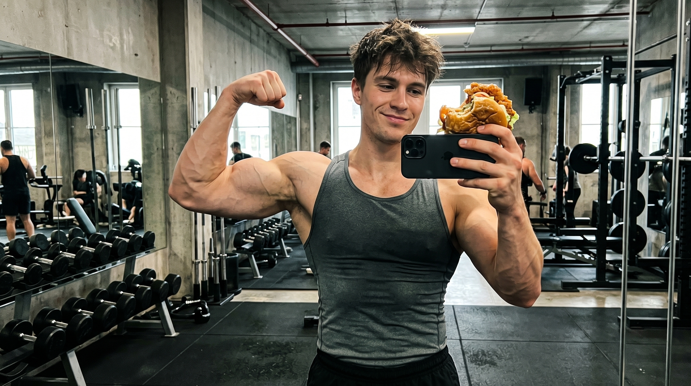
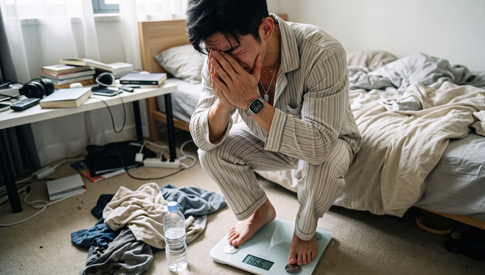
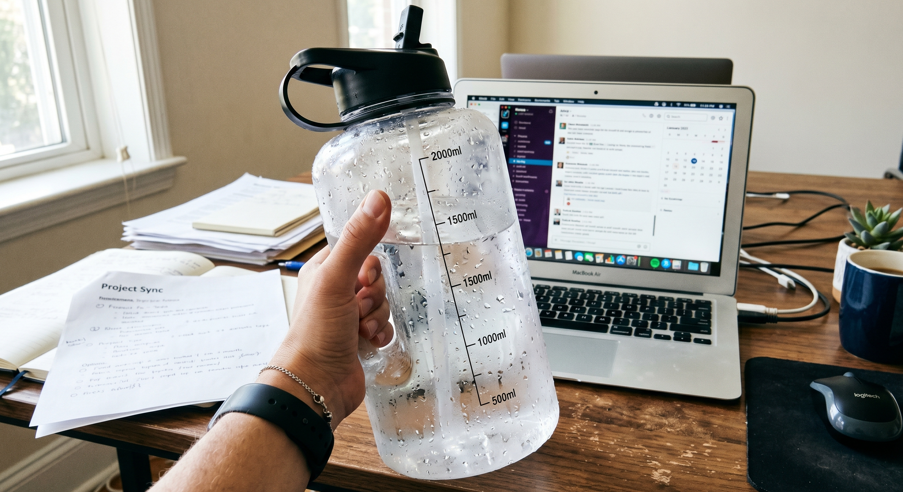
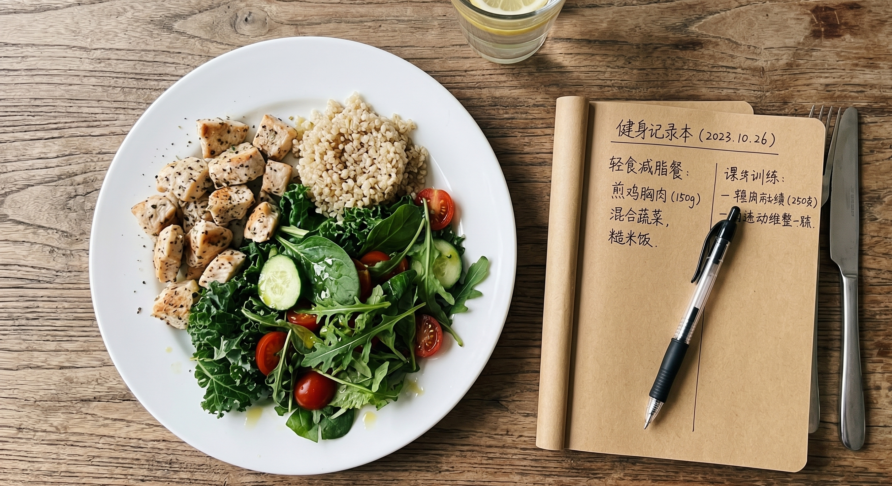

昨天晚上没忍住，吃了一顿放纵大餐。

火锅、烤肉，毛肚卷、滋滋肉排以及云朵小蛋糕，全部一下子都吃到了自己的肚子里面。

今天早晨的时候，我站到了体重秤之上。刚刚站上去我就马上一下发懵。这是什么情况？竟然在一个晚上的时间里体重增加了三斤。

胸口充满了悔意，内心默默地做出决定，要么就饿上一顿，要么就到跑步机上去疯狂地跑上两小时以此来弥补自己所犯的过错。

千万别！过度地进行弥补会让你产生非常强烈的饥饿感，之后就会陷入暴食、节食，然后又暴食的恶性死循环之中。

现在把这三个关于黄金24小时急救的妙招分享给你。

昨天晚上所摄入的很多热量，要在它们刚刚出现迹象的时候就将其全部消灭掉。

❌ **第一步：停止恐慌，认清“假胖”真相**

不要被体重秤上面的数字所欺骗，秤上面的数字并不全部是真实存在的脂肪。

要是你食用了过多甜腻以及高脂的物品，身体会首先将很多物品转化成为糖原，之后将糖原储存到肌肉以及肝脏当中。

当糖原在体内进行储存的时候，也会同时连带地将不少水分锁住。

你所涨上来的体重，基本上都是水分以及糖原储备。身体要将多余热量转化为脂肪相关的情况，是**需要花费一些时间的，通常需要适应一两天**才会开始明显地转化。

在它还没有变成松垮的赘肉之前，我们趁早去进行调整，现在仍然是来得及的！。

💧 **第二步：猛喝水，把多余的钠排出去**

人在吃饱了一顿饭之后，身体一般情况下就会摄入过量的盐分。

如果一个人摄入过多的盐分，那么其身体将会留存大量的水分，这样一来人就会呈现出较为肥胖的状态。

解决这类问题的最为合适的办法，并非是对喝水的量进行限制，而是主动增加补水的次数！

饮用足够量的水，能够促使身体加快进行代谢活动。如此一来便可以将多余的盐分排泄出去。

你还可以饮用黑咖啡或者清茶，利用它们自身所具备的天然功效，能够使你更为迅速地消除水肿。

🏋️‍♂️ **第三步：带着满格能量，去“炸”掉它们**

既然肌肉之中充满了刚刚补充好的能量，那么就应当好好地加以利用。

今天不要去进行慢跑活动了，换一个地方到力量区域进行大重量的综合动作训练。例如蹲起、硬拉或者卧推这一类的动作。

大重量的力量训练能够迅速地把很多多余的糖原储备消耗掉，与此同时还可以使身体的产热消耗大幅度地提升。

你会察觉到，前一天晚上吃得非常饱，到了今天全身都拥有着很充足的力气，肌肉所呈现出的那种胀胀的紧实感觉格外舒适！。

🍲 **第四步：利用“热量借用法”，平稳回归**

今天千万不要让自己处于饥饿的状态，就安安稳稳地回归到平常那种具有规律性、清淡的饮食情况就可以了。

你可以尝试运用热量平摊的方法。将当天的热量预算适当降低。把前一天超出标准的热量平均分配到接下来一周的几天当中，随后逐步将其消耗掉。

首先应当确保摄入足够数量的优质蛋白质，接着碳水化合物和脂肪略微减少一些便可以了。

不要仅仅因为一时的放松，把自己的心搞乱了。一步接着一步地踏实地去进行做事，这才是能够维持长久的办法！

👇 **【交作业时间】**

最近没有能够控制住自己的嘴巴，你所吃的那个具有“快乐负罪感”的美食到底是什么？
欢迎在评论区交卷！

### 参考文献
*《中国居民膳食指南（2022）》：第一部分一般人群膳食指南，第128页（阐述暴饮暴食与超重及心理状态的关联）
*《健身营养全书》：第2章“碳水化合物”，第48页及203页（阐述超量摄入碳水转化为糖原与体脂的适应时间，及高强度训练对生热效应的影响）
*《肌肉与力量全书》：第3部分 第17章“行为与生活方式”，第323-324页（阐述热量借用法在日常饮食超标后的灵活调整机制）