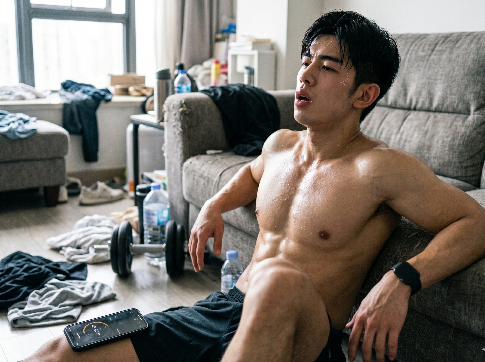
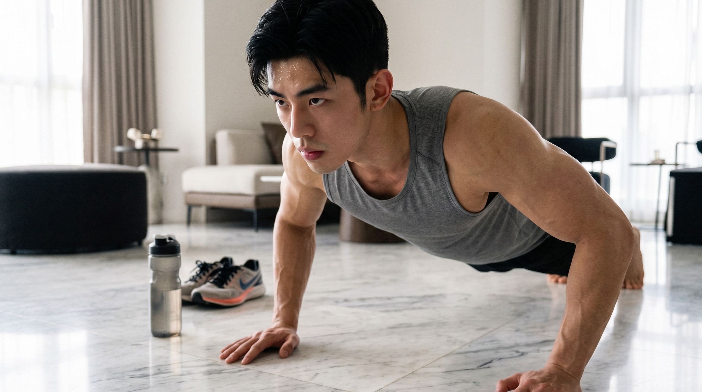
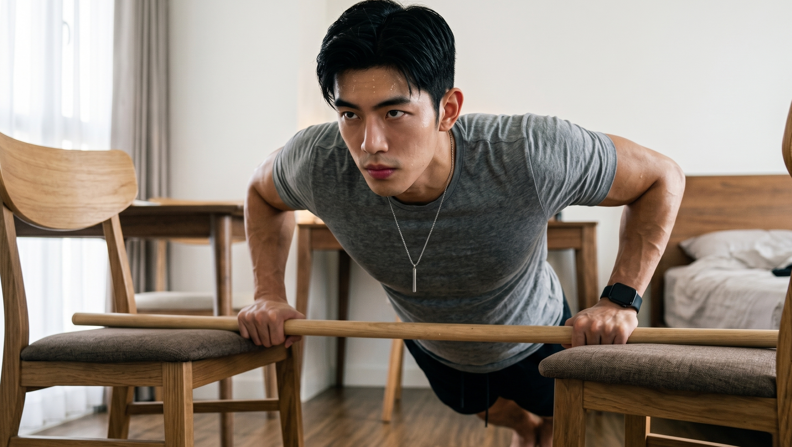
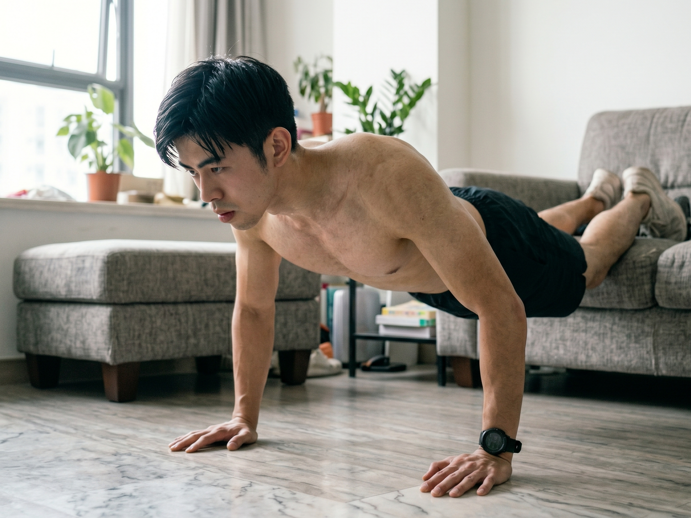

### 每天坚持100个俯卧撑会怎样？

很多人认为，平板支撑是能够用来直接判断男生身体素质情况的标准。

你应该已经刷到过各种各样的三十天俯卧撑打卡挑战的视频了。

画面之中的人每一天去做一百次俯卧撑，经过三十天之后，肌肉变得十分结实，身体的轮廓也变得清晰了起来。

听起来是不是特别让人热血沸腾？

但如果一个毫无训练基础的普通人，真的每天死磕100个俯卧撑，身体到底会发生什么？

真相可能和你想的完全不一样。

### 一、 每天100个？你的肌肉可能越练越少

首先我们得先把想法统一起来。撑臂起身这个动作是比较实用的，是一个好的动作。

在《肌肉健美训练图解》中明确指出，俯卧撑主要锻炼的是我们的胸大肌、肱三头肌以及三角肌前束

（配图1）

当你突然用力进行推动操作的时候，胸部区域和手臂部位一同使出力量。

但问题就出现在“天天”以及“上百个”这两个关键之处。

很多人心里想着，既然锻炼可以让肌肉生长起来，那就用力气每天都进行锻炼，认为这样的成效肯定能够加倍。

这其中存在一个最为关键的错误，肌肉并非是在进行锻炼的时候变得强壮的，而是在休息的时间段里生长变大的。

根据《肌肉与力量全书》的生理学原理解析，力量训练的本质是破坏肌纤维，而肌肉的修复和超量恢复需要48到72小时

如果不休息肌肉，今天刚刚拉伤了，明天又继续进行折腾。

最后会出现这样的一种情况：肌肉由于训练得太过度，始终处于被消耗的状态。

你觉得自己正在努力练习肌肉以增加肌肉量，但实际上肌肉正在悄悄地被消耗掉。

### 二、 数量的陷阱：你练的根本不是力量

存在一个残酷的情形：每天竭尽全力进行一百组的练习，对于练出你所期望的厚实的胸肌没有丝毫的帮助。

这是为什么？是因为我们的身体是非常灵敏的。身体在极短的时间内就能够适应过来。

《囚徒健身》在开篇的十式递进理论中就狠狠泼了一盆冷水：

当依靠自身重量进行锻炼时，如果只是一个劲儿地大幅增加动作的次数（例如从20次强行增加到100次），那么所锻炼出来的仅仅是肌肉的耐受力而已。

（配图2）

在提升极限力量以及塑造饱满肌肉维度这一方面，它基本上没有什么作用。

等身体适应了自身的重量之后，在那之后每一天去做一百个俯卧撑，这和进行一套没有趣味的有氧耐力操几乎是一样的。

就像《健身进阶指南》当中所提及的，要使得力量以及肌肉慢慢地得到提升，就需要采用逐步增加重量的方式来进行。

要是训练的强度一直保持不变，那么身体就会出现停止肌肉生长进程的情况。

觉得每天进行一百个俯卧撑的锻炼就能够练出如同施瓦辛格那样的身材，那完全是不符合实际情况的想法。

### 三、 没等胸肌变大，肩膀和手腕先废了

比练不出肌肉更加糟糕的状况，是在进行运动的时候让自己受到了伤害。

许多人在进行俯卧撑运动的时候，所采取的动作完全不符合正确的要求。

《量化健身（动作精讲）》中专门解析过由于过量推类动作引发的运动损伤：

要是长时间反复地去进行卧推或者俯卧撑的运动，胸肌以及很多负责肩关节内旋内收的肌肉就比较容易出现过于粗壮并且紧绷的情况。

相反的情况是，很多负责让肩膀向外转动以及向外展开的肌群没有什么力量。

要是这种失衡的状态一直持续下去，那么就很有可能会出现含胸、抬肩这类身体姿态走样的情形。

（配图3）

更为糟糕的情况是，你累到不行并且快要支撑不住了，还强行要去完成每天一百个的任务数量，在这个时候动作肯定会发生变形。

塌腰、肋骨外翻、耸肩……

原本本应该由胸肌去承受的负荷，一下子全部转移到了娇弱的肩关节以及手腕韧带上。

很多人进行锻炼还没有达到两周的时间，胸肌没有出现任何的变化，并且大拇指根部以及肩膀前侧存在疼痛的情况，疼痛的程度严重到连外卖都没有办法拎起。

### 四、 科学的自重训练，到底应该怎么玩？

要是在你的身边不存在健身器材，并且还希望依靠俯卧撑来练出紧致的身材，就不要再每日强行凑够一百个俯卧撑了。

按照科学的训练思路，你需要做出以下改变：

**1. 创造“呼吸感”的频次**

不要总是每天都沉浸在训练当中。每一周选择2天到3天的时间，认真地锻炼胸部以及上肢的力量。其余的日子就规规矩矩地进行休息。

**2. 拒绝数量，增加难度**

当你可以轻松地做出二十个规范的俯卧撑的时候，不要立刻就想着去达成冲五十个的目标。

请按照《肌肉健美训练图解》的指导变换动作角度：

把双脚垫高，尝试“下斜俯卧撑”，把压力转移到胸大肌锁骨部（上胸）；

你可以把双手之间的距离进行收窄操作。尝试进行窄距俯卧撑的相关动作。这样做能够精准地对肱三头肌产生刺激作用。

每组进行练习时，做到只能完成八次到十二次就完全没有力气了。这是锻炼出肌肉的高效黄金节奏情况。

动起来之前，永远记住一句话：

死磕硬扛没有什么作用，那仅仅是自己欺骗自己的没有用处的功夫。依照身体的规律来进行科学的锻炼，这才是能够重新塑造身形的可靠办法。