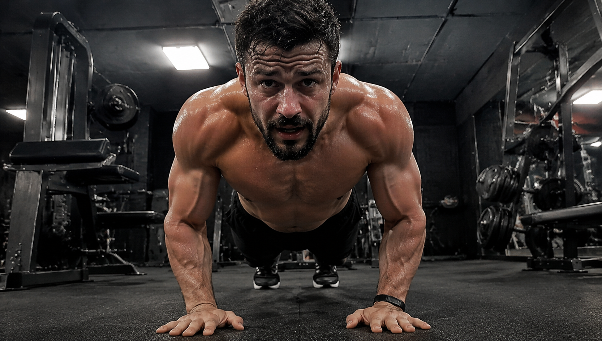
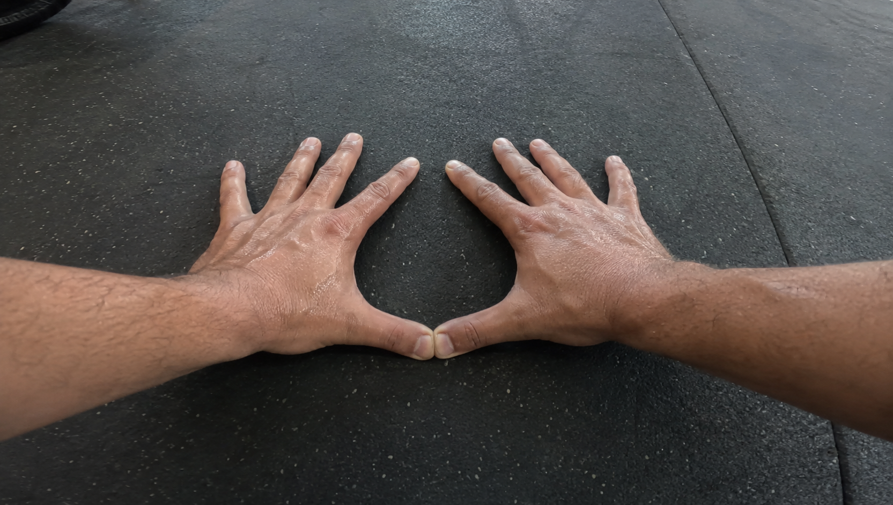
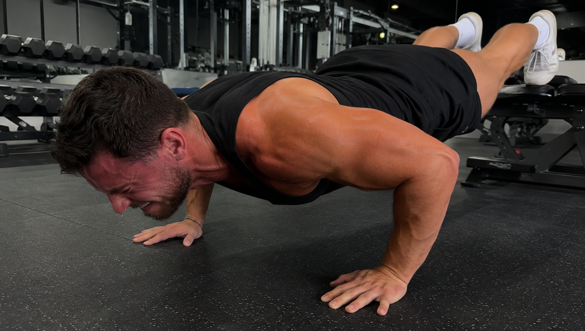

很多刚刚开始进行健身活动的人，一旦听到需要锻炼胸肌，立刻趴在地面上用力地去做俯卧撑。

一天疯狂地练下八十个，练得满头大汗、气喘吁吁。

结果坚持了一个月，胸肌没有看到有丝毫鼓起来的迹象，胳膊却酸痛到抬不起来了。

别傻了！

你觉得随意地趴在某个地方做几个俯卧撑，胸肌就会自己生长出来？

**真相是** ：你的手臂所处的摆放位置以及身体的倾斜角度存在着问题。在这种状况之下，你或许根本就没有锻炼到胸部。

今天我们来谈论一下，不同动作的俯卧撑具体锻炼的是身体哪个部位的肌肉群。

### 1. 宽距与窄距：双手的距离决定谁在发力

先说最常见的双手间距问题。

双手之间的距离，会对于发力在胸肌和手臂之间的分配比例产生直接的影响。

要是你采用**宽距俯卧撑**（双手间距约1.5倍肩宽）时，那么胳膊向外张开的幅度就会变大。

这时候，你的胸前肌群会被拉伸到最大程度，近乎承担了全部的发力任务。

期望拥有饱满且厚实的胸肌？那么宽握的姿势就是一种比较适合你的方式。

相反，如果把双手凑到一起，做**窄距俯卧撑**（比如双手相触的钻石俯卧撑）。

现在胸大肌的发力感觉逐渐变弱，手臂后侧的很多肌肉**肱三头肌**就会承担大部分的发力负担。

你原本计划练习胸部肌肉，结果每天一直关注窄距动作进行练习。那确实如此手臂酸痛得都无法抬起，但是胸部肌肉却没有任何变化。

### 2. 上斜与下斜：身体的倾斜改变胸肌厚度

除了需要把控横向的宽度之外，身体倾斜的幅度之中也存在着不少需要注意的地方。

调整上半身倾斜的角度，如此便能够精准地刺激胸肌不同的区域。

把脚垫高，双手撑地，这叫**下斜俯卧撑**。

进行这个动作的时候，身体的重心会朝着锁骨所在的方向发生移动。如此便能够精准地激活你上胸的部位。

要是上胸被锻炼得足够好，从视觉方面来看身形会有向上提升的感觉，如此一来穿衣服也会显得更加挺拔且利落。

反过来，将双手抬高，让双脚平稳地踩在地面上，这就是上斜俯卧撑。

重心出现了偏移，这样的一个动作，能够更为精准地激活你的下胸部位的肌群。

另外，由于身体替你分担了一部分重量，上斜俯卧撑对于力量不够的新手或者女性来说，也比较适合用来作为入门练习。

### 3. 真正的健美铁律：用脑子控制发力

运动塑形这一事情，并非随随便便进行大量的运动就可以达成的。真正意义上的运动塑形，根本就不是没有目标地盲目去增加运动量。

要是你希望拥有饱满的上胸，那么垫高双脚去进行下斜卧推便能够达成。

你是否想要练出厚实的胸肌？那么不妨尝试宽距双手展开这个动作吧。

你想要拥有结实且粗壮的手臂？那么你就赶快双手并拢去进行钻石俯卧撑。

不要再像一个没有感情的起落机一样胡乱用力了。你应该盯住你所要练习的肌肉。然后用心去把控每一次的发力情况。

要是你有过为了凑数而随意做俯卧撑的经历，那么就请点一个赞。将这条内容转发给身边还在拼命练习没有实际用处的百个俯卧撑的朋友，尽快把他们拉回到正确的道路之上。

---

**【参考文献】**

1. 《硬派健身》，一平米健身：硬派健身，Chapter 4。详细讲解了宽距俯卧撑对胸大肌、窄距俯卧撑对肱三头肌的肌电水平差异，以及下斜窄距对上胸肌的精准刺激
2. 《肌肉健美训练图解》，胸部训练，第54页。明确指出了抬高双脚重点锻炼胸大肌锁骨部（上胸），抬高胸部重点锻炼胸大肌腹部部（下胸），以及改变双手间距对胸大肌内外侧的影响