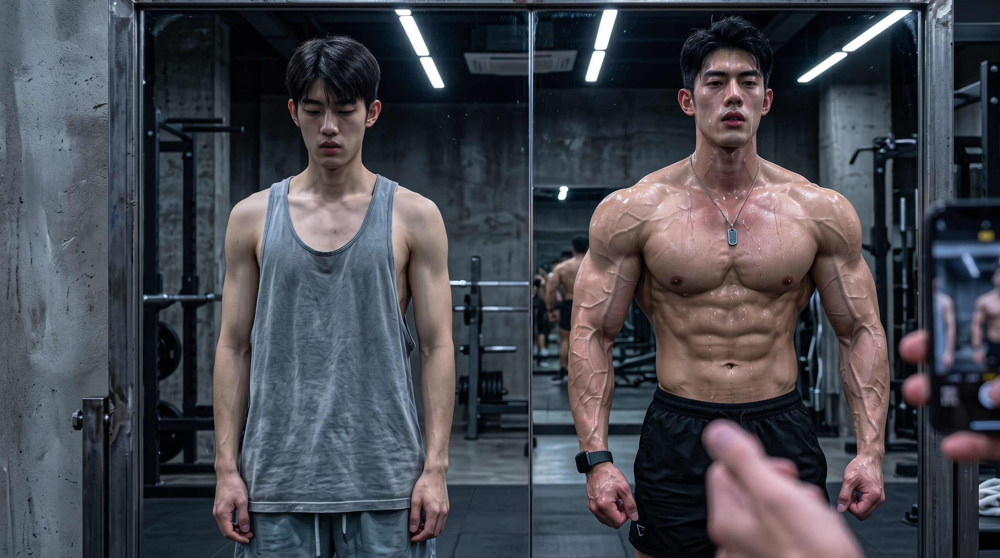
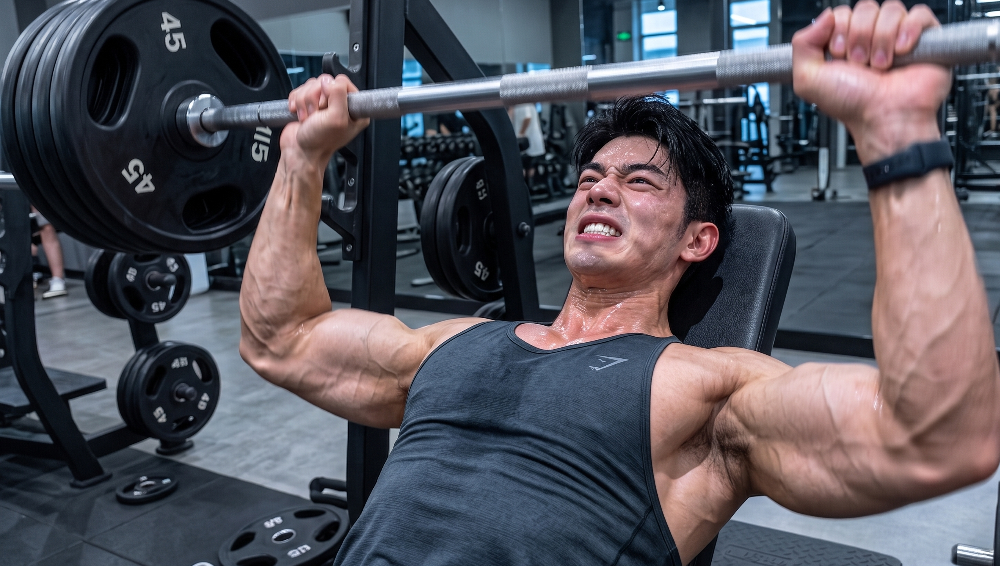
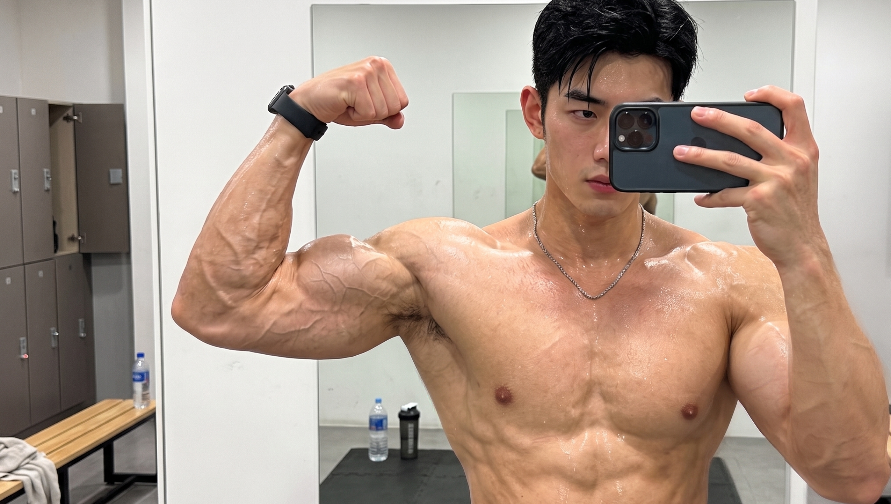

你每天待在健身场馆里面，汗水不断地流淌，用力地举起杠铃。

一个接着一个桶地去灌蛋白粉，吃到鸡胸肉以至于都产生了恶心的感觉。

好几个月一直在进行各种折腾相关的活动，体重没有出现减少的情况，身体上肌肉的维度也没有发生任何的改变。

看到他人在三个月的时间里练就了厚实且挺拔的肩背，而自己却没有任何一点进步？

不要随意地进行练习了。如果不了解肌肉是如何生长的，那么即使流出大量的汗水也是没有作用的。

当下，我要把那三个能够帮助你快速练出饱满肌肉的实用小技巧分享给你了。

赶紧将其保存起来，不要等到已经没有健身的热情了才去后悔。

🔥 **秘诀一：打破舒适圈，无情施加“机械张力”**

首先得先打破一个很容易让人产生错误认识的点：肌肉并不是在运动的时候直接就生成的。

当你进行高强度运动的时候，肌肉纤维会存在细微的损伤。这就好像织线被轻轻地扯松了一点的这种情况一样。

当肌肉处于紧绷状态并对抗外界阻力的时候，会产生强大的拉扯力量。而这种拉扯力量是促使肌肉变得强壮的核心要点所在。

这种拉扯的感觉会致使细胞的支撑结构产生物理方面的变化，接着这种变化会向机体传达指令，使得机体产生蛋白质合成的生长情况。

你每天使用相同重量的哑铃，进行同样次数的动作。身体会迅速适应这样的强度。那还有能让你增长肌肉的动力？

即使仅仅是每一次给杠铃增添2.5公斤的重量，这也全都是在使身体去适应新的强度方面的挑战。

要使得肌肉变得粗壮有力，就需要持续地向肌肉施加足够的牵拉刺激才可以。只有持续不断地向肌肉提供足够的牵拉刺激，肌肉才会逐渐地变得粗壮有力。

🩸 **秘诀二：榨干肌肉，追求极致的“代谢压力”**

健身达人为什么会特别在意在肌肉出现发胀以及充血情况时所呈现出的那种紧绷的感觉？

这其中存在着有助于肌肉生长的第二个关键因素，也就是代谢负荷。

当你重复进行8到12组规范动作的时候，肌肉在无氧代谢的过程中会积累大量像乳酸这样的代谢废物。

代谢废物持续不断地累积，会致使你的肌肉产生明显的发胀感觉以及灼热感觉。

外力所产生的刺激能够唤醒肌卫星细胞。当肌卫星细胞被唤醒之后，会使得肌肉蛋白的生成速度加快。由于肌肉蛋白生成速度的加快，最终使得肌肉的维度出现明显的增长。

那么，不要总是仅仅去关注1到3次的大重量极限尝试，倒不如将训练的次数往上涨一涨。

当你静下心来感受肌肉被逐渐拉伸时那种鼓胀的畅快的感觉，那么代偿的部位就会自行退开了。

🛏️ **秘诀三：喂饱身体，激活“超量恢复”**

很多进行健身的新手非常想要每天都待在健身房里面，就担忧休息一天，所锻炼出来的很多线条就会消失不见。

运动结束之后，需要补充蛋白质。蛋白质可以填补受到损伤的肌肉组织，并且有助于进行修复。原本的肌肉纤维会逐渐变得粗壮，这就是超量恢复的情况。

要是你所摄入的热量不充足，或者所摄取的蛋白质不充分，身体就会将你身体上剩余的肌肉分解成为能量来加以使用。

更关键的是，睡眠就像是一个天然的身体调节剂。

在深夜里，你进入了深度睡眠的状态。在这个时候身体会悄悄地分泌出足够数量的生长因子以及雄性激素。生长因子和雄性激素是帮助你练出结实肌肉的关键动力。

只要将身体的全部力气都调动起来，把自身所具有的潜能逼迫出来，之后再做到吃好和睡足就可以了。

即使你自身所具备的条件没有那么的出色，也依然可以通过锻炼拥有能够撑起紧身衣的宽厚胸肌以及结实的臂膀。

👇 **【交作业时间】**

你在平时进行训练的时候，哪一个身体部位锻炼得最为用力，并且酸胀的感觉最为明显？
欢迎在评论区交卷！

***

### 参考文献
* 《量化健身：原理解析》：第五章“拆解增肌训练”，第104-106页（阐述肌肉与肌力增大的原理及机械张力、代谢压力等肌肥大机制）
* 《量化健身：原理解析》：第一章“破除健身迷思”，第2-3页（阐述肌肉并非在锻炼中生长，而是需要撕裂后的修复）
* 《量化健身：原理解析》：第二章“建立严谨的计划观念”，第34-35页（阐述运动学中的超量恢复理论及体能上升机制）
* 《囚徒健身全集》：第二章“发展肌肉的哲学”，第217-218页（阐述睡眠对分泌生长激素及睾酮的决定性影响）
* 《施瓦辛格健身全书》：第一章“基础训练原则”，第90页（阐述渐进超负荷及肌肉强迫生长的原则）