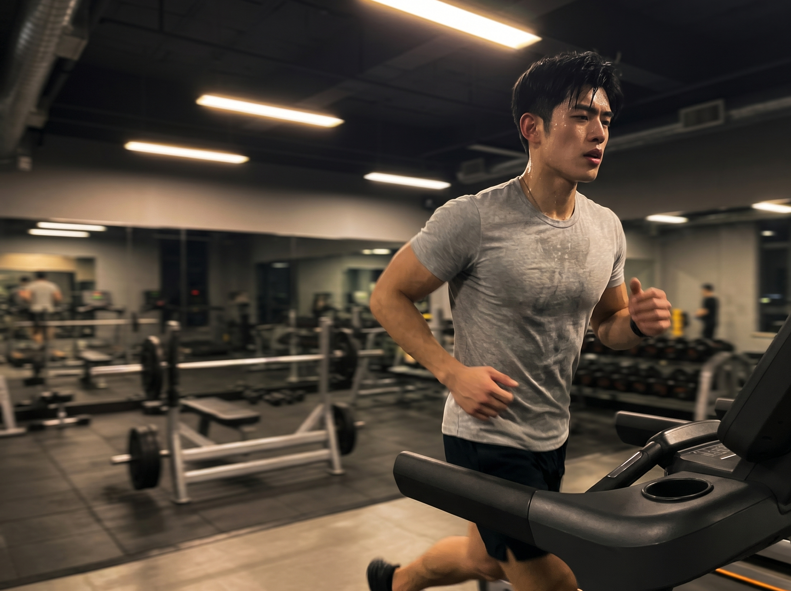
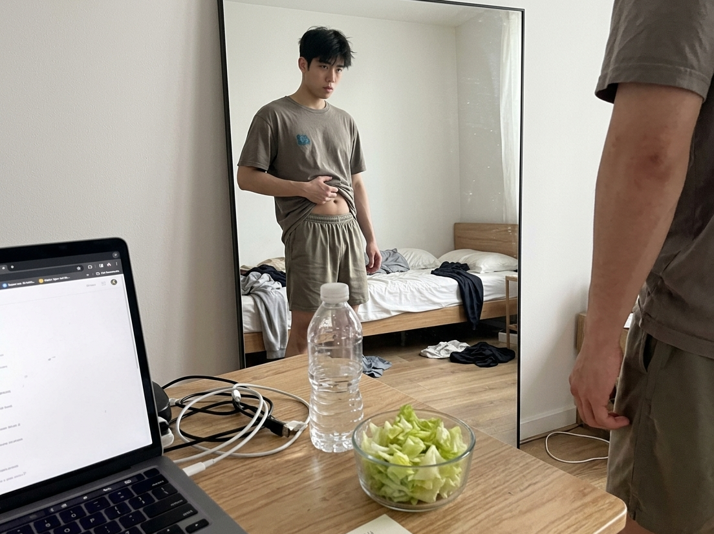

你是否也遇到过这样令人烦恼的事情：每天努力地进行锻炼，累到满身大汗，体重是有所降低了，但是对着镜子看的时候，身体的形态并没有达到期望中的好看模样？甚至原本明显的肌肉轮廓变得不清晰了，皮肤还有些松垮，也就是人们常说的“脂包骨”状态。

要是你出现了这样的感觉，那么就需要提醒你了：你很有可能在不知不觉间就陷入了减少肌肉的“陷阱”。你所减掉的不只是身体上的多余脂肪，还包含了你花费大量时间和精力锻炼出来的紧致肌肉。

肌肉在维持日常的新陈代谢、塑造匀称的身体形态、提高运动的耐力方面是非常重要的。参考专业健身读物的具有实用性的内容，下面来分析六个在日常中容易出现的损伤肌肉的小习惯，帮助你精准地避开很多不良之处，高效地达成健康减重的目标。

## 一、 “伪健康”饮食：为了减重绝食或过度节食

**毁肌指数：⭐⭐⭐⭐⭐**

这是一种很常见并且对身体很有伤害的不良习惯。很多人为了快速地进行减肥，采用了极端的方式。例如每一顿饭仅仅食用蔬菜和水果，甚至直接不进食。

（这里插入配图+序号1：image_1.png，指令见文末）

**书籍科学依据：**

要是身体长期摄入的能量不足，那么就会启动自身的防护模式。首先它会降低日常的能量消耗。接着就开始分解肌肉，将肌肉里的营养转化为供能的物质。简单来讲你吃得越少，身体就会越早依靠消耗肌肉来维持运转，而脂肪的消耗反而往后推迟。长期故意少吃不仅不能真正减掉脂肪，还会使你变成代谢差、皮肉松垮的“虚胖瘦子”

## 二、 运动结构失衡：只做有氧，抗拒力量训练

**毁肌指数：⭐⭐⭐⭐**

慢跑、蛙泳这类有氧形式的锻炼，能够对心肺功能起到锻炼的作用，同时还可以帮助身体消耗掉热量。但是如果仅仅只是进行有氧锻炼，完全不开展力量训练的话，那么就错失了用于维持以及增加肌肉的良好途径。

（这里插入配图+序号2：image_2.png，指令见文末）

**书籍科学依据：**

肌肉的状态存在着这样一种规律，经常使用就会变得强壮，闲置不用就会变得衰弱。有针对性的力量练习能够给肌肉施加必要的外力刺激，进而启动肌肉生长的内在信号。要是没有这样的刺激，身体会觉得肌肉是没有必要的高耗能部位，就会逐渐把它分解掉。长时间的有氧锻炼能够消耗不少热量，可是如果缺少力量练习所带来的促生长信号，最终减掉的体重当中，肌肉所占的比例会比较高。

## 三、 宏量营养素缺失：优质蛋白质摄入严重不足

**毁肌指数：⭐⭐⭐⭐⭐**

要是你坚持进行力量训练，但是在日常所食用的食物当中蛋白质的含量不充足。那么不仅无法生长出肌肉，而且还有可能会把已经拥有的肌肉消耗掉。

**书籍科学依据：**

肌肉的主要构成成分是蛋白质。每一次力量训练结束之后，肌肉的细微结构会出现受损的情况（这属于正常的现象）。在这个时候身体需要有足够数量的优质蛋白质来对这些损伤进行修补，如此一来肌肉便能够实现超量恢复——也就是肌肉的维度以及力量都会出现增加的状况。要是你在进行减脂的时候仅仅食用主食和蔬菜，完全不摄入肉、蛋、奶这类物品，那么身体就没有办法达成修复的过程。当训练所带来的合成代谢信号和热量缺口所带来的分解代谢信号同时存在的时候，要是缺乏蛋白质这种修复的材料，那么肌肉的分解情况肯定会发生。

## 四、 过度训练：不知道“休息”也是训练的一部分

**毁肌指数：⭐⭐⭐**

“练得越勤效果越好”是健身新手常犯的错误。有很多人想要快速见到成果，所以每天都待在健身房里，有的甚至一天进行两次锻炼。

（这里插入配图+序号3：image_3.png，指令见文末）

**书籍科学依据：**

肌肉并非是在锻炼的过程中生长出来的。肌肉是在休息的时间段里，经过修复、合成以及超量恢复的过程逐步生长的。锻炼得过于剧烈会使得体内的皮质醇一直维持在较高的水平位置，皮质醇是会加速身体分解的激素。与此同时睾酮的含量会出现下降的情况，睾酮是能够帮助身体进行合成的激素。当身体的分解速度比合成速度快的时候，肌肉不但不能够生长起来，还会渐渐地出现缩水的状况。要是在锻炼完之后第二天全身疲惫得抬不起力气，肌肉的酸痛没有得到缓解，甚至力气比以前还要小，那么就需要停下来好好地进行休息。

## 五、 “欺骗餐”的误用：一次放纵，一周白练

**毁肌指数：⭐⭐**

“放纵餐”最初的目的是在长期控制脂肪摄入的时候，短暂地让精力有所提升，并且调节身体内部瘦素的分泌，以此来防止身体的新陈代谢陷入到停滞的状态之中。但是很多人却把一次的放纵饮食，转变成为整个星期都没有节制地饮食或者是在某一天疯狂地大吃大喝。

**书籍科学依据：**

若想要享用一顿具有有效放松效果的餐食，就需要对各类营养的比例进行把控。要是某一顿饭摄入了很多高油高糖且没有什么优质蛋白的食物，例如一大桶炸鸡以及好几块奶油蛋糕，那么这不仅无法助力身体提高代谢水平，还会致使热量严重超出标准，进而转化为脂肪储存起来，此前一两周进行撸铁、跑步等运动所付出的努力就会付诸东流。这种热量极端的忽高忽低情况，对于增肌是没有益处的。

## 六、 忽视睡眠质量：你睡觉时肌肉正在疯狂合成

**毁肌指数：⭐⭐⭐**

许多人能够坚持进行高强度的训练并且严格地控制饮食，但是却无法按时地进行休息。常常出现熬夜或者睡眠质量不佳的情况，渐渐地就会对自身的肌肉状态产生影响。

**书籍科学依据：**

熟睡的时候是身体分泌生长因子以及雄性激素的黄金时间段。生长因子对于肌肉的修护以及脂肪的代谢是非常关键的。要是睡眠不充足，生长因子以及雄性激素的分泌数量就会急剧下降，压力激素的水平就会急剧上升。这会使得身体处于不利于肌肉生成的情形：肌肉修复的速度变得缓慢，合成的效率大幅度降低，并且还更加容易囤积脂肪。

## 参考文献

[1] 《力量训练套装》，马克·瑞比拖、安迪·贝克. (第8章“营养”第199页、第13章“恢复”第307页) [2] 《健身营养全书：关于力量与肌肉的营养策略》，克里斯蒂安·冯·勒费尔霍尔茨. (第3章“蛋白质代谢”第67页、第5章“碳水化合物”第115页、第9章“代谢适应与节食陷阱”第245页) [3] 《肌肉与力量全书：用严谨的科学构建关于健身的完整知识体系》，埃里克·赫尔姆斯. (第3章“宏量营养素”第89页、第4章“训练计划设计”第135页、第6章“休息与恢复”第201页) [4] 《NSCA-CSCS美国国家体能协会体能教练认证指南第4版》. (第5章“宏量营养素与体能”第121页、第10章“过度训练”第275页)