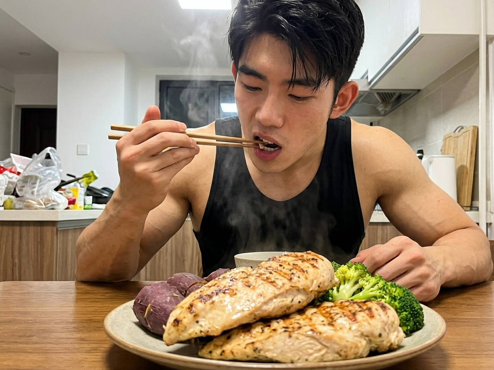

很多健身的人都有一个共同的焦虑：

我练了这么久，到底长肌肉了没有？

每一天都对着镜子进行观察，观察自身的身材时发现并没有出现任何的变化情况。

不要着急。肌肉缓慢生长的过程，隐藏得还比较隐蔽。

在肉眼看到明显的围度改变之前，

你的身体会早早地给出精准的身体提示。

今天要跟你讲述肌肉悄悄生长起来的6个明显迹象。

如果你中了3个以上，说明你的增肌计划非常成功！

### 信号一：同样的重量，你觉得变轻了

练习过程当中，可以明显观察到身体长肉的一个明显迹象就是，经过一段时间之后力气就会有所增长。

如果你上个月推举哑铃还摇摇晃晃，

这个月却稳稳地完成了预先设定好的任务数量。

这便意味着，你的肌肉的维度或者神经的调控能力发生了变化。

神经元动员了更多的肌纤维参与收缩，

这便是肌肉块体实现功能性增长的关键信号。

它不断变得强大的核心信号在于肌肉的维度正在稳步地提升。

要是体重出现了上升的情况，那么很有可能是肌肉正在悄悄地生长。

(配图1)

### 信号二：训练完，目标肌肉有强烈的“泵感”

练习的时候，发力的那个部位的肌肉会变得特别紧绷，呈现出鼓起来并且有胀胀的感觉，同时还带有一点热乎的感觉。

这就是健身常说的“泵感”，

在科学上被称为代谢压力。

当肌肉反复地进行收紧的动作时，静脉之中的血液会被在短时间内进行挤压。

大量血液和代谢产物滞留在肌肉细胞周围，

肌细胞如同被吹胀的气球一般，变得充血并且呈现出鼓胀的状态。

这类细胞出现体积增大的情形，会立刻使得身体的促进生长的信号被触发。

它能开启蛋白质合成通路，

让肌肉的肌纤维变得粗壮，这样可以有助于肌肉变得饱满且厚实。

(配图2)

### 信号三：酸痛变得有规律，且恢复速度变快

刚开始进行练习的时候，整个人会连续好几天全身都呈现出一种酸溜溜的状态。

但如果你发现最近的延迟性肌肉酸痛（DOMS）变得非常有规律，

一般情况下在训练结束之后的1天到2天会达到峰值，随后就马上快速地缓解。

即使过了一段时间之后再去练习同一个身体部位，之前那种酸胀的感觉已经完全没有了。

这表明你的身体已经达成了理想状态下的代偿修复。

当你的肌肉纤维出现细微的损伤情况时，它的恢复节奏便会变得更为快速。

这一情况要归功于更好的肌肉以及神经之间相互进行配合，同时还有内分泌方面的调节作用。

你的身体正在努力地修复肌纤维，并且在默默地帮助你让肌肉的状态变得更强。

### 信号四：食欲大增，身体像个“无底洞”

最近一到饭点就饿得发慌，胃口比以前好得多？

别担心，这绝不是你变馋了，

而是肌肉在逼你补充能量。

肌肉在人的身体里面就像是一个消耗能量的大户，这是大家都知道的“耗能奢侈品”

进行大强度的力量练习，会使得你的日常代谢水平出现明显的提升。

当肌肉需要进行修复以及生长的时候，就需要不断地去补充蛋白质以及主食这一类的食物。

当身体发出强烈的饥饿信号时，

这表明身体内部如同瘦素这类的信号物质正在主动地去对新陈代谢进行调节。

现在补充足够多的优质蛋白，此时正是肌肉发力生长的良好时期。

(配图3)

### 信号五：动作越来越稳，不再晃晃悠悠

如果你发现自己在做深蹲或推举时，

身体晃动的明显程度减少，核心部位的肌肉更加紧绷，动作流畅得好像是沿着事先设定好的轨道滑行。

这表明你的身体反应的灵敏程度以及整体的配合程度都已经有了较为明显的提升。

人体内部的神经肌肉网络，可以使得主动发力的肌肉、起到反向制约作用的肌肉以及起到深层固定作用的肌肉共同协同工作。

这神经方面的调节属于肌肉发育的起始步骤。

如果发力链条一直保持动态的平稳状态，那么目标肌群才可以承受住更大的负荷。

动作越是稳定，就意味着肌肉发力的调动效率越高。

### 信号六：睡眠变沉，甚至沾枕头就着

如果想要身体分泌生长激素的量达到最高值，那么就需要睡眠状态处于既香甜又踏实的情况。

如果你发现最近训练完当晚睡得特别沉，

深睡的时长出现了变长的情况，这就意味着身体正在全力启动修复滋养的模式。

大负荷的力量练习会对于神经中枢以及内分泌系统产生积极的作用。

身体为了修复受损的肌纤维和结缔组织，

能够自动把深度睡眠的时长进行拉长，从而帮助身体快速补充所消耗掉的能量。

一接触到枕头就睡得很香甜，这样良好的睡眠，是对肌肉默默生长的自然助力。

当你处于睡眠状态时，你的肌肉正在悄悄地变得更为强壮。

### 总结

要去打造肌肉的线条，这是一个需要慢慢与身体进行磨合的漫长过程。

不要总是将目光聚焦在体重秤上面的数字以及镜子里面自身的模样。

力量变大、泵感强烈、动作变稳、睡得更香，

这些不太引人注目的小的变化，正是肌肉自身进行重新塑造的很有力的证据。

收到这些信号，请继续保持你的训练与饮食！

### 参考文献

1. 《肌肉与力量全书：用严谨的科学构建关于健身的完整知识体系》，第一章、第二章。
    
2. 《力量训练套装》，第一部分：深蹲与推举的力学原理，第二部分：适应背后的生理学。
    
3. 《NASM-CPT美国国家运动医学学会私人教练认证指南（第6版）》，第二章：神经肌肉系统，第十三章：无氧训练计划。
    
4. 《健身营养全书：关于力量与肌肉的营养策略》，第三章：能量平衡与信号分子调控。
    
