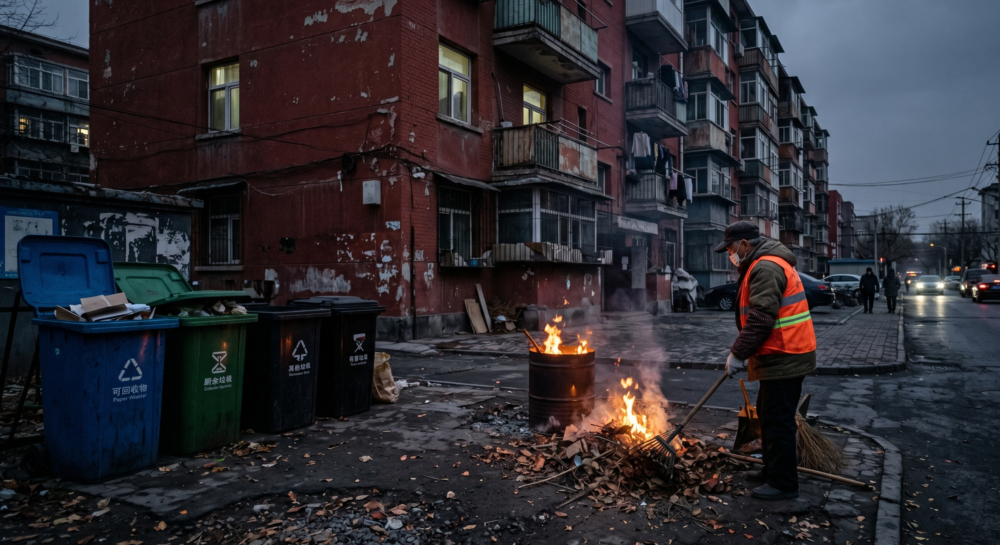

- 谈了3年，今晚我亲手把她送进了火葬场。
看着很多东西在火光之中逐渐化为灰烬，我确实没有流淌哪怕是一滴眼泪。那是被我撕碎的写满“我为你好”控制欲的便签，还有三年来因迎合对方妥协的所有独立主张。

被我送进火葬场的，并不是是随便哪一个普通的生命，而是那一段致使我完全失去自我，紧紧依附于他人情绪的那种“畸形的共生关系”。

在那充满信息的汹涌浪潮以及繁杂的人际环境当中，我们实在是太容易为了去维持那表面上看起来的和谐状态，而将我们自己的精神坐标系完完全全地双手奉献出去。底层的道理其实挺简单的：要是一段关系得让你委屈自己，把界限都弄模糊了，那是在一点点耗掉你的生命。你得在独处时自越，于反思中寻回边界。

在你身旁，难道不会也存在一个人，他是以“爱”作为幌子，持续地对你进行精神上的消耗？今晚你打算为哪段内耗关系做个了断？