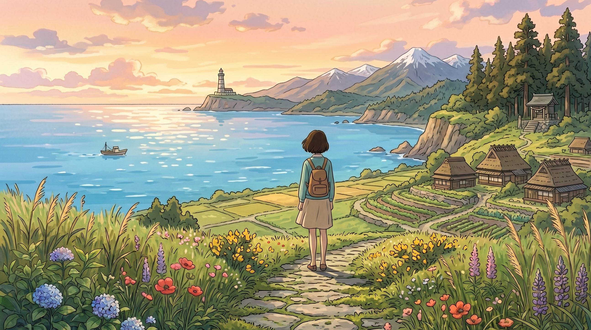

你总是问我为什么仅仅认定你，而不将心思分给予其他的人。

其实。

你只是在某一个特定的时候。

我忽然就遭遇到了满满的那种幸福的感觉。

你是我明知不可为。

可即便如此，那个人还是拼尽了全部的力量也不愿意松开自己的手。

---

昨天深夜。

屏幕亮起的那一瞬，你是不是又忍不住屏住了呼吸？

有可能是他发送的一条没有什么重要意义的节日群消息，也有可能是朋友圈里一张没有标注具体位置信息的风景图片。

你盯着那个熟悉的头像。

突然之间想起那天下着雨的那个傍晚，他将那唯一的伞全部朝着你所在的方向倾斜过去，他自身的半边肩头都被雨水湿透了。

那股带有皂香以及潮意的干爽气息，曾经让你仿佛感觉，指尖触碰到了岁月的所有。

所以。

即使后来的日子里。

**他信息回得越来越慢，态度越来越敷衍，你依然舍不得删掉那个对话框。**

在对话框之中打出了几行文字，之后又全部将其删除掉。随后退出该对话框，在那犹豫了好长的一段时间，最终还是再次点击回到对话框之中。

反反复复地折腾自己。

你处于求而不得的拉扯之中，如同在寒冷的夜晚等待一场不会归来的潮汐。

你问自己：为什么别人都不行，偏偏是他？

---

暖暖想对你说句戳心的话。

醒醒吧，亲爱的。

你执着的，根本不是他这个人。

**你执着的，只是当年那个被他短暂照亮过、随即又被抛回黑暗中的自己。**

在心理学领域之中，存在这样一种说法被称作“未完成心结”

还没有走完的道路，等待不到的回应，在你的脑海之中逐渐被柔和的光线所包围起来。

你以为那是纯粹的爱。

但实际上你就在那里独自十分投入地表演着一场没有人回应的独角戏。

你一直苦苦支撑着当前的这种状况，盼望他能够改变自己的想法，盼望情况能够出现变化和转变。

可你忘了。

**一个频繁让你流泪、让你反复试探的人，本质上就是怯懦与不尊重。**

当男生处于纠结该选择哪一个的状况时，他实际上比你所认为的更为清醒，也更能够沉住气。

他对你的态度呈现出一种平平淡淡的状态。这种情况和他是否忙碌没有任何关联。说白了你在他的心里面并没有那么的重要。

他有时候会扭头往后看，这和爱没有一点关系，这只是他在极度孤独的时候，一种没有什么意义的下意识的试探行为。

你总是觉得即便撞到了南墙也不回头，实际上是内心当中的那团疙瘩拧得过于紧密了。

但在现实的亲密关系里。

这叫自我感动，叫不知止损。

---

人在这一生当中，大多数的难受情况，是由于将自身价值的要点绑定在了他人所给予的回应之上。

可亲密关系的底层逻辑。

往往是残酷的价值交换。

不要依赖那一点旧的回忆，去填补那个人离开之后所留下的空缺之处。自己参与的表演。

你一直忍受着当下的这种状况，去期待他能够改变心意从而出现转变的机会。

可你忘了。

**一个频繁让你流泪、让你反复试探的人，本质上就是怯懦与不尊重。**

当男生处于思考是要还是不要的状态时，他比你所认为的更加理智且更为沉稳。

他对你的态度是冷淡的。这并非是因为他没有时间。而是他内心认为，你在他那里没有处于很重要的地位。

他有时候会回头张望。这与爱并没有关联。这仅仅是他在极度孤独难以忍受的时候所进行的一种价值不高的试探。

你所认为的撞了南墙还不改变方向，实际上就是内心的执念过于深重了。

但在现实的亲密关系里。

这叫自我感动，叫不知止损。

---

人在其一生之中的大部分难受，是由于将自身的意义寄托于他人的回应这一情况之上。

可亲密关系的底层逻辑。

往往是残酷的价值交换。

你不可以借助着少量过去的回忆，去填补那个已经转过身离开之人的空缺。

**被爱从来不是人生的必需品，爱自己才是终身浪漫的开始。**

阿德勒说过，要学会课题分离。

他对不在意你这件事情，那是他自己做出的决定；你能不能放下心里的那件事情，这可是你自身的一种成长。

不要总是死死地抓住不放，也没有必要一定去寻求一个说法。

当一个人到了一定的年龄时，不互相见面、没有消息传递，这就是逐渐产生疏远的迹象。

有些人的出现。

他仅仅是陪你走过一段路程的人。最终他十分果断地转身离开。这使得你能够学会果断地放手。

**失去，有时候比拥有更让人觉得踏实。**

现在你不再需要持续担忧他会在什么时候离开。

---

听暖暖的话。

把原本放在他人身上的心思，用力地收回至自身所在的这一边来。

去赚取钱财，去进行学习，去开展慢跑活动，去把你那杂乱无章的生活节奏重新恢复起来。

允许一切发生。

就让那一段缘分，在最为艰难的时刻默默地结束。

礼貌退场，断联。

这是你留给自己的最后那一点点儿的体面。

今天晚上，去泡一个温热的热水澡吧。

穿上那最为柔软舒适的家居服，将手机调整成静音模式，之后安安稳稳地去睡一个好觉。

天亮之后。

需要好好对待这只此一次并且非常珍贵的人生，应该珍惜这独一无二而且无比珍贵的人生。