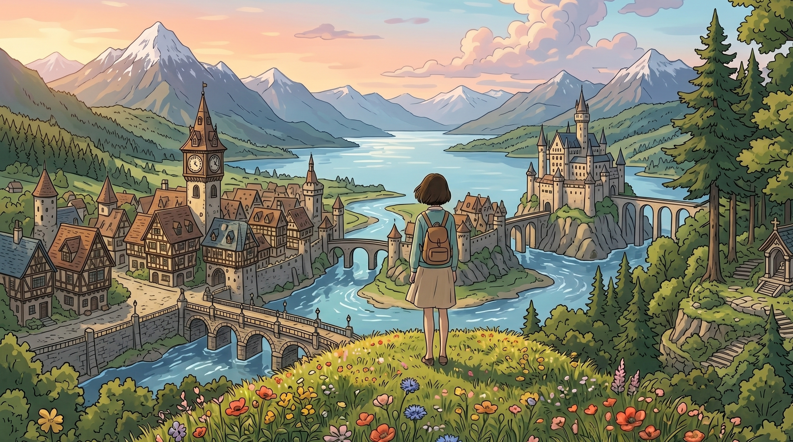

他于深渊之中去权衡那许多的利弊，而你则在废墟之处去缝补那青春时光：为何这一生最为想要的那个人，常常只能够陪你走过那短短的一小段路程？

爱到了极致的时候，最终并不是是相互的毁坏。

**但是，却是那形同陌路般的黑名单。**

下午三点突降雷阵雨。

你静静地伫立在便利店那屋檐的下面，眼神凝望着雨水顺着那透明的伞尖持续地往下坠落砸落。

那一刻你点开那个置顶却未再亮的小头像。

对话框里空着的时候输入了“雨好大”这几个字，手指在那里悬了好久，最后还是把它给删掉。

最初求而不得引发的内耗，最伤人的并不是拉扯过程。

**可你心中满是话语，却发觉连去打扰他人的身份都已经不复存在了。**

你终明白，下次遇心仪之人。

一定要紧紧地把心门守住，仅仅去做朋友，只是去谈论很多风花雪月的事儿。

我们常常会觉得，一段感情走向终结是由于彼此之间不够深切地相互爱恋。

其实不是。

**成年人的世界，满是权衡下的不动声色。**

你所认为的那种“突然就断了联系”的情形，在对方的视角去考量，实际上不过就是一场经过了细致且精密谋划，成本相对比较低的退出行动罢了。

大众觉得只要有不甘并愿挽回，遗憾能被填平。

这仅仅只是那种属于低配版本的浪漫幻想罢了。

他深夜发的朋友圈或试探性点赞。

根本就并不是是由于那所谓的深情。

**那是在寂寞的时候所进行的广泛撒网之举，以及去确认你是否还在原来所在之地的那种低成本的试探行为。**

你还在因为他的一个眼神而吃不下饭，睡不好觉，可他，早已毫无留恋地转身去考量下一个更为合适的对象。

男性之爱多具较强现实主义。

而女人的爱，却常常是那种带着自己觉得正确，仿佛是在进行献祭一般的感觉。

你因内心有所感触而痛哭流涕，言说那是兵荒马乱的青春时光。

但是在心理学范畴之中，这被称作是欠缺“课题分离”这种情况所体现出的防御性自私的状况。

他的冷漠是其课题，你的执念是你课题。

**你将人生全部的价值都紧紧地捆绑在对方给予的回馈之上，而这样的做法从其本质而言，就是一场必定会输掉的赌局。**

不远不近观赏，淡淡喜爱。

乍一听好似是在退缩，可实际上这是成年人对于自身所实施的最为顶尖的一种保护举措。

与其到最后失去了最初的心意辜负了美好的年华，倒不如从一开始就只谈论风花雪月而不去计较以后的岁月。

承认，对于某些人的出现而言，实实在在地就是仅仅为了陪伴你去走过那短短的一小段路程。

收回托付他人的精力。

去努力搞钱，去认真阅读，去将生活满满地填充上自己所喜爱的很多事物。

**失去相较于拥有而言会显得更为稳当，这是因为这样的一种状况意味着你已经不再对失去心怀惧怕。**

允许一段关系毫无预兆地突然走向结束，实际上是对于自身最为得体，最为周全的一种成全之举。

爱自己是终身浪漫的起始。

今晚去泡一个充满热气，暖烘烘的热水澡。

将乱绪留昨夜，好好睡一觉。

让所有的事情都可以自然地发生，允许那所有的一切都按照其自身的轨迹去发生。

**然后，过好你这一次极其珍贵，专属自己的生活。**