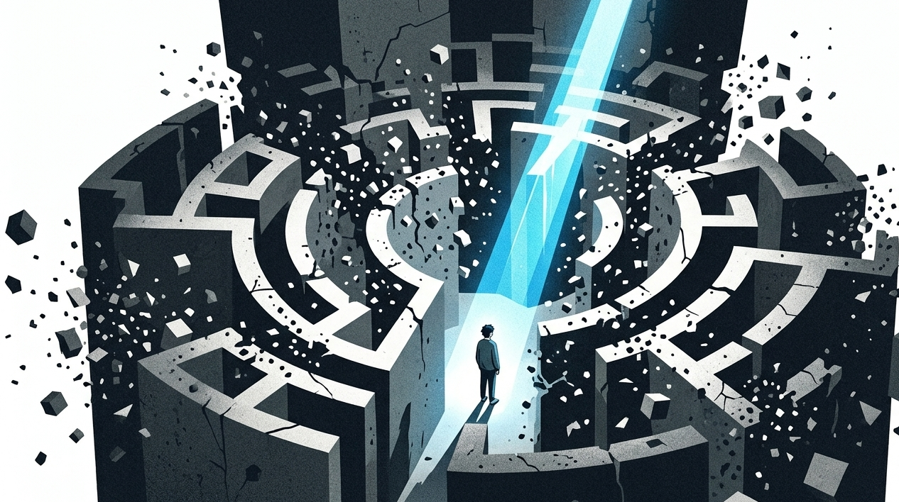
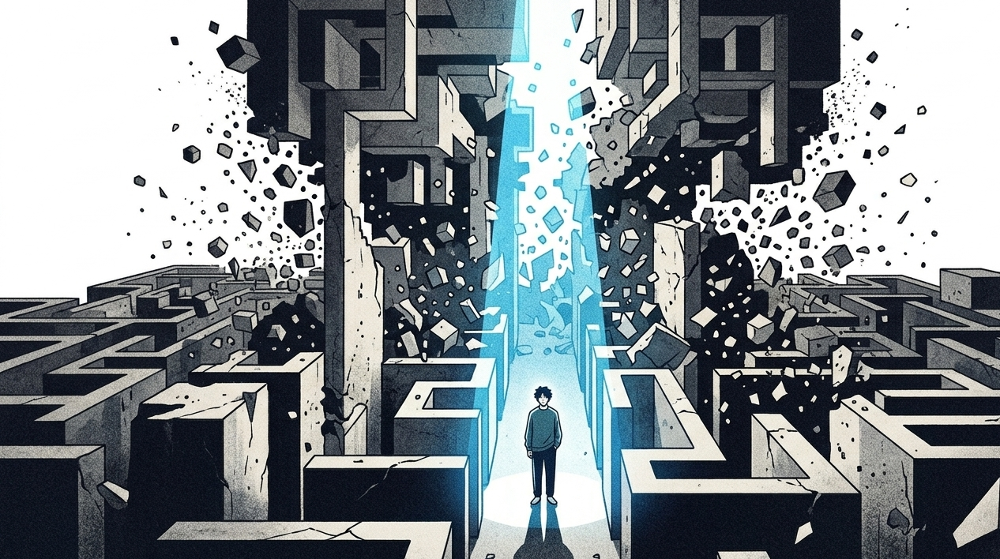

“人在没有外力干涉的情况下，其内部的混乱度会自发地无限增加。”

这是物理学大师薛定谔在《生命是什么》里提出的铁律——热力学第二定律，也叫熵增

简单来说：如果一个屋子没有人去进行收拾，那么它就会逐渐变得更加杂乱。如果一个人对自己的人生不予理会，那么精力、行动力以及生活就会逐步朝着不良的方向发展。

在三十岁之前，我如同一滩没有什么劲头的烂泥一般生活着。

那时候我常常觉得，做事拖拖拉拉的原因是自己过于懒惰，还是自身缺少自我控制的能力。

那我就开始疯狂囤积课程了，将每天的行程安排得十分满当，如同上了发条的时钟一般准时去进行打卡。

谁能想到仅仅三天的时间就无法再坚持下去了，整个人彻底垮了下来，瘫倒在床上，连半根手指都不想抬起来。

心里想要去做但是却无法做到的那种沮丧，如同直直地看着一个有着破洞的气球在面前缓缓瘪下去。

过了很长的时间我才突然明白，一直困住我的并非是什么自控力不够这样的事情。

我正在做的事情就是与天地间最基本的规则相对抗。

## 所谓的自律，不过是一场自我感动的慢性自杀

你可不要弄混淆了。很多你认为是高效行动达人的人，并非是依靠死撑意志力才坚持下来的。

市场当中存在着众多劝你强硬地坚持着、顽固地支撑着去逼迫自己实现突破的成功学相关言论，这些全部都是具有危害性质的事物。

人的毅力就好像是随身充电宝里面的电。如果电被耗尽了，那么就需要马上补充能量。

每天早晨刚刚睁开眼睛的时候，需要在心里与自己纠结好一段时间，之后才愿意起身离开床铺。

只要一迈进公司的大门，就必须勉强自己装出笑脸去应对很多难以相处的合作方以及自己的上司。

你内心之中所拥有的力气，已经被很多无法被看见的内部消耗情况给消耗殆尽了。

这时候你还想逼着自己去健身、去学习、去搞副业？

这怎么能算作是有执行的能力，这就是对于自身身体和心理两个方面都在进行苛刻的对待。

如果你总是一直在一个地方死脑筋地去对待事情，内心之中的怨愤之气就会逐步变得越来越多，最终就会如同憋到再也无法继续憋住的气球一样，“啪”地一下就爆炸得什么都不存在了。

**真正的顶级执行力，从不需要咬牙切齿，它是一场顺应物理规律的“负熵武器”。**

## 每天叫醒你的不是梦想，而是屋子里不断漫上来的积水

想想很多在中途停止了、没有完成的计划。

在周一的深夜时分，内心之中满是冲劲，罗列出来十条能够获取钱财的办法。

星期二完成工作之后，整个人感觉酸痛的程度如同被沉重的物体挤压过一样，回到家里就想要瘫坐在沙发上刷短视频。

【插入配图1】

这时候，你的大脑开始疯狂开庭：

“天天这么累，放松一下怎么了？”

“明天再开始也来得及，今晚先充个电。”

在迷迷糊糊的状态中，时针已经走到了午夜的时候。你内心充满了愧疚之情，然后钻进了被窝里。在床上翻来覆去，一直到了凌晨两点，依旧没有能够进入睡眠的状态。

你是否已经察觉到了？你所欠缺的根本就不是时间，而是去迈出第一步的那一种劲头。

你的生活如同一间总是漏雨的屋子，你没有考虑去修补屋顶，却拿着一个瓷碗不断地往外舀水。

这种没有意义的内耗循环，正在悄悄地消耗着你核心能力的基础。

**无序的忙碌只是在加速熵增，它除了自我感动，给不了你任何结果。**

## 引入外部负熵，像清理垃圾文件一样重启系统

若想要具备极为强大的行动能力，就需要尝试着从外部去获取积极向上的能量，从而将混乱无序的状态拉回到正常的运行轨道之上。

你需要为自己制定一套不带感情色彩且按章办事甚至略显刻板的行事准则。

不要仅仅相信从内心之中冒出来的想法，而应该相信你眼前实际存在着的环境。

### 动作：执行力降维，把阻力降到物理极限

需要把很多需要花费力气去纠结的选择题，全部转化为不需要耗费脑力就可以进行选择的单选题。

■ 实用操作指南：① 阻力最小化：今晚就把明天要读的书翻开停在第一页，把跑步的鞋子摆在玄关最显眼的位置。② 物理隔离法：工作时把手机锁进另一个房间，或者用软件强制屏蔽所有娱乐App，斩断一切让人分心的熵增源头。③ 微习惯锁死：不要试图一次写三千字，规定自己每天只要打开文档写下50个字就算通关，用极低的启动门槛骗过大脑的防御机制。④ 建立能量锚点：每天在固定的时间和固定的角落做固定的事，让身体形成肌肉记忆，用习惯的惯性代替意志力的消耗

当你不再在内心之中反复地纠结、自己与自己较劲、死钻牛角尖的时候，行动力就变成了深入骨髓的本能了。

你无需将自己变成什么都能够做到的大英雄，只需要成为一个明明白白、果断干脆，按照规律一步一步稳定行动的人就可以了。

**执行力不是意志力的狂欢，而是高级程序员对生活环境的一场底层重构。**

生活就是向着混沌不断前行的漫长行程，到处都能够看见涣散的状态，规整反而成为了稀少的惊喜。

别再怪自己不够努力了。

他将身体弯曲下来去查看屋子里出现渗水情况的部位，之后迅速跑开去关闭那一个会让人产生烦躁情绪的水阀。

请你点一个赞，或者在评论区说一说你今晚准备切断的那个“内耗源头”吧。

下期聊聊怎么在人际关系里玩“课题分离”，让自己彻底戒掉讨好型人格