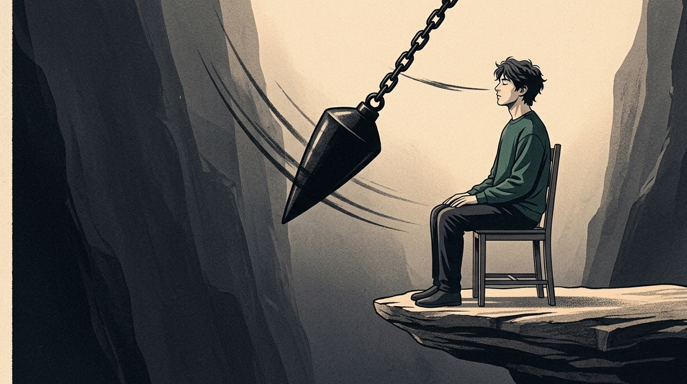
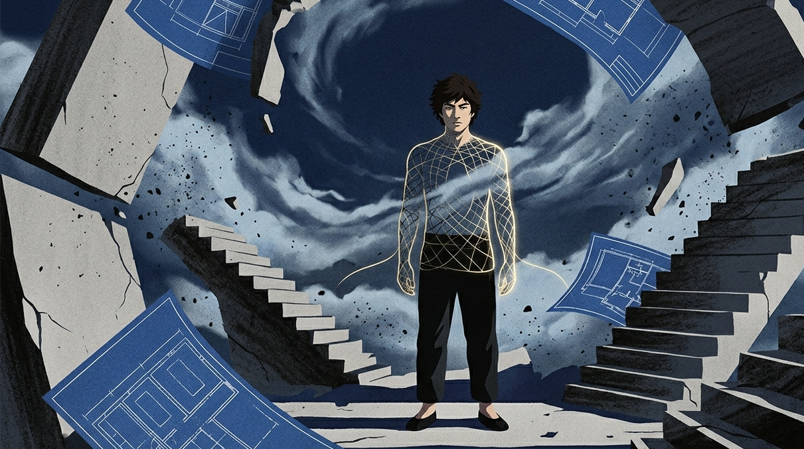

里尔克曾在《给一个青年诗人的信》里写道：“要对心里一切悬而未决的事保持耐性，试着去爱这些问题本身，像是爱一间锁着的房间，或是用异国文字写就的书。”

在热力学的相关领域范畴里，存在着一个针对开放系统的深层次比喻。

当一个系统完全封闭、死死捂住所有的边界时，它内部的混乱与衰变就会呈指数级上升，直到走向崩溃；

成熟的开放体系，能够使能量、信息以及动荡自由地通过。它在变化的过程中保持着充满活力且稳定的平衡状态。

从前我也是一个容易因为一点事情就发怒的急性子。

只要生活当中出现一点不确定的迹象，我的心立刻就好像被拉紧了的弦一样。

项目结果没有当场定下来，我能在夜里把最坏的打算在脑子里排练一百遍；

发送出去的消息没有得到回应。我每隔几分钟就将屏幕按亮一次，反复地处于非常焦虑的状态之中，最后胃部一阵泛酸并且还出现绞痛的情况。

在那段时间当中，我如同一个弦拉得满满的岗亭哨兵，看到任何事物都觉得好像有动静前来侵犯，用尽剩余的力气想要把日子里所有不确定的苗头都用力按下去。

直到后来我被自己设定的“确定性牢笼”活活憋个半死才明白：

有些人内心存在那种特别急切地想要立刻看到结果的偏执想法，这根本不是什么掌控力，而是内心安全感不足在起作用。

你总是过于执着每一件事情都必须有一个确定的结果，这样你正在亲手为自己的人生之路建造一道严密到无法透气的高墙。

## 紧绷的绝对掌控，不过是对未知世界的深度恐惧

我们经常会被世俗中对于效率的那种执着以及对于安稳确定的那种迷念所卷入进去。

总感觉做任何事情都需要有一个相应的交代，每一件事情都应该有对应的回应。人生应当如同搭建积木一般严丝合缝，只有这样才能够算得上是可靠的。

不，那根本不是什么执行力。

当你没有办法承受未知的情况、无法避开失控的状况的时候，大脑会下意识地出现本能的紧绷状态。

真正强大的人格，它的核心并非是一块一碰就会破碎的顽石，而是一张可以容纳各种东西的软网。

当风暴、质疑、焦虑和悬而未决的未知砸过来的时候，习惯性紧绷的人会选择硬碰硬，结果被砸得满身裂痕；

一个能够坦然接受所有事情的人，往往只是安静地站着，摊开手掌，使很多纷扰如同一阵风一般从指缝间吹走并远去。

很多心情和最终的结果，在他们的心中没有引发任何一点波动就默默地消失了。

如同把一片落叶抛到辽阔的江面上。它并不尝试去阻挡湍急的水流。它仅仅跟随水波的起伏变化。它听任自身在变化多端的湍流中漂浮游荡。

【插入配图1】

**你死死抓着不放的那个确定性，往往就是勒死你行动力的那根绳子。**

## 为什么你总是在“等待宣判”的间隙里，把自己凌迟了一万次？

你一定有过那样的时候，频繁出现那种让你内心很纠结、让人感觉透不过气来的状况。

一份决定命运的合同还在走审批，你在等待的四十八小时里，在脑子里已经把破产、失业、流落街头的画面演到了大结局；

当你非常在意的那个人态度忽然变得奇特且难以捉摸时，你坐着也不是站着也不是，反反复复地思索他昨晚随意说出的普通话，如同着了魔一般在细微之处找寻一点疏离的迹象。

你如同那个紧紧攥着衣角，眼巴巴地等待老师给予分数的学生一样生活着。

事情还没有一个确定的结果，你，在很早的时候就在心里把那一点能够支撑自己的底气打了一半的折扣，将其贱价卖出去了。

内耗一直在持续不断地进行着，如同一间始终处于不断渗水状态的小屋。

你没有去拧紧正在漏水的水龙头，也没有去拉开门让积水排出。你把自己被困在了水里。你一边在水中呛水，一边还在埋怨老天为什么还不停止下雨。

你将自身最为珍贵的生命能量全部消耗殆尽，仅仅是为了预先防备很多或许根本不会出现的灾祸。

**焦虑的底层逻辑，是你试图在因果链还没闭环的时候，强行用自己的肉身去当那个结果。**

## 系统重构：把边界彻底格式化，允许自己成为一个穿堂风的通道

既然没有办法对外部的任何变化进行控制，那么不妨尝试一下阿德勒所提出的课题分离。将内心的门户调整到“接纳”的状态。

结局什么时候到来，会以如何的模样呈现，那是关于天地时间次序的难题，和当下的你没有任何关联。

你所必须紧紧关注的关键之处，便是你的气息以及眼前那距离非常近的空间。

试着让自己变成一个能够通透容纳的空的容器吧。

当焦虑、恐惧以及迷茫如同潮水一般不断涌来的时候，不要去进行抗拒，也不要去勉强自己硬撑着。

在心里温柔地对自己说一句：“来吧，我允许你穿过我。”

瞧它钻过你的骨缝，它漫过你的心情思绪，它松开你紧紧攥着的肩头，然后看它如同轻烟一般融入到身后的空茫里面去。

得接受一些事情目前还没有确定的结果，得接受答案还没有出现，得接受这个世界本身处处存在着缺口和不确定性。

【插入配图2】

**钝感的人在死磕，敏感的人在逃避；而真正活明白的人，在允许一切发生的同时，自己该干嘛干嘛。**

你的内在是非常珍贵的，不要总是在自己瞎想以及一直等待的坑当中白白地浪费时间。

要是你也想要卸下那层厚重的铠甲，让自己完全地放松下来，那么就请点一个赞吧。我们在那前路并不明确的漫长路途当中，默默地一同前行。