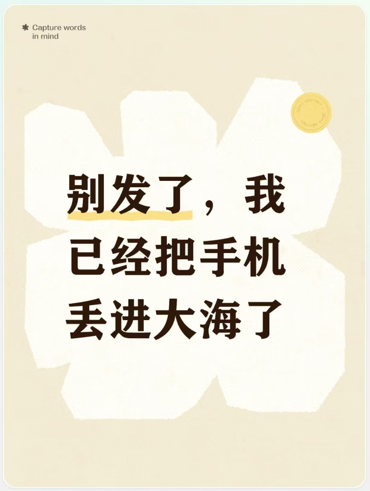

我没跳海，我也没疯。昨夜我将微信内120个无联系的群均予以退出，还把所有推送通知永久关闭，仿若未发生过极端之事，感觉如同丢失了手机一般

在信息的大洪流之中，处于整日忙碌状态的我们，自认为掌控了全世界，实际上不过是被手机所左右的“数字难民”

不进行灌鸡汤的时候，能够发现底层的逻辑实际上是较为简单的，也就是信息越多生活就越模糊，诱惑越多坐标就越混乱。那么对抗浮躁时代的办法仅有一个，主动进行“精神断联”，随后停下盲目地忙碌，在独处之中进行反思，在清醒之中开展沉淀