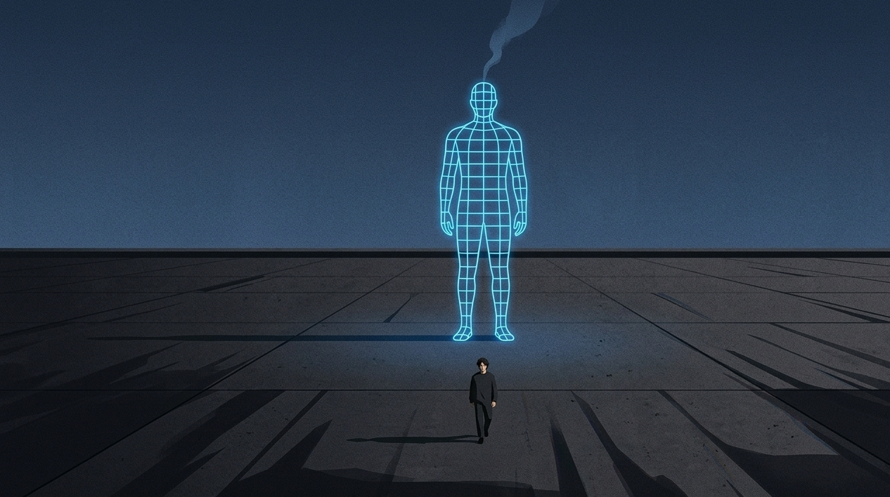
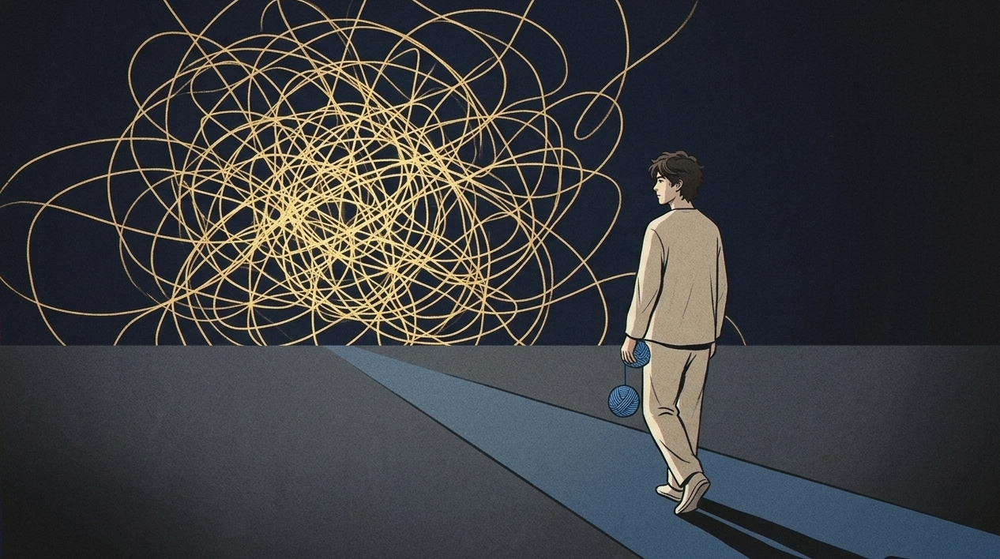
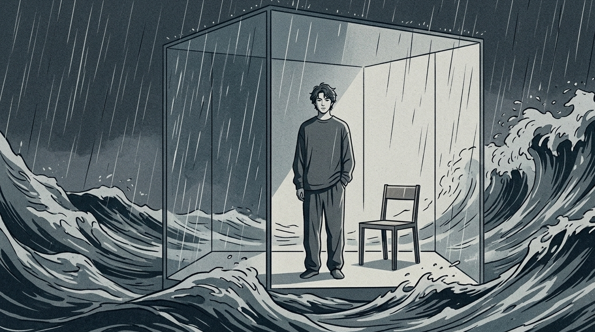

世界之中最为强烈的那种吸引力，并不是是激情，反而是那呈现出熵减状态的冷漠。”

薛定谔在《生命是什么》中提及：生命为抗死亡与腐败，需不断从环境取“负熵”，即维自身秩序。

很多人在谈恋爱或者进行社交的时候，生活得如同一个功率完全开启，不断在漏电的电热毯一样，急切地想要把所有的热量，情绪以及秒回的那份诚意，全部都塞给对方。

结果呢？

我曾有过“高燃型人格”。

当对方和我之间的一个眼神没有对上的时候，我的内心之中如是展开了一场规模宏大如同最高法院般的庭审，不断地反复去审判自己是不是哪里说错了话。

我燃成死灰后，对方嫌我烫手而离开。

我这才算是真正地活明白了：那一直都在不停地燃烧着，一直都在不断地迎合着的热情，从它的底层逻辑来看，实际上就是一种处于无序状态的“高熵状态”。

高级吸引力乃“间接性冷漠”，为高秩序感冰山治越。

## 间接性冷漠，才是不漏电的顶级负熵

那根本就不是自私，更不是人们所说的那种所谓的“欲擒故纵”以及很多个套路。

世俗常让我们热情，高情商且总提供情绪价值。

但是事实情况是你连自身情绪的高压锅都快要爆炸，那你借助着什么去渡过别人？

心理学中“间接性冷漠”本质是阿德勒所言“课题分离”。

它把拉扯在别人身上的视线冷酷地收了回来，如同那堵高高的墙壁一般，将外界很多没有逻辑的噪音给隔绝开来。

当你有间接性冷漠时，就是在宣告：我的情绪主权不容侵犯。

【插入配图1】

那种无论何时何地都随时准备奉献热情的人，在人际关系之中就好似一座始终不断进水的屋子，你永远都得拿着脸盆去淘水，那模样真是十分狼狈不堪。

而有间接性冷漠的人，在屋顶建了排水系统。

能够把控冷漠出现频率的人，才是拥有着处于最高级别层次的心理防御方面的主权之人。**

## 你所谓的体贴，不过是在心里反复开庭

你定有过此般令人窒息之场景。

微信响了起来，你当时正在吃饭，可却不由自主地放下筷子，立刻就去秒回消息。

他为何仅回“”？我是不是语气太生硬了？

你将自身所有的精神内核，毫无保留地全部挂靠在了他人所给予的反馈之上。

这如同把银行卡密码交路人，还每日盼他们不取你钱。

这种极为极端的“间接性热情”，从其本质而言，是深度内耗下的自虐行为。

对方平静如常，你内心已如海啸翻腾多次。

最终你疲惫了，你觉得是这一段关系存在了问题，实际上是你始终一直在自己去折磨你自己。

每一次无底线秒回与迎合，皆为出让灵魂主权。**

## 切换你的精神受力点，把高压锅的阀门拧开

若要去重构这样一种被动的局面，你就非得要学会把精神方面的受力的那个点，从“别人会如何来看我”转换到“我当下究竟需要些什么”才行。

这并不是要你成为无温度的冷血者。

而是在你处于电量低迷，情绪过度负荷的时候，主动去按下那一个“冷漠开关”。

别人欲以情绪垃圾桶砸你时，你需谨记：那是他的课题，非你之责。

■ 实用操作指南：

①建立“断联保护期”，每天雷打不动留出2小时不回复任何非紧急消息。当收到情绪化提问的时候，就去执行那所谓的“三秒延迟法则”，强迫自己在收到情绪化提问之后倒数三秒然后再去做出相应的决定。③戒断“过度解释”，对于不想去、不想做的事，直接说“我有事去不了”，不编造理由、不自我羞辱。④建立“多支点生活”，把热烈分散给举铁、搞钱或读书，让社交只占你精力版图的20%。

【插入配图2】

当你的世界不再只有唯一的受力点，你就不会因为某一个人的冷淡而彻底塌房。

那种间接性的冷漠，会变成你身上最迷人的神秘感。

因为别人发现，他们再也无法轻易看透你、撼动你、消耗你。

**真正吸引人的，从不是毫无保留的炽热，而是随时可以收回的温柔。**

点个赞吧，别总当那个随时随地给人取暖、最后自己冻死在寒冬里的电热毯了。过得清醒一点，我们在下一个清醒的瞬间再见。