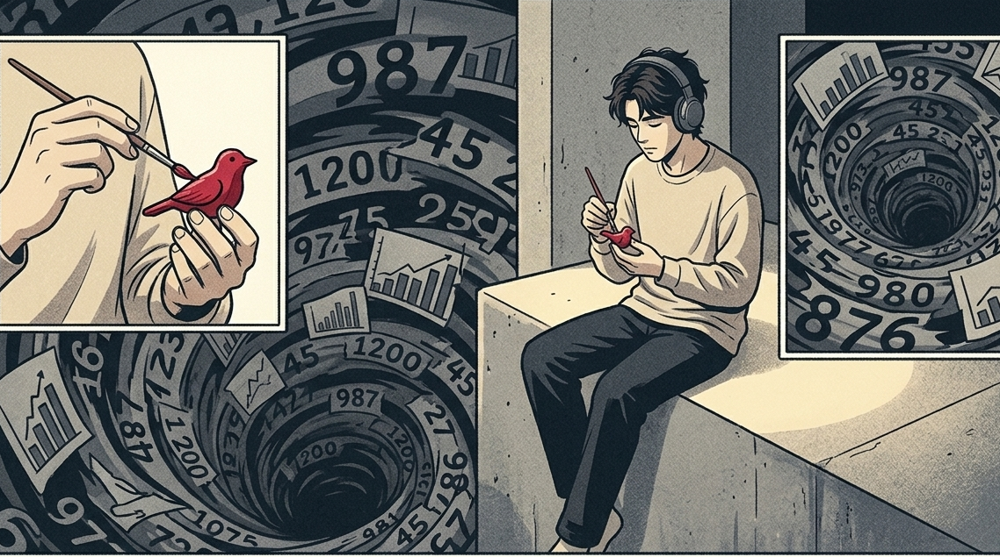
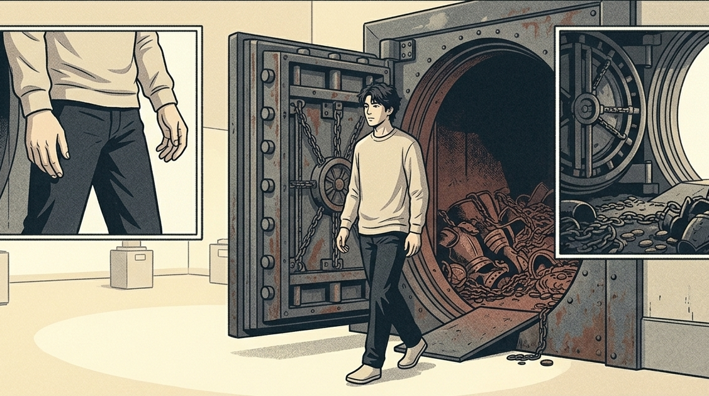

罗曼·罗兰曾说：“世界上只有一种真正的英雄主义，那就是认清生活的真相后依然热爱生活。”

在心理学的这个领域范围之内，存在着这样的一种现象。这种现象被称作“选择性信息闭环”

在心智逐渐走向成熟的过程当中，有一些人并非是没有经历过生活的困苦。他们看到周边处于一种杂乱无章的状态，就自己将自身身上的脏污之物清理掉，之后躲到自己营造出的一个安静的小区域里去 。

以前在带队去洽谈业务的时候，遇到过不少年龄在三十岁左右的人。这些人从外表看显得单纯，单纯的程度有点像是天真。

一顿饭局，别人在眉来眼去交换利益，他低头认真研究那盘干炒牛河够不够镬气；

合作方采取了一些不太光明的手段，大家内心都清楚相关情况，但是他却直接将事情拿到公开的场合来进行处理。

那时候我觉得他们是没有接触过现实的娇弱的年轻人，心里想着这类人在工作场所估计坚持不了几天。

后来我自己踩了无数个大坑、被所谓的高情商和心机反噬过才猛然惊醒：

有一些人在过了三十岁之后仍然保持着纯粹的内心状态，他们中的大多数并不愚蠢。他们主动选择了一种具有“防护罩”的高级通透状态。

纯粹究竟是如何的一种状态？它并非是糊里糊涂的样子。而是在经历了许多复杂的事情之后，能够以较为镇定的心态去做出相应的选择。

## 所谓的成熟圆滑，不过是认知匮乏的防御妥协

我们常常会觉得，到了三十岁就应该是那种八面玲珑、左右逢源且心思深沉的样子。

总觉得，很多说话保留着三分余地，做事保留着九分退路的人，才是真正通透的明白之人。

那怎么能算是成熟？只不过是在被生活磨去了棱角之后，本能地收缩起来罢了。

你由于没办法承受前方道路的改变，只能够锻炼出将自己包裹起来的方式。

很多人到了三十岁左右的年纪，内心觉得自己已经成熟了。但是实际上不过是在那密集得让人感觉难以呼吸的生活的挤压之下，将自身所有的棱角都磨得消失殆尽了。

他们已经丧失了对事物本质进行探究的欲望。他们将全部心思都花费在对人情世故的研究之上。他们总是去揣摩别人的神色变化。

很多始终保持着纯粹心性的人们，他们内心存在着一个区域，有着能够持续自我更新的正向能量场。

他们具备足够的底气以及实力。他们可以摆脱外界很多世俗规则的约束。他们始终保持着清爽的自身状态。他们不会陷入混乱的状况之中。

这如同一辆配置过高的豪华跑车，没有必要去思考如何在烂泥地当中和农用拖拉机进行抢道。

它始终保持着最初的流畅线条，只是为了奔赴更加澄澈、更加宽广的赛场。

【插入配图1】

**世故是随波逐流的本能，而单纯是逆流而上的选择。**

## 为什么你总是在“心里开庭”时羡慕别人的钝感？

你肯定会有这样的时刻，被内耗紧紧地缠绕着，让人感觉透不过气来。

老板在群里发了个收到，没加波浪号，你能在脑子里复盘出一百种自己即将被开除的兆头；

客户说了一句模模糊糊的话语，你在听到之后，躺在床上翻来覆去地思索，越思索心里越不舒服，胸口感觉闷，胃里还感觉发酸 。

你从早到晚一直在进行算计，一直在进行提防，把人与人之间的交往看作是一场猜测心思的游戏。

你所看到的那个看起来傻呵呵的同事，到了规定的时间就离开工作岗位，回到自己的住所去逗弄猫咪，但是他的工资却一点都没有减少，并且业绩还比你更为出色。

这如同运用极为强大的计算能积极破解一个根本不存在的密码。

你以为别人是在第一层，你在第五层；

可谁能预料到，别人早已看透了这场闹剧的荒谬。有个人一拍桌子，转身离开。又回到最原本、最真实的起始点。

你正在将自身宝贵的精力用于为很多见不得人的人情关系充当垫脚石。

**心机是一件沉重的防弹衣，穿久了，你连路都走不动。**

## 系统重构：把繁复的心机，置换成高级的聚焦

阿德勒提出了课题分离，它如同一个过滤网，这个过滤网在这个年龄段是很贴心的。

三十多岁仍然保持内心单纯的人，大多从出生开始就知道把自身和外部世界的界限清晰地划分开。

他们将全部的心思都集中在手头正在进行的事情之上，周围很多无关紧要的闲言碎语完全无法传入到他们的耳中。

你拥有很多阴阳怪气的手段以及在职场上的权谋算计，还有那种表面温和但内心有尖刺的套路。他们神经比较粗糙并且很能承受压力，你很多手段如同雨珠落在芭蕉叶上，一下子就滚落掉了，没有一点痕迹留存下来。

他们不再将精力花费在施展小聪明方面，而是专注去打造能够让自己维持生活、立足社会的本领。要么去享用一顿舒适的晚餐，要么去陪伴身边最为重视的人。

这并不是笨拙。这是一种高层次的内心进行减法操作。

当你再一次感觉到身心疲惫，被生活压迫得喘不过气来的时候，尝试将自己身上很多层层包裹着的防备卸除下来。

到了三十来岁还如同一个不受约束的纯真之人，能够接受他人那种迂回曲折的方式，却偏偏要当作自己锋利的工具，一下子就刺到关键的地方。

### 动作：启动你心智的“纯真净化器”

日常省心的办法：其一为按照表面的意思来理解他人所说的话语，不要去猜测其中深层次的含义。其二是依靠实际的业绩在职场中站稳脚跟，不参与到不同的派系以及受情绪的影响而相互勾结。其三是每天留出时间让自己处于放空的状态，每到夜晚花费一个小时去做能够让人开心的所谓“没有实际用途的事情”，比如拼装积木、观看绘本相关的活动，以此消除工作所带来的疲惫之感。其四是对于圈子之外的八卦、相互攀比以及集体性的焦虑情况，在心里构筑起一道墙壁，不观看、不聆听并且不参与到其中去。

【插入配图2】

**真正的强者不是长满刺去刺伤世界，而是长出一层透明的壳，把污垢挡在外面。**

长大就是使杂乱的声音全部消失，纯粹就是将最珍贵的真心给予最值得的人。

如果你也想要摆脱负担轻松地开始前行，那么请点一个赞吧，我们就在这清爽且简单的系统当中一同向前迈进。
