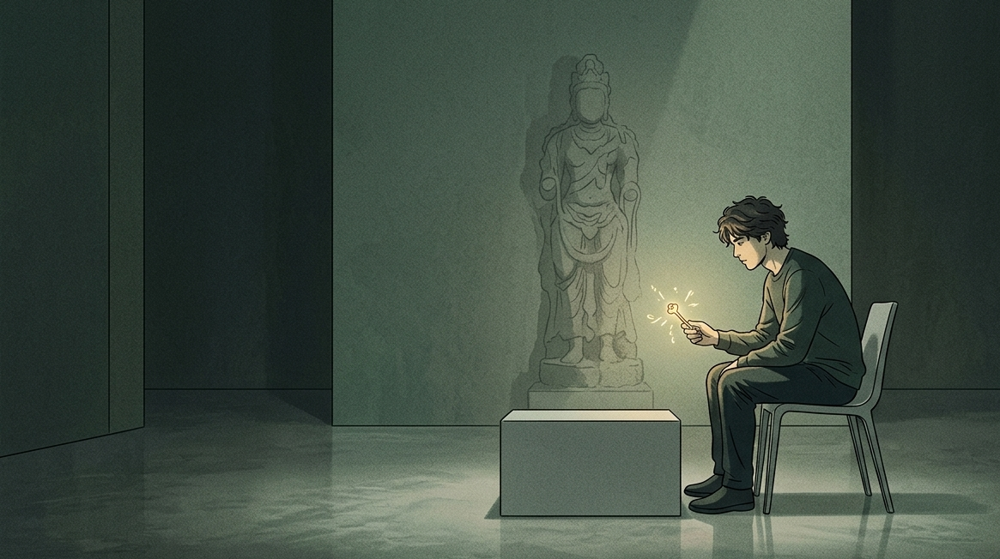
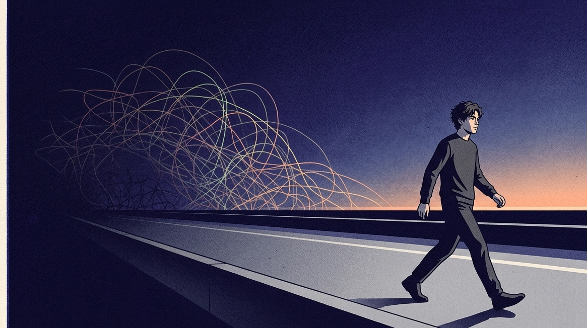

泰戈尔曾说：“如果因为错过太阳而流泪，那么你也将错过群星。”

在量子领域存在一种被称作退相干的说法，而这种说法实际上更能够触动人们的内心。

存在一对曾经紧密相连的粒子。只要它们与周围环境哪怕有一次不受控制的微小接触，它们之间那种特殊的关联状态便会完全消失。之后它们就成为了彼此互不相关的独立个体。

过去的我，特别害怕状态消散。

二十岁左右的时候，我将挚友、爱人以及一同工作的伙伴都视为生活中不可或缺的核心人物。

要是彼此之间的关系存在那么一点细微的缝隙，或者对方的脚步稍微跨大那么一点点，我的心里就会忽然涌起一种喘不过气来的慌张感觉。

为了维持一段名存实亡的关系，我可以在夜里不睡觉，微信小作文写得像答辩论文；

明明知道那个早晚要离开的人是留不住的，我依旧愿意把自己的骄傲碾碎然后吞咽下去，装作自己什么都不害怕、从来不会难过的样子。

在多次遭受欺骗、遭受疏离、遭受漠然对待之后，我蹲在感情的残留痕迹旁边，看着自己手掌上的伤痕，忽然笑了起来。

我抬起头，看见天空完好地在那里。钱包里的钱也没有缺少一分。至于明天还是得依照规定的时间去吃早饭。

我活明白了这个世界最刺骨的真相：

你所当作根基的很多承重墙，实际上仅仅是暂时让你借助力量的支撑架。

在这世间，没有什么是你一定要紧紧握住不放的，也不存在哪一种关系是无法摆脱掉的。

## 所谓的心甘情愿，不过是你在关系里的慢性自我蚕食

从小被灌输的观念，一个劲儿地说要坚持、要始终如一，还有为了维持面子而去做出让步。

要是能够把一段情分一直守护着度过一生，那么这一生才不会白白地来这世间走一回。

听好了，那算不上是长久的深情，只不过是两个人在生活的巨大压力之下，没有办法才退而求其次的无奈凑合罢了。

你仅仅是害怕独自面对冷清的状况，就匆匆忙忙地把人生的控制权交予了另一个同样找不到方向的人罢了。

你以为你在用深情筑巢。

简单来说，就是你在内心之中，任凭他人没有尽头地消耗你的情绪能量。

这就好像把一个能够租出很高价格的核心优质商铺，毫无缘由地借给了一个整天在其中胡乱堆放杂物的无赖。

你将自己最为宝贵的时光以及最为珍贵的精力全部投入了进去。最终对方一转身就去到了别的地方。仅仅给你留下一间连墙皮都已经脱落了的空屋子。

【插入配图1】

**所有让你感到快要榨干自己的留恋，本质上都是你在给过去的沉没成本举行葬礼。**

## 为什么每次面临分别，你都在脑子里把自己的前半生“重审”一遍？

你肯定经历过那样一种分别的时候，心里难受得几乎都无法顺畅呼吸了。

相处了多年的挚友，忽然在微信上变得生疏。我盯着那头长时间不亮的对话框，心里将近三年的聊天片段全部回想了一遍，并且反复地揪着细节自己问自己 。

你心里忍不住去思索，是不是在上个月聚餐的时候没有主动去进行结账，又或者是在昨天刷朋友圈的时候没有给其动态点一个赞相关的情况。

在他说出分开的那个夜晚，我睁着眼睛注视着头顶的天花板。我在脑海之中反复地播放初次见面时候的情景。我总是想要找出一些线索，让自己不那么像是一个被扔掉的人。

你处于充满自我否定的氛围之中，自己将内心那个支撑自己的关键事物给弄丢了。

你就好像是在狂风暴雨之中紧紧握住破旧船柱的水手，却忘记了你自己本来是能够在浪涛里自由自在游动的厉害人物。

那极为强烈的不甘心，如同一间始终存在漏雨情况的小屋。

你蹲在地面上大声哭泣。你伸出手去堵塞漏水的缝隙，那个缝隙早就已经被锈穿了。你忘记了这所屋子从来就不属于你。

**你用最昂贵的灵魂内耗，去挽留了一个早已把你移出高优先级的过客。**

## 系统重构：把所有的纠缠，置换成绝对的个体自主

阿德勒所提出的课题分离，当下并不像是能够治越伤痛的良好办法，反而好像是一场冰冷且刺骨的无情分割。

别人来了又离开了，在没有你陪伴的很多日子里，他们生活得是否顺遂，他们自身的冷暖状况，那都属于他们自身的事情，和你没有任何关联。

你必须紧紧守护住一个区域，那个区域是你情绪的临界之处。

人在三十岁之后，应当学着去接受任何人的离去，这就好像是为自身打造的情绪防护器具。

当一段缘分结束，联系逐渐变弱直至完全消失的时候，需要在心里默默地筑起一道看不见的隔开的墙。

他乐意陪伴你走过那条满是泥坑的艰难行走之路，这样的陪伴就是一种很大的善意。

此刻他正打算从车上下来，前往他自己所向往的远方。这是他自己做出的选择。

把你伸向他人的那根线完全收回，然后扎入你自己的根基之中。

用你那已经看惯了许多变化的眼睛，认真观察那个在不断讨好过程中丧失原本模样的你自身。

试着让自己成为能够独自应对各种不同情况的人。学着去和独自待着这件事情进行和解。将所有的精力都投入到挣钱、锻炼以及提升自己这一些事情上面。

【插入配图2】

**在这个泥泞的世界里，能救你的从来不是什么深情和人脉，而是你随时可以掀桌子一个人走回大雨里的绝对能力。**

人与人之间的相互联系，从本质上来说，是在某一段行程里的同频共振，而并非是一生之中的相互依赖以及相互纠缠。

要是你也决定在自己的小空间当中成为一个充满热情的独自旅行者，那么就点一个赞吧，我们在简洁而明快的人生道路之上分别向着不同的山海前行。