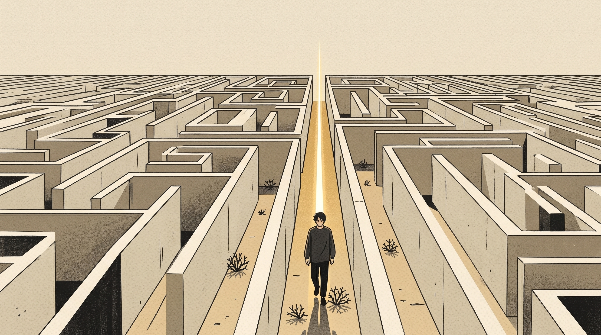
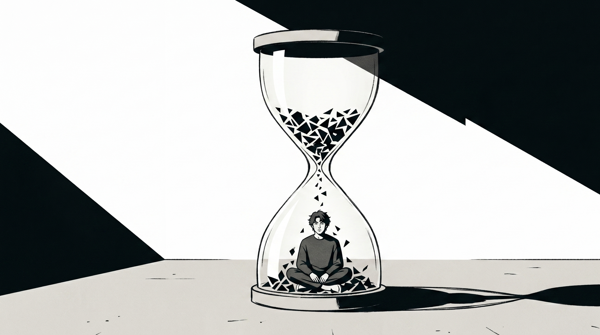
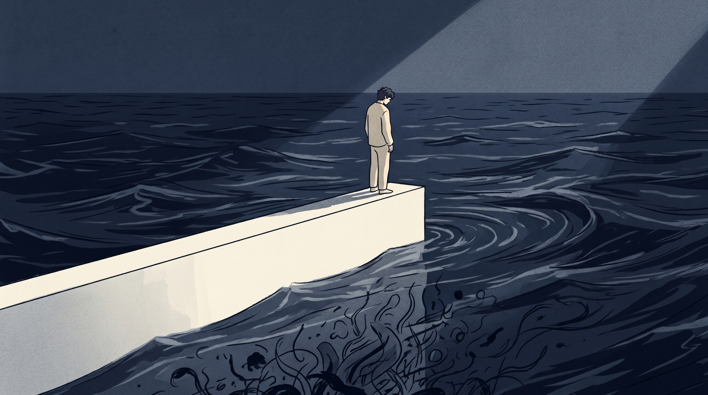

“只要让这个系统不崩溃，有些零件晃荡就随它去吧。”

很多年以前，我将克劳修斯那个大家都知道的热力学定律奉为圭臬。

已故的那位物理学家平静地说，一个封闭的系统，如果不去管它，最终就会变得无序且混沌。

这就是熵增。

在那个时候，为了维持表面的好看，我每一天都在制作一个十分周全的“外壳”。

同事开了一个不恰当的玩笑，我内心十分不舒服，脸上还要勉强露出不自然的笑容。

搭档连续三次没有跟我打一声招呼就修改了我的运营计划。我紧紧地握着拳头，内心对自己说：忍耐一下吧不要因为这件事情而坏了重要的事情。

我曾经觉得这些是没有什么大的重要性的小的事情，就好像窗缝里面的一点漂浮着的灰尘一样，挥一挥手就可以把它弄掉。

存在那么一天，那个实习生没有发出任何声响就使用了我的计算机，这成为了压垮我的最后一根稻草。

午后十分平常，没有任何预兆。我的脑子如同一个装满闷热气的高压锅，在那个时候完全崩裂开来。

我缩在写字楼的消防通道里面，哭得如同一个丢失了糖块的孩子一样。

直到在那一个瞬间，我才突然明白，世界上根本不存在那种毫无一点预兆就情绪崩溃的事情。

一件又一件令人心里不痛快的小事，在没有察觉的时候，把你的精神和力气都消耗殆尽了。随后就出现了很多失去控制的崩溃状况。

## 忍耐不是美德，那是你在给灵魂不断喂毒

在从小所接受的教育当中，始终将宽厚以及体谅看作是最为宝贵的奖励。

你会觉得，为了那几句带有讽刺意味的话语、一个让人内心烦躁的眼神而一直进行计较，实在是很不豁达。

那怎么能算作是恰当的标准？那只不过是你在潜意识里存在的胆小，还披着礼貌的外衣来做一些事情。

你总是担忧会发生冲突，担忧打破那看上去安稳的表面。于是你一次又一次地如同潮水退去那般，将自己的底线越缩越往后靠。

每一次你对自己说出“着吧”这句话的时候，自己的勇气铠甲就会逐渐地被一层一层地剥落。

你当时没有制止的很多越界行为，没有让事情过去。它们只是潜藏到你意识里不突出的地方，变成了散发着臭味的烂泥。

你所认为自己熬过的仅仅是平常的事情，但是实际情况是，那就是自己往心里倒入了一杯慢性的苦酒。

【插入配图1】

如果我们连最微小的刺痛都要靠钝化神经来忍受，那我们和一块麻木的砧板有什么区别？

**你对不舒服的小事越宽容，你对自己的人生就越残忍。**

## 每一个深夜在脑子里开庭的瞬间，都是在给慢性自杀剪彩

你一定太熟悉这种场景了。

白天在刷微信的时候看到了一句让人感觉不愉快的回复，我当时只是简单地回复了一个“行”字。

夜里一直熬到了十一点，刚刚躺到床上，那两个字就突然冒了出来，就好像没有关闭的闸门的洪水一样，一个劲儿地在脑海之中冒出来。

你的脑子如同一个始终不停转动的小齿轮，一直在那里不断地转动，完全停不下来。

脑海中那个画面不断地旋转。在事情结束之后才想到一连串当时应该回击回去的解气话语。

越想心里越是感到生气，心里一直感觉很堵，心脏在不停地突突跳动，忍不住在心里骂自己：当初怎么会那么没有用。

这一种感觉，就好像是守护着一间老旧的房子一直在渗水，同时手中还拿着一个存在裂缝的陶瓢。

你不要觉得自己仅仅是在翻旧账。仔细想一想，是他人越界的行为打乱了你的睡觉节奏。

白天没有得到解决的小矛盾，到了夜晚如同缠绕在身上的湿棉絮一样，默默地消耗着人的精神，整个人都感觉到十分沉重。

**所有的深夜内耗，不过是你在为白天丢失的边界买单。**

## 建立你的底层“个人政策清单”

若想要终结这种默默的内耗，就需要把守住自身的边界，并且让守住边界深入到自身的骨子里。

其他人是否会因为你拒绝而产生情绪，那是他们自身的事情，和你没有任何关联。

每一个人都必须坚守内心之中那一片安稳的状态。不要让周围的人和事情将它扰乱掉。这实在是一辈子当中最为重要的事情。

你需要将自己视作严格遵守规则之人，为日常的生活设定一条不可跨越的界限。

从当下时刻起始，为自身构建起防护的网络。只要存在不好的苗头刚刚开始出现，就立刻在其初始阶段将它予以消除。

【插入配图2】

### 动作：微型边界重构

超好用的人际相处小技巧到来了。

第一招拉开情绪的安全距离。当听到不好听的话语的时候，悄悄地往后退一小步。利用物理上的距离来隔开负面的情绪。

第二招开启类似“复读机”一样的回应方式。不要发火看着对方的眼睛，用平稳的语气把冒犯你的原来的话语抛回给对方。例如“你刚才说我的方案像是小学生写的？”

第三招，把问题抛回到对方那里。不进行辩解也不着急自我证明，留出几秒钟的沉默时间。等待对方陷入尴尬之后主动来进行圆场。

第四招强制进行冷静的缓冲。碰到拿不准要不要回复的消息，直接把手机锁屏十五分钟。去喝一些水或者进行深呼吸，依靠短暂的放空让大脑重新变得清醒。

即使是日常生活当中很多零零散散的小事情，你也可以把它们处理得规规矩矩的，很多让人心里不愉快的烦心事自然就会悄悄地离你远远的。

**真正的强大不是能忍受多少侮辱，而是从一开始，就不给侮辱留下一毫米落脚的缝隙。**

生活不会总是让你处于那种光鲜体面的戏剧情境当中。生活是你需要竭尽全积极奔赴的现实试炼。

将温柔与体谅给予很多真正能够理解你并心疼你的人。对于很多扰乱人的心绪的细碎烦恼，应该尽早将它们梳理清楚。

要是你觉得我所讲述的内容符合你的喜好，那么就不要忘记去点击关注。

当你在深夜里翻来覆去无法入睡且心里感觉杂乱无章的时候，要明白我也曾经有过很多令人难受的时光。我会陪伴着你把那如同一团乱麻般的思绪一点一点地梳理清楚。