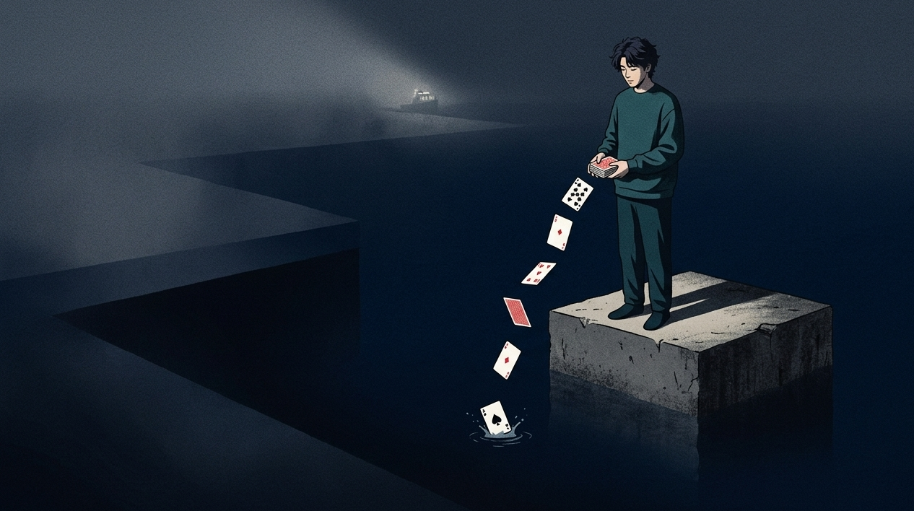
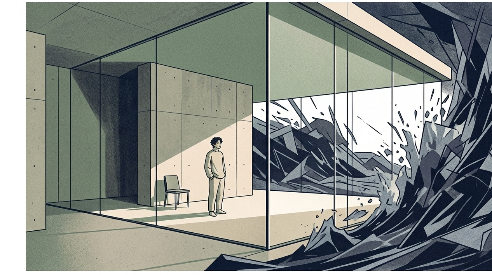
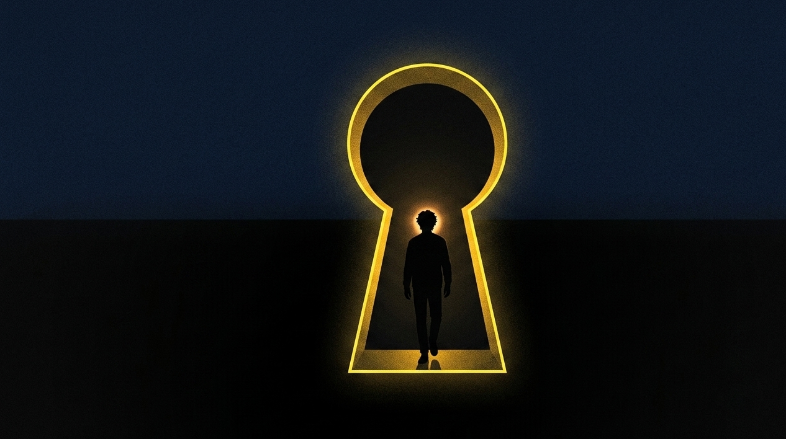

“如果一个系统是封闭的，那么它终究会走向最大程度的无序与混乱，这就是热力学第二定律的熵增。”

我很早就吃过这个亏。

那时候刚刚有了一点小的进展，特别想要把日常的琐碎事情以及满心的期待全部放到朋友圈当中去，就好像一个盼望着长辈夸赞一下的小毛孩一样。

结果呢？

等了又等，所等来的并非是众人的欢呼与叫好。所等来的是在那暗流的里面，存在着许许多多的漩涡。

暗处存在着有人在想着你的退路，身后存在着有人在偷偷嗤笑着，就连身边最为亲近的人，也正在用让人无法看透的目光来打量着你。

在那一个瞬间，我才突然察觉到，将自身毫无保留地呈现出来，如同把心灵小屋的屋檐予以拆除，而后狂风暴雨便这样径直地涌入。

## 你以为的分享，在别人眼里只是底牌的泄露

不要再提及所谓的掏心掏肺那一类说法。在成年人所身处的圈子当中，最不可以去做的事情就是毫无保留地把自身完全展现出来。

那所谓的率真又随意不过就是你心里满是不安并且还盼望着被人关注自己在那里自我陶醉罢了。

心理学领域存在一个被称作投射性认同的概念。当你把自身的状态全部甩向周边环境的时候，实际上就是将对自身能量的主导权交送出去了。

你展示了一张在凌晨时分熬夜进行加班打卡的图片。

真正懂你的人实际上数量并不多。但是在不经意的时候，同行就已经了解到你手头的忙碌程度。领导也察觉到了你还能够承担更多工作的限度。

你发了一段对生活的迷茫感悟。

有的人会紧紧盯着你的缺点不放。很多心怀嫉妒的人，更是将此当作在聊天时用来打发时间的话题。

【插入配图1】

当那神秘的箱子被掀开的那一个瞬间，那只处于混沌状态的小猫才会转变成为明确的形态。

你的状态也是这样。要是你不说话，在这场较量之中就始终存在着无限的变化以及机会。

**永远不要底牌尽出，你的神秘感，才是你最坚固的护城河。**

## 那些在深夜里，反复为一条朋友圈开庭的窒息瞬间

每个人都有过那样的时刻，全身都感觉不舒服，坐着不合适，站着也不合适。

我经过仔细地琢磨而形成了一段文字，并且还搭配上了一张图片。这张图片表面看起来比较随意，实际上滤镜被调整了三次。

点击发送。

在接下来的一百二十分钟的时间范围之内，你的手机如同一个处于闷烧状态的压力锅一般。你的大脑转变成为了进行终审裁决的所在之处。

每间隔五分钟的时间把屏幕点亮，查看那个红色圆圈里面的数字是不是有往上升的情况。

“为什么他给别人点赞了，却漏掉了我？”

“我是不是刚才那句话说得太高调了，别人会不会觉得我是在炫耀？”

你在内心当中不断地与自己较劲，越思考就越感到懊恼，最终满心都是苦涩并且还带着尴尬，悄悄地把内容设置成为仅自己能够看见。

你看，这就是信息反噬。

你最初期望借助分享来贴近世界，但是最终却被他人有或者没有的回应所束缚。

自我进行消耗如同一间一直存在渗水情况的屋子。你在屋子里面费力地向外淘水。却完全没有察觉到，最开始是你自己把玻璃敲碎的。

**把幸福的定义权交在别人手里，是世上最赔本的买卖。**

## 课题分离：在自己的世界里独舞，在别人的世界里闭嘴

阿德勒在《被讨厌的勇气》当中表示：人与人之间所产生的摩擦，要么是存在着有人跨越界限去干涉别人的事情，要么是自己所拥有的事情被别人进行过度的干涉。

把日常进行分享出去，那实际上就是在默认别人来对自己的生活进行评论。

如果你想要摆脱那种令人喘不过气来的压抑感觉，那么你就需要将自身的精神状态完全重新进行塑造，并且要学会清晰地划分与他人之间的界限。

你日常生活当中所具有的烟火气息，你获取钱财的计划，你心情所出现的波动，全部都是你自身的人生问题，其他人没有办法参与其中。

别人对你是羡慕还是期望，是误解还是认可，那都属于别人的事情，你没有任何可以参与的机会。

### 动作：构建个人信息防火墙

实用的社交小窍门如下：其一马上关闭朋友圈中“允许陌生人查看十条内容”的设置，将动态能够被人看到的范围设定为三天或者半年。其二先暂停进行分享，无论是当下的情绪波动还是有一点小的成就，先在心里放置满48个小时，要是过了这么长的时间还想要分享，到那个时候再发送也不晚。其三为自己打造一个专属的秘密角落，很多没有地方诉说的感受、期望、脆弱等，都记录到只有自己能够看到的本地记事本中。其四在社交平台只分享有用的干货或者客观的信息，绝对不发布带有个人主观情绪的私人动态。

【插入配图2】

当你不再把精力花费在外面很多杂乱无章的事情之上，而是转而趋向于专注地向自己内心里面进行沉淀，你便会察觉到内心的正向动力正在悄然地重新开始启动。

真正强大的人，拥有着不需要向他人解释任何事情的自在状态。那是一种从容的状态，彰显出强者的样子。

**真正的狠人，都把自己活成了静水流深。**

---

生活并非是所有人都在关注的综艺节目。不需要见到每一个人就向他人絮叨自己的日常生活。

把嘴闭上，把事做好。

你处于寂静的地方，静静地伸展自身的枝条，努力地向上生长，直到枝头挂满沉甸甸的果实，那份触动，原本就不需要用任何话语来进行修饰。

请给我点一个赞吧。我们每个人都在坚守着自己所拥有的那一小片区域。生活得明白并且自在。