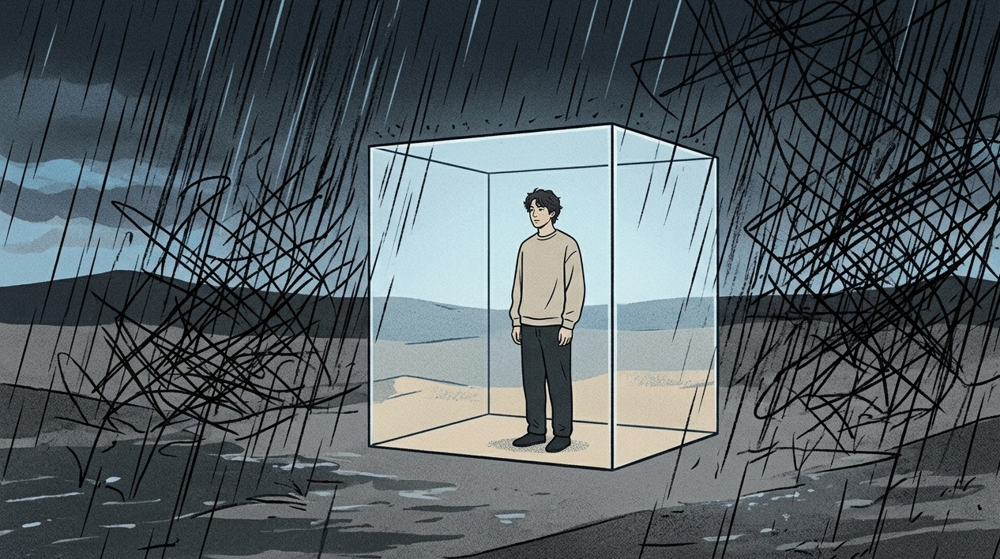

薛定谔曾经说过，生命的本质是持续地从周围的环境当中获取能够抵消混乱状况的有序能量。

简单来说，人生活在世界上，就是一场与无序乱象进行艰难抗争的战斗。

年少的时候，我总是觉得朋友数量多是一件非常了不起的事情。那时候的我每天忙碌得就像一个不停地转动的陀螺一样，脚都不沾地了。

谁不高兴了，我秒回微信。

谁有怨气了，我跟着自责。

有朝一日，我发觉自己仿佛是一个始终在漏雨的纸箱子。

四周的各处地方都存在着裂缝，我紧握着带有缺口的小铁勺，持续不断地向外舀水。

水没少，我先溺水了。

那股让人喘不过气来的压迫感最终使我清醒了：我根本不是在爱某个人，而是在耗尽自己，去换取一张能够让我安心的入场券。

## 情绪高压锅炸裂之前，先切断别人的引信

你自认为自己是怀有善意的。从荣格的心理层面来看，那有可能仅仅是你内心深处所潜藏着的阴暗情绪。

仅仅是一味地迁就并不是真正用心去对待，这是一种裹着糖衣的情感强迫行为。

你在内心暗自构思好了情节，期望自己默默的承受能够换来对方的心疼。

那哪里能算得上是体谅，实际上是你在一味地迁就之中惯养出了一个长不大的孩子。

人与人相互交往的关键之处，并不是借助降低自身的姿态去维系和谐的关系。

从心理学的角度来看边界划分这件事情，简单地说就是在人与人相互交往的时候各自承担属于自己那一部分的事情。

【插入配图1】

他人的喜怒哀乐、闲言碎语以及目光的投向，那仅仅是属于他们自身的事情。

你是否愿意去表达拒绝，事情是否符合你的心意，你是否处于开心的状态，这些才是属于你的生活空间。

你连自己的主权都守不住，还妄想去当别人的救世主？

**把你身上的传感器关掉，你才能听见自己骨骼拔节的声音。**

## 键盘上的每一步退让，都在给自己的心理开庭

你一定太熟悉这个场景了。

微信的提示音忽然响了起来，你的心里立刻就变得紧张起来了。

对方说“在不在”的时候，你内心就会自己去想象出很多相关的情节。

刚拒绝了他人之后，连续有长达三个小时的时间，我在内心不断地责备自己，心中全部都是愧疚之感。

“我是不是太自私了？”

“他会不会讨厌我了？”

这就是典型的课题越界。

当你将车辆行驶到他人的私人土地之上时，那么你就需要花费钱财去帮助人家将道路修缮完好。

你每天在内心之中持续不断地进行着类似于审判的事情。你一会儿好似处于被告席上的那个人，一会儿又仿佛是敲击法槌的审判者。最终被判定终身禁锢的依旧是你自己。

你活得像个情绪的搬运工。

总是把他人的所有烦心事都往自己心里装，最终就成为了装满忧愁的“情绪回收站”

**每一次违心的“没关系”，都是在对自己说“去你的”。**

## 建立底层操作系统，在自己的地盘里受力

心理学家阿德勒曾经说过：所有的困扰产生的原因是人与人之间存在着相互的关系。

要寻得破局的方法，不可以消极地回避尘世，而是要尝试着为自己多营造几个能够起到支撑作用的地方。

不要再借助他人的回应去确定自身的价值。

打个比方来说，如同一座房屋，不能够仅仅依靠一个被称作“讨好他人”的房梁来进行支撑。

你期盼着风也期盼着雨，还得生长出能够承受得住所有事情的坚硬骨头啊。

从当下这个时刻起，开启你自身所拥有的专属防护屏障吧。

谁让你心烦这件事，那是属于他的事情。你选择抽身离开，这是属于你的权利。

【插入配图2】

不要去承接很多被抛过来的负面情绪所带来的麻烦事情。

让它们朝着飘过去，之后将其钉在墙面上，或者使其弹回到原来所在的地方。

你就停留在那里，不要让其他人察觉到某些情况，要保持头脑处于清晰的状态。

■ 实用操作指南：

①将微信消息的回复设置调整为在半小时之后再进行回复，从而改变马上就回复的习惯。
②在拒绝他人的时候，就阐述实际的情况以及明确的结果，不要找寻借口、胡乱编造理由，也不要过于啰嗦。
③每天在内心之中默默念诵三遍：这和我有什么关联，那和你有什么关联。
④为自身制作一份情绪清单，要是陷入了内耗状况，马上停止与相关人员的眼神交流以及对话。

**真正的高手，早就把自己活成了局外人。**

别指望所有人都会为你鼓掌。

你又不是糖，没有办法让所有的人都喜欢你。

还有，很多需要你放低自己的姿态去维持的情谊，从一开始就仅仅是虚幻的东西。

他们所关注的并不是真实的你。他们所关注的是你对他们言听计从的那种状态。

当你尝试着去把拒绝表达出来的时候，你会发现，天实际上根本不会像你所想象的那样出现崩塌的情况。

相反，只有很多在内心深处重视你的人，才会自己主动朝着你靠近。

想要了解如何破解深层情绪内耗？请点个赞吧。在评论区留下您的言论吧。资深玩家继续带领您在人际场合中轻松实现突破。