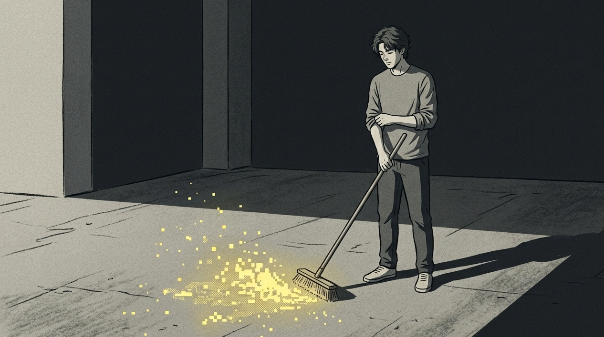

## 人类最为荒谬的超能力，是能够在脑海中进行无需成本的庆功宴。

我在二十来岁刚在职场担任主管的时候，也存在这样的毛病。

每一天晚上躺在床铺上，闭着眼睛，脑海里全是自己弄出所谓现象级爆款、上台接受奖项、被同行疯狂转发的画面。

---

多巴胺在不断地分泌，我感觉自己好像有点缺氧。

第二天闹钟刚刚响起的时候，看到空荡荡的文档，我连第一个字都无法敲进去了。

在那个时候昨晚那个完美的自己，反而变成了一个大的监视器，冷冷地嘲笑我眼前的笨拙。

科学界把这叫做“享乐适应的反向吞噬”，用《道德经》里的话来说就是“踮脚站不稳，跨大步走不动”。

你把能量都预先支取给幻想了，现实中的每一步就好像踩钢丝一样。

---

别装作一副无所谓的样子，那哪里能算作是什么野心，不过就是你给现实注射的麻醉剂罢了。

有很多人觉得，过度地幻想成功就是自己“有追求、有格局”。

其实这是不对的，那根本就不是野心，仅仅是你大脑在偷懒罢了。

从事内容矩阵搭建、进行运营工作的人是最清楚这个底层逻辑的。

大脑特别地贪婪同时又很小气，它没办法区分开“真正把事情做成”的快乐和“幻想把事情做成”的大脑产生的那种高潮感觉。

当你在自我幻想当中把豪车豪宅、粉丝数量达到百万的剧情都演绎完毕，你的潜意识就会想：“，我已经享受过这种快感，那么现实当中很多令人觉得恶心、琐碎的苦差事，我就不去做”。

这就好像你还没有进入厨房，就在脑海里把满汉全席都吃光了一样。

---

当你真正面对那盘需要清洗、需要切割并且还冒着油烟的生肉的时候，就会觉得恶心和反胃。

【插入配图1】

把它幻想成逃避平庸现实的避风港。

你以为是在为未来积攒力量，实际上是用高浓度的主观鸦片，麻醉当下变得糟糕的行动力。

---

每一个夜晚，脑海之中反复地“开庭”，都在消耗你次日的负熵。

去还原你某一个令人窒息的周日晚上。

你狠了狠心明天要开始做新账号的复盘，或者撰写拖延了半个月的策划。

之后完美主义与幻想狂热交叉感染。

你开始思索：第一篇得一下子走红，开头得让人眼前一亮，排版得是全网最酷的。

连续爆火之后怎么回复评论、怎么洽谈商务，你也在脑海里“审理”了一遍。

---

这个过程是否畅快？那可真是畅快。

但是代价是你精神上的混乱在这个过程中彻底失去控制了，就像快要爆炸的高压锅一样。

第二天早上看着空白的屏幕，“要是写作失败了该怎么办”这种恐惧一下子就将你击垮。

你无法忍受现实中写出糟糕初稿的自己，害怕玷污了脑海里那完美的形象。

然后你就转身去刷短视频，要不把桌子擦拭三遍，接着用拖延来维持那虚幻的脸面。

你不是没有能力，你是被自己脑海里的“超完美的自己”给欺负了。

---

头脑之中想着很好，现实情况里却无法前行。

这是完美主义者的秘密自我伤害行为。

那该如何解决？

学习一下薛定谔的负熵理论。

想要让系统不混乱，需要从外部引入确定性。

那么你可以在自己个人的规划里添加一条规定：允许自己如同一个大笨蛋一样开始。

---

不要总是去思索什么所谓的爆款内容，也不要老是去探寻行业方面的终极解决办法。

把目标从“我想要打造出一个非常厉害的产品”，降低到“我今天必须要产出大量质量不佳的东西”。

当不尝试去契合脑海中那完美的设想时，你和当下的这种对抗也就消失了。

去实施“垃圾初稿”的策略。

实用的操作指导如下：

① 每天固定花费二十分钟的“纯粹输出低质量内容的时间段”；

② 在这个时候不要进行任何形式的修改，就连错别字也不要去修改；

③ 关闭所有的数据反馈提示声音，把“完成的程度”当作主要的任务；

④ 告诉自己，今天只要整出一大堆质量很差的东西，就算是取得了胜利。

---

【插入配图2】

将“成功之后的我”和“现在的我”完全地分隔开来。

成功的他是未来所获取的东西，当下的你只需要一点点地投入。

不要去讲很多大道理，去应对眼前具体的小事情。

现实或许就像一个老是进水的屋子，但是握着抹布的人，比闭着眼睛幻想晴天的人更加清醒、更加有力量。

去尝试一下吧。

今天只要写出一个差劲的开头，把脑子里那个指手画脚的假权威给打败。

要是觉得说到你了，就点个赞，或者在评论区说说你今天要处理的“第一波糟糕的事情”。