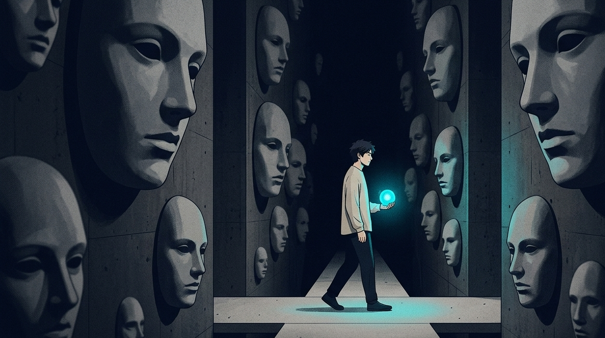

叔本华曾在《人生的智慧》里写道：“大众的头脑是很难容纳真正的幸福的，它就像一个喧闹的集市，里面充斥着虚荣和嘈杂。”

物理学里有个概念叫热寂。

在一个完全封闭的系统当中，无序的状态达到了极致。所有能够被利用的能量都呈现出乱糟糟的混沌状态。整个系统就这样完完全全地陷入到没有一点声响的停滞状态之中。

过去的我，好像是一滩完全没有了生机、再也不能激起浪花的死水。

三十岁之前的时候，我如同街边没有被人管理的报刊亭一样。任何路过的人都可以过来对我进行一番评头论足。

老板随口一句“最近状态一般”，我能把简历翻出来修改到凌晨三点；

长辈不经意间说出“都已经这么大年纪了怎么还没有购买房子”这样的话语，此时我嘴里正在吃着的酱烧肉，立刻就变得如同难以吞咽下去的干柴一般。

我如同一个被精心制作的牵线玩偶。很多彼此之间并不认识的人手中握着线绳。他们只要稍微动一下，我就必须在台上表演滑稽的闹剧。

在我经历了几次碰壁的情况之后，我将很多束缚住自身的虚浮执念全部摒弃掉了，这时候才清楚了这世间最为实在的道理。

## 所谓的情商高，不过是你把评议权双手奉上

在我们还小的时候，我们被教导要去考虑身边每一个人的心情。

随和、贴心以及能够听从他人的劝告，已经转变成为保护自身的柔软铠甲。

别欺骗你自己了，那根本不算是会说话，实际上是你自己亲手把自我保护的铠甲给卸除了。

你将你自己应当掌握的裁决权力，毫无意义地移交给了法庭外面很多一边嗑着瓜子一边观看稀奇事的人们。

你总是觉得自己正在积累着人情世故，并且维持着那种表面上看起来还比较体面的人际之间的交流互动。

简单来说，你就是在你自己那很小的区域内，为很多和你没有太多关联的人修筑了许多可以随意让人踩踏的小路。

这就好像把一辆经过精心调整的赛车交给连方向盘都没有摸过的外行，让外行在烂泥地里胡乱地进行驾驶。

他们在闹完之后就转身离开，只剩下你面对着散落的破损零件，以及到处都是的脏泥而发愁。

【插入配图1】

**你不需要满足所有人，因为大部分人根本没有脑子来真正理解你。**

## 为什么你总是在别人的眼神里“凌迟”自己？

你肯定有过那么一次，心脏突然就好像被紧紧地揪起来一样。

刚发布的朋友圈，在过了半个小时之后才收到两个赞。心里不由地想着，是不是自己太过矫情了。随后指尖颤抖着，点击进行了删除操作。

我走过相邻座位处的同事身旁，看见她正与他人凑到一块儿，头挨着头在说笑。当她的目光掠过我时，我的全身汗毛忽然就竖立了起来。

你在心里反复思索，是不是在前一天进行工作交接的时候不小心打错了标点符号。

你如同一个始终处于满负荷工作状态的探测器，对于风里飘过的细微绒絮，你都要去嗅探出其中是否存在恶意的成分。

如同把心悬挂在市井肉摊的铁钩之上，就是这般攥得过于紧的在意便是如此。

每个人都用带着审视的目光去端详它，甚至还用指尖去捏一捏，以此来查看肉质是否鲜嫩 。

你将自己最为珍贵的人生精力，用来填补对于陌生人而言没有太多意义的闲暇时光了。

**人际内耗的底层逻辑，是你用自己的尊严，去治疗别人的教养缺失。**

## 系统重构：在这个世界上，你只需要向两个人交代

如果一个人的精力是有限的，那么就需要把很多没有用处的路径全部封堵起来。

阿德勒所提及的课题分离，在当下这个时期，是能够最为快速地梳理清楚很多错综复杂状况的方法。

在这个世界当中，你必须认真地去对待、用心地去照顾的，从根本上来说也就仅仅是那么两个人罢了。

当下存在着一个此时的我，同时也存在着一个在前方道路之上的我。

除了那另外的两个人之外，其余人的评判、期望，以及很多把“为了你好”当作借口所说出的话语，都如同飘荡在你世界外部的嘈杂声音。

需要把别人的看法和自身的生活花费完全进行区分。

别人对你的看法就是其自身心里的主观反映，那是其认知里尚未消除的偏见。

你是否能够安稳入睡，是否拥有实实在在的收获，这是你绝对不可以舍弃的底线啊。

把所有拉住你前进脚步的手全部予以砍断。

不要再去留意他人的脸色了。来看看那个你已经很长时间没有关注、最需要被疼爱的自己吧。

### 动作：构建你的人际“负熵防火墙”

■ 实用操作指南：① 启动“关我屁事”过滤机制，凡是不给你发工资、不陪你度过低谷的人，他们的评价一律归类为无效噪音。② 设立“24小时冷冻期”，收到负面反馈时绝不当场自省，把情绪放进冰箱冻一天再看。③ 实施“关注力配额制”，每天只把10%的精力分给社会社交，剩下的90%留给搞钱和睡觉。④ 撰写“双人法庭日志”，每天晚上闭眼时只问自己两个问题：今天的我满不满意？明天的我会不会感谢今天的决定？

【插入配图2】

**钝感不是麻木，而是你终于明白，狗叫的时候，人不需要跟着一起回头。**

你当前所进行的活动和你之后所呈现的状况存在直接的关联，其中不存在多余且复杂的情形。

如果你对于总是在别人的故事里充当配角也感到厌烦了，那么就点一个赞吧。我们在极简的道路上，于顶尖之处再相互遇见。