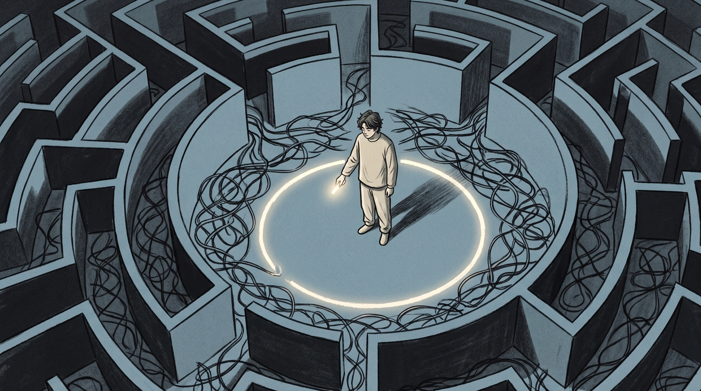
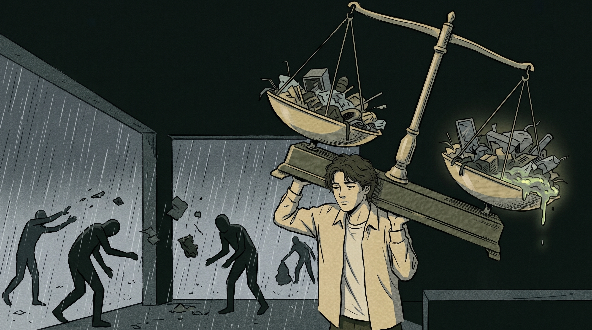
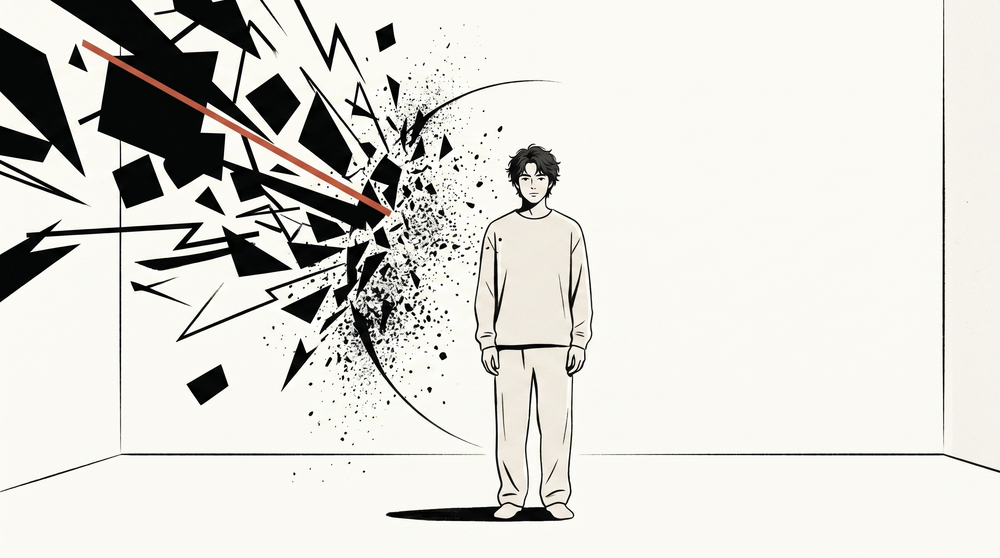

德国哲学家叔本华说过：

“人性一个最特别的弱点，就是过分看重自己在他人眼中的形象。”

在三十岁之前，我常常将他人抛来的情绪当作需要自己去应对的麻烦事情。

老板皱了一下眉头，我在心里反复思索近三个月里出现的疏漏之处，一直思索到后半夜。

当好友说出带有一些不满情绪的话语时，我就会控制不住地去思索，是不是自己并没有达到非常贴心和周全的程度。

那种感觉，就好像是在最为寒冷的冬季穿着一件被水完全湿透了的厚重棉衣。

感觉到沉滞、潮寒、黏糊的状态，怎么都无法将其摆脱掉，并且还伴随钻心的凉的感觉。

直到我快把自己耗干了才活明白：

总是去承接他人的负面情绪，还傻乎乎地责怪自己没有做好。

## 别把别人扔过来的垃圾当成了自己的勋章

许多人所提及的高情商，实际上是一块充分吸满了人情世故的软海绵。

你以为你在体恤别人。

他人借助他们片面的观点来扰乱你那平静的小小世界，而你却在听任这样的情形发生。

要是存在有人持续地对你进行挑剔，说你仅仅只是只顾自己、不善于与人合群，又或者说你做事没有条理相关的情况。

那根本不是对你的客观评价。

那仅仅是他内心所怀有的慌张、无力以及想要抓住一切的执念，只是没有地方去释放罢了。

他就这样做了。他看准了你内心容易心软这一点。之后他如同泼洒脏水一般，一下子把所有的脏水都泼向了你。

可你却还把很多破旧的东西小心翼翼地捡起来，擦拭得非常干净，之后像对待宝贝一样挂在胸口进行炫耀。

【插入配图1】

你总是觉得将自己完全改变模样，就可以让他喜欢。

不，那只是个无底洞。

要是你越是愿意去应对，他就越是习惯把全部的情绪都扔过来。

**你不是承接情绪的垃圾桶，没有义务为别人的内心残缺买单。**

## 你的心里是不是也住着一个疲惫的法官

你有没有过这种窒息的时刻？

微信的提示音一旦响起，心里就会没来由地突然一揪，紧接着就会马上想要迅速地去回复。

就担心会慢上那么几秒钟，对方会在心里悄悄地降低与你的亲近感的等级。

他坐在办公桌之前，拒绝了一件原本不应该由他来做的琐碎事情。

在接下来的三个小时里，你的心情如同正在经历一场没有尽头的内心争斗。

你是作为原告的一方。同时你也是作为被告的一方。你所背负的罪名是表现出淡漠并且疏离的状态。

你连呼吸都故意放轻，生怕别人觉得你在混日子。

这种高压锅快要炸了的内耗，到底在折磨谁？

你总是把他人的看法当作判断自己能否好好生活的唯一标准。

但你不要忘记，那个坐在审判席上的法官，实际上是一个装模作样的空有其表的人。

**天天在心里自我开庭的人，永远等不来无罪释放的判决书。**

## 课题分离是抵御一切情绪寄生的顶级负熵

存在这样一种规律，有系统被完全封闭起来，与外界没有任何能量交流，这样的系统只会朝着一个方向变得越来越没有秩序，这就是通常所说的熵增现象。

你的内心之中所拥有的安全感正在逐渐地消失不见，这仅仅是因为你让外界的很多负面情绪进入到了你的生活当中，从而使得你的生活被搞得一团糟。

若想要重新拥有踏实的感觉，就需要主动地对生活进行减法操作。简单地说就是清晰地划分出彼此之间的界限。

把不属于你的很多杂事，就好像摘除毒瘤一样，从你的日常生活当中完完全全地剥离出去。

记住一个最简单的判定标准：

“这件事情的后果，最终由谁来承担？”

要是那是他的心气、是他的体面、是他的怅惘，那么这就应当是他独自去面对的关卡。

### 动作：拉起心理防御的铁丝网

日常实用的小技巧现在到来：①要是有他人用话语来贬低你，那么心里就思考这是对方自身的情绪相关事情，和自己并没有什么关联，要赶快从那种负面的氛围当中抽离出来。②当遇到过分的要求时，身体处于放松状态但是眼神保持坚定，用平稳的语气说这并不在自己的工作范围之内，不需要额外地进行解释或者道歉。③在拒绝别人之后，马上把注意力放置到具体的小事上面，比如翻几页书、喝一口水，不要让自己陷入到自我纠结的思绪当中。④每一天在睡觉之前，在脑海里整理情绪，把白天别人传递过来的负面情绪进行打包，想象着全部扔出窗外。

【插入配图2】

不要去关注他人的私人事务，也不要让他人来扰乱你的生活。

把界限划清楚。

你会发觉，天并没有如同你所预想的那样崩塌下来。而周围的环境，则是处于安安静静的状态之中。

**守住自己的边界，让别人的情绪留在他自己的世界里。**

你需要接受他人对你的错误理解，同时还要能够容忍他人对你的疏远。

这才是最高级的自由。

当接下来某个人打算将他自己的不安转移到你的身上的时候。

我面无表情地看了他一眼，内心默默地思索：那是属于你的麻烦事情，我并不想要去管。

要是你也曾经在费积极迎合他人以及跟自己较劲儿的状况当中，红着眼睛踏过了很多坑。

请关注一下。我们一同在这杂乱无章的生活当中，稳定地积累属于普通人群体的踏实感受。