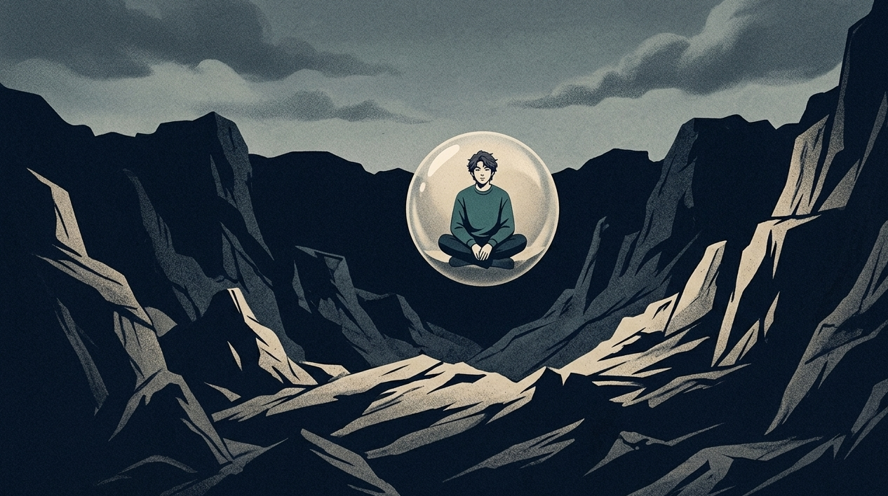

叔本华说过：“所有的欲望都源于缺乏，而幻想则是试图在沙滩上建造一座不倒的城堡。”

当刚刚跨越二十岁那个界限的时候，我的心里满是没有依据的胡乱思索。

每一天待在床铺上，就会控制不住地在内心去构思一场与过去达成和解，或者是瞬间就实现逆袭获取成功的那种热闹的场景。

那感觉就像是在深冬的时候，饮用了一口既呛人又便宜的烧酒。喝下去会有灼烧的感觉，还能够让人在暂时的时间里处于昏昏沉沉并且感觉麻木的状态。

过了很长时间我才明白，心里总是反复思索各种情况，那根本不是想象力过于丰富。

生活之中，心灵碰撞到遍体鳞伤，之后便寻得一处能够躲避风雨的所在躲藏起来。

我们运用虚构的甜蜜，去填补年少时期或者过去那一段昏暗且空空荡荡的时光。

## 每一个粉红色的泡泡，底下都藏着一把没拔出来的刀

很多人持有这样的看法，认为爱做白日梦是一种没有太大重要性的空想相关的情况。

那根本就不是一个充满生机且丰富多样的精神世界。

那是你在目前的生活当中的一种悄然脱离。

当你遭遇到梳理不清的矛盾、无法做出的约定，以及无法逃避的怯懦状况时，你的大脑便会自行启动切换机制。

去制造一个完美的平行宇宙。

在那个所处的地方之中，你做事情非常顺利，所有人都对你怀有喜欢之情，所有的不愉快都消失不见了。

就好像在眼看就要炸开的压力锅外面涂抹一层柔和的粉色油漆一样，存在着这样一种精巧的情绪掩饰情况。

要是在脑海之中更多地沉浸于那虚幻的快乐，那么在现实当中向前行进的劲头就会相应地减少一些。

你将想象当作保护自身的东西，最终却成为被困在内心那个笼子里最为听话的囚徒。

【插入配图1】

**你以为是在滋养精神，其实是在用高纯度的精神鸦片给创伤止痛。**

## 你在脑子里反复开庭，却在现实里当场哑火

你肯定会遇到这样的瞬间，在这个瞬间里会立刻感觉到心里非常堵得慌。

在白天的时候，毫无缘由地被自己的上司训斥了一番，或者被自己的好友冷落在一旁，你在那个时候就勉强挤出一个恰当的笑容。

晚上在回到自己的家中之后，刚刚往床上躺下去的时候，脑海之中那严肃的庭审就正式地开始了。

你的心里开始产生一些不切实际的想法：自己变成可以和众多人进行辩论的人，运用极为厉害且极为有条理的话语让对方没有话语可以回应。

你竟然将对方脸上那种又惊又臊的神情完全一样地复刻了出来。

你的心里存在着由报复所带来的那种畅快之感，这种畅快之感使得你的心猛然跳动起来，你抑制不住地在暗处抿着嘴偷偷发笑。

可是第二天闹铃响起之后，你拉开门。看到依然是杂乱无章的环境，在这个时候你才发觉，自己竟然连与对方对视的勇气都丧失了。

内耗如同一扇无法关紧的窗户，寒冷的风总是不断地往心里吹进来。

你不仅没有将水龙头拧紧，还停留在溢出来的水里面，心里想着自己仿佛拥有了一艘豪华的游轮。

## 课题分离：把投射到云端的光，收回到脚下的泥土里

心理学家阿德勒曾经说过，人们大多数的烦恼，很多都和人与人之间相处的问题存在关联。

空想就是我们将对别人的期望转变成为自己一个人在心里独自编排的戏。

若想要摆脱这种内耗拉扯的状况，你就需要去学会划分开彼此之间的责任界限。

别人对于你的态度，那是由他们自己来确定的。你没有办法去管束他们要如何去行事。

你需要思考如何去接纳当下那个并不十分完整且还存在着些许小缺陷的你自己，这才是你真正需要去学习的事情。

不要去尝试维持那种容易破碎的完美的幻想。

试着去接受自己所犯的失误，接受自己有时候所展现出的笨拙，接受生活当中很多能够将自视甚高磨平的琐碎之事。

当你不再总是去想很多没有依据的“要是当初如何如何，现在就会如何如何”相关的假设时，这时候你才真正算是站稳了脚跟。

【插入配图2】

■ 实用操作指南：① 每当脑海中开始编织宏大幻想时，大喊一声“停”，用脚趾抓地感受重力。② 拿出一张纸，把幻想中渴望得到的“赞赏/安全感”写下来，变成一句现实中今天就能做的具体小事。③ 每天找一件会产生真实痛感或疲惫感的事情去执行，比如去健身房做组深蹲，用肉体的对抗感去撞碎脑内的虚无。④ 放弃完美主义，把及格线降到30分，允许自己在粗糙的现实里笨拙地往前挪动一步

**成熟不是戒掉幻想，而是终于有勇气，去亲手拍碎那个完美的肥皂泡。**

空想如同飘在空中没有基础的气泡。日子即使艰难，也可以是能够踩出实际痕迹的泥土地。

要是这篇文字恰好与你深夜里的思绪部分相契合，那么你可以进行点赞的操作或者发表一些话语。

在这个存在些许冰冷的世界当中，我并非是独自在清醒的状态里艰难地度过时光。