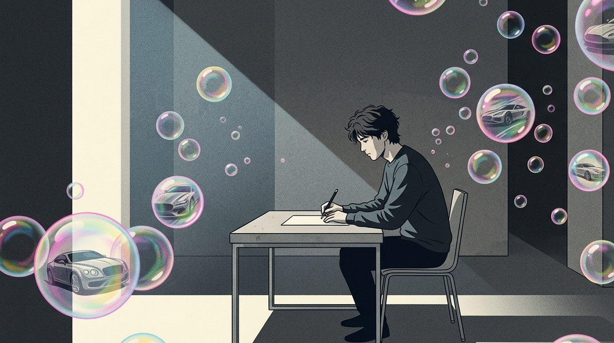

拿破仑·希尔曾说：“心想事成的前提，是你的渴望变成了具体的行动计划，而不是躺在床上沉迷于结果的幻象。”

实话跟你直接说，在脑科学这一领域当中，存在着这样一种比较让人心里不太畅快的说法，即多巴胺消耗过多了。

你在心里仔细地描绘自己功成名就的灿烂景象，幻想获得满满当当的收获并且被众人围绕着欢呼。此时你的大脑会错误地认为你已经走过了这段艰难行走的路途，早早地把本应该留存下来用于支撑你继续前进的力气消耗掉了。

在之前的一段时间里忙于进行创业活动以及思索新的想法的时候，我也总是没有办法控制自己陷入到那个数字瘾之中。

方案刚刚说了没有几句话，我就开始思索账号变得受欢迎之后的事情。心里想着要举办一场热闹的庆功宴会，而且还得在行业的峰会上进行引人注目的个人分享。

那时候，快乐在脑海里四处奔跑，全身舒适到每一个毛孔都向外冒出畅快之感。

一回到现实场景当中，看到空白的文档以及数量众多还没有得到解决的问题，我马上如同泄了气的气球一般，瘫倒在椅子之上。

突然出现了失重的感觉，我抬起手去触碰鼠标，如同在移动一座极为沉重的大山一样。

我当时以为自己是单纯的拖延症、是意志力不够，后来多翻了几本脑科学和心理学教材才看清真相：

我总是在内心一遍又一遍地思索功成名就之后的好处，最终连去直面现实、踏实地进行打拼的那一点劲头都消失不见了。

总是沉浸在幻想自己功成名就的情形当中，这并非是良好的心理引导方式。这样会逐渐使得自己的判断力被削弱。

## 脑海里的虚拟加冕，不过是底层意志的自慰幻觉

我们经常被那无处不在的“正向吸引论”以及成功学方面的毒鸡汤所左右着。

总是觉得每天拼命去思索拥有豪华的汽车、居住宽敞的房屋，觉得上天会将这些想法真实地呈现在面前。

那这哪里是什么能够让愿望实现的神奇力量。

当一个人处于现实当中的极度窘迫状况并且没有办法摆脱困境的时候，大脑会做出一些事情。为了让这个人能够坚持下去，大脑会凭空制造出一场自我麻痹的虚幻慰藉。

在心理学领域当中，这被称作提前进入享乐适应的一种状态。

你总是在内心反复地勾勒达成目标的场景，你的潜意识已经将那圆满的结果当作当下的普通事情了。

它能够使得你的心跳速度减慢，肌肉不再处于紧绷的状态。身体会感觉到当下处于没有防备的安全状态。

若想要达成那个目标，你必须要在烂泥地当中行走好几里路，拨打几百次没有温度的电话，承受无数次冷眼和挫折。

你的潜意识完全没有办法承受这种从高处一下子落到低处时所产生的那种令人揪心的落差感，它会本能地促使你避开应该去做的事情。

这就像把一匹战马放进堆满精饲料的温室里，它每天吃饱喝足、原地打转，你还指望它能上战场去趟地雷阵吗？

【插入配图1】

**你在脑海里给自己加冕了多少次，你在现实中就会对眼前的琐碎产生多少倍的恶心。**

## 为什么你总是在“雄心万丈”的第二天，陷入更深的瘫痪？

你必然会有那种频繁且令人尴尬的被打脸的状况。

在某一个凌晨时刻，你忽然被一条极为燃爆的短视频或者推文所触动，之后浑身热乎乎地在便签之中噼里啪地写下满是天马行空的赚钱想法。

你待处在被窝当中，闭合双眼，在内心之中反复地演练逆风实现翻盘之后的那一种畅快的感觉，因为激动而辗转反侧无法入睡。

在那一瞬间，你会感觉自己具备能够一掌将这个星球拍碎的能力。

可到了第二天，闹钟响起的时候，看着窗外呈现出灰扑扑状态的天空，以及扔在椅子边上还没有清洗的袜子，前一晚心里所拥有的那股冲劲立刻就消失不见了。

你仅仅只是想要在被窝里面再多待上五分钟，连去触摸枕边手机、打开便签的力气都不存在。

空茫的快感一阵一阵消退之后，你进入了一个特别漫长、看不到尽头且特别寒冷的思维倦怠阶段。

就好像房子正在漏雨的时候，你还在屋子里面尽情地玩耍，这就是提前透支心力的状态。

你按照自己所想把过冬用的柴禾全部烧光了，到最后就在非常寒冷的冬天里冻成一个可笑的冰疙瘩。

**内耗的底层逻辑，是你用最高的算力去模拟了结果，却用最廉价的行动去敷衍了过程。**

## 系统重构：把对结果的贪婪，置换成对过程的“机器式执行”

快乐因子总是想要不付出劳动就获得成果。那么我们就引入具有动态制衡特点的能量补给机制。利用严谨的框架来迫使行为变得规整。

从当下时刻起始，在你内心所拥有的认知范畴以内，将那个被叫做“成功的自己”的事物完完全全地予以去除。

把人和事情区分开来的这种想法，不仅在人际交往方面是适用的，而且还能够让你对自己和内心很多杂乱的想法之间的关联进行梳理。

能否获得结果是以后不确定的情形，这与当下的你没有任何关联。

你所必须紧紧抓住的关键之处，就是你当下指尖正在敲击的那个程序、正在梳理的那项信息。

尝试让生活像没有情绪的自动化生产机器一样去运转起来。

从远处的领奖台那里将那根天线拔下来，之后把它插回到位于脚边的这一小块泥土地里面。

不要总是纠结这样做之后是否会变得受欢迎，也不要总是思考做完之后能够赚取多少钱。

把那遥远得难以触及的大目标拆解得极为细碎，细碎到最终变成不需要耗费脑力，仅仅依靠身体的本能就能够随手去做的小任务。

当你把所有的想法都放置一旁，如同一个沉着的开拓者，每日按时在荒地上拿起铁锹进行挥动，这时候蜕变就会无声地来临。

### 动作：执行清除幻觉的“枯燥行动拉力赛”

实操行动贴士：
① 运用空想即时打断法。当察觉到自己脑海中开始浮现成功之后的风光场景时，立刻在心里叫停，接着去做比如擦桌子、叠衣服这类需要动手的日常小事。
② 开展视野聚焦训练。每日仅仅将注意力集中在当天需要完成的3个小目标上，把超过一周的长远规划暂且放置一旁。
③ 采用最低启动能量法。想要进行写作的时候，仅仅要求自己敲打出50个随意的文字；想要进行运动的时候，仅仅要求自己换上运动服，借助很低的心理门槛来消除内心的抵触情绪。
④ 记录平实行动日志。每天不统计获取到多少认可以及收益，仅仅记录下自己依照既定步骤完成的具体事情。

【插入配图2】

**钝感的人在干活，敏感的人在幻想；而在这个粗粝的世界上，所有的资产都是干活的人从幻想者手里割走的。**

你的精力是非常宝贵的，可不要总是在很多没有边际的空想之中白白地将它消耗掉。

要是你也想要从那种混混沌沌的状态当中摆脱出来，那么就请点一个赞吧。我们正在最为普通、最为踏实的领域范围之内默默地进行钻研。