# 一、前言

大家好，我是小俊，这是第二次在淘金之路这个优秀的圈子上分享文章，值得高兴的是，在我上一次写文章也是第一次写文章就拿到了精华帖，希望上次的帖子能帮助到各位圈友。时隔两个多月，这次再给大家分享一下我这段时间的一些经验。

上次的文章很多人也都私信我了，按照我的方法确实来了不少的流量，但是转化很困难，并且视频剪辑这方面如果矩阵操作起来，耗费的时间非常多。我只能说这是说，这个对于超级个体来说是这样子的，没办法。

那么我今天就给大家分享一下超级个体该如何进行流量的矩阵操作。

上一篇文章：[ 新人做私域IP如何赚到第一桶金](https://lwhhubzf68z.feishu.cn/docx/XQA2dfM22ocDZVxqoDDc1wN5ndd)

> 内容很长，并且很干，请各位圈友耐心一字一字的看。

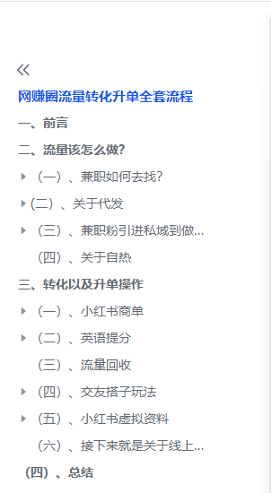

进入正题之前，首先，再次感谢一下淘金之路这个优秀的圈子，圈友们的发的帖子也给我带来了不少灵感，果如优秀的圈子真的可以改变一个人，非常感谢狗哥大佬搭建的这个优秀圈子，俗话说，出水不忘挖井人，今天我再给各位圈友毫无保留的分享一下，我这段时间的玩法！

# 二、流量该怎么做？

我给大家提供一个思路，那就是兼职代发的一个模式，这个模式也有其他的圈友分享过，但是我今天是把流量，转化以及升单的整套的链路给大家拆解出来。

那么有看过我上一篇文章的圈友就会问了，为什么我上一篇文章还没有分享给大家呢？其实不是不分享，因为在上一篇的时间点，我还在完善这个模式，虽然跑通了，但是不太稳定，所以没有给各位圈友分享出来。

> 方法可能不适合全部圈友，但是能帮助部分圈友也是值得高兴的

## （一）、兼职如何去找？

那么我们进入正题，剪辑这个事情最耗费个人精力的，所以我们完全可以把这个让兼职去做，兼职如何去找呢？

最廉价的兼职往往都是在校园，可能有一些在读大学的圈友就可能知道，就比如校园外卖，这些做校园外卖兼职的大学生会为了一块钱去跑楼送外卖到宿舍（因为这些外卖只能是送到宿舍大门的，无法送到宿舍里面，所以就有了一批兼职跑楼送外卖的大学生。) 

总结一点是什么呢？大学生是非常愿意通过自己的努力去赚钱，而且非常认干。

就打个比方，大学校园里的食堂干一天六个小时才 50 元，相当于时薪才 8 元。剪辑一条一分多钟的工具号视频所耗费的时间才半个小时左右，项目拆解的话基本上十分钟以内可以解决。一个小时的时间他可以剪两条工具号视频或者六条项目拆解的视频。

按照广西这边的平均薪资水平，一个全职线下的剪辑，最低需要 5k 一个月的，单单底薪就平均 167 元一天。如果我算他一天能给我剪辑 10 条视频，那么折合一条视频的成本就是 16.7 元。

这样子大家算下来就特别清晰了对吧，不管线下剪辑给我剪辑的是什么类型的视频都已经注定了一条视频的成本高达接近 17 元，但是我们用这 17 元找大学生兼职的话他们可以给我们剪辑出三条工具号视频以及一条项目拆解视频。

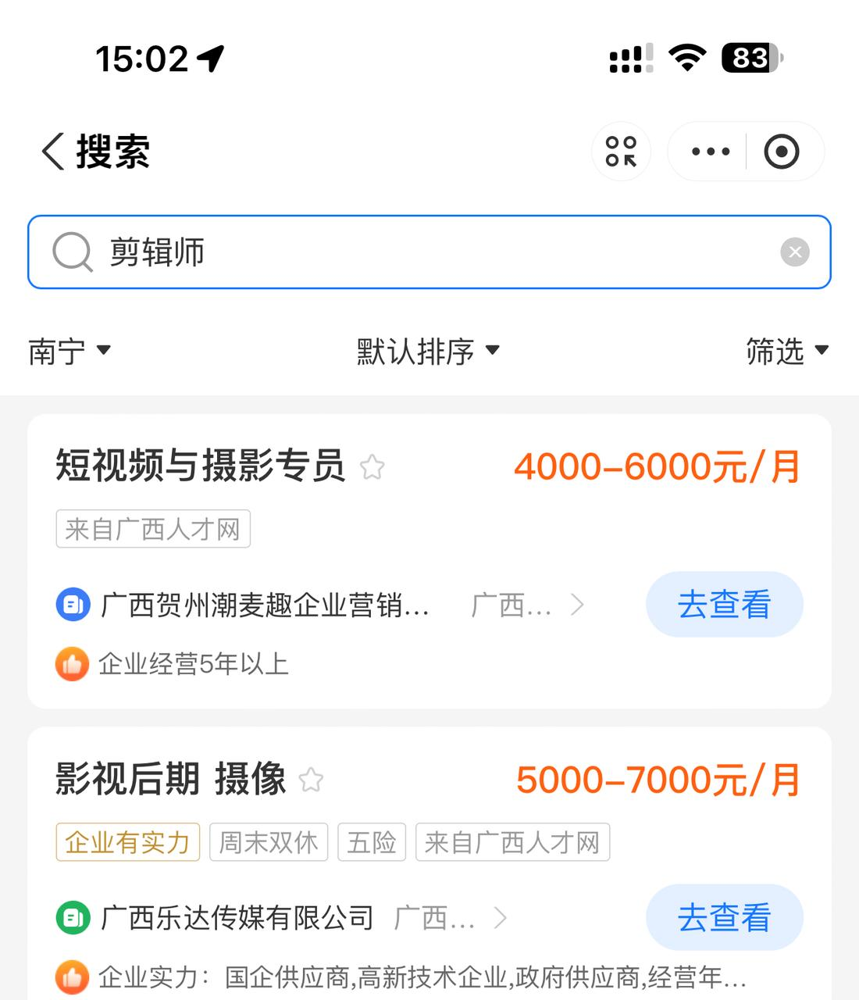

我们需要做的就是降本，因为我们不是什么很牛逼的大公司，上市公司，所以没有必要招一个线下的剪辑。

那么我们可以利用这一点，就去找大学生兼职，那么这些大学生怎么去找？

### 第一步：

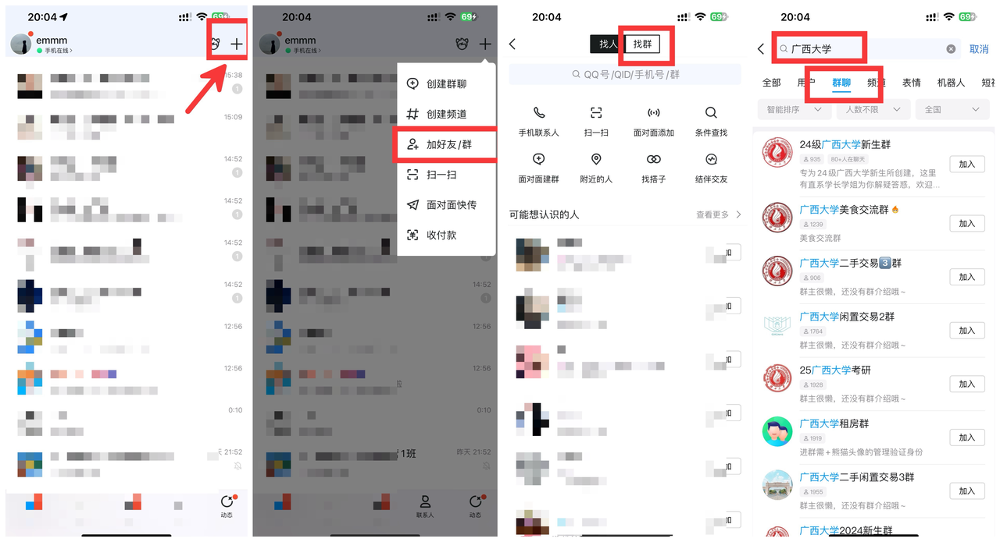

这是第一步，首先在 QQ 里面加群，这里要注意的两点是，大学一定要搜索二三线城市的本科院校，为什么呢？因为二三线城市的本科院校，里面的学生认知普遍没有多高**（普遍阿，不是全部，别骂）**就是很简单的一个道理，一个认认真真学习的学生，不怎么了解过社会以及互联网上面的东西，那么基本上对于这种东西是不怎么熟悉的，那么我们就可以利用这个信息差来找兼职。（我工作室就在大学城附近，所以经常看见隔壁高校的大学生被 zp）

而且他们对剪辑以及代发这一类的兼职的市场价也不熟悉，但是难免有一些知道市场价是多少的，我们直接 pass 就行

### 第二步：

进群之后，不要直接发什么，招剪辑，代发兼职，一单一结这种东西 ，大学生虽然认知不高，但是看到你一上来就发这种东西，肯定都是把你当成 zp 的，所以我们要在群里面跟他们聊天，拉近距离以及拉高信任，接下来就是王炸，等到熟悉到一定程度的时候，在大家都在聊天的时候，秀肌肉，秀车啊，秀收入流水都可以。

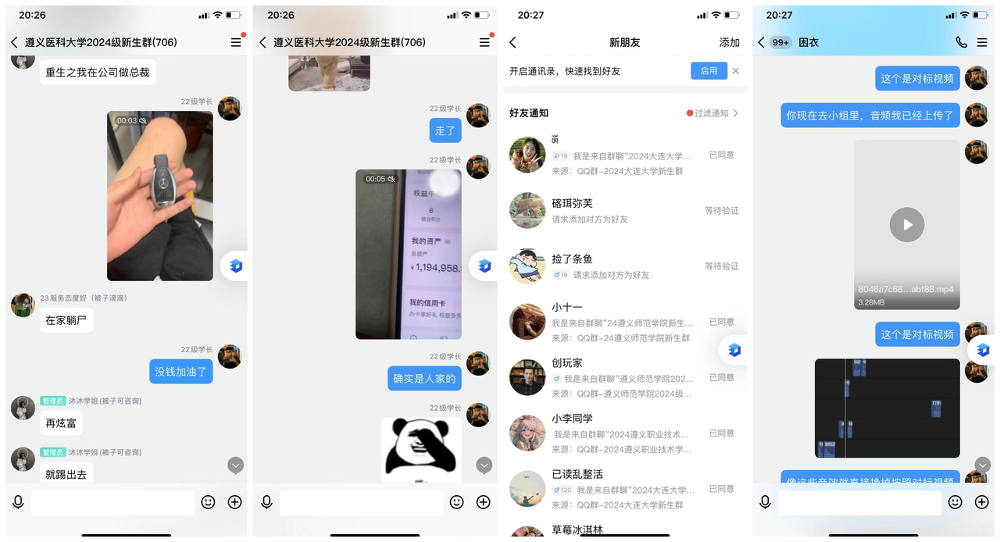

大学生就爱吃这套，因为他们都有一个梦想，年少有为的梦想，在他们眼中这种就是神，人都是慕强的，所以他会毫不犹豫的去链接你。

## (二）、关于代发

### 1.各位圈友也可以使用上面的方法找，另外一种找兼职代发的方法如下：

把小红书名字设置成这个类型的，这个模板可以打任何的粉。

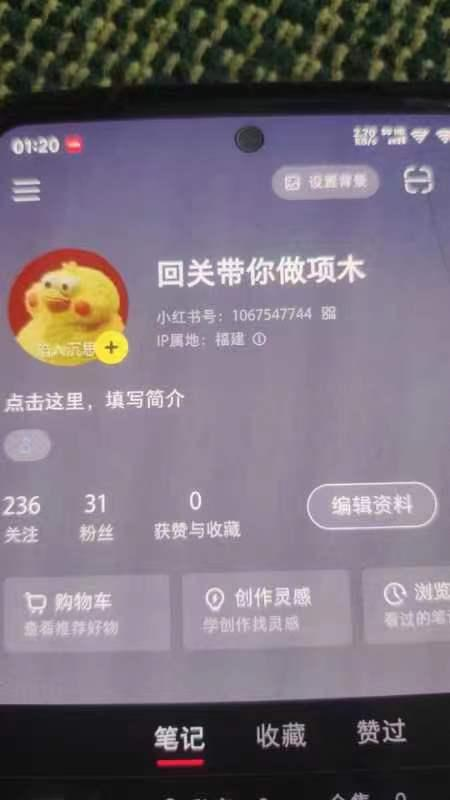

然后就去刷对标的账号，需要什么粉就去刷什么样的对标账号，比如你需要兼职粉，就去刷关于兼职或者副业的图文。

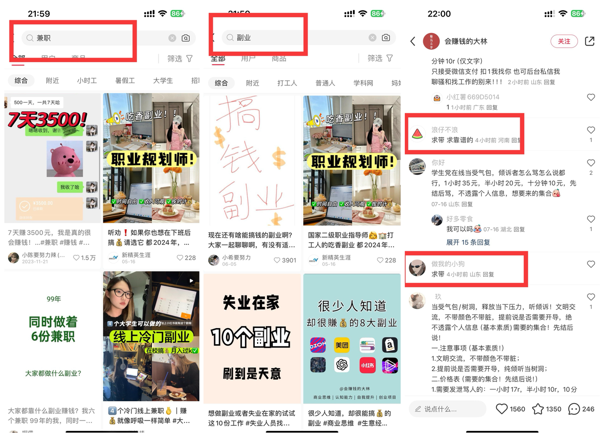

但是需要注意的就是，一定要去最近发布的爆款笔记进行截流。然后我们就去找刚刚评论五个小时以内，因为这种用户的活跃度是最高的，你关注他之后，基本上都会回关你

### 2.实操视频：

[7bc516b2792dd5e0ab1808bb593a7494\_raw.mp4]()

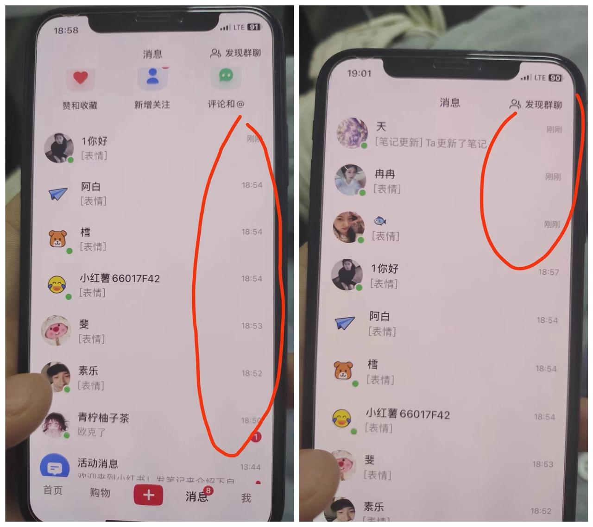

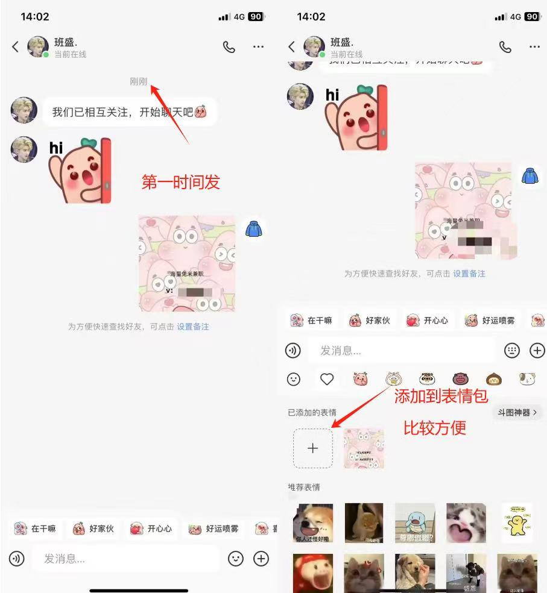

等用户回关我们之后，我们只需要到美图秀秀制作一张图片，直接发给他就可以了

接下来就是坐等上人就行（一定要用其他的号去承接兼职以及副业粉）

兼职粉账号分开的原因是，这批粉自己用完之后，还可以卖给别人继续用

[9a026c7e8d6d1bb9e28c433d43f233c5\_raw.mp4]()

然后等他们加过来之后，一定要进行拉留存，我们只需要准备一套话术就行：做兼职和副业的朋友请看我朋友圈置顶。

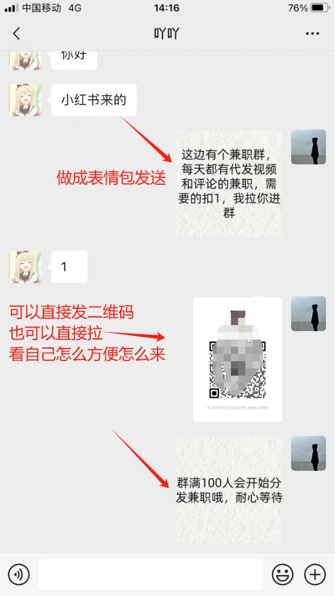

然后在朋友圈置顶一个兼职副业社群的二维码

这样子他们就会直接进入到群聊了，但是社群只是一个作为发布代发任务的平台，有任务之后就直接再社群里艾特全体成员：现在要任务需要做任务的直接私信我

这个的参考价是代发视频或者图文，一块钱，评论区截流五毛钱，截流的来一个人加一块钱。

### 3.兼职截流如何培训：

可以让他们到小红书或者是抖音的评论区进行截流，但是要注意，不能教这个方法做截流，因为这个方法是用到后来流量回收这个陪跑项目里面的。

比如：在抖音的评论区，有很多发求带或者有执行力缺大哥类似的评论，然后呢我们就是让这些兼职去截流，在评论区回复他或者是关注私信他，说带她什么什么的。

为什么说上面回关的这个方法不能教给兼职呢？因为这个方法是教给流量回收这个项目的学员的，二者的区别在于，一个你要给你发工资，另外一个他要给你付费。

例如：

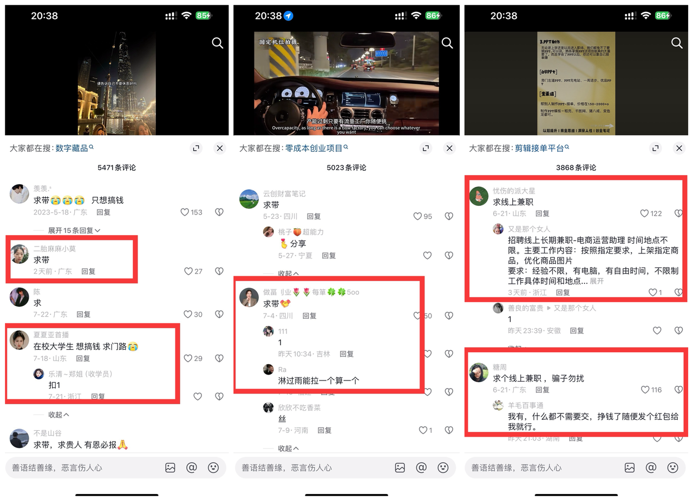

有人发求带或者求兼职这种，就让这一批做截流的粉去导流到你这里，虽然这个方法废号，但是你们要记住一点是，那不是你们的号。这种方法的截流我相信大部分圈友都做过，所以就不再细说了。

### 4.那么怎么记粉呢？

**首先肯定要使用一个专门去承接兼职打过来的粉的一个微信，然后就是粉过来时候的一个验证信息，叫那些兼职让那些粉扣 111 或者扣 666，这样子才算一个有效进粉。**

> 以下是发给代发兼职粉的一套模板：
>
>
>
> * **首先先简单介绍一下你们的工作内容，简单来说就是每天花 2 分钟发布一篇图文或者视频**
>
> * **纯绿色，不封号，可以长期兼职，短期干也赚不到什么钱**
>
> * **每天几分钟，一个月轻轻松松几百块钱**
>
>
>
> **（以上是与代发沟通的话术）**
>
>
>
> * **1、发帖奖金**
>
> * 每日发帖抖音播放量＜1000，1 元/条，≥1000，3 元/&#x6761;**（日结）**
>
> * 每日发帖小红书播放量＜700，1 元/条，≥700，5 元/&#x6761;**（日结）**
>
> * **备注：抖音正常账号每条播放量随便破千，小红书正常账号随便上 7 百播放**
>
> * **2、账号月度奖金：**
>
> * 账号粉丝 500-1000 人，月合作奖金 100 &#x5143;**（月结）**
>
> * 账号粉丝 200-499 人，月合作奖金 50 &#x5143;**（月结）**
>
> * 账号粉丝 1-199 人，月合作奖金 20 &#x5143;**（月结）**
>
> * 单条破 20 万播放，月合作奖金 10 块&#x94B1;**（月结）**
>
> * 单条破 50 万播放，月合作奖金 30 块&#x94B1;**（月结）**
>
> * 单条破 100 万播放，月合作奖金 60 块&#x94B1;**（月结）**
>
> * **播放量奖励是累计的，3 条 50 万就是 90 奖金，一个月 30 条轻轻松松爆几条**
>
> * **要求：每日发帖≥1 篇**
>
> * **合作不足 1 个月的，无月度账号奖金**
>
> **每天晚上 9 点结账**
>
>

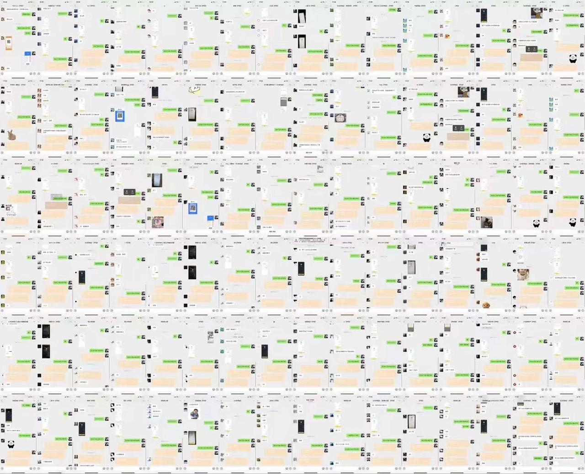

兼职的内容抖音分发各种视频，高楼大厦的视频配上赚钱的文案，一条给2块钱，然后再按照播放量看心情结算（自热）

还有就是评论区截流，一条给0.5，一天让他们发20条，引流来一个人在提成1，这个效果是最快的

这套模型成型之后，后续就可以不用自己打兼职粉了，都可以用兼职粉来裂变，兼职粉打兼职粉，兼职粉打创业粉，打其他的都可以，后续就可以把重心放在内容引流上面

到这个时候，你的素人分发体系就已经搭建完成了，后续只需要持续更新新的模版，新的截流玩法让素人去跑

### 5.关于如何教剪辑制作视频和图文？

大家可以看一下我上次发的帖子，里面我教大家如何制作工具号，项目拆解以及图文，大家可以直接教大学生剪辑如何让去制作，由于内容比较多，我就不重新写一次了。

[ 新人做私域IP如何赚到第一桶金](https://lwhhubzf68z.feishu.cn/docx/XQA2dfM22ocDZVxqoDDc1wN5ndd)

关于对标视频的话，我只能给大家提供两个视频作为参考，因为做得好的兄弟都开启了不被陌生人搜索，所以账号我无法给大家提供，但是那么可以通过在养号期间，观看推荐页的视频看到。

**关于剪辑的注意事项就是，直接就发一个对标视频给他，不要教他如何去做，如果他在你没有教的情况下，能做出一个差不多的视频，那么这个人就是具有可塑性的，你后续再教他如何去制作视频是可以的。如果没有做出你心里预期的视频，直接 pass，毫不犹豫，因为现在这个社会，最不缺的就是大学生。关于价格这方面，我的定价大家可以参考一下：工具号 5 块钱，项目拆解 2 块钱。仅供参考，大家不要模仿，因为这个按照我当地调查之后给出的定价！**

当剪辑第一次剪出了达到你心里预期的视频，接下来就是培训他

> 链接: https://pan.baidu.com/s/1g-hiPf2kHp9Bcc7-3y731g?pwd=8888 提取码: 8888&#x20;
>
> \--来自百度网盘超级会员v1的分享

> 链接: https://pan.baidu.com/s/1KWOErp2YZodZEggo\_-BjTw?pwd=8888 提取码: 8888&#x20;
>
> \--来自百度网盘超级会员v1的分享

上面是关于剪辑的一个课程，可以直接发给他让他学习一下，另外还要教他完善一下细节，关于比如关键帧，音效，画中画，特效，滤镜，文字模板，文字动画等等的一些使用方&#x6CD5;**。**

视频能不能提高播放量，完全就是看你的五秒完播率和两秒跳出率，所以五秒要做到就是教他，视频开头的画面以及配音一定要吸引人，大家可以看一下下面这两个对标视频，开头都是使用了一些梗，所以特别吸引人。

另外还有爆款的文案，爆款的文案，无论发多少次都是可以继续爆的，例如：

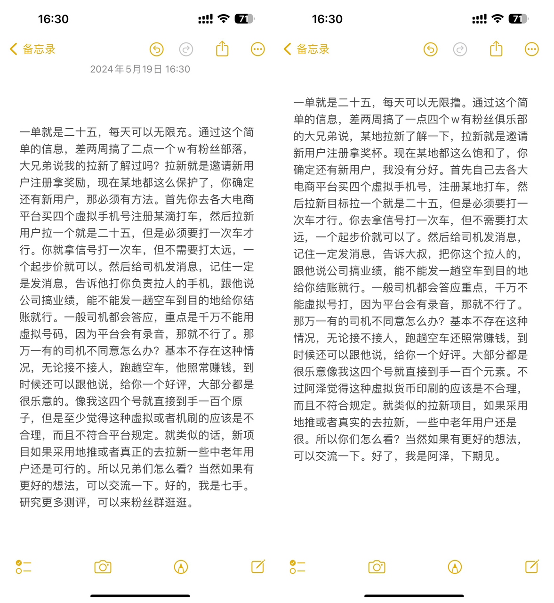

上面这两个爆款文案大家可以看到，其实前面开头都是一样的，只是中间的内容进行二创的修改。

**基本上就是按照前面文案不变，二创之后中间的内容进行修改，最后结尾留下钩子的逻辑**

文章的结尾最好就是：点赞收藏评论666这一类

引导用户进行互动的话可以把你的视频推向更大的流量池，别人看到的话也会盲目的从众

**你的钩子留下的越多，那么这个用户去链接你的可能性就越大**

**关于选题这一方面**

**选题的话直接根据当天的热点就行，比如今天的热点全自动剪辑神器，那么我们就去找做这个内容的爆款对标就行**

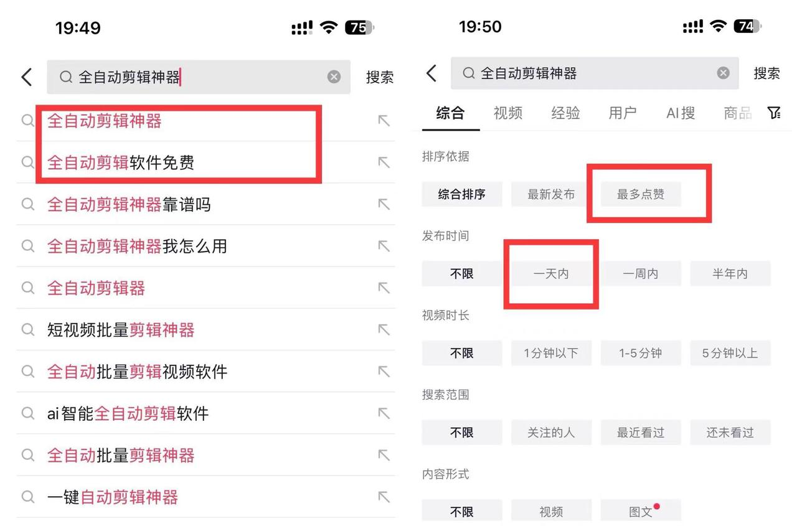

[8346b8ce149bf572e755428aa6faa21f\_raw.mp4]()

[fda20e1c1fe031b8a5cda5f9f7ef2c14\_raw.mp4]()

音效以及配音方面大家可以参考如下：

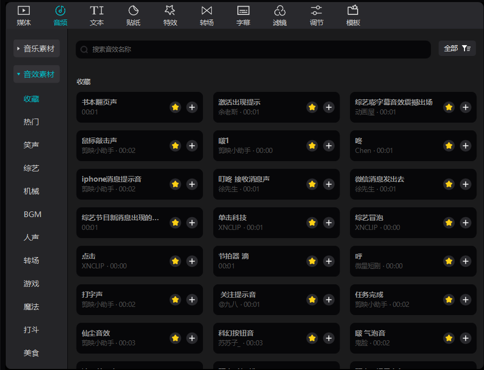

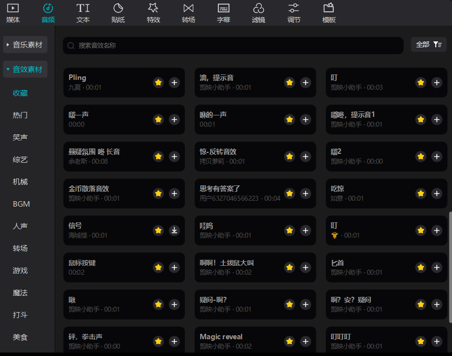

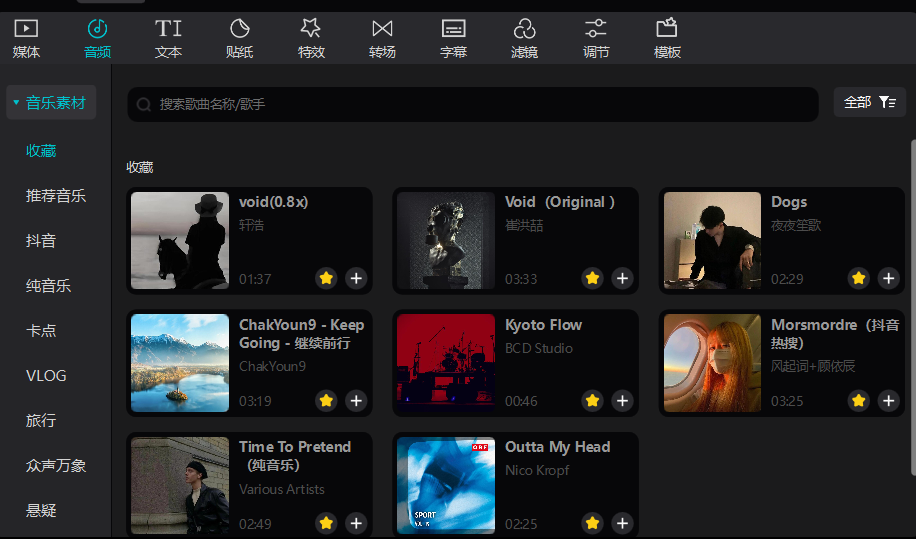

具体的音效你得根据素材内容和文案来比较好，不是固定的。

还有关于视频或者图文导流的方法还是之前的方法，粉丝群，关于抖音的群聊开启大家可以通过这个方法

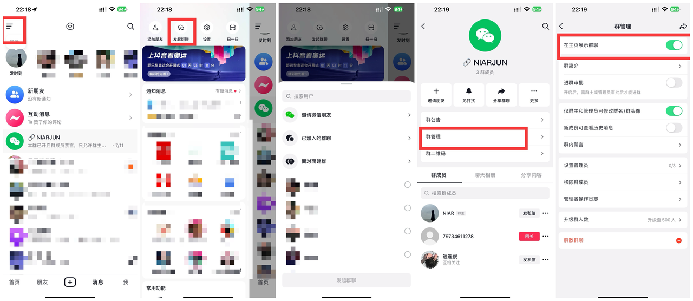

小红书的方法也是和抖音是一样的。

关于

我来说一下这种粉的价值，我的工作室打的时候名字都是取回关带你做项木，所以很多也是蹦着项目来的，不一定都是兼职粉 ，所以这种粉是可以直接卖项目的，都可以在朋友圈里洗

说一下我工作室的人员配备，我一个人是配了 4 台手机，3 个微信号，4 台设备全都是跑关注截流，一个小时一台设备跑 30 到 50 个左右，50 个关注进粉率一个小时一台 7 到 10 个，都是关注 2 个小时左右的客资，一天至少是 6 轮，一台平均是可以进 30 个左右的粉

**纯手动，因为用科技来的粉不太精准。**

再来说一下为什么配备三个微信，一个是专门来承接兼职粉的，还有一个是专门来对接兼职粉给他们分发兼职的，还有一个就是来承接兼职粉分发出去内容进来的创业粉。

### 6.为什么不让剪辑的人直接进行代发呢？

因为如果剪辑的人懂了你视频的制作，再去做代发，那么他结合你所发的兼职任务，就很容易知道你这一整套的链路是怎么操作的了，所以让剪辑剪完视频继续做代发是 7 元，剪辑和代发两种人分开也是 7 元，还是分开比较好。

简单来说：就是招大学生剪辑，然后去小红书招兼职粉，我们在中间，两边互不相关，初步形成信息壁垒。

## （三）、兼职粉引进私域到做单全过程

上面也讲过兼职粉引到私域然后拉群，我就接着下面的步骤去讲

### 第一步：

首先，我们要知道，兼职这个词语本来就是敏感词，所以一定不能用承接兼职粉的微信区分发任务

前面有教你们拉一个兼职的通知群聊，顾名思义这个群聊就是专门用来通知的

接着说这么去通知，可以拉群，也可以一对一去分发，个人觉得还是一对一去分发靠谱，拉群一起分发太乱

例如：

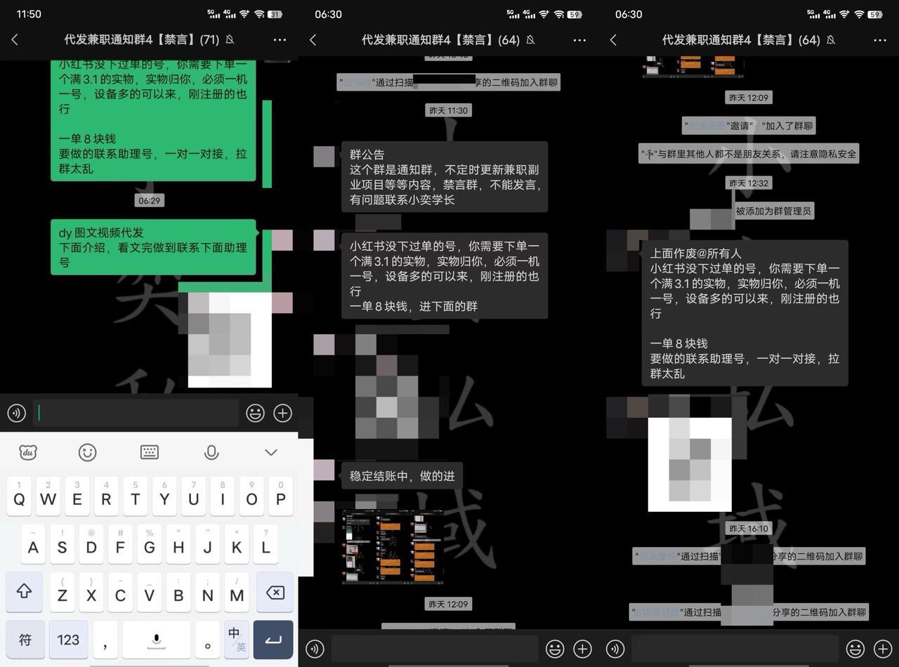

### 第二步：

兼职来找你要任务的第一步，先测素材是否正常

一个小时没破播放，就换素材继续上

下面这张图是之前测试模版的，不是自热，现在还是推荐你们打自热

分发的原理一样，套公式就可以

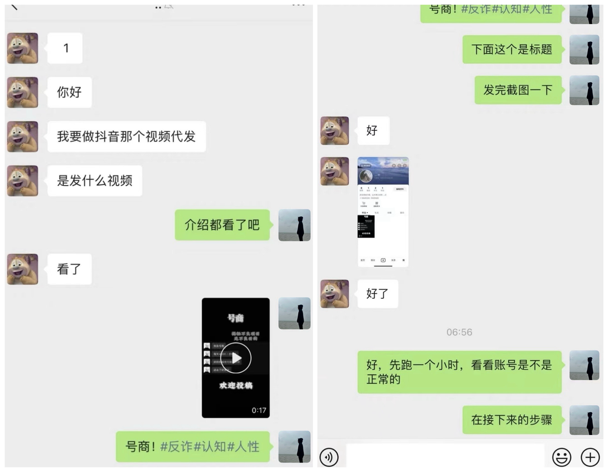

### 第三步：

就是看一下视频可不可以投流，不可以就换素材就可以了

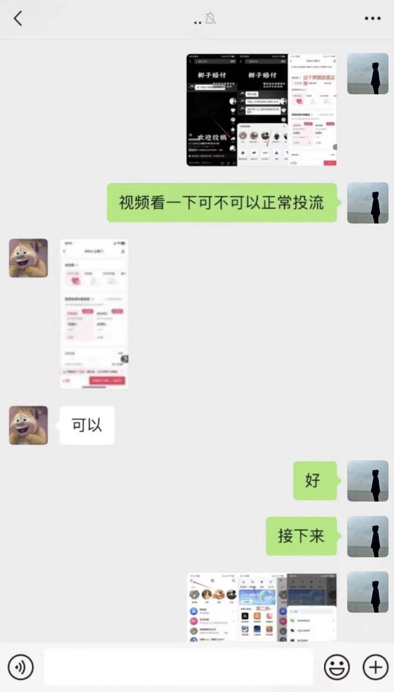

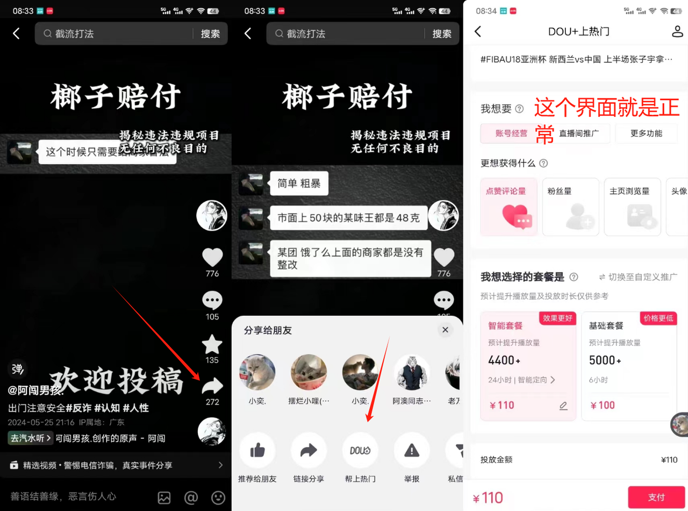

关于导流还是一样的，群头像设置成微信，名字设置为你的微信号

### 第四步：

就是把每天剪辑做好的视频发给他，然后结账

## （四）、关于自热

1.A 种 B 收（A 就是你发视频的账号，B 就是你去评论区截流的账号）

例如：

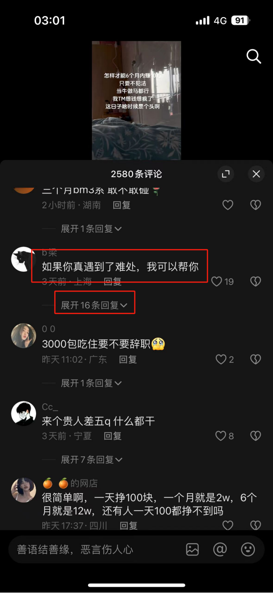

2.A 种 B 问 C 收

A 发作品 B 提问 C 收割（3 个号都是你自己的号）

B 的钩子流露关键词，来的人付费意识会高点

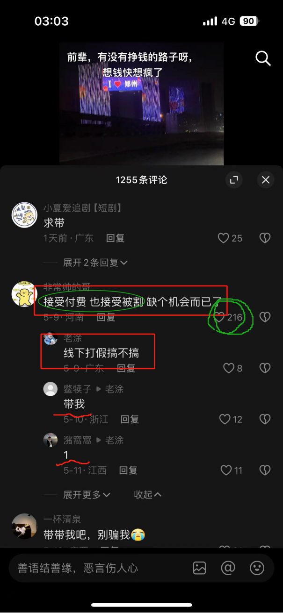

3.评论区删评论（就是把对你不好的评论都删了）

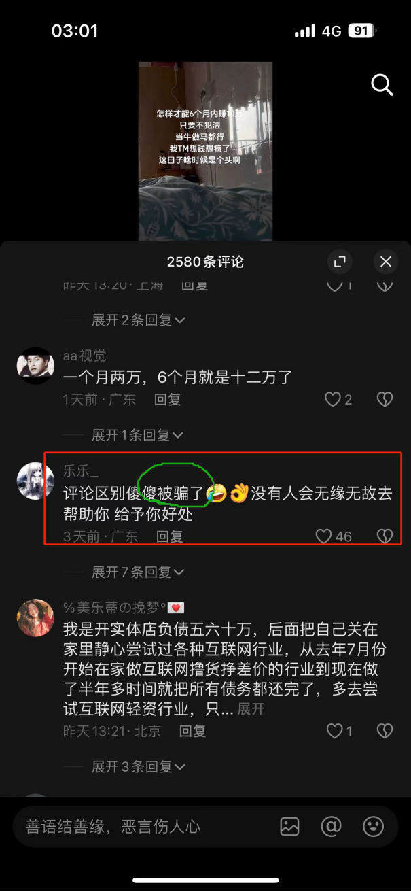

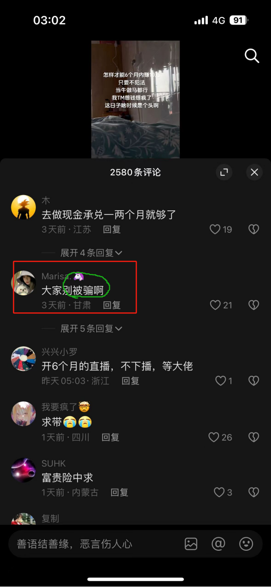

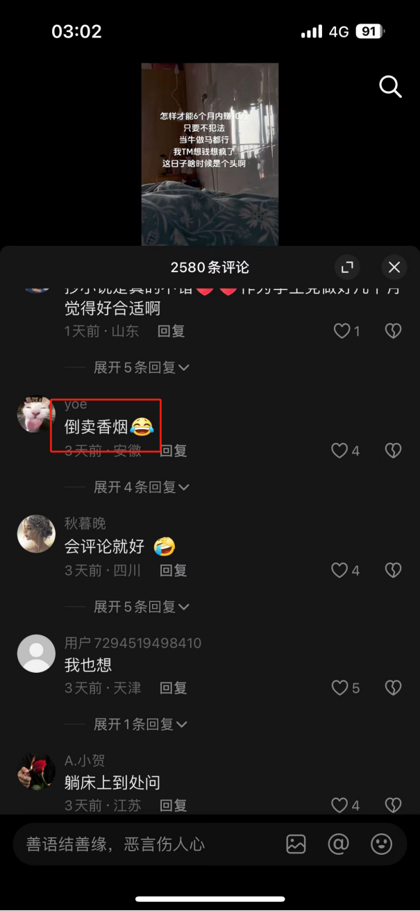

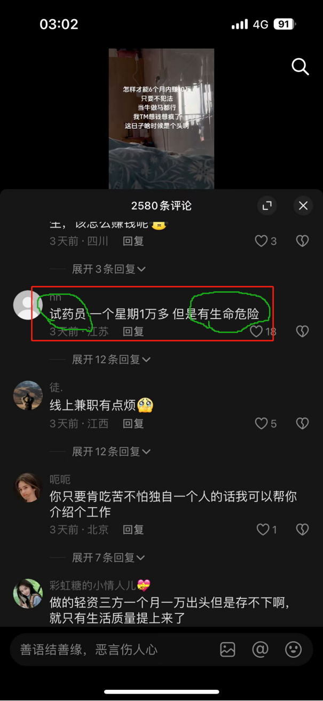

> 这个就是兼职以及代发的一套链路，大家有什么不懂的可以私信问我。

# 三、转化以及升单操作

转化困难的问题还是因为后端产品的客单价高，这是最主要的原因，那么我们进行一个操作就可以完美的解决，就是做低客单价的产品。

那么有人就说了，我一直都是做高客单价的产品，高人设，如果做低客单价就直接拉低我的人设了。其实我想说，压根没必要，不论人设高低，赚到钱就是好的。

针对这个情况，我自己设计了几个不同客单价的产品。兼职和代发来的粉可以直接使用成承接创业粉的微信号去承接。

**一转 99 的小红书商单项目群，二转 199 的英语提分项目群，三转 888 的流量回收，四转 1280 的交友搭子项目，五转 1980 的小红书虚拟资料项目，六转的 2580 线上合伙人，七转 6980 的线下合伙人。**

以上价格仅供参考！

大家需要注意的是，你所开设的项目一定要能赚到钱，如果不能赚到钱，你就无法进行下一步的升单操作。

兼职和代发来的粉直接发小红书商单的项目介绍，问他要不要上车，因为代发和兼职的工资是需要你自己结的，所以我们要做的就是提高转化，直接做筛选，虽然转化率比较低，但是一样是有转化的，转化不了的，一样也是可以在朋友圈进行营销转化。

> 接下来我给大家拆解一下，我每个项目的玩法是怎么样的，如果后端没有项目的可以直接模仿我就行，但是需要注意的是，得找人负责交付的问题，建议一个项目一个人。

## （一）、小红书商单

小红书商单项目有三个方法可以快速涨粉：

### 1.星球动画的赛道

#### 注册账号：必须使用流量进行注册，必须实名，必须绑定手机号码，手机号码和实名可以不是同一个人的

##### **养号：**

###### 第一天：打开小红书正常刷视频，每个视频必须完播，可以分不同的时间去刷，分三个时间，早、中、晚，每个时间段刷半个小时就可以了

在养号期间他推荐的上面作品是什么都不用管，我们只管刷就可以了，大家也可以直接在搜索框搜索我们做的类目视频（星球动画，星球视频，星球，二次元动画，二次元）搜索完直接观看，最好就是每个视频都看完，要不然系统会以为你是机器模拟人工的。

###### 第二天：在搜索框搜索刷对标视频，打垂直标签

操作步骤：在小红书的搜索框搜索“星球动画、星球视频、二次元、二次元动漫、星球”。搜完，看到视频要对他们的作品适当的点赞，收藏，评论以及关注。

要经常进行点赞评论和收藏，平均五个或者六个视频就要点赞评论收藏一次

###### **第三天**：就是延续第二天养号的操作，正常点赞关注，看看推荐页里的视频里面有没有推荐给你符合你赛道的视频，如果有，也可以对推荐的进行正常的点赞与关注、评论，转发等操作。

一定要适当的评论，大概五个点赞率评论一个，**评论的内容，基本上是找同行里面的热评，比较火，回复率很高，点赞比较高的评论，复制粘贴即可。 **

**当你的发现页推荐的至少 50%-70%都是你这个赛道的作品，基本就养号成功了。如果没有超过 40%，就继续养号**

##### **搜哪些？怎么搜：**

###### **通过关键词搜索你做的这个赛道的笔记，找那些点赞量超过 1000 的视频，进⾏浏览点赞、评论，适当地关注⼏个账号。&#x20;**

**举个例⼦：&#x20;**

1.做星球动画的话，那我们就在⼩红书上搜索“星球动画、星球视频、二次元、二次元动漫、星球“等关键词，找到同⾏或者其他⼈推荐的视频，每个视频都认真看完，一定模拟⼀个真实的⽤⼾的去做就可以了

观看完以后再进行点赞、或者评论，如果操作太频繁的话，系统也会判定你为机器号或者劣质账号，你喜欢什么内容，系统就会不断给你推荐相关的视频内容，所以同样的道理，你发这种类型的内容， 系统也会推荐给关注这个领域的⽤⼾&#x20;

2.然后就是每天差不多⽤1-2 小时左右在⼩红书平台上浏览互动，把我们的账号活跃度提升起来，让平台认为是我们⼀个活跃的账号，那么给的流量会更多⼀些。接下来，给对标视频评论的时候不要去评论⼀些 “很好”、“感谢分享” 等⼀些很⼝⽔的内容，⼀定要去模拟正常⼈说话的⼝吻去评论，要的就是真实。&#x20;

3.持续养号 3 天时间就可以开始发布笔记。

4.养号时，一定要多关注其他的小红书账号。 ⼩红书的官⽅账号，比如“薯管家、⼩红书成⻓笔记、创作者⼩助⼿”等等。

正常我们账号没什么问题，视频质量能达到对标账号的⽔平的时候，发到 10 条笔记左右， 就会有⼀条爆款视频

##### 2、实操剪辑

账号养号完成之后，开始实操

###### （一）实操剪辑模版

[4月25日.mp4]()

###### （二）动图背景图及查找素材

**（1）背景图模版**

1.可以自己去抖音、快手等短视频平台下载无水印的

2.不要直接搬运别人的东西，也不要去想着盗用别人的一旦盗用就会直接查重，账号就会被限流，背景图模板如下：

[411045fc16b69a979621ad6510b1be74\_raw.mp4]()

[6467ccc26acec787536e81639f3579dc\_raw.mp4]()

##### 3、发布作品流程

###### （一）发布作品前，一定要自己看一次视频，检查视频存不存在别人的水印，要不然会影响视频的流量，导致限流

###### （二）发布作品，发布作品一定不要点加号直接发布，按照下面的方法进行发布

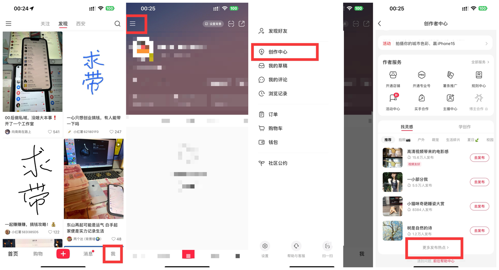

随便选择一个热度比较高的创作灵感进行发布

###### （三）发布作品的条数

1.千粉前：每天 3-5 条；

2.千粉后：每天 1-2 条；

3.中间千万不能断更，会直接影响流量。

###### （四）发布时间

早上：8 点 -9 点（小黄金时间段）

中午：12 点 -14 点（中黄金时间段）

&#x20;        15 点 -16 点（小黄金时间段）

晚上：18 点 -21 点（中/大黄金时间点）

以上发布时间为通用发布时间段，具体的可以直接在小红书搜索，发布时间段（动画发布时间段；娱乐类发布时间段等等）

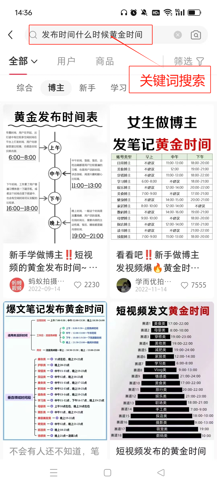

###### （五）发布作品的注意事项

1.发布时需加封面：可单独制作或者选取作品的某一个画面

2.发布时需加标题：此标题并非视频中的标题，而是自己单独起一个具有吸引力的标题。但不要有引导性词组出现，或者负面的，违禁的，擦边的都不行。

3.标题下面加话题：话题可参考对标账号都加的哪些话题。

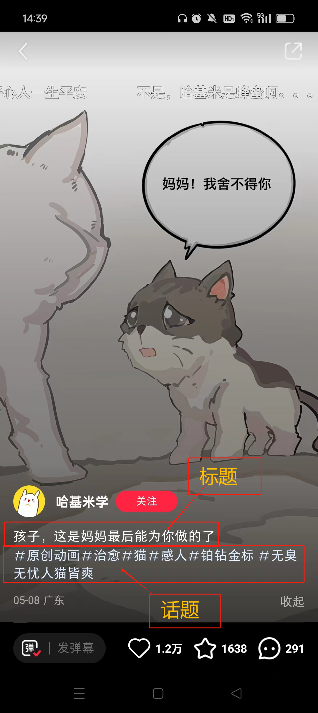

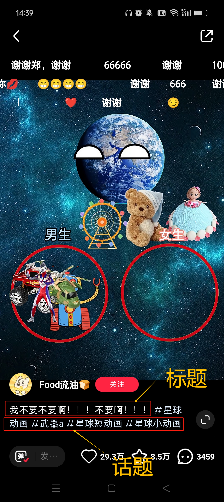

###### （六）作品发布之后

①作品发布之后：先点分享然后自己给自己点个赞、收藏一下，也可以自己评论一下，千万不要有引导关注的。也不要发了作品就一丢，什么都不管了

②如果两天都没什么流量（浏览量低于 200），一定要分析一下账号

③如果发布后作品流量大部分在 500+以上，就按照制作的视频模版继续发布即可

##### 4.如何检查自己发布的视频是否违规

[WeChat\_20230716022706.mp4]()

##### 5、小红书账号被提示原创度低，限流的解决方案

如果账号被提示原创度低，可以用下面的方法解除限流，如果不能使用下面的方法，又不想注销重新做，可以在养一段时间，这一段时间内发原创作品或者作品去重度高的，然后过 5 天在自检一下账号是否恢复正常。

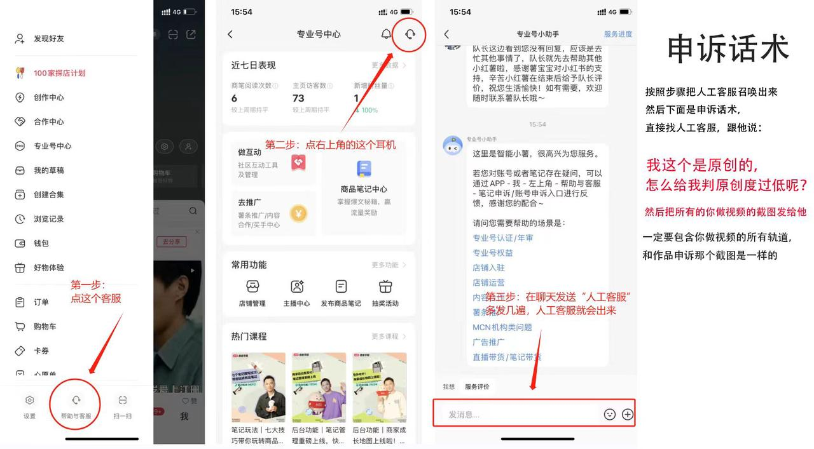

##### 6，如何查找专业号，看账号是否正常？

[11.mp4]()

### 2.小红书简笔画视频详细教程

养号以及打标签的方面和上面一样，就不详细说明了，给大家分享的是剪辑方法

###### （一）、实操剪辑模板：

[简笔画.mp4]()

[简笔画上下排版课件.mov]()

### 3.小红书泥巴短剧视频详细教程

###### （一）、实操剪辑模板：

[2023-10-20 105802.mov]()

[影视课件.mov]()

关于素材这一方面，大家可以到建议或者是小红书上复制链接下载无水印视频

> 为什么一转是小红书商单这个项目呢？因为可以保证千粉开通蒲公英之后马上能见到收益，因为当一个新号达到千粉之后，就马上会有机构来找博主接商单广告，单价在 150～200 之间。

## （二）、英语提分

首先说明一下我为什么要开设这个项目，因为现在国家要求减负，不允许开设课外的补习班的机构，按照中国家长的惯性，肯定是不允许孩子在假期时间在家里玩的。

教育 K12 赛道，这就有点类似于小红书虚拟资料这个项目，只不过这个项目的客单价偏高。在双减之前支撑了太多的年营收上亿的上市公司，像大家所熟知的新东方就是这个类目的，以前的行业巨头，双减对其的打压直接转行做直播带货了。巨头落幕，但是教育这部分的需求一直存在。家长的需求在，这块大蛋糕就摆在这里，看谁能吃上。

### 1.以下是关于一些对标账号的内容

[4889f83aa9c95e35de3f8a9b29f0757d\_4.mp4]()

[657690965d95ee2c3b70604f834c965c\_4.mp4]()

不过这个项目做流量的话还是有一点门槛的，比如至少需要六个微信，五个视频号，一台电脑，一个业务微信

每个手机号注册绑定一个微信视频号，空出一个手机号备用，电脑用来打开网页拍素材用，业务微信号用来承接引流过来的流量。

### 2.微信的头像以及背景可以使用类似于这种

### 3.账号的素材该怎么制作呢？

其实非常的简单要么使用 EV 录屏录制一段学习英语的过程，要么一个人拿着手机在旁边拍学习英语的过程，怼着电脑拍，十几秒一条，例如

[c761a9ba34ebb6c1377ecb333f6b6e64.mp4]()

[0af516199f2991fb632ea3ed80de34be.mp4]()

这就是素材的获取方式

### 4.视频素材的剪辑

[42ca95226581855771621748008fb40b.mp4]()

首先比例设置为 9：16，把素材放在最中间，然后上下输入和上面视频里类似的内容，最后添加画面特效，滤镜，贴纸，音效，背景音乐等就可以了，这就是一个全新的素材

剪辑的方法其实就和拾柒姐的视频号素材混剪方法差不多

### 5.注意事项

大家需要注意的是，发布作品之后，也不能丢在旁边就不管了，要时时刻刻看着视频号的私信以及评论，有咨询直接发联系方式过去就行。

例如，家长您好，请加微信：xxxxxx，暑假快速提升英语。

&#x20;        家长您好，因咨询量大，请加微信：xxxxxx，暑假快速提升英语。

视频号本来就是腾讯旗下的平台，所以大家放心大胆的发，没事的！

### 6.导流到私域该如何成交

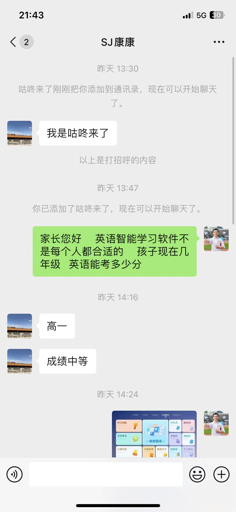

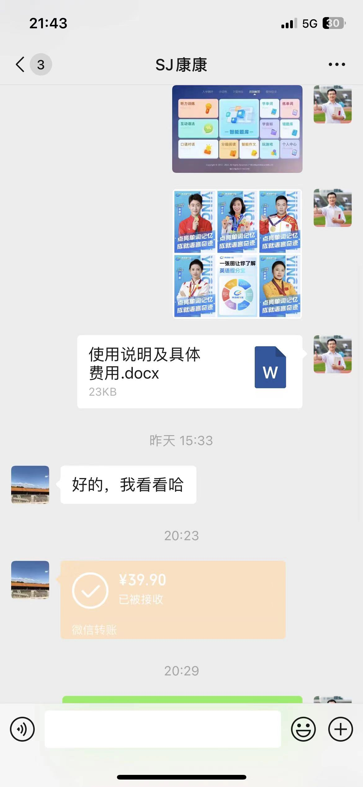

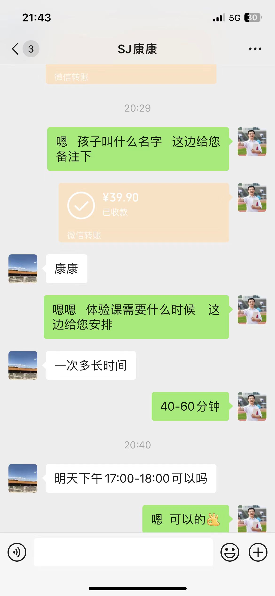

这个就是相关的一个话术，39.9 的一个体验课这是为了成交高客单做跳板。这其实就是一个提高转化以及升单的动作。

[ff013328ecca5ab0bf4cf073814901fc.mp4]()

关于聊天记录所发的 DOCX 文档无法在这里发出来，有需要的可以联系我

> 关于这个项目如果学员不满足六个微信这个硬性要求的话，可以替换成其他的项目也可以不推，进行下一个项目的升单操作。大家有什么不懂的可以私信问我。

## （三）、流量回收

流量回收这个项目的玩法也有很多圈友分享过，在这里我就不细说了

大家可以完全可以教他们去做小红书的截流、工具号、项目拆解号等等的玩法（也就是我开头教你们的那一套玩法）我给的一个参考价是一块钱一个粉。

首先肯定要使用一个专门去承接兼职打过来的粉的一个微信，然后就是粉过来时候的一个验证信息，叫那些兼职让那些粉扣 111 或者扣 666，这样子才算一个有效进粉。

这样子剪辑代发那边来的粉，再加上流量回收来的粉，压根就不会再缺流量，流量来了之后再重复一样的操作，这就实现了闭环。

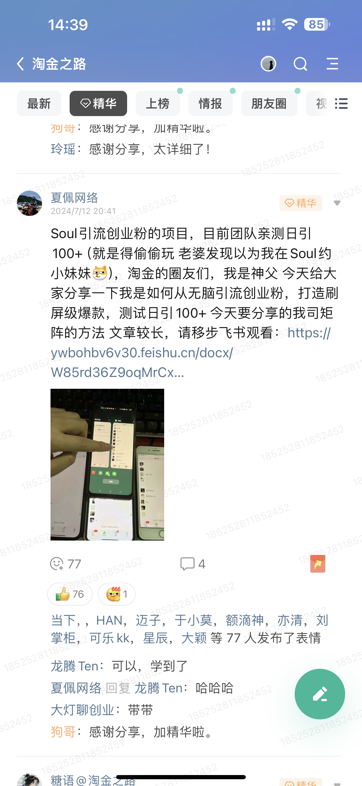

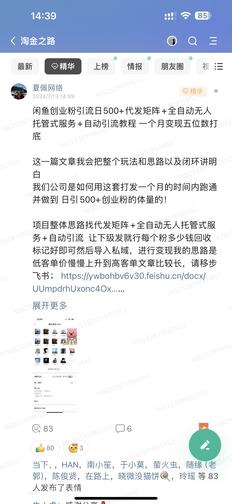

> 关于做流量的方法有很多，各位圈友也在星球上分享了很多，大家可以去看一下，比如小红书截流，公众号，视频号，抖音，闲鱼，soul。需要什么粉就让他们打什么粉就行，这些平台都是可以进行打粉的。大家如果需要这方面的东西可以私信问我。

## （四）、交友搭子玩法

### 1.了解平台的基本玩法

首先肯定要有属于自己的一个后台，然后复制推广链接进行推广

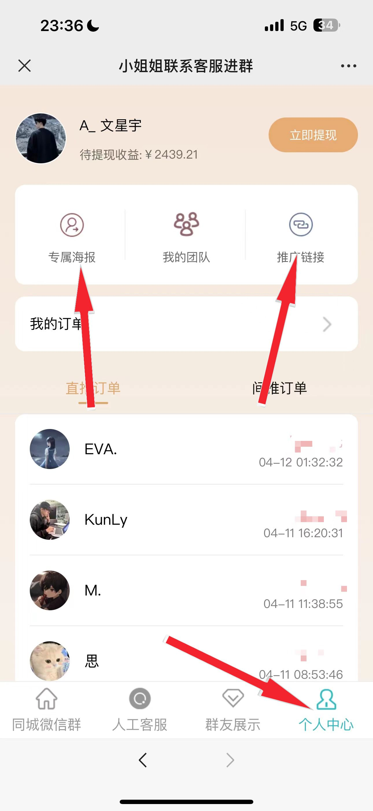

用户通过你的专属海报或者链接付费进群，你的后台就可以看到收益

[208766e62337165e377f18ea808d5196.mp4]()

### 2.三种付费进群引流变现模式

#### （一）、抖音快手截流 QQ 群玩法

##### 第一步：制作一个好看的二维码

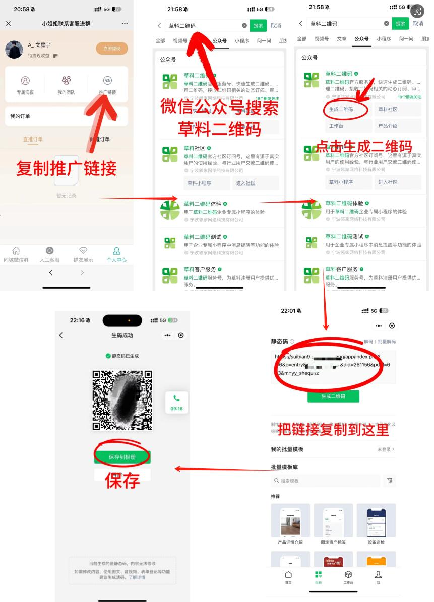

我给大家提供一个模板，你们可以自己制作覆盖上去

覆盖的话也非常的简单，大家可以参考下面的方法

[WeChat\_20240604182918.mp4]()

##### 第二步：QQ 群的设置以及 QQ 群发布的文案

我们为什么要建 QQ 群承接流量呢？用微信不好嘛？因为 QQ 群我会设置好全员禁言，然后开启任何人可以通过群号搜到群聊之后，还有默认用户可见聊天记录。我的 QQ 群可以做到一个无限承接流量，全自动变现的一个效果。主要原因还是因为微信有加人限制。

###### 首先创建一个 QQ 群聊

然后把群的名字和头像都改了，名字改成同城搭子 xxx 群，头像换成美女的照片

1.设置把可通过群号搜索打开

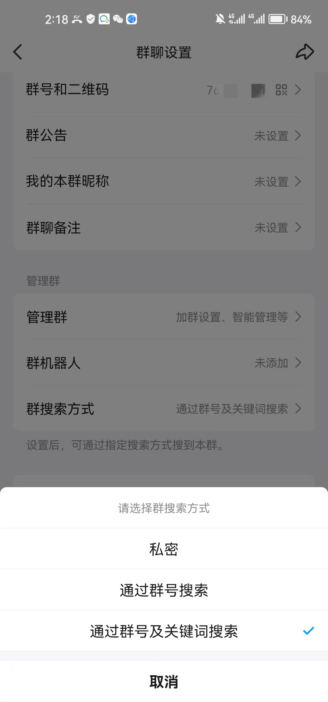

2.设置里面打开全员禁言

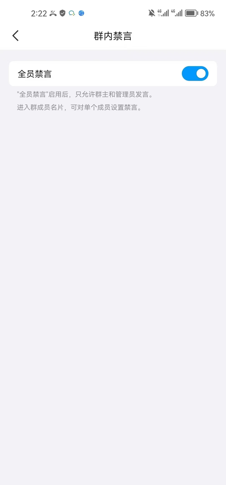

3.设置允许任何人进群

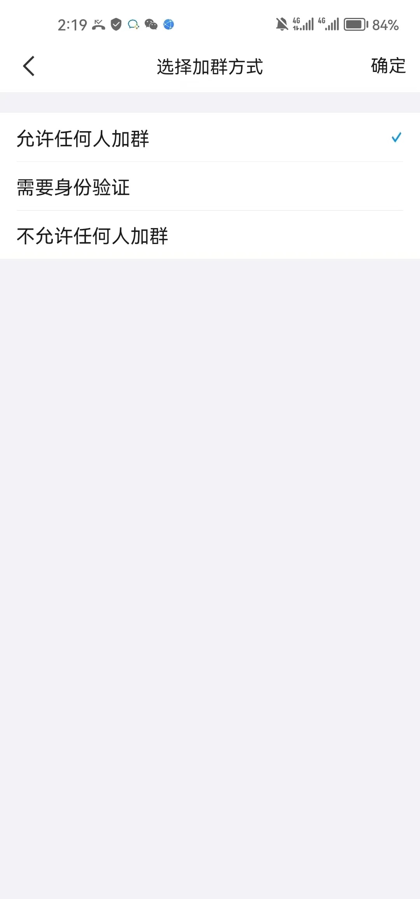

4.在管理群中～功能权限中打开，加群用户默认可见聊天记录

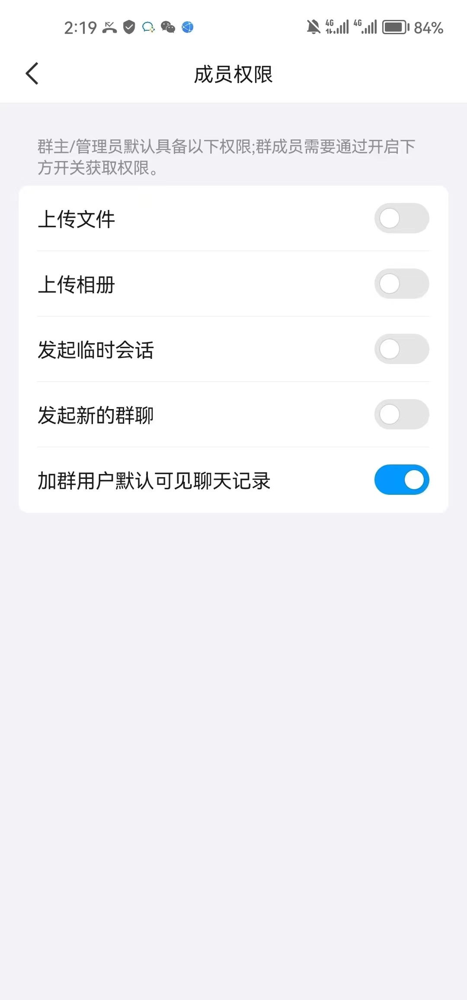

##### 第三步：在群里需要发布的文案以及图片

我们在群聊发布的是 文案+图片 （ 文案和图片可以有效的提高转化效率 ）

例子：

说明一下做了聊天同城 bt 聊天群，里面有很多你想象不到的丰富搭子有门槛直（扫码就可以了）扫描不了保存到 vx 里面有你喜欢的搭子筛选出低质量人群），群内基本上都是 90 后 00 后禁止未成年进入，看上哪个直接加好友去私聊大家都玩得很开认识一群玩得开的小哥哥小姐姐你不觉着值嘛？都是一起玩的圈子（也可以配一些图片）

保存到微信扫码 （一定要加这句话，在 QQ 是无法付款的）

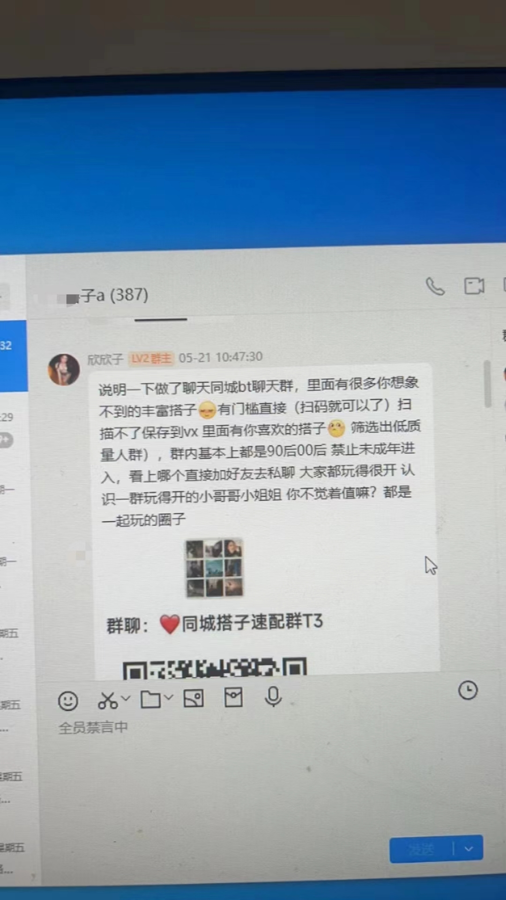

### 3.抖音截流玩法

截流就是去有流量的精准视频下，在评论区去引流精准客户

通常，评论区引流有两个玩法，一个是评论引流，一个是点赞关注引流

项目的底层逻辑：通过在抖音引流到我们想要的目标人群进我们抖音主页，看我们主页留的 QQ 群号，进群之后我们再通过群里发的付费群二维码进行变现。

#### （一）、养号

新号养号流程：

第一天注册好抖音的时候可以直接改头像和名字，然后多刷一下视频，至少刷 1-2 小时

第二天去搜索对标的抖音账号，多刷一下他们的视频，刷个半小时，然后偶尔点赞收藏一下视频，刷完一个小时左右就可以填写 qq 群号了。

第三天就刷个半小时左右就可以开始引流。

老号养号流程：

老号的定义是你平时刷视频的抖音号，一定要是老号

第一天：直接修改头像和名字，但是不要进行评论点赞关注的操作，正常刷视频然后去搜索我发你的那些抖音号，偶尔给那些视频点赞收藏一下，然后你的老号就可以经常刷到这些类似的视频，等你的老号经常可以刷到这些类似的视频了，你的号就算是养成了，就可以开始引流了。

&#x20;

#### （二）、在主页留 QQ 群号

**点赞关注的玩法如何留 QQ 群号，**&#x4F8B;子：

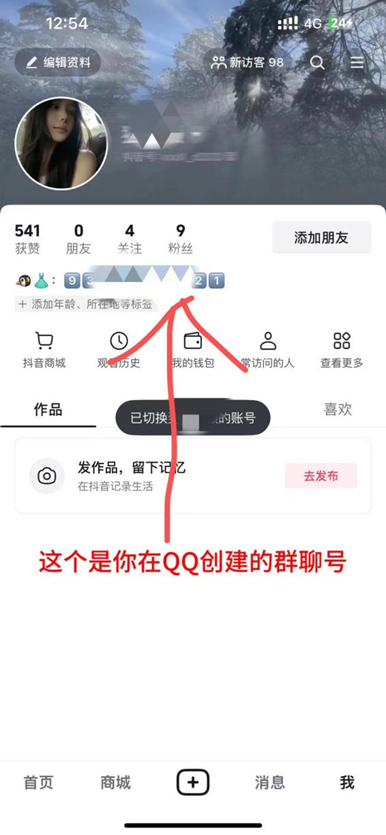

**评论引流的玩法如何留 QQ 群号**：随便发一个美女的视频，然后在抖音上搜索（抖音视频如何添加合集，把合集名改成：qun：你的 QQ 群号

如果还是不懂的话，可以搜索一些这几个账号：

90193469868  hao2709888  20513795175  MKK5529  175102605  63429109984

#### （三）、引流方法

点赞关注截流法，这个玩法具有可复制性

你抖音主页刷到的这种找搭子视频，去看他们评论区，有很多女生的评论，会吸引很多这种男粉，你给他们一个个点赞＋关注，（点赞关注的评论最好是刚发没多久的评论，效果更好），他们自己就会看你的主页，然后加到你的 QQ 群，一个抖音号一天可以点两百个关注左右，这种方法效果很不错。

&#x20;例子：

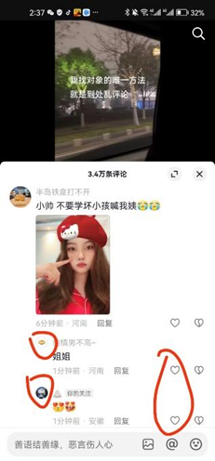

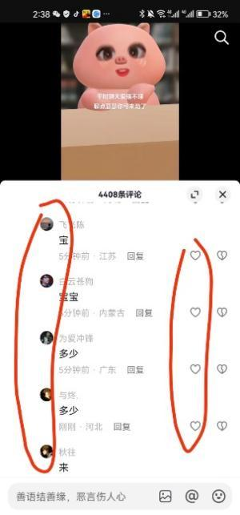

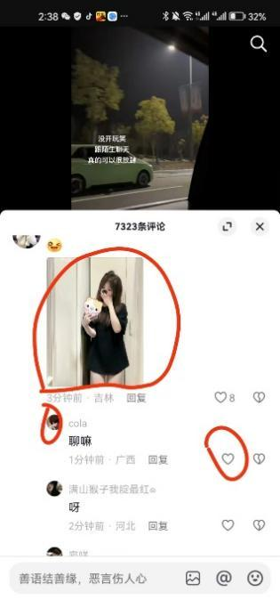

这个就是关于抖音的引流方法，抖音引流目的就是让这些找搭子的人进你的 QQ 群，然后看到你的 QQ 群发的的付费二维码，扫码进同城群就行变现，以及盲盒抽纸条就行变现，盲盒抽纸条=女生的微信，此项目是长期收益，有很大的价值懂得都得

你有多个抖音号可以多种玩法一起玩，上人肯定更多。

实操：

[5eccd50fcd1e5490e0e15db3deda2c06.mp4]()

### 4.快手截流玩法

#### （一）、养号

快手第一步同样也是养号，但是快手平台规则没有抖音那么严格，不容易违规。无需像抖音进行严格养号，账号直接去刷美女视频就行

#### （二）、主页留 QQ 群方法

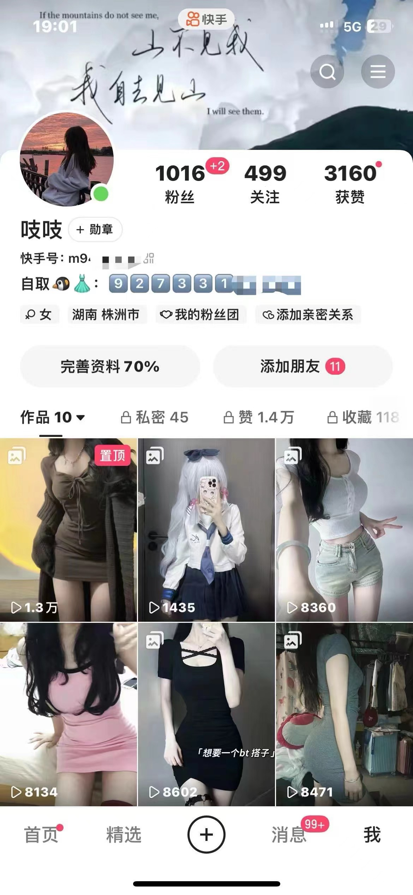

大家在快手主页留下 QQ 群号就好了。我们可以适当发一点女生日常作品，提高转化。其实快手截流玩法和抖音的方法是差不多的

##### 1、点赞引流法（与抖音有区别，我们只需要点赞目标对象即可）

[90e80231ba1c7fad2287001c8699e623.mp4]()

原理是什么呢？我们点赞这些精准客户，他们感兴趣来看我们的主页，这就达到了一个引流效果。

##### 2、评论引流法

这个很简单，无需讲解，你刷快手的时候，评论区那些都是引流的同行，你看评论区别人是如何引流的，照着做就 ok。注意一定不要色情引流

> 以上就是关于交友搭子的一些玩法和教程，大家有什么不懂的可以私信问我。

## （五）、小红书虚拟资料

这个项目的话狗哥大佬也在星球上开设过实战。为什么我把这个项目放在第四呢，因为经过我团队的测试，这个项目的复购率高，英语提分这个项目虽然也有复购率，但是要等用户的孩子上初中或者高中才行。

这个项目其实就是发布无版权的虚拟资料并引流到私域里销售，主流的赛道还是 k12，论文，考研，APP 安装包等等

### 1.养号

用流量注册好小红书账号，每个视频必须完播，可以分不同的时间去刷，分三个时间，早、中、晚，每个时间段刷半个小时就可以了。

第二天，继续养号，刷视频。到搜索框搜索你所做赛道的对标视频，偶尔进行视频的点赞，评论以及收藏，关注所做赛道的博主

第三天，完善账号的信息，其他跟第二天一样的操作。

### 2.人设和经历

和小红书商单不同的是，小红书商单不需要写简介，但是这个不行，得写一些关于你的身份，背景，所做赛道以及经历的东西，这样子可以拉近跟用户的距离感

头像方面的话，比如你做 k12  赛道那就是 用跟老师相关的头像，你做健身的就用肌肉们猛男的头像，以此类推

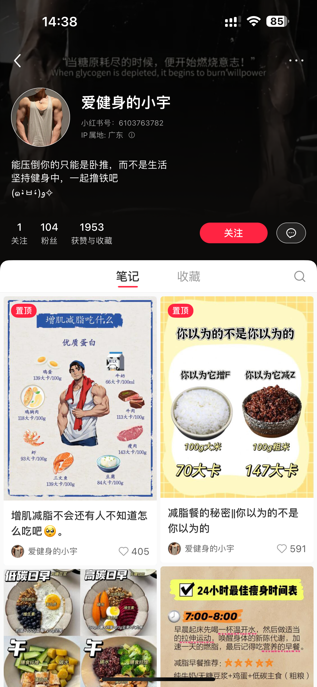


### 3.对标账号

搜索框搜索你所做赛道的笔记，比如你做的是教辅资料：


这一类型的笔记就是你的对标账号，尤其是爆款的

要记住一句话：同样的爆款，爆过一次之后，一样会有上热门的可能

所以我们要做的就是，分析他的内容，分析他能成为爆款的原因。

### 4.笔记内容

推荐使用 3：4 的这个比例，因为大部分的爆款笔记都是这个比例。

前期笔记内容不知道怎么做的话，可以看一下已经上热门的同行，去模仿就行。

模仿同行，成为同行，超越同行

大家千万不要直接抄，一定要在抄的过程中，分析他能成为爆款的点，这样子有利于我们以后自己就制作出爆款。


### 5.关于封面

一个好的封面可以让你事半功倍，因为小红书是一个以图文形式的平台，所以制作一个吸引人的封面是非常有必要的

以健身为例子：

[078994946cc5114a176f6a2f73616c2b\_raw.mp4]()

大家通过上面这个视频可以发现，无一例外，封面都是非常吸引人的基本上都是健身的男性或者女性

### 6.封面以及内容的制作 APP：

1.醒图

2.美图秀秀：https://pc.meitu.com/

3.稿定设计：https://www.gaoding.com/

4.创客帖：https://www.chuangkit.com/

### 7.标题

除了封面之外，标题也是尤为重要的，用户第一眼看到的是封面，第二眼就是标题

大家可以是使用一个工具：后羿采集器，这个工具也是实战期间推荐的

这个是官网的链接：https://www.houyicaiji.com/

使用方法如下：


复制链接之后，直接把链接粘贴到后羿采集器里


接下来开始采集


以上就是关于后羿采集器的使用教程

大家把提取出来的关键词重新进行一个组合，这个又是一个全新的爆款标题。

### 8.内容文案

内容文案这方面可以直接对标同行的，把他的文案扒下来，然后丢给 AI 进行二创

二创之后，再手动进行润色，毕竟 AI 写出来的东西有点太官方，缺乏口语化

给大家推荐几个 AI：

豆包：https://www.doubao.com/chat/?channel=baidu\_pz\&source=db\_baidu\_pz\_01\&keywordid=weizhi13

火山写作：https://writingo.net/document?docId=1

接下来大家要在文章下点钩子，比如评论区评论 1，送价值多少多少的资料 。

或者是，私信 666，送价值多少多少的资料 。

话题方面的话，大家在发布笔记之前，一定要加多点话题，小红书不像抖音有限制，大家可以把热度高的都添加上去


就比如健身这个话题，衍生出来的这些话题，过亿浏览的大家都可以添加上去，有助于流量的提高。

### 9.引流

笔记发布之后就是等流量起来，等人来找你，但是小红书对于引流这方面查得比较严

所以大家还是可以按照拉群的一个模式去进行导流，只不过发布导流图片的不再是主号，而是小号，毕竟小号没了就没了


### 10.成交

因为我们是以免费送什么什么资料进行导流到私域的，那么等他加过来之后先给他发你所承诺的资料，积累信任。

接下来就是等他再次咨询你要资料

例如：


以上是部分的出单案例，你已经送过东西给他了，在免费送肯定不行

这个时候搭配一套话术：

您好，这个资料不能再免费送给你，资料来之不易，需要的话可以购买！

这个时候，用户一想，确实也是这种情况，就促进了成交。

> 很多人可能没有这些资料，大家可以用一下我的这个
>
>
>
> 初高中资料：链接： https://pan.baidu.com/s/1TWALdmcLlApv7uSppAyjXA?pwd=8888 提取码： 8888&#x20;
>
> \--来自百度网盘超级会员 v1 的分享
>
>
>
> 考研资料：链接： https://pan.baidu.com/s/1dhSMyU1nljPFz3rUSj04mQ?pwd=8888 提取码： 8888&#x20;
>
> \--来自百度网盘超级会员 v1 的分享
>
>
>
> 如果想做其他赛道的话，大家可以到拼多多或者淘宝购买，几块钱一份不贵。

## （六）、接下来就是关于线上合伙人以及线下合伙人的

当信任这样子一步步培养过来之后，你的粉丝粘性以及信任度就非常高了，可以说已经是小迷弟的那种，毕竟你带她赚到钱了。

后续他问你还有什么项目，你给他介绍之后，如果他预算充足的情况下，都会毫不犹豫的上车，也不需要你再过多的去介绍了。

关于合伙人这方面的东西，我在这里就不跟大家过多介绍了

想了解的大家可以看我上一篇帖子：[ 新人做私域IP如何赚到第一桶金](https://lwhhubzf68z.feishu.cn/docx/XQA2dfM22ocDZVxqoDDc1wN5ndd)

# （四）、总结

这个玩法麻烦的地方你后端的产品问题，以及一个人员问题，你需要做到的是一个项目有一个专门陪跑的导师，如果交付不好的话一样也是没用的。

对于没有产品的圈友们，可以直接照抄我的玩法，每个项目的链路我都写出来了。

这就是一整个闭环的玩法，环环相扣。

方法给各位圈友了，剩下的就是看各位圈友的执行力了。

我一直都相信，越努力，越幸运，很多东西只要迈出去第一步才发现是非常简单的

另外很高兴加入淘金之路这个大家庭，狗哥大佬搭建的这个优秀圈子，真的改变了我很多，与优秀的人为伍，创业的道路好走很多。

很感谢带我入行的导师，首负大佬，如果没有他我可能还不知道有淘金之路这个优秀的圈子。加入淘金之后真的学习到了很多的东西，不论是方法上，项目上，或者是资源上，都帮助到了我很多。

很多圈友找我讨论创业粉问题， 如果你也感兴趣的话，可以直接联系我：NIARJUN，知无不言，言无不尽！

最后，祝大家淘金之路，一起变富！

