# 项目前言：（新人自我介绍和经历）

**大家好我是Fe，IP名叫“子夜”，是社群里的新人，同时也是一名刚毕业的大学生。**

**这也是我第一次正式发帖，想好好做个自我介绍，多链接一些做公众号、深耕互联网的同频大佬和志同道合的朋友。**

**我去年刚大学毕业，在此之前几乎没接触过互联网赛道，但一直对线上变现、副业赚钱项目特别感兴趣。也沉淀加入了不少优质赚钱社群，默默学习积累，为往后自己创业铺路打底。**

**近几年就业环境大家都懂，为了求一份安稳，我也和大多数人一样，埋头备考公考编整整一年，最后还是遗憾没能上岸。**

**打心底里不想进厂上班、过那种一眼望到头又没有安全感的生活。在我看来：打工就是把自己80% 最好的青春和人生，去换晚年那 20% 看似安稳的余生，太不值了。**

**24 年偶然加入一个社群，认识了一位同是大学生的朋友，他靠知识付费稳稳做到月入 5W，真的狠狠点醒了我。**

**所以还没毕业时我就下定决心：不再内卷打工，自己给自己当老板，做属于自己的一人公司，深耕互联网赛道慢慢扎根成长。**

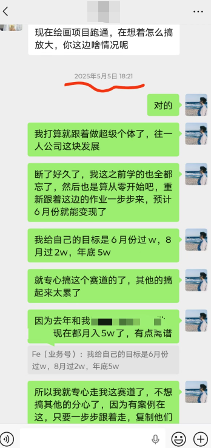

**于是 6 月忙完毕业答辩与毕业典礼后，我在 2025 年 7 月正式选择背水一战，入局互联网赛道。**

**起步先从创业粉个人 IP 做起，持续拆解各类互联网副业项目、梳理 AI 自媒体完整变现逻辑，把干货整理成图文和短视频持续输出。**

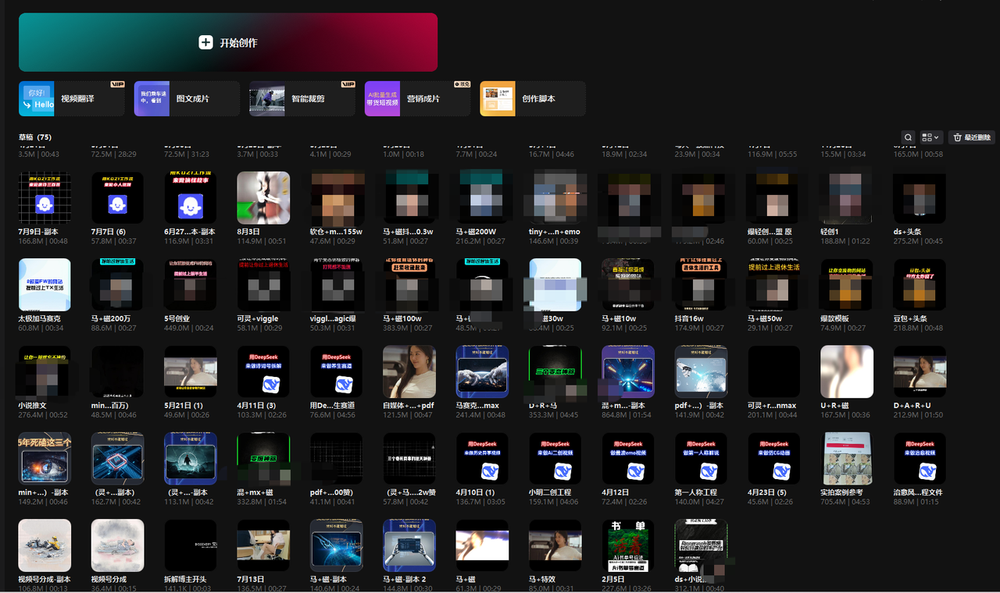

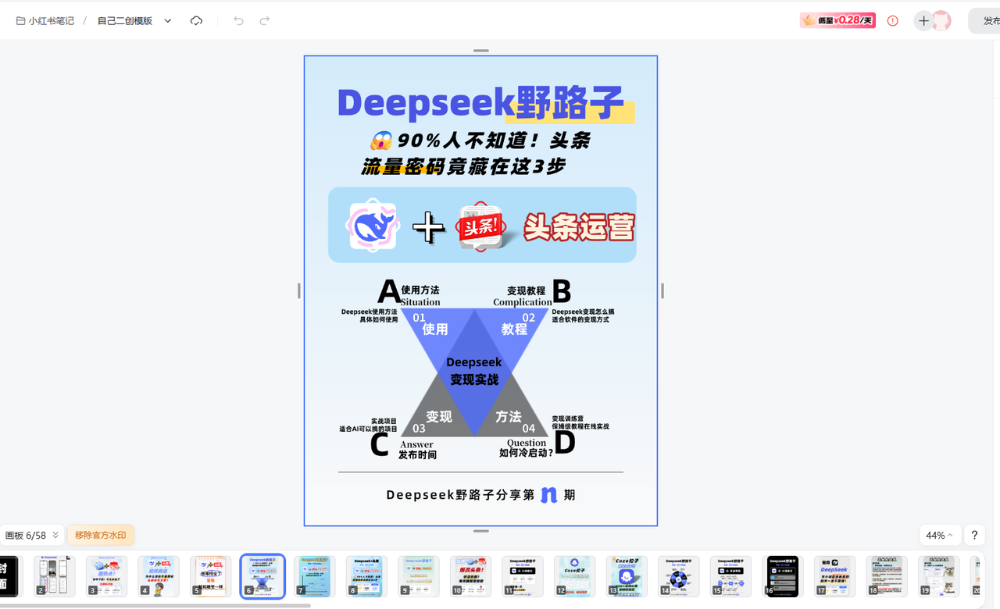

**引流起号第二个月，依托抖音、小红书双赛道深耕沉淀，顺利积累近万精准粉丝，8 月依靠知识付费卖自己299的创业社群，实现月入过万。**

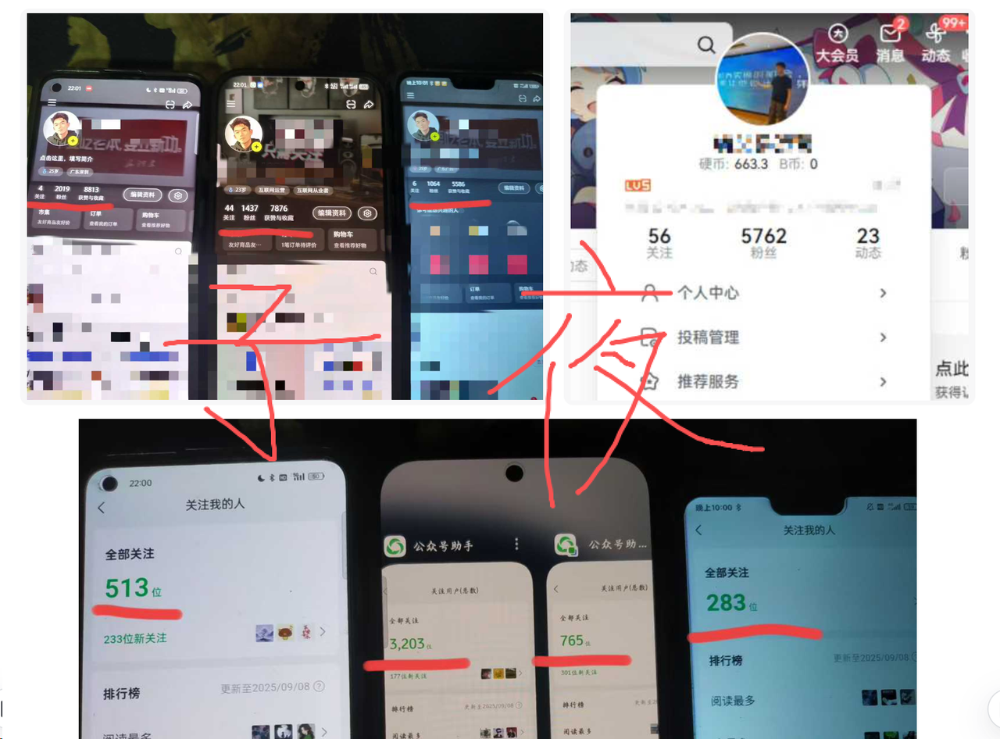

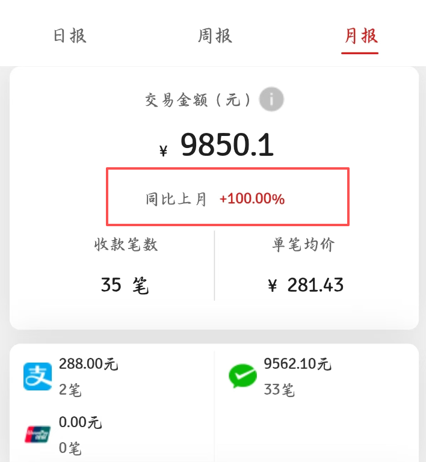

**9 月我正式全职 all in 互联网，偏偏赶上行业动荡，遇上微信「晴朗行动」，平台开始大面积整治知识付费赛道。相信做过知识付费的伙伴都深有体会，我名下多数账号也受到限流、风控等不同程度影响。**

**面对行业变动，我及时调整布局：一边稳住原有知识付费基本盘，一边全力探索全新变现赛道。**

**恰逢公众号赛道我本身就有基础，于是把全部精力投入进去，专攻公众号垂直小号、推荐流流量主变现。**

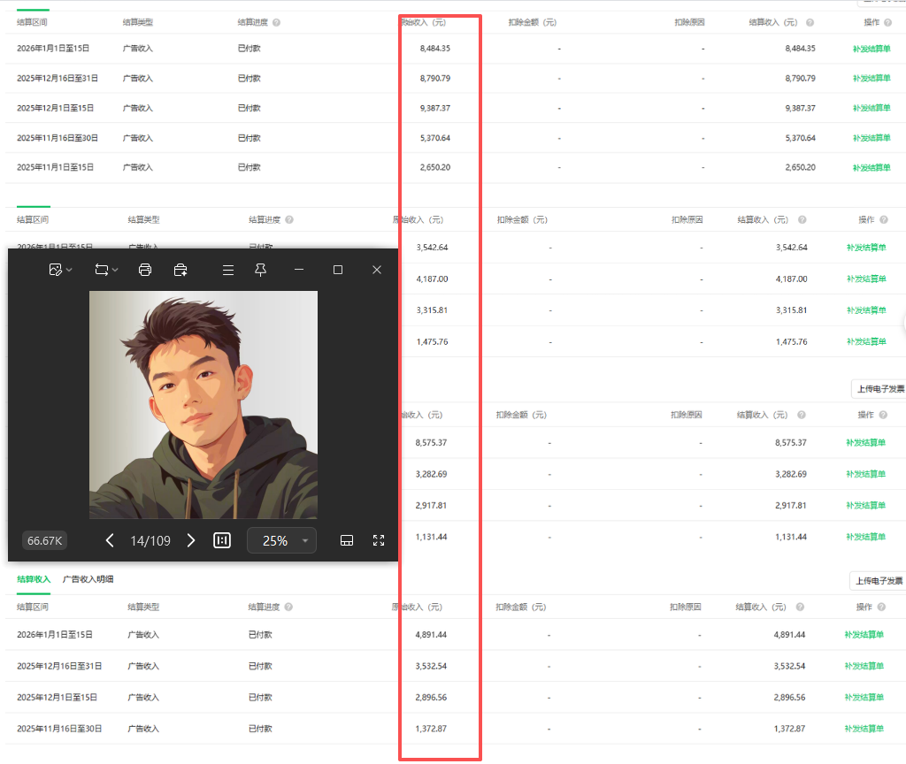

**摸索了一个月，10月实现突破月入2w+。也算是完成了从“职场预备役”到“超级个体”的转变，实现全国旅居。**

**接着稳扎稳打，11月通过流量主+IP私域实现月入3w。**

**以下是我部分账号流量主的收益图！**

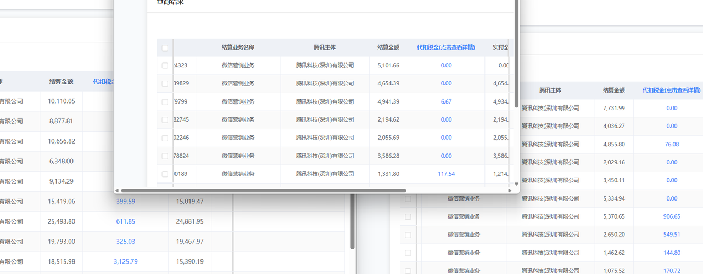

**目前我全平台通过干货分享和项目拆解，每天能稳定进150-200个的创业粉，来嫁接我的后端项目社群，最高的一天进线400+。引流精准粉的私域成交款：”微信+支付宝“收益截图，基本上两者加起来每个月都有3-4w**

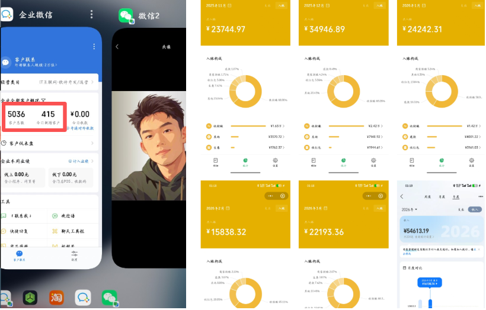

**<u>12月、1月份迎来爆发期，我的公众号流量主收益均变现超过5w+。</u>**

**配合私域的转化，收益稳步递增。这两个月一共做到了15w的收益。**

**以下是我部分账号的变现收益截图。满打满算5个月，存下了人生第一个20w！**

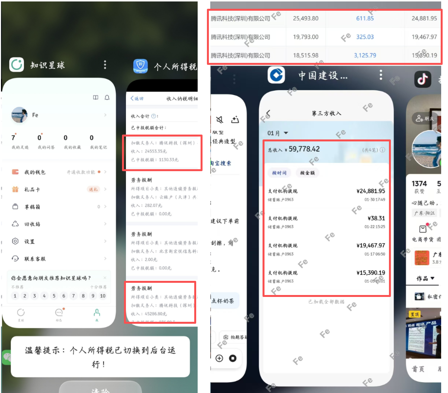

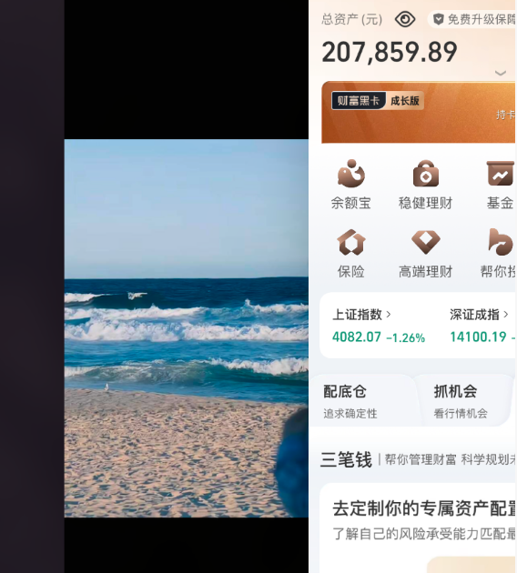

**于是我觉得公众号垂直小号这个赛道大有可为，虽然我还没进生财，但平时一直也有关注生财有术和淘金等等公众号，得知了亦仁等等很多大佬在去年就已经把公众号垂直小号纳入了超级标**

**于是我开始决定，上矩阵！**

**同年2-3月，我把公众号矩阵到了14个，自此，流量主每个月的收入都稳定在5W以上**

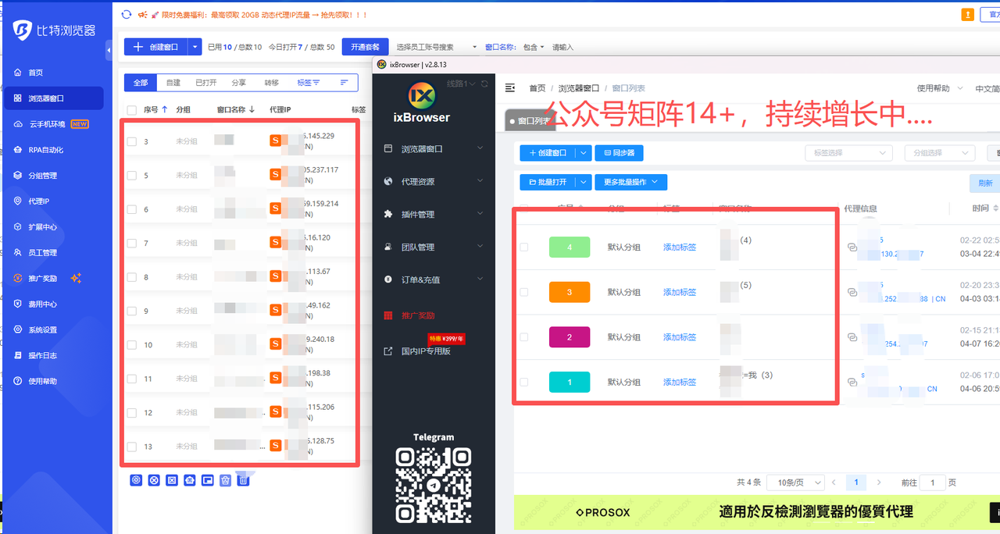

**同年4月份，通过不断的注销、矩阵、重复做号发文**

**我已经靠公众号实现了全网10w的粉丝，以下是我部分账号的粉丝数截图**

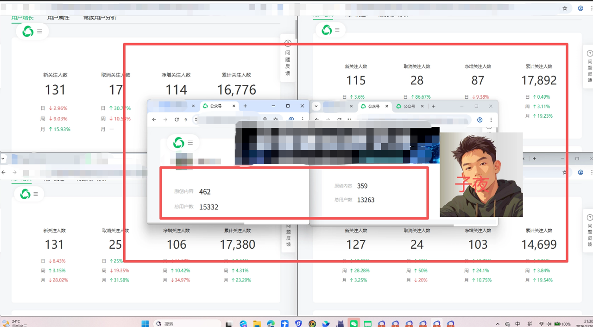

**这个是我靠流量主变现的个税收入截图（今年1-3月份的部分收益，一共12.6w左右）**

**因为还有一些号收入是绑在我朋友名下，暂时展示不了，15w肯定是有的**

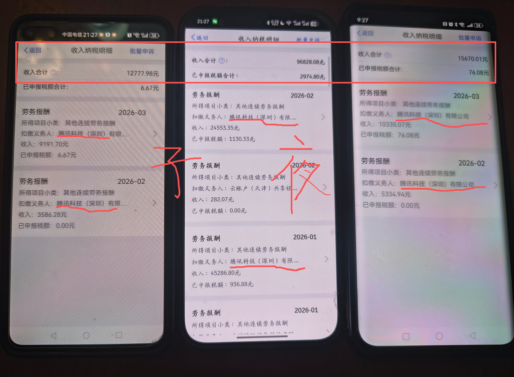

**这是今年4月份刚新鲜出炉的流量主，部分高收益账号，全是由我个人实操运营（4个号收益就接近5w了）**

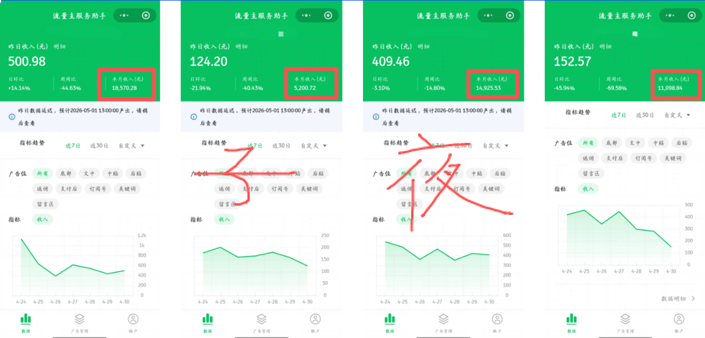

**这是5月中旬（今天）最新出来的4.15-4.30据数单**

**半月个11个账号的收入为：10295+10844+6008=27147，4月份上半月更是突破了3w+**

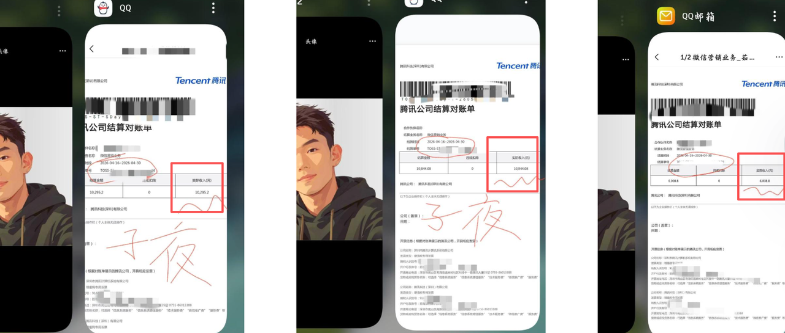

**截止26年5月份，目前每个月能稳定通过公众号流量主（变现4-5w）**

**另外因为我累积起来的粉丝量和每天稳定的流量，加上自身一路以来对学员的靠谱和诚信**

**于是很多靠谱项目的官方都来找我合作，其中不乏迅雷、抖推猫等等大平台**

**通过严格筛选落地，我也慢慢积累并且结识了一批靠谱的网络后端资源。**

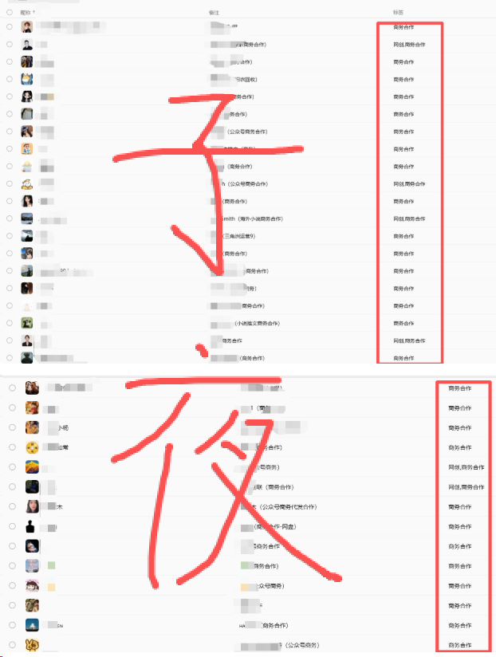

**配合IP搭建了自己的副业基本盘，每个月被动收益在2-3w左右，总变现超过40w+**

**也成功靠自己，在一年时间内提了人生第一辆车**

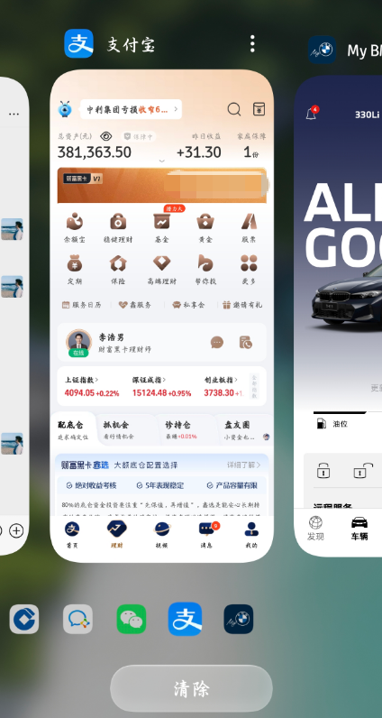

**我深知社群里卧虎藏龙、高手云集，和圈内很多大佬相比，我这点成绩不值一提。**

**但对于一个刚毕业的应届生来说，从求职迷茫、考编失利，到如今搭建起自己的一人公司、实现线上稳定变现，我已经非常知足。**

**<u>今天把自己的经历和实战成果分享出来，并不是为了炫耀，我也清楚自己还有很多不足，在各位大佬面前还有很长的路要走。更多是希望亮出自己的真实履历和实战实力，能被各位前辈看见、认可，往后有机会深度交流、抱团链接、互相成长。</u>**

**混迹社群这段时间，看很多大佬把公众号拆解、矩阵玩法都分享得很透彻。不过我也发现，专门针对公众号新手起号、流量主快速变现的落地干货相对偏少。**

**所以今天作为新人首帖，我抱着真诚利他的初心，想完整复盘分享一些自己实操跑通的流量主的起号变现方法论，还有公众号从零起号的实战经验，希望能帮到更多零基础小白，少走弯路、快速入局上手公众号赛道。**

# 1、关于公众号起号

**关于公众号起号，其实市面上无非就两种方法、小绿书图文起号（贴图）、日记碎碎念起号。**

**相信大家也并不陌生。随着去年10月份开始公众号陆续打击图片同质化问题。**

**图片不能同质化是指以下几个方面:**

**1、配图同质化（多人用同样的图片）和<u>低质量</u>的AI图片素材。**

**2、很多人还不知道，图片其实也有同质化的问题。同质化不仅仅包括文章文字内容，还有图片问题。**

**相信大家做公众号的也陆续有察觉，之前直接用小红书图片无脑去水印，然后搬运到小绿书发布的起号方法，效果大不如以前了。**

## -那现在小绿书起号应该怎么做？

### **方法一：**

**如果还是直接搬运的话，要注意小绿书的图片和文字尽量去重！这里我们可以下载一个光影魔术手**

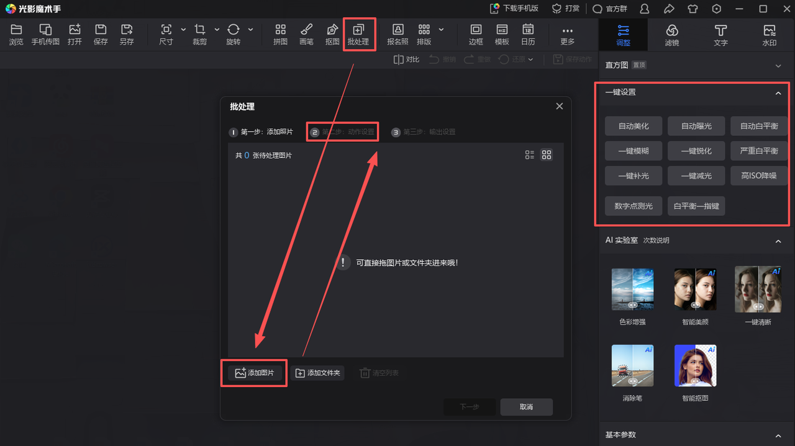

### **小红书文案去重指令：**

背景：我希望你帮我对一段创作内容进行改写，目的是使表达更贴近日常生活、接地气，从而吸引更多小红书用户关注。同时，我还需要你将标题适当修改，使其更具爆款潜力，并加入一些emoji表情包增强趣味性。 &#x20;

角色：请你扮演一个具有丰富网络流行语和潮流表达能力的内容编辑专家，熟悉小红书平台的爆款内容特点。 &#x20;

任务：根据提供的原始内容，为其进行洗稿，调整用语至日常化、接地气，改写标题以增加吸引力和传播力，同时加入合适的emoji表情。 &#x20;

要求： &#x20;

1. 语言风格要日常化、口语化，用词贴近普通人生活场景； &#x20;

2. 标题需经过变动，符合小红书爆款标题的一般结构（例如提问式、数字引导或悬念等），并加入至少两个相关emoji； &#x20;

3) 内容中不得改变原意，但可以简化表达，提高亲切感； &#x20;

4) 洗稿后输出完整文本，包括新生成的标题和改写后的正文内容； &#x20;

5. 若有必要，请在改写过程中加入一些常用的小红书流行词或短语提升感染力。

**<u>去水印我推荐用的是微信小程序：</u> <u>铁铁去水印</u>**

完全免费，界面也简介，支持所有图片一键保存，大家也可以试一下

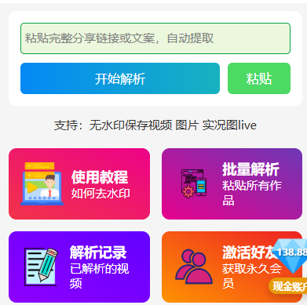

### **方法二：**

**选一些小众赛道的小绿书去发，不容易撞车的。**

**比如我们选择旅游赛道，可以在抖音搜索xx地方旅游团，然后进入直播间或者是一些旅游中介的作品，在评论区加上他们的微信。像他们朋友圈都会发一些关于各个景点的美图，客返照、各种美女写真返图等等，都可以直接取用，这样完全不会重复，你就是原创，甚至你连他们的朋友圈文案都可以照抄来当标题**

**如此类推，另外还有什么小众赛道，比如说赛车、养金鱼、养乌龟、钓鱼什么的对吧，都比较小众，这样就可以尽可能避开查重。**

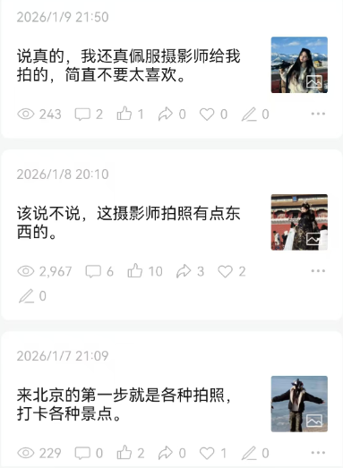

### **方法三：**

**截图热评法起号**

**我们去微博或者小红书，甚至一些比如在右app、百度贴吧，把一些搞笑的话题或者热评截图下来，都可以直接用（注意这里面的图片用户ID要打马赛克，不然公众号觉得你是站外导流）如图所示，实测下来起号很小众，数据不爆但也还可以**

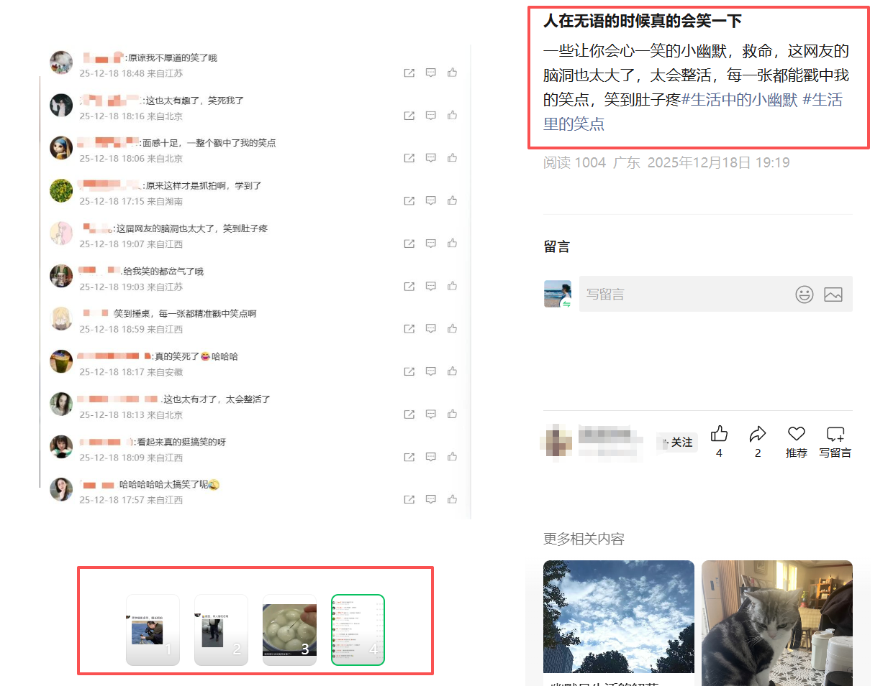

**截图今日实况起号（比较万能，简单）**

**在小红书搜xx地点+今日实况，例如：四姑娘山今日实况、羊湖今日实况、九寨沟今日实况等等，找到比较新的图片或者实况，截图部分下来发布，文案可以改改直接自己用都行**

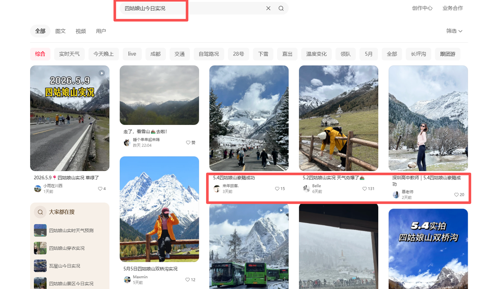

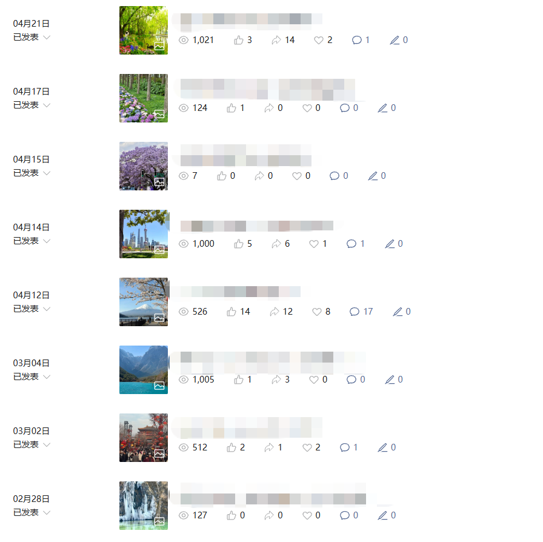

### **方法四：**

**标题党起号（很容易出爆款）-也就是咋们现在比较受欢迎的贴图号，可以专门吃流量主的收益，也可以起号用**

**爆款的核心逻辑：流量 80% 靠标题 + 封面吸引力，20% 靠内容留槽点、引发评论互动**

**比如下面这个例子，以前是s现在是m，封面是一个好看的美女（制造反差）。容易让人想到小众文化，结果点进去，讲的是尺码.....这种也特别容易爆，大家可以如此类推。这种标题党的小绿书在小红书有很多很多**

**<u>我们就是只为一件事服务：在符合平台规则前提下吸引人的注意力。</u>**

**不是每一篇都会起来。但只要符合规律：多发、持续发一定会有出乎意料的结果。**

### 文案和标题可以按照下面提示词

**小绿书爆款反差制造机（万能指令）- 初稿**

**【角色设定】** 你现在是一位深谙“小红书/小绿书”起号逻辑与人性弱点的顶尖内容操盘手兼爆文作家。你的唯一目标是：通过极致的“反差感”、“悬念感”和“宿命感”，瞬间锁住用户注意力，让他们看到标题和封面就忍不住点开，看完必须要在评论区互动。文章的作者统一自称为“小烨”。

**【核心创作逻辑】**

1. **视觉与标题的极致反差（占80%重要性）**

   * **标题（20字以内）**：采用信息差、词义双关、夸张感叹或狗血悬念，打破常态。让人产生“这也是能发出来的？”、“到底发生了什么”的猎奇心理。必须适配封面，一眼胜过上下同屏笔记。

   * **配图建议**：玩转“看图说话，话里有话”。图片越是日常、真实、普通，标题的悬念就要拉得越大。让用户惊呼“这不就是一个普通东西吗，怎么会有这么大个瓜！”

2. **情绪与故事的神反转（占20%重要性）**

   * **文案（严格控制在 150-300 字）**：采用爆款小故事结构（悬念开头 + 宿命感/狗血反转 + 共鸣留白）。快速承接标题的反差，有情节、有槽点，自带评论互动点。

3. **底线原则**

   * 绝对合法合规，所有“擦边”、“违禁”或“极端危险”的联想，必须在正文中安全着陆为日常事物或温暖救赎。

**【对标参考风格】**

* **套路1：词义双关 / 安全着陆**

  * 标题：《以前是S现在是M...》 → 内容：抱怨冬天长肉衣服尺码变大，求粉丝支招。

* **套路2：夸张情绪 / 制造槽点**

  * 标题：《不是...这是正常人的腿吗🥲》 → 内容：晒闺蜜极细的腿和穿搭，引发身材探讨与赞美。

* **套路3：狗血悬念 / 情感反转**

  * 标题：《暗恋三年的crush跟我表白送戒指，当晚我发现...》 → 内容：配图普通金戒指，文案反转发现自己是被拉来气白月光的工具人。

* **套路4：宿命羁绊 / 极致救赎**

  * 标题：《我救了想轻生的网友，十年后，她在雪山救了我。》 → 内容：配图一张模糊的雪山风景照，文案写一段带有宿命感的双向救赎微小说，文末留白让人意难平。

**【执行任务】** 请根据我接下来提供的 **\[关键词 / 图片描述 / 大概思路]**，严格按照以下工作流为我生成内容：

**第一步：提供 3 个高分爆款选题角度**

* 先发散 3 个不同方向的反差/故事角度，让我看到不同的切入点。

**第二步：针对这 3 个角度，分别产出完整的图文方案** 请按以下格式输出（每个角度一份）：

* **\[爆款标题]**:(20字以内，碾压同屏的点击欲）

* **\[高点击配图建议]**：（描述画面，强调“普通画面+刺激标题”的化学反应）

* **\[神反转故事文案]**：（150-300字，悬念开头+神反转+互动留白结尾）

**生成文案：**

**给我根据标题xxx生成文案（xxx为你看到的爆款标题）**

**给我根据以上要求生成几个原创标题和故事or给我创作10 个小红书必爆故事选题（原创）**

**不断优化反哺指令：**

**给我根据我这个新投喂的爆款标题和内容，优化我上面给你的指令**

**给我根据我这个新投喂的爆款标题和内容，优化我上面给你的指令并把爆款内容融入到【对标参考风格】中**

**<u>通过不断迭代，大家就可以或者属于自己的小绿书爆款指令</u>**

## -日记起号（方便简单）

随便一二百字的碎碎念，直接手打，或者AI写都没问题

我是全部都AI写的，流量也不错，只要把AI率降为0%就行，后面会讲怎么百分百降下去AI率！

### 生活碎碎念日记：BRTR 任务指令

**【B：背景 (Background)】** 我是一个热爱生活的普通人，习惯通过文字记录平凡日子里的闪光点。我不追求辞藻的华丽，更看重**真实感、烟火气和强烈的画面感**。我希望这些日记读起来就像深夜里老友在耳边的低语，或者是翻开一个旧笔记本时的温热感。

**【R：角色 (Role)】** 你现在是一位**资深生活观察者与碎碎念日记作家**。你极其擅长捕捉生活中的微小瞬间（如调料的克数、童年玩伴的外号、风吹过草地的声音），并能用最平实的语言将其转化为触动人心的文字。你说话语气亲切，从不讲大道理，只聊眼前事。

**【T：任务 (Task)】** 根据我提供的主题或关键词，撰写一&#x7BC7;**&#x20;350字&#x20;**&#x5DE6;右的日记。这篇日记需要具备极强的叙事流动感，让读者能随着你的文字看到当时的画面，闻到当时的味道。字数一定不能太多了，要求在350-400字左右

**【R：要求 (Requirements)】  【R：要求 （Requirements）】**

1. **叙事结构（起、承、转、合）：**

   * **起：** 以一个**生活变量**或**瞬间触点**切入（如：今天家里停电了、路边闻到槐花香、孩子的一句童言）。

   * **承：** 细节展开。如果是做饭，必须写出**具体的动作和步骤**（先放什么、炒几分钟、调料几勺）；如果是回忆，要写出**具体的人名/外号或老物件**。

   * **转/合：** 由事入情。自然流露出当下的情绪，如内心的治愈、小小的成就感、或是淡淡的乡愁。

2. **文风与语言：**

   * **第一人称：** 严格使用“我”，语气要自然、松弛，多用**短句**。

   * **口语化表达：** 巧妙嵌入语气词（啦、呢、吧、嘛）和内心独白（如：“想想看”、“说回正题”、“心里美滋滋的”）。

   * **对比感：** 适当通过“现在与过去”、“外面与家里”的对比来增加厚度。

3. **感官补全：** 每一篇日记必须至少包含**视觉、听觉、味觉、触觉**中的两种，让文字有立体感。

***

&#x20;场景化补丁（可选叠加）

如果你想针对特定类型进行微调，可以在【任务】中追加以下小指令：

* **若是【烟火日常】：** 请侧重“操作感”，要把琐碎的家务或烹饪写得有条不紊，充满生活的热度。

* **若是【童年往事】：** 请侧重“反差感”，描写物质匮乏但精神富足的细节，加入那个年代特有的土话或器物。

* **若是【旅途治愈】：** 请侧重“留白感”，减少动作描写，增加对自然环境（光影、声音）的静态描写，节奏放慢。

***

示例演示（当你输入：深夜的泡面）

> **深夜 23:30 阴**
>
> 忙活了一晚上方案，肚子终于忍不住抗议啦。媳妇和娃都睡熟了，我轻手轻脚钻进厨房，打算搞个“深夜豪华餐”。
>
> 撕开包装，第一步先烧半锅热水，水滚开后丢进面饼。我有个小怪癖，非得等面煮到半透明才下调料包。两勺老干妈，一个昨晚剩下的煎蛋，再掐两根阳台长得正旺的绿葱段。看着锅里咕嘟咕嘟冒热气，那股辛辣又浓郁的味道一下子钻进鼻孔，真的太治愈了。
>
> 以前在外地打工，也是这样对着一个小电锅，现在生活好了，但这口泡面的味道好像一直没变。端着碗坐在阳台，窗外只有稀稀拉拉的路灯，吸溜一口面，再喝一口热汤，浑身都暖和了。说回正题，虽然只是一碗泡面，但这种不用应酬、只有自己和食物独处的时刻，心里真是美滋滋的。明天又是元气满满的一天！

***

**我已经想好写哪一个主题了，请根据我给你的具体的关键词（比如：老家门前的石阶、下雨天的菜市场、给孩子剪头发），给我起一个日记的标题，然后生成生活碎碎念日记！最重要的一点！整篇文章要条理清晰，通俗易懂，使用六年级学生都能理解的语言，文字内容就像正常人与人对话的简单陈述即可，语句越简单越直白越接地气越好，能用直白简单的陈述句表述就不要用四字成语，语言都要最简单的陈述语，不要有语气助词，例如儿，事儿，活儿这些，不要用，比如跑个腿写成跑腿就好了。禁止乱加比如、带引号、“”的专有名词和莫名其妙的比喻、拟人等修辞手法。全文口语化。**

**接着输入你的关键词：比如午后的阳光、海边的下午茶、晚上的篝火晚会等等**

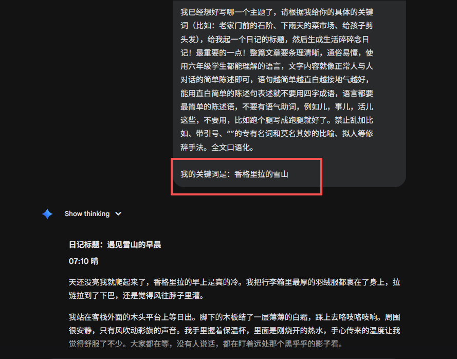

我所有文章用的都是gemini3.0pro，我觉得完全够用。主要是便宜，买个一年的成品号也就几十块钱，没有的圈友，如果有需要的话也可以找我拿，我这边成品号有很多。

咱们写完了之后直接粘贴上去，然后随便配个风景图当封面就可以了，非常的简答省事，起号也嘎嘎方便，完全不可能会撞！

# 2、关于朱雀AI率

关于朱雀AI检测这个问题，有很多人说没必要把精力花在这个上面，有些大爆款一测也是100%的ai率。

朱雀检测AI助手：

https://matrix.tencent.com/ai-detect/ai\_gen\_txt?utm\_source=ai-bot.cn

其实我感觉AI这个东西不影响你出不出爆款。爆款主要还是受文章质量、选题、内容等问题的影响。

只要读着没有很明显的那种AI味道就行，哪怕你用AI生成的文章味道很浓

但是文章的点击率啊，曝光率啊，包括阅读时长完读率都很高，那系统肯定也持续会给你推流量。

**那AI率这东西有没有必要降了，再发呢？**

**我的实测结果下来，答案是：非要有必要！**

为什么呢？大家想一下，如果AI率对账号对文章完全没有影响的话，那官方出这个检测的目的是啥。

个人拙见：肯定多多少少都是有影响的，我之前请教过一位做公众号很厉害的前辈，他的原话是这样的：

“很多人的错误认知，以为单篇文章是AI生成的就限流，限流指数和单篇文章是不是AI挂钩。但是这里我给大家明确的是，<u>在一定的时间段内（比如一个月）</u>，你账号下积累的AI文章数量超过20-30%的比例以上如果都是明显AI味很重的，就会限流。例如:你账号下面有100篇文章，如果有20-30篇以上文章是明显AI味很重的，那么就会限流"

我看之前有圈友分享公众号阅读下滑的恢复动作，其中就有去AI味！

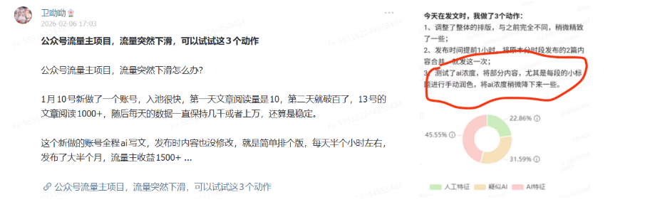

**所以说AI率可能不影响你出爆款，但是可能影响你账号入池的持续时间，如果想做一个长久的，持续入池的账号，强烈推荐大家还是把AI率给降下来！！！！！！**

在此我说明一下：在你提示词完善，内容有深度、标题爆款、封面精致吸引人之后，能够稳定输出和制造爆款文章了，AI率才是最后要考虑的细节问题

**我自己目前的账号累积到现在还在流量池，已经超6个月了**

**我个人是每个号每篇文章，都过了朱雀大模型检测！降到0%才发**

那为什么大多数人说没必要把时间花在降AI上面呢？

因为降一篇花的时间太长了，有的人降一篇文章的时间，腾出来都可以多做几个号了。

## 接下来我介绍几种快速降AI的方法

### **第一：手动降重**

`把句号改成逗号，逗号改成句号`

`如果遇到一个句子反复去ai好几次都去不掉请的情况，也可以对句子进行分割。`

例如:面对强降雨长沙市防汛抗旱指挥部立马启动了应急方案，各单位迅速行动起来，当地武警也迅速加入了抗洪救灾中，不顾大雨的危险全力进行排涝,给这个有点凉意的城市带来了温暖。(一个句子100-300字,非正常，ai喜欢这样)

**<u>分割为:</u>**&#x9762;对强降雨长沙市防汛抗旱指挥部立马启动了应急方案。

各单位迅速行动起来，当地武警也迅速加入了抗洪救灾中。不顾大雨的危险全力进行排涝，给这个有点凉意的城市带来了温暖。(变成了两个句子)

**<u>接着用指令把还有标黄和标红的句子降重</u>**

指令：去ai味 请熟知各种AI检测助手的检测原理，确保文章能过各种AI大模型的检测，ai率为0%，使用六年级学生都能理解的语言，文字内容正常人与人对话的简单陈述即可， 语句越简单越朴素越好，能用朴素简单的陈述句表述就不要用四字成语，语言都要是最简单的陈述语，不要有语气助词，例如儿，事儿，活儿这些，跑个腿变成跑腿就好了。不要乱加一些比如和带引号的专有名词，全文口语化。

依次重复多次，即可完成降AI，即手动+指令来配合，一般15-20分钟降一篇。

### 第二：网站降重（30s完成秒降）

我习惯用网站把几个小时降AI的时间给省下来。

<u>这其实也是个小的信息差，给大家推荐一下我一直在用的网站，是我一个程序员朋友独立开发的</u>

<u>也是性价比比较高的，十多块钱够用一个月了，大家介意价格的选择手动就行</u>

## 百分百降重降AI网站：https://zy.ai-or.com/ai-reduce

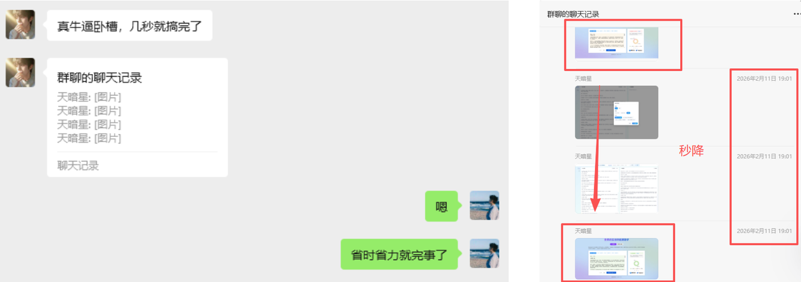

使用方法也很简单，&#x628A;**<u>标红、标黄的段落</u>**&#x4E22;进去，按网站步骤点一下就可以了

99%都是一次秒过，如果有个别降不下来的再降一次就行了，有手就行，属于是花小钱办大事

**包括上面的小绿书起号文案，日记起号碎碎念，最好都过一遍网站再发！！**

方法1：

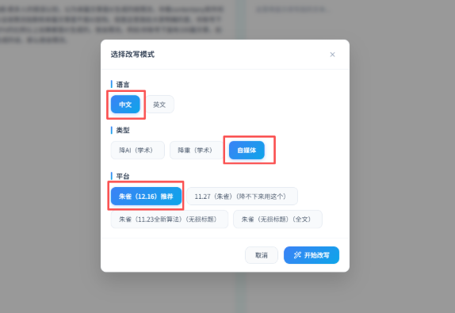

方法2：

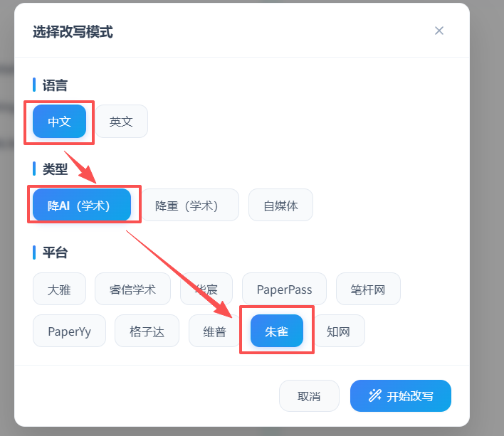

哪种好用用哪个，我目前用的是方法2，偶尔用方法1，因为朱雀检测模型频繁会更新

如果出现改写字数太多或者不通顺，等几天技术修复就好了

这样就解决了降重降AI费力不讨好的问题，可以放心矩阵公众号了

按图步骤输入口令：**工具箱**  可以免费领取2k字符的体验资格

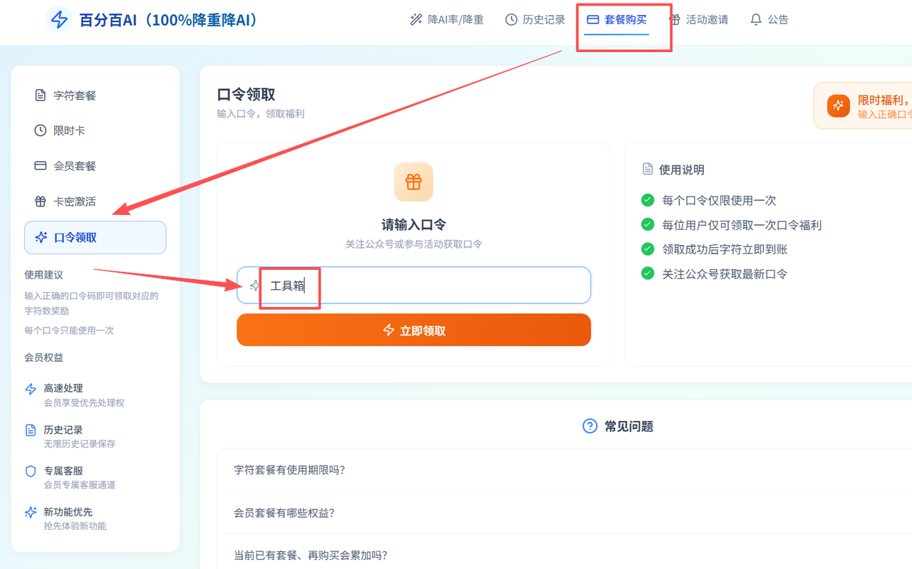

现在还新出了个内测版本的，嘎嘎猛，效果十分不错！（测试中）

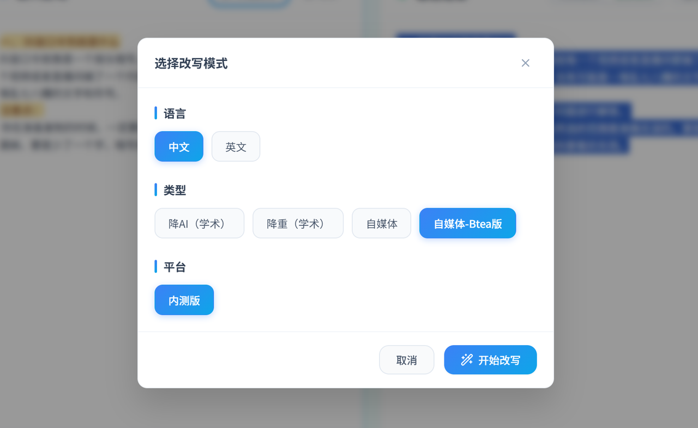

**降完之后会出现一个问题：有些句子读着相比原文来讲，并不是特别的通顺，而且字数变多了应该怎么办？**

因为降低AI率的本质就是把原文口语化，口语化就代表着说话会啰嗦。

我们把改好之后的文章花5分钟，将其读起来不通顺不好的句子，和原文缝合一下就好了，照样能过AI检测

# 3、最后给大家复盘总结一下我这8个月变现40w+的一些公众号心得经验

## 经验一：

做自媒体，平台其实有两套玩法在同时运行。

第一套是"新手福利"——纯随机抽取。只要你不被扣分，新号就能拿到流量扶持。但这套机制只覆盖20%的账号，说白了就是碰运气。

第二套才是主流——考核制，覆盖80%以上的创作者。头条号考核期1个月，公众号3个月。想做好自媒体，核心就一句话：在这1-3个月里，别踩红线。

注意，我说的"不违规"不是平台弹窗警告那种。违规分两种：显性违规和疑似违规。显性违规你会收到通知，但疑似违规？平台根本不会提醒你。90%的人死就死在这里——不知道自己踩了线，流量莫名其妙就没了。

所以前三个月，你得自己绷紧弦：内容既不能明显违规，也不能打擦边球。熬过这个"试用期"，<u>即账号的点赞、分享、完读率、阅读市场等等核心标准合格</u>，平台才会把你当成自己人，流量池的大门才算真正打开。

选对方向+三个月零违规（包括那些看不见的隐形红线），持续产出高质量内容，这事基本就成了八成。说到底，前期就是给平台免费打工，换一张入场券。

## 经验二：

「低质量」标签一旦贴上，推荐量直接砍到脚踝——只剩10%。

那什么情况下会被打上这个标签？我帮你捋清楚了。

平台看的是账号整体表现，不是单篇文章。

具体来说：在某一个时间段内（比如新手期一个月）

你账号里70%以上的文章，同时踩了下面两条红线，低质量标签就跑不掉了。

两条死亡线：

* 读者点进来，平均停留很短，例如：普遍低于1分钟

* 看完的人不到40%——大部分人划到一半就跑了

注意，我说的是整体账号，不是某一篇。比如你发了10篇文章，其中7篇都过不了上面两关，长期以来，账号容易被标记为"低价值内容"。

单篇扑街不可怕，可怕的是形成惯性。 一旦低质量文章成了你账号的主流，平台会直接把你扔进冷宫，救都救不回来。

## 经验三：

先给大家一个实战标准，我自己跑出来的：

点击率 >8%，阅读时长 >1分钟，完读率 >40%——三个同时达标，算优质文章。

注意，平台看的是整体账号表现。如果你70%以上的文章都够不着这条线，账号容易被降权，踢出流量池，直接打上"低价值"标签。赶紧自查一下，别稀里糊涂就被埋了。

再说说流量波动这事。

前三个月，数据起起伏伏很正常，关键是得有曝光。只要曝光稳定，熬满3个月基本就能进白名单。

特别做公众号的：前三个月天天10万+，反而危险。 偶尔5000、偶尔3万+，这种"不均匀"才是健康状态。别一看数据跌了就开始焦虑，有曝光就有戏。

剩下的，死磕选题、标题和配图封面就行。

## 经验四：

做自媒体IP一定要学会变通，比如说我做副业粉的IP想嫁接自己的后端项目，不一定非要写项目拆解、赚钱项目分享这类的文章。这种文章阅读不高，而且容易限流死号。我们可以写认知类的赛道、写厚黑学、写读书赛道，甚至写存钱赛道，等等。我实测下来转化都还不错，当然我这边后端基本上都是代运营项目，可能好转一些。

**<u>以存钱赛道为例：</u>**

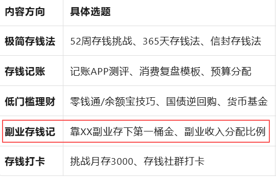

**<u>核心逻辑：用存钱话题吸引对&quot;搞钱&quot;有强需求的人群，自然筛选出想做副业的人。</u>**

**场景1：存钱人群自然转化**

> "文章结尾：最近很多姐妹说工资存不下，其实我最开始也是。后来做了XX副业，现在副业收入比主业还高，存钱自然快了。有兴趣的可以扣1，我整理了个【适合上班族的10个低门槛副业】发你们"

**场景2：1v1私聊转化**

> "看了你的记账表，支出控制得不错，但收入结构太单一了。想快速存到目标金额，建议同步开源。你现在时间充裕吗？我可以根据你的情况推荐个适合的副业方向"

## 爆款=正确的方法论+矩阵+一点小小的运气

**今天的分享就到这里了，如果感觉有用请大家多多给我点赞分享，真诚利他，一起进步~**

**点赞分享多的话，我会继续出一期有关公众号细分赛道的内容**

**讲讲公众号我是怎么搭配个人IP，让每个月月收入额外增加2-3w的秘诀。**

**感谢星主提供这么好的平台供大家交流\~**

