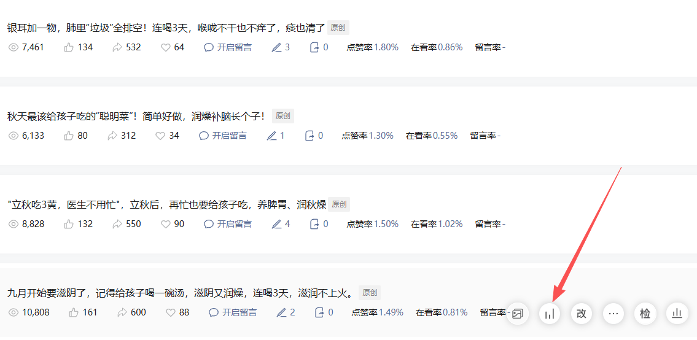
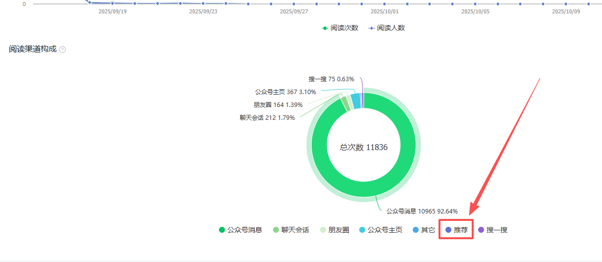

## 选赛道
[‍​​​​​‍​‬‍‌‌​‍‍​‍​​⁠​​‍​​‍‬⁠​‍​‌​​​​​​​‍​‬​赛道对标（参考） - 飞书云文档](https://d7s4ezaanv.feishu.cn/wiki/WA1EwuKxzitYQ5kPElNcSo3Hn8f)
[赛道对标（参考）](赛道对标（参考）.md)
①产品
②所属行业
③兴趣爱好
④选择大流量
⑤单客价值
⑥蓝海赛道

如果拆解和表达增肌对于一些随笔的看法呢？

## 对标账号

寻找近期内从0-1起步并获得真实增长的成功样本。一个合格的对标账号，通常满足以下四个条件：
1. **注册时间新**：优先选择近一年内注册的账号。这意味着它的成长方法契合平台当前的推荐规则。
2. **内容数量少**：总发文数量在200篇以内。这证明它并非依靠长期的内容堆积，而是通过优质内容在较短时间内获得了系统推荐，参考价值更高。
3. **阅读量平稳**：近期文章的阅读量能稳定在几千到几万区间。这表明账号已进入平台稳定的推荐池，流量来源健康。
4. **排除官方号**：各类官方认证的企业或机构账号不作为对标，因为它们的流量构成和运营目标与个人账号完全不同。（就是这种带有公司认证类的账号，这类账号往往粉丝量巨大，所以爆款文章有可能是粉丝阅读，所以不作为参考。）

## 账号包装
专业辨识度 = 名称垂直度 + 简介清晰度 + 头像相关度。

## 注册流量主绑定结算

## 选题

#### 4.12筛选爆款选题

从每个对标账号中，提取近半个月内出现的爆款题目。筛选时应遵循以下顺序：

* 优先提取阅读量达到10万+ 的题目；

* 其次选择阅读量1万以上的题目作为主要参考。

### 垂直深耕型

适用情况：

* 个人IP类账号

* 业务引流类账号

* 小众细分领域账号

直接围绕选定领域持续创作专业内容，建立领域权威性。

### 流量测试型

适用情况：

* 娱乐、养老、军事等大众流量领域

* 以流量主收益为主要目标

初期采用"小绿书"形式快速测试，发布约15篇内容后进行数据评估，根据反馈效果调整内容方向。该方法需要持续优化，具体执行需根据实际数据灵活调整。

## 更新频率

一个账号刚开始写的时候，因为没有获得系统的推荐，所以大多数时候，阅读量都是个位数。随着你的文章垂直输出，后面如果获得了系统推荐，那么文章的阅读量就会慢慢上来，会出现几千几万的阅读。

**大部分账号获得系统推荐的话，在半个月左右**，所以前期没有阅读或者是个位数阅读也都是很正常的。

当你开始启动之后，那么要做的事情就是持续更新。提前准备好第二天的文章，做好定时发布。

## 4.5如何看数据

> 公众号的阅读量主要取决于平台是否将你的内容放入“推荐流量池”。这本质上是一个基于内容质量的筛选机制。理解你账号处于流量周期的哪个阶段，是决定后续所有操作的前提。

**进入流量池**

当你的账号，阅读量突然间有了几百或者几千的时候，而且连续几天都是这样的，那么这时候你的账号往往是进了流量池，获得了相应的推荐。

**掉出流量池**

如果你的账号突然间从稳定的几千几万阅读的时候，变成了个位数，连续几天都是这样，那么这时候可能是掉出了流量池。

**判断更新**

账号要不要继续更新，如果是个人ip账号，那么就持续更新。如果是爆款流量类型的账号，那么就看看近3天账号是否有相应的推荐。

看看单篇文章推荐占比，如果没有推荐量了，那么可能需要注销重来了。

