### ①接广告变现

当一个垂直类的公众号，粉丝越来越多，阅读量也不错，而且比较稳定的情况下，这时候会有很多广告主找过来商家会在后台留言“商务合作”，然后加微信谈价钱，要我们自己出价。

一般他们提供文案，我们发布，费用分头条，条，和三条，大部分人的广告能够200\~1000元一条，头条价格最高。

有些定制类的广告价值更高，主要是依据粉丝数量，粉丝类型，阅读量来定，如果粉丝量比较大，或者是偏向于商业类的公众号，广告费会给的更多，包括平台也会有一些互选广告推荐。

有个素人朋友写的是认知类的账号，半年涨粉到20万。2024年的时候，单条广告能做到2w/条。

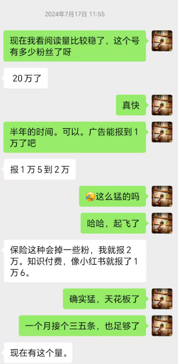

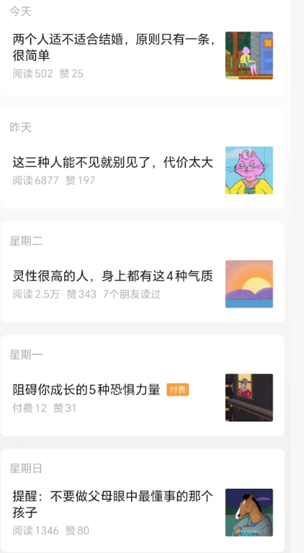

文章垂直形式类似于这种认知类的。

> 要看他们提供的文案，是有关哪方面内容，如果涉黄、涉赌、封建迷信类的，不要接，有可能会造成封号。还有一些涉及到APP下载 ，体育彩票，命理类的广告不接。
>
> 接广告之前，对方一般要后台粉丝数，粉丝画像，粉丝地区，粉丝年龄这些信息，可以给到。

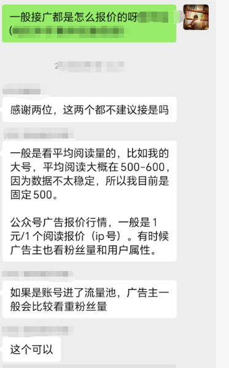

**如何报价：**

以上作为参考，具体广告报价的话大概可以根据自己心中能接受的报价来报，一般个人ip类型的公众号单价高点，一般一个阅读0.5元-1元。

可以根据自己头条第一篇阅读，估算一周的平均阅读。

对方开价自己能够接受，那么就接，不能接受，就等下一次。一般账号流量不错，会有很多广告商找过来。

确定后，对方一般提前一天打款，发布后一般保存3天后，将广告删除。

### ②流量主变现

流量主功能开通以后，发布出去的文章，只要有阅读，那么就会有流量主的收益。

如果所做的领域是偏向于老年人的赛道，那么流量主的单价往往更高一些。美食养生类垂直账号素人单月能做到10w这样的收益（不是大部分人，是有这样的案例，意思是有这个空间和天花板）

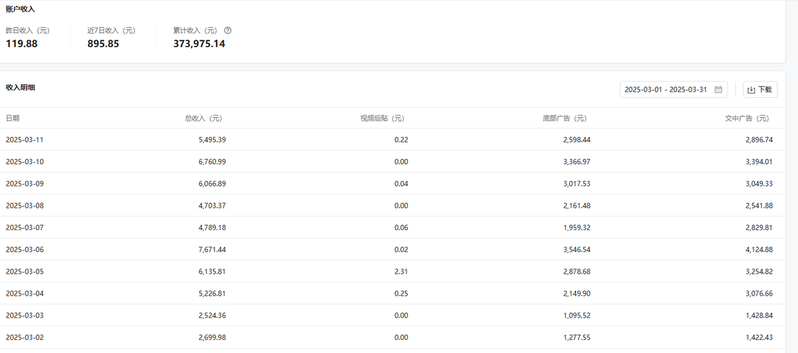

### ③付费文章

当积累到一定粉丝数量的时候，可以推出一些付费文章，那么也会有粉丝购买，产生变现。

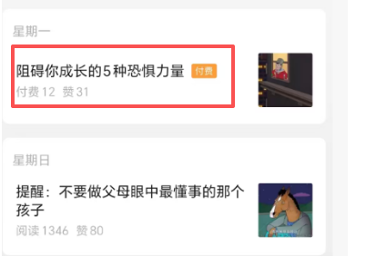

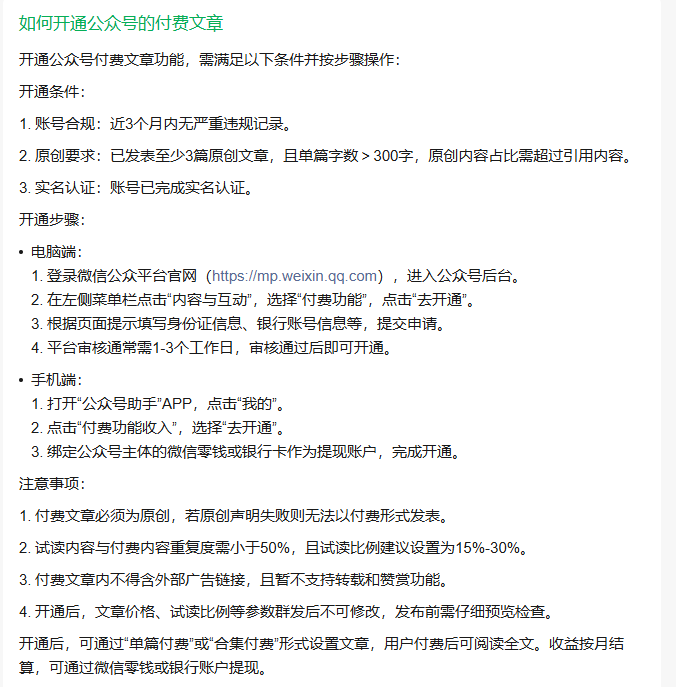

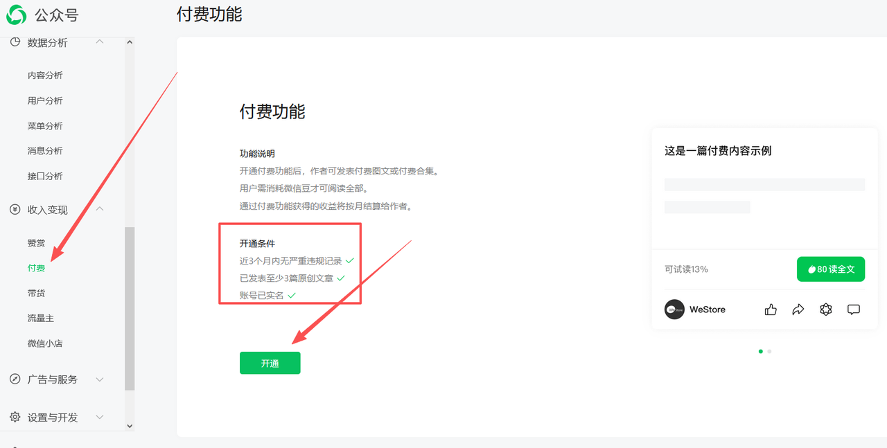

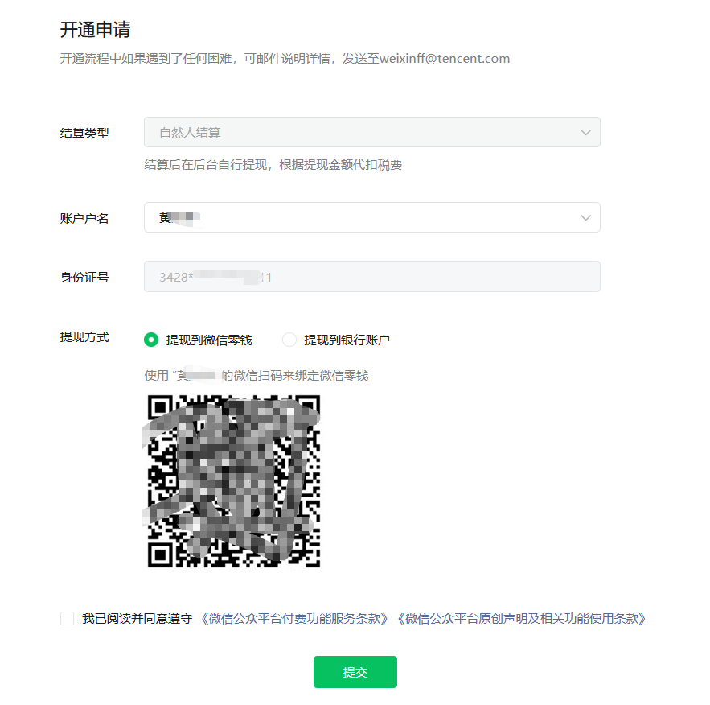

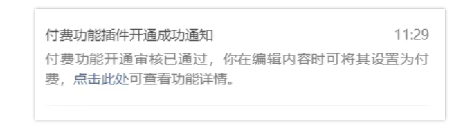

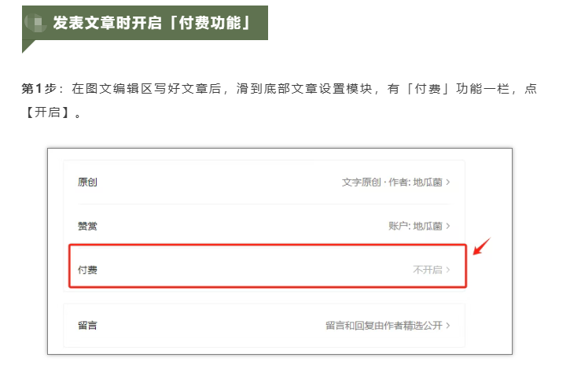

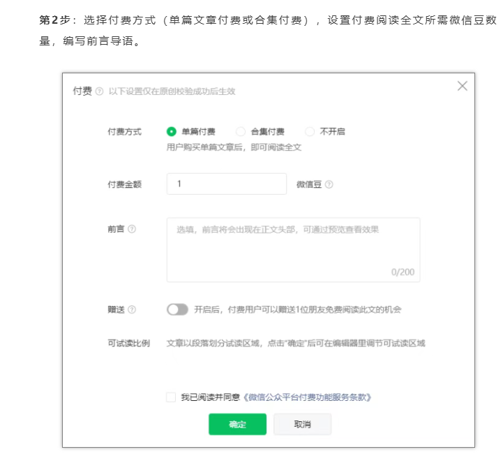

**按照要求来填写就可以了，发布之前建议点预览看下，有没有问题。**

### ④文中带货

公众号创作灵活，图文和货物相关性要求低。有些赛道是粉丝有了一些粘性之后，是可以利用粉丝进行带货变现。

比如你是写情感领域，学习类、励志类、文学类、情感类书籍都可以带。

如果粉丝量足够，我们带的商品还可以自己找商家，谈佣金。

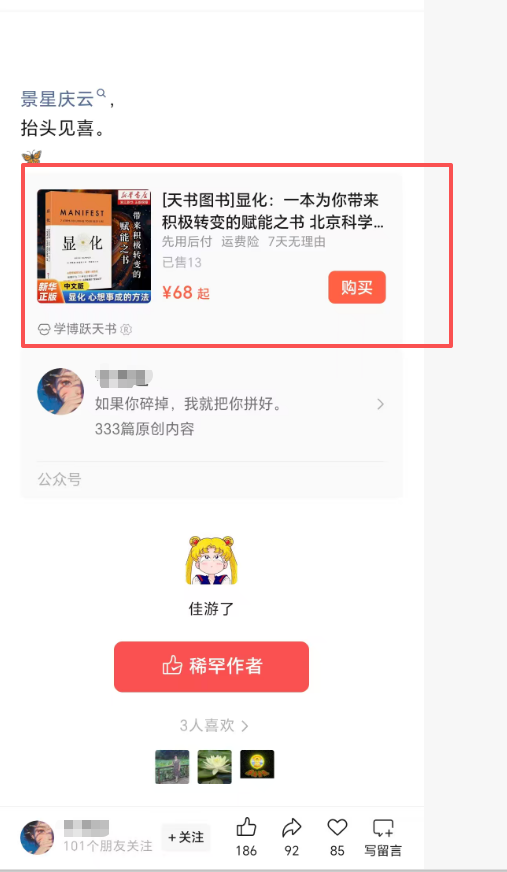

**具体开通流程：**

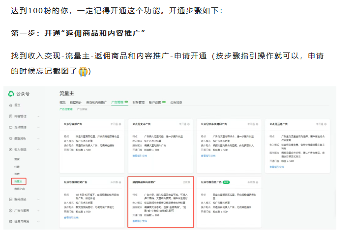

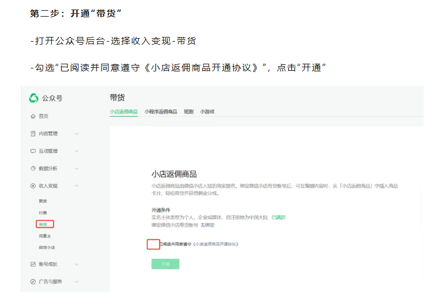

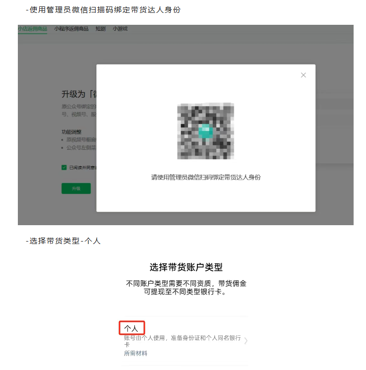

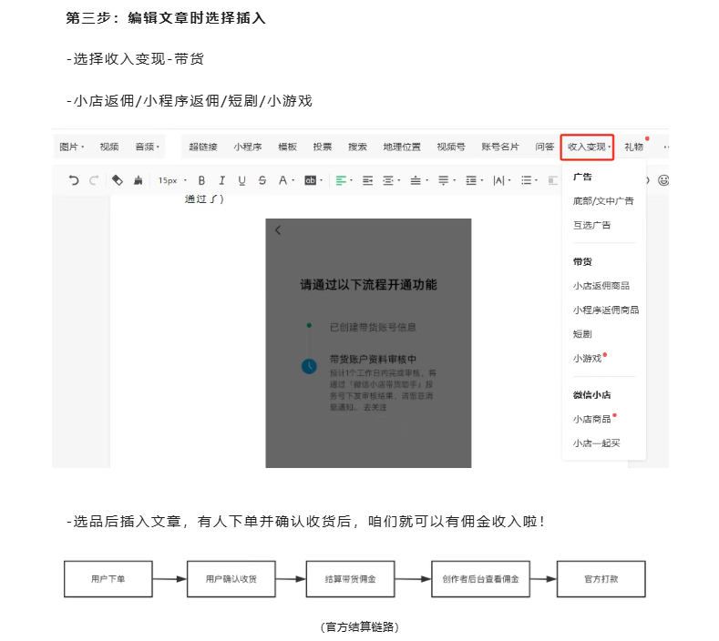

### ⑤粉丝打赏

开了流量主之后，原创群发3篇文章，就可以获得打赏权限。账号名字头像和打赏的名字头像，要尽量让它-致，这样看起来人设更真实。

对于一些有共鸣的文章，粉丝打赏也是其中一部分，比如说老年人情感赛道的打赏还是非常多的。

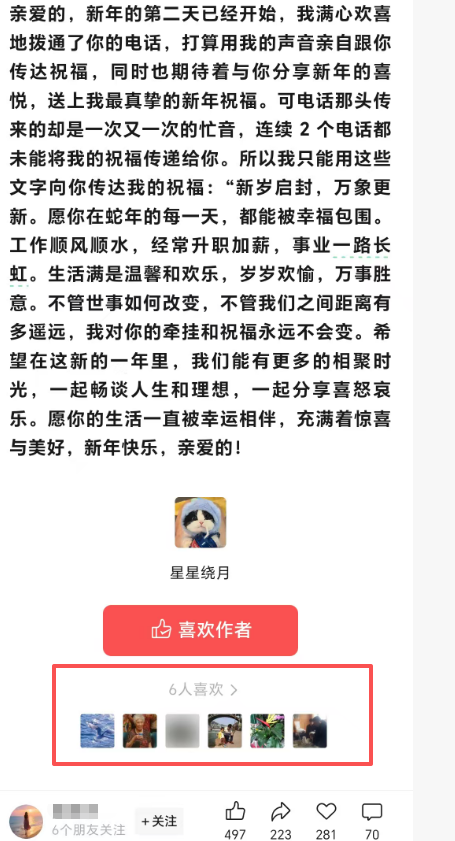

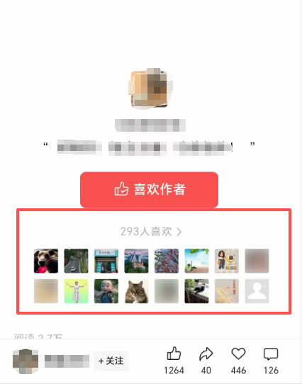

### ⑥靠私域变现

这种变现方式空间更大一些，也更持久一些。主要是后端有产品，然后围绕产品做流量，垂直写这一类型的公众号文章，在底部放二维码，吸引精准的粉丝关注，引流到私域变现。

比如说一些保险类型的公众号，还有一些做知识付费类型的公众号。

**还有其他的方式，所以说，垂类公众号的机会其实挺多的，真正去做了，感受才是最深刻的。**

