> 你的目的就是通过公众号引流，然后做私域变现，所有内容必须紧密围绕自己的产品去做，写与之相对应的公众号内容，你的产品是什么，赛道也就确定了。

# 一、产品选赛道

## **1.1减肥减脂赛道**

如果你是做减肥赛道，那么你就可以做这个垂类的公众号，引流私域。

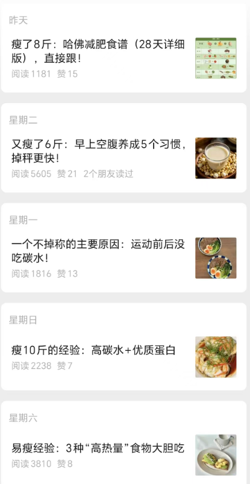

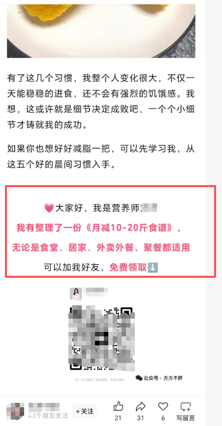

## 1.2法律咨询

比如你是做法律咨询的，那么可以找到这种法律类型的账号，引流私域。

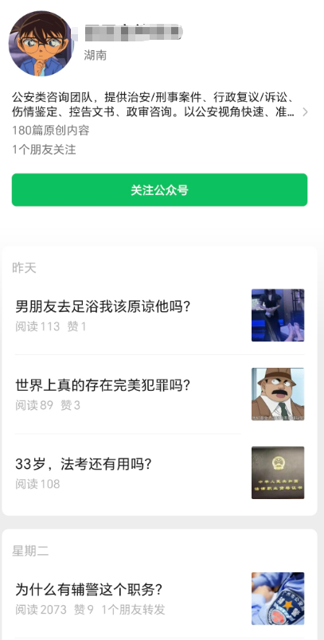

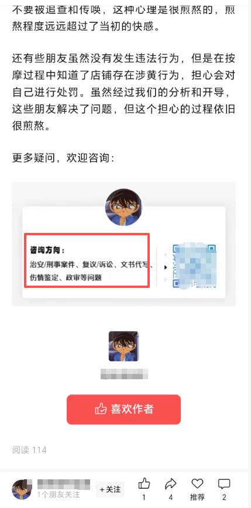

## **1.3中医赛道**

如果你有这个证书资质，后端有产品，可以引流小程序，或者你有后端，直接帮别人做。

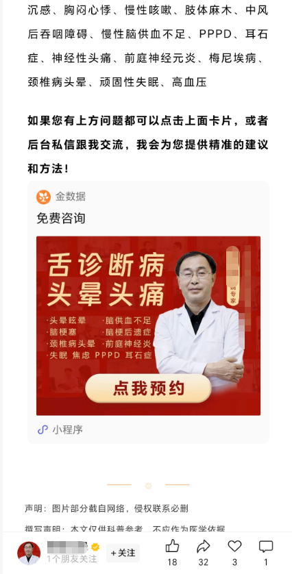

## 1.4中医脾胃

无需资质类型。引流私域。

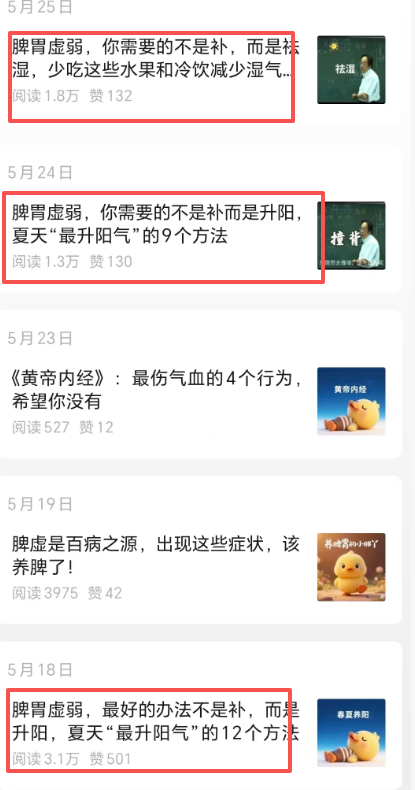

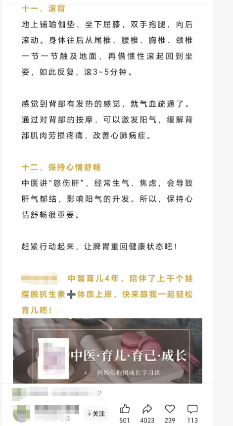

## 1.5副业引流

文中不放二维码，通过评论区导流，目前还比较稳定。

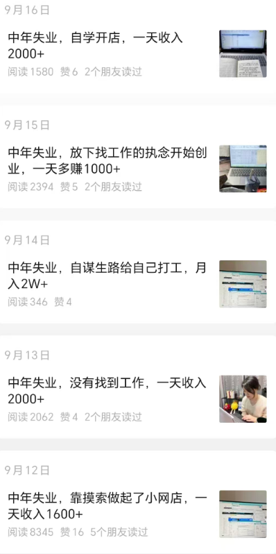

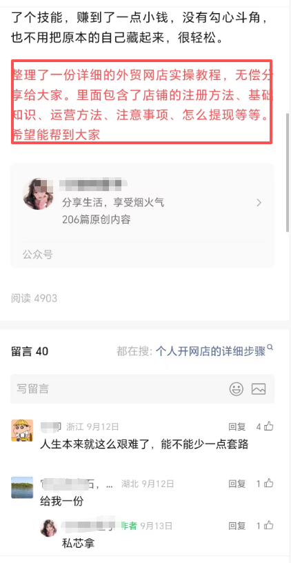

## 1.6 项目引流

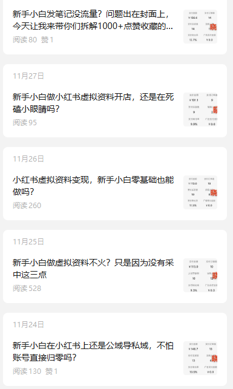

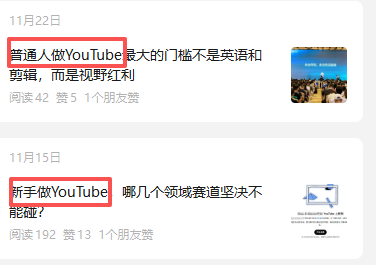

# **二、行业选赛道**

如果你自己没有产品，就想结合自己工作，这样写起来不累。请明确你的职业身份，例如：护士、退伍军人、老师、律师、医生、退伍军人、财务会计、宝妈等。

在微信“搜一搜”输入你的身份关键词（如“心理医生 抑郁症 焦虑症”），查看是否有同类账号通过流量主变现。如果有，证明可行。

这是创作成本最低的方式。参考这些账号的选题，身份变化下，标题形式不变，就可以进行创作了。 这样写出来很真实，也没有难度。

这种方式竞争不大，往往账号更加稳定。

## **2.1护士**

> 那么你可以做护士关键词来的垂类账号，进行变现。

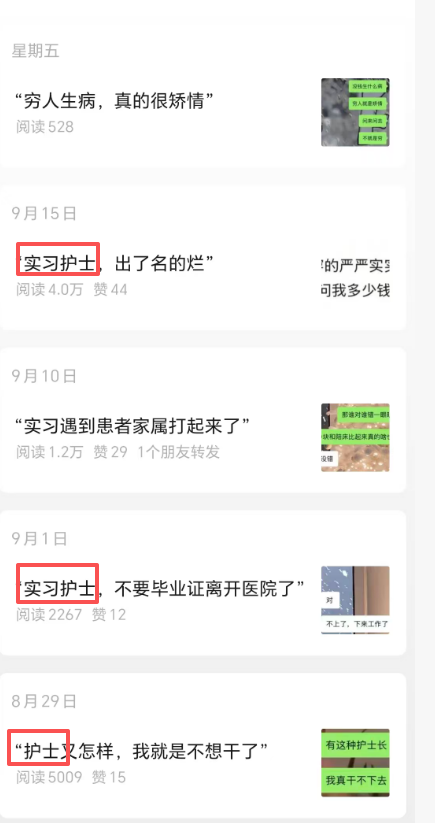

## **2.2退伍军人**

> 你从部队退伍，那么可以写写部队，退伍类的垂类账号，进行变现。

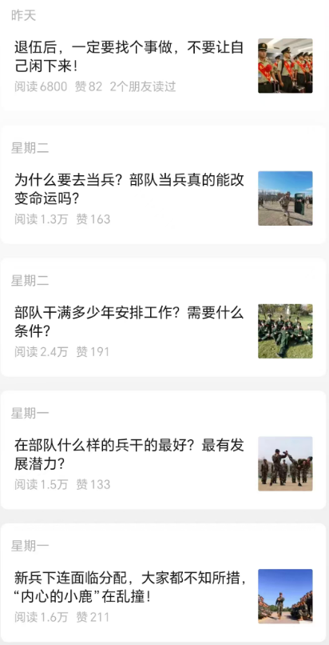

## 2.3.老师

> 你是老师，那么可以围绕老师这样的话题垂直来写，进行变现。

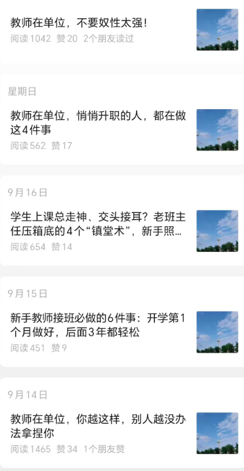

## **2.4船员**

> 你是船员，那么可以围绕船员工作这样的话题垂直来写，进行变现。

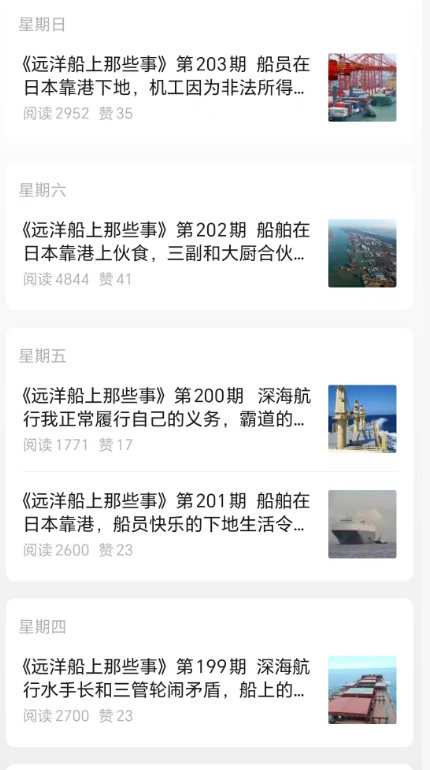

> 所以，你现在在做什么行业，什么工作，是不是也可以结合自己熟悉的领域来写，这样写出来很真实，也没有难度。
>
>
>
> 只需要参考这些账号的选题，身份变化下，标题形式不变，就可以进行创作了。这样的创作成本相对低很多，而且竞争不大，往往账号更加稳定。

# **三、兴趣爱好选赛道**

## 3.1读书

> 你喜欢读书，那么可以来写书评；你喜欢看电视，可以来写剧评

## 3.2影视

> 你喜欢影视，那么可以写影视报告；你喜欢心理学，那么可以来写心理学知识。

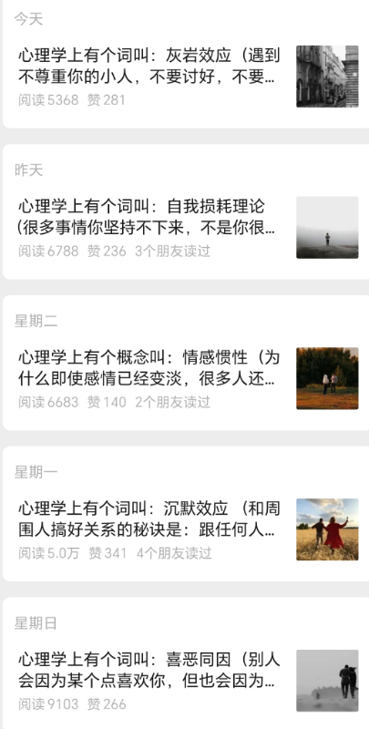

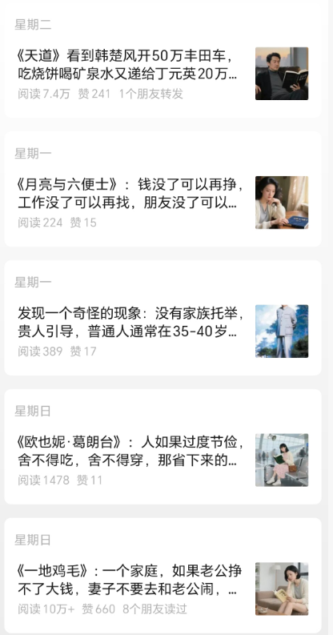

所以你看看自己的兴趣爱好是什么，那么可以围绕自己的兴趣爱好来写。

# **四、选择流量大的赛道。**

> 一般来说，娱乐赛道，军事赛道等这些赛道的流量往往比较大

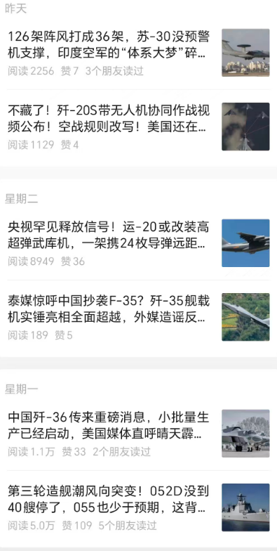

# **五、流量主单价高的赛道**

> 单价高的赛道，一般和中老年人比较相关。比如说美食养生，比如老年情感

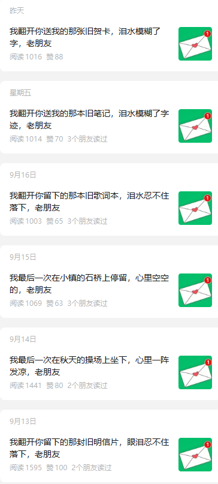

# **六、稳定的赛道。**

> 很多领域因为竞争比较大，账号反倒是容易掉出推荐。
>
> 所以找到一些没有多少人做的赛道，账号反倒是更加稳定一些，这个需要去发掘和测试。

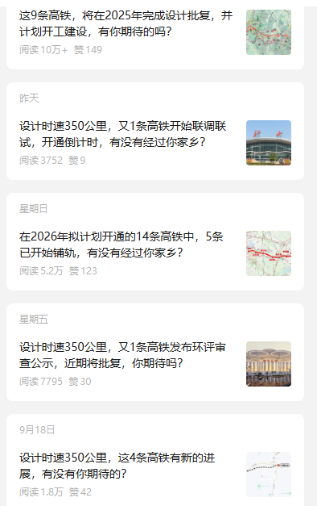

